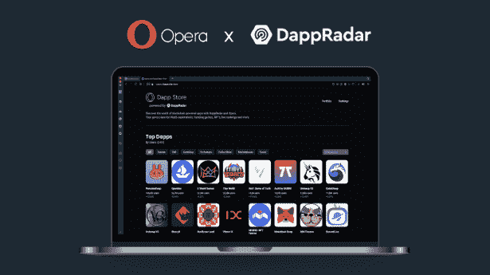
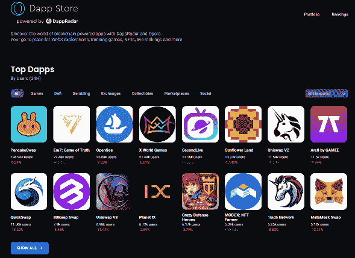

# DappRadar 和 Opera Browser 联合起来加速 Web3 的采用

> 原文：<https://web.archive.org/web/https://dappradar.com/blog/dappradar-and-opera-browser-unite-to-speed-web3-adoption>

## DappRadar 和 Opera 浏览器联手推进 Web3。

DappRadar 和 Opera 浏览器联手推进 Web3。 **Opera 的加密浏览器简化了用户处理基于 Web3 的服务时的体验，如分散交易(DEX)和游戏 dapps。**

全球 dapp 商店 DappRadar 很高兴地宣布，它将与 Opera 合作开发全球首款 Web3 浏览器，使用户能够充分利用 crypto 提供的功能。

Opera 浏览器提供了独特的移动专用 Web3 体验，并在区块链技术中将信号与噪音分开，使其易于理解和使用。

## Opera 浏览器是什么？

Opera 浏览器使新用户和有经验的 Web3 用户能够探索 Web3 真正提供了什么。通过其原生的多链钱包，用户无需安装任何扩展就可以访问他们的密码和 dapps。

通过 Crypto Corner，用户可以访问最新的区块链新闻、即将到来的空投、行业活动日历、NFTs、加密社区、教育内容、播客和视频。各种经验水平的用户一眼就能看到最新的加密价格、天然气费用和市场情绪。

## 这种合作关系意味着什么？

通过这种合作关系，Opera Crypto 浏览器的用户现在可以通过集成到浏览器中的 DappRadar 专用“dapp 商店”来探索和发现 dapp。这种合作关系使 DappRadar 的可靠数据能够通过 DappRadar 的 API 以用户友好的前端设计与 Opera Crypto 浏览器用户共享。

由 DappRadar 的独特功能推动的 Opera 每月数亿用户的增长是一个巨大的里程碑，标志着 dapp 创新和采用的新时代的开始。

## 用户如何从这个联盟中受益？

用户在多方面受益。例如，他们可以通过使用创新的 Web3 浏览器*搜索最新的 dapp 排名来发现他们的下一个加密机会。*

他们可以从 DappRadar 访问实时 dapp 数据，为 Opera 用户提供对有价值指标的准确洞察，如过去 24 小时内用户在每个类别中的顶级 dapp。

DappRadar 使 Opera Crypto Browser 用户能够立即访问超过 49 种协议的 12，000 多种 dapp 的详细信息，包括 NFTs、收藏品、游戏和 DeFi，使他们能够快速按 dapp 的总资产进行排序，例如，决定是否了解特定 dapp 的更多信息。

此外，Opera Crypto Browser 团队推出了一种新工具，可以增强同时使用多个钱包的用户对 dapp 的访问。Opera 的新钱包 Selector 在交换令牌或使用 dapps 进行交易时，自动化了在不同加密钱包扩展之间切换的麻烦。

**关于 dappRadar**
DappRadar 成立于 2018 年，是全球 Dapp 商店:一个全球去中心化应用程序(dapps)商店，使其每月超过 100 万的用户群可以通过其在线平台轻松跟踪、分析和发现 Dapp 活动。该平台目前托管来自 30 多种协议的 10，000 多个 dapps，并提供许多消费者友好的工具，包括全面的 NFT 估值、投资组合管理和每日行业领先的可操作洞察。

社交:[推特](https://web.archive.org/web/20220926010419/https://twitter.com/dappradar)–[不和](https://web.archive.org/web/20220926010419/https://discord.com/invite/4ybbssrHkm)–[Reddit](https://web.archive.org/web/20220926010419/https://www.reddit.com/domain/dappradar.com/)–[电报](https://web.archive.org/web/20220926010419/https://t.me/joinchat/GdhNjQ8PMhCZ_a0CZutmXg)–[脸书](https://web.archive.org/web/20220926010419/https://www.facebook.com/dappradar)

**关于歌剧**

Opera 是一家全球性的网络创新公司，拥有上亿每月活跃用户，这些用户都在寻求更好的互联网体验。基于始于浏览器产品的超过 25 年的创新，Opera 现在正在利用其品牌和高度参与的用户群，以将其业务扩展到新的细分市场。今天，Opera 为世界各地的用户提供一系列产品和服务，包括 PC 和移动浏览器、新闻阅读器 Opera News 以及专用于游戏、加密、电子商务和分类广告的应用程序。2018 年，Opera 推出了第一款内置加密钱包和 Web3 支持的浏览器。Opera 总部位于挪威奥斯陆，并在纳斯达克证券交易所(OPRA)上市。2022 年 1 月，Opera 发布了其加密浏览器的第一个版本，这是一个针对加密爱好者和加密好奇者的专用网络浏览器。

社交:[歌剧加密推特](https://web.archive.org/web/20220926010419/https://opr.as/pr-cb-tw)，[歌剧加密不和](https://web.archive.org/web/20220926010419/https://opr.as/pr-cb-discord)，[歌剧加密电报](https://web.archive.org/web/20220926010419/https://opr.as/pr-cb-tg)