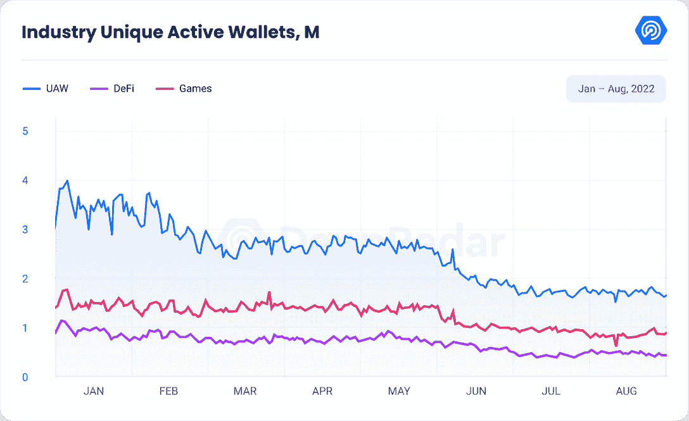
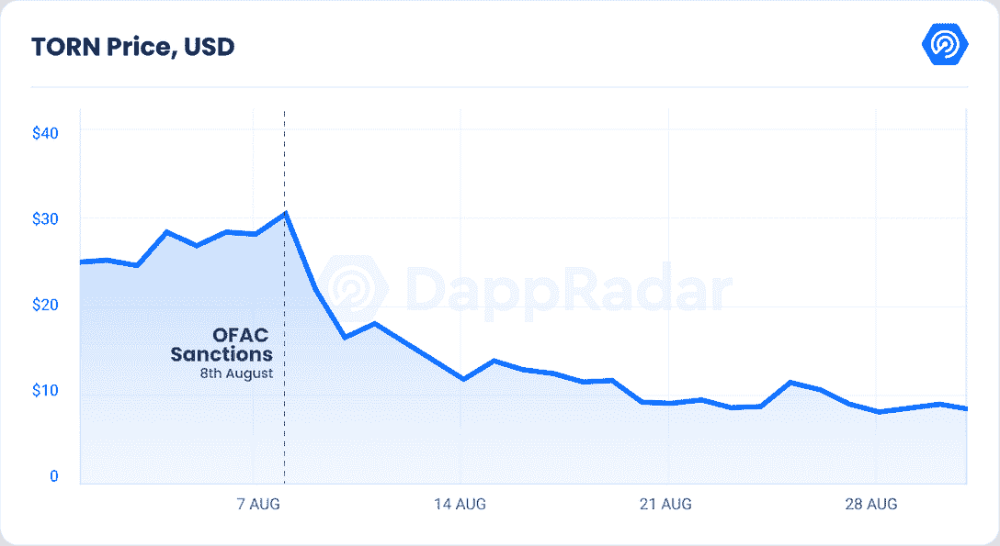
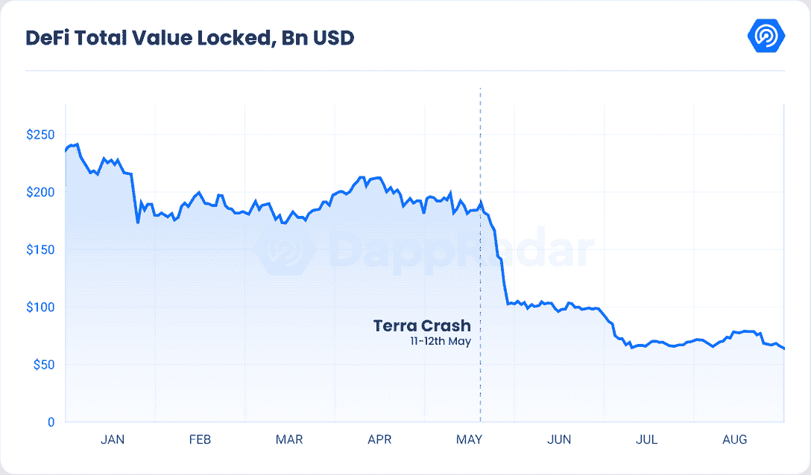
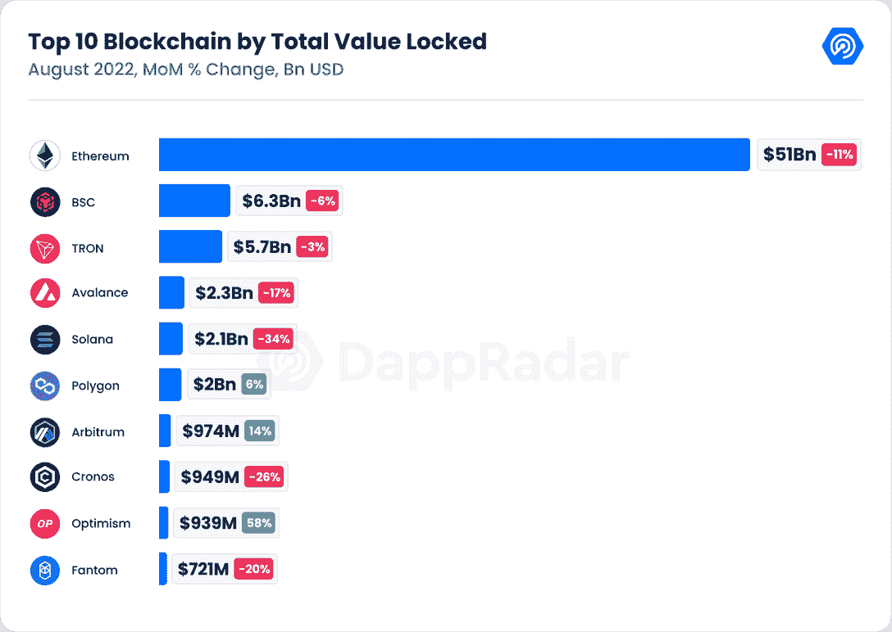
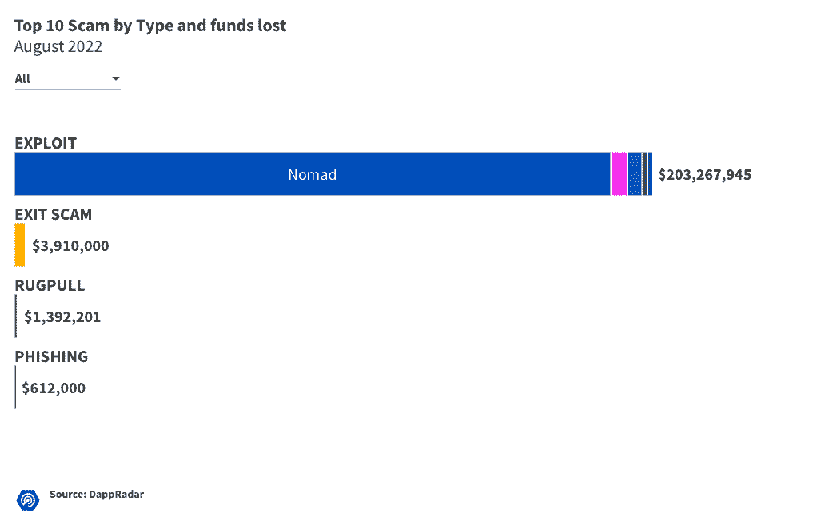
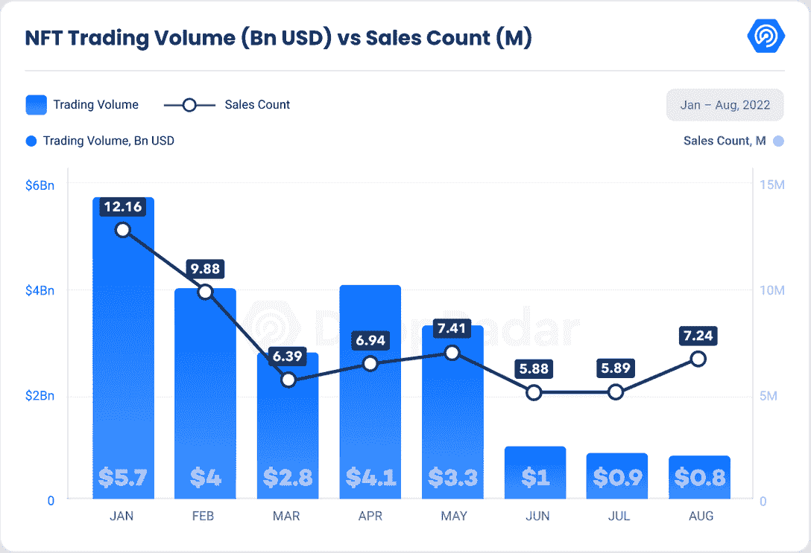
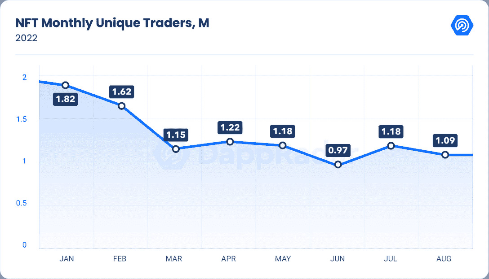
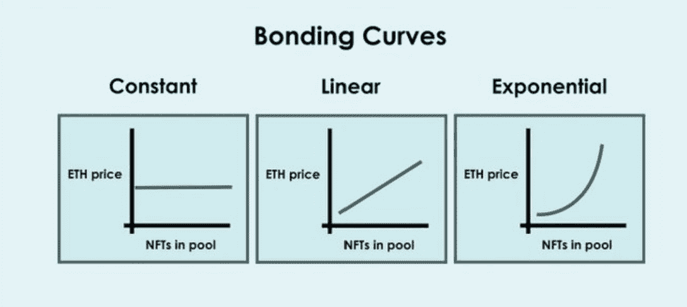
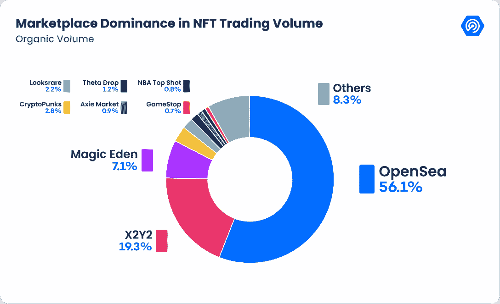
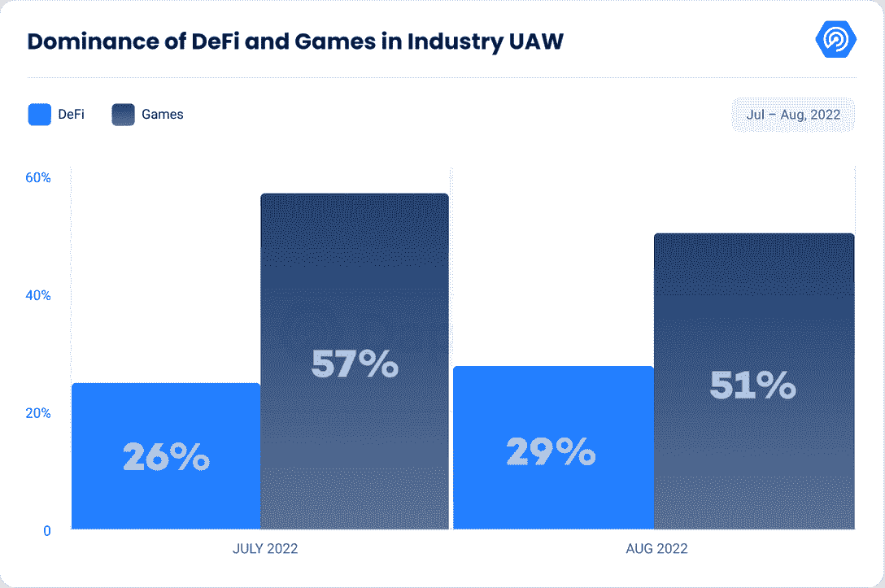

# DappRadar 区块链行业报告–2022 年 8 月

> 原文：<https://web.archive.org/web/https://dappradar.com/blog/dappradar-blockchain-industry-report-august-2022>

## 查看 2022 年 8 月的 dapp 行业亮点

最近几个月，加密市场似乎被一个接一个的负面消息所占据。8 月份发生了几起违规事件，包括[索拉纳](https://web.archive.org/web/20230131172836/https://dappradar.com/rankings/protocol/solana)钱包攻击、[阿卡拉](https://web.archive.org/web/20230131172836/https://dappradar.com/blog/acala-network-saves-stablecoin-after-it-plummets-to-zero)和[游牧](https://web.archive.org/web/20230131172836/https://dappradar.com/blog/nomad-bridge-hack-leads-to-first-decentralized-looting/)漏洞攻击，以及[龙卷风现金](https://web.archive.org/web/20230131172836/https://dappradar.com/hub/token/eth/TORN/ETH?from=0x77777feddddffc19ff86db637967013e6c6a116c)制裁，它们极大地影响了[迪菲 TVL](https://web.archive.org/web/20230131172836/https://dappradar.com/defi) ，我们将在下面看到。

尽管如此，八月也带来了一些积极的消息，因为以太坊网络完成了最大的测试网络之一 Goerli，为 T2 即将到来的合并 T3 做准备。

[Download Blockchain Industry Report – August 2022 (PDF)](https://web.archive.org/web/20230131172836/https://wp.dappradar.com/wp-content/uploads/2022/09/dappradar.com-aug-industry-report-compressed.pdf)

毫无疑问，熊市的影响仍然可见，dapp 活动继续逐月减少，目前为 167 万，是区块链 dapp 全年注册的最低的每日唯一活跃钱包(UAW)。这比上个月下降了 3.52%，比 2021 年 8 月下降了 14.73%。

Source: DappRadar

自 5 月以来，DeFi dapps 首次显示出复苏迹象，日均 UAW 环比增长 3.7%。尽管如此，DeFi 类别仍远未达到其峰值，每日 UAW 不到 50 万。

这一增长主要是由 Flow protocol 推动的，由于 Instagram (LINK)支持基于流量的 NFT 以及他们的游戏 [Solitaire Blitz](https://web.archive.org/web/20230131172836/https://dappradar.com/flow/games/solitaire-blitz) 的成功，该协议的 UAW 比上个月增长了 577%。此外，[乐观度](https://web.archive.org/web/20230131172836/https://dappradar.com/rankings/protocol/optimism)环比增长 33%，主要受即将到来的以太坊合并的推动。

相比之下，索拉纳 UAW 较前一个月下降了 53%，交易数量下降了 68%，原因是本月初发生的最新索拉纳黑客攻击。

即使它在游戏领域拥有整个活动行业 50%的使用量，独特的活动钱包本月也下降了 11%。此外，从交易数量来看，我们发现逐月下降了 12.7%。

与此同时，在 NFT 方面，UAW 的数量减少了 16.7%，至 114，542 人，为 2021 年 6 月以来的最低水平。

本报告涵盖了上个月最重要的趋势。

## 关键要点

*   基于 DeFi 的活动较上月上升了 3.7%；然而，由于龙卷风现金状况，该行业的 TVL 比 7 月份下降了 10.47%。
*   以太坊缩放解决方案的 DeFi dapps 在合并中的 DeFi metrics 有了相当大的增长；乐观主义以大约 10 亿美元打破了 TVL 排名前十的区块链。
*   合并已经在 9 月 15 日前后得到以太坊基金会的确认；这一事件将带来一个新的共识机制，同时使 ETH 通货紧缩，而不改变链的可扩展性。
*   8 月份损失超过 2 . 11 亿美元，其中 90%归因于游牧者的剥削。
*   SudoSWAP 的新市场通过引入“自动做市商”(AMM)模式扰乱了 NFT 交易。

## 内容

*   [对 Tornado Cash 的制裁引发对 Web3 去中心化的质疑](https://web.archive.org/web/20230131172836/https://dappradar.com/blog/dappradar-blockchain-industry-report-august-2022/#Sanctions)
*   [由于龙卷风现金制裁，DeFi TVL 收缩 10.47%；扩展协议显示增长迹象](https://web.archive.org/web/20230131172836/https://dappradar.com/blog/dappradar-blockchain-industry-report-august-2022/#DeFi-TVL-shrinks)
*   合并会对缩放解决方案产生什么影响？
*   [Nomad 的剥削占 8 月份资金损失总额的 90%](https://web.archive.org/web/20230131172836/https://dappradar.com/blog/dappradar-blockchain-industry-report-august-2022/#Nomad’s-exploit)
*   [对青岛清盘的担忧对 NFT 市场产生负面影响](https://web.archive.org/web/20230131172836/https://dappradar.com/blog/dappradar-blockchain-industry-report-august-2022/#Fear-of-BendDao)
*   [NFT 市场随着 SudoSWAP 不断发展，而 OpenSea 的统治地位继续下降](https://web.archive.org/web/20230131172836/https://dappradar.com/blog/dappradar-blockchain-industry-report-august-2022/#SudoSWAP)
*   [游戏领域仍占行业使用量的 51%](https://web.archive.org/web/20230131172836/https://dappradar.com/blog/dappradar-blockchain-industry-report-august-2022/#Gaming-sector-)
*   [关闭](https://web.archive.org/web/20230131172836/https://dappradar.com/blog/dappradar-blockchain-industry-report-august-2022/#Closing)

## 对 Tornado Cash 的制裁引发了对 Web3 去中心化的质疑

8 月 8 日，外国资产控制办公室(OFAC)对加密货币混合器 [Tornado Cash](https://web.archive.org/web/20230131172836/https://dappradar.com/blog/how-the-tornado-cash-ban-instigates-a-free-speech-battle) 进行了处罚。这导致了一系列意外超出美国边界的事件，引发了对分散式区块链技术实用性的诸多质疑。

OFAC 对龙卷风现金处罚的主要理由是，该工具已被用于大量非法洗钱活动，估计价值 70 亿美元。据估计，其中 4.55 亿美元由臭名昭著的拉扎勒斯集团(Lazarus Group)控制，这是一个朝鲜政府支持的黑客组织。此外，Tornado Cash 还被用于清洗来自 6 月份 Harmony Bridge 黑客攻击的超过 9600 万美元的非法资金，以及来自本月 Nomad 抢劫案的 780 万美元。

紧接着 OFAC 的处罚，龙卷风现金(撕裂)的象征是 30 美元，并在短短两天内暴跌 45%。自那以后，价格有所下降，目前为 9 美元，降幅为 71%。

Source: DappRadar

具体而言，该政策应仅适用于美国公民，他们不再被允许使用该协议并与不同的受制裁钱包进行交互。然而，这些影响在美国之外很快就被注意到了。首先，USDC 广播公司 Circle 决定禁止一些与龙卷风现金相关的地址，冻结了 7.5 万美元现金。这一决定，虽然从货币的角度来看并不十分重要，但却激起了加密团体的愤慨，他们认为这是分散化环境中的最后一根稻草。

这促使马克尔道的创造者鲁恩·克里斯滕森怀疑戴人的操作。在我们的 [stablecoins 报道](https://web.archive.org/web/20230131172836/https://dappradar.com/blog/defis-stablecoins-battle-fallout-from-terra-tornado-cash-and-the-ethereum-merge)中，我们分析了龙卷风现金危机对戴稳定币稳定性的影响，戴稳定币的稳定是由的存款维持的。

与此同时，GitHub 从其网站上撤下了龙卷风现金的开源代码。这种免于法院判决的自由并没有直接伤害 GitHub，但它重新引发了一个问题，即少数人的错误行为不应该不可避免地谴责所有人。

在 OFAC 做出判决后，像 [dYdX](https://web.archive.org/web/20230131172836/https://dydx.exchange/) 和 [Aave](https://web.archive.org/web/20230131172836/https://dappradar.com/optimism/defi/aave) 这样的协议已经决定禁止任何处理过龙卷风现金的人使用他们的平台。这一步骤的结果是， [Tron 生态系统](https://web.archive.org/web/20230131172836/https://dappradar.com/rankings/protocol/tron) (TRX)的创造者[孙正义](https://web.archive.org/web/20230131172836/https://twitter.com/justinsuntron)，被阻止访问 [Aave](https://web.archive.org/web/20230131172836/https://dappradar.com/optimism/defi/aave) 。

他遵守了 OFAC 的制裁，但一位匿名用户向几个知名地址捐赠了 0.1 ETH，以抗议美国财政部的诉讼，包括他的地址。由于理论上不可能阻止以太坊上的一笔交易，通过 Tornado Cash 接受付款会使你违反处罚规定。

Aave 团队[在意识到这个问题后立即做出了回应](https://web.archive.org/web/20230131172836/https://twitter.com/AaveAave/status/1558537736956542978)。然而，应该强调的是，这些块仅与各自平台的接口相关。那些具有编程专业知识的人可以直接与他们选择的智能合约连接，绕过所谓的“前端”例如，原则上，即使是黑名单上的地址也可以继续使用 Aave 和 Tornado Cash。

此外，不能排除其他开发人员可能会创建替代接口来规避这些限制，并为那些受限制的人提供对这些智能合同的访问。

## 由于龙卷风现金制裁，DeFi TVL 收缩 10.47%；扩展协议显示出增长的迹象

尽管在分析行业独特的主动钱包时，DeFi 显示出复苏的迹象，但 TVL 的整体 DeFi 仍处于困境，目前为 742.1 亿美元，考虑到这一金额比八个月前少了 2500 亿美元，这是一个惊人的下降。

上一次 TVL 如此之低是在 2021 年 4 月，当时太空刚刚开始获得动力。这表明，自 2021 年 8 月以来，DeFi TVL 减少了 56%或更多。

由于龙卷风现金危机，这个月对市场来说尤其困难，TVL 月环比下跌 10.47%，损失约 87 亿美元。

Source: DappRadar

Source: DappRadar

以太坊继续成为最突出的连锁店，以 514.7 亿美元控制了 TVL 69%的股份，比上个月减少了 11%，比 2021 年 8 月减少了 56.63%。BSC 环比下降 6.44%，同比下降 75.67%。

由于钱包袭击，索拉纳·TVL 在 8 月的前四天下跌了 27%，在这个月的剩余时间里继续下跌了 6%，现在的价值为 21.1 亿美元，亏损约 10 亿美元。

创 TVL 环比下降 2.90%，至 57.0 亿美元，尽管自 2021 年 8 月以来增长了近 68%。同样，Avalanche 环比下降 17.20%，尽管自 2021 年 8 月以来上涨了近 11%。

从更积极的方面来看，只有基于以太坊的第二层(L2)协议显示出增长的迹象，这主要是由即将到来的以太坊合并推动的。排在第一位的是乐观，它以约 10 亿美元的总锁定价值进入区块链前 10 名，同比增长 57.61%。其次是 Arbitrum，环比上涨 14.36%，其次是 [Polygon](https://web.archive.org/web/20230131172836/https://dappradar.com/rankings/protocol/polygon) ，环比上涨 6.50%，同比下跌 62.58%。

## 合并会对缩放解决方案产生什么影响？

自成立以来，以太坊一直是最大和最受欢迎的智能合约区块链。然而，随着装备更好的竞争对手试图迎头赶上，以太坊正转向一种能源密集度较低的技术来运营其区块链。之前被称为以太坊 2.0 或 Eth2，以太坊基金会现在将其称为以太坊合并。

这是加密行业历史上最令人期待的事件之一，如果你想了解更多关于以太坊从工作证明到利益证明的转变，你可以阅读[这篇文章。](https://web.archive.org/web/20230131172836/https://dappradar.com/blog/what-is-the-ethereum-merge)

解释合并的直接影响是很重要的。首先，ETH 令牌的发行率将大幅下降，因为以太坊网络将不再向矿工提供 ETH 令牌激励，导致 ETH 的年发行率下降 90%。发行利率的大幅下降，加上 EIP-1559 提案建立的烧钱机制，可能会导致以太坊网络在高块空间需求时期出现通货紧缩。这是史无前例的，它构成了以太坊网络的一个基本的、结构性的改变。

另一个影响是机构对资产和网络的兴趣越来越大，这是由不断增加的赌注支出推动的。以前，交易费支付给矿商，合并后，交易费将支付给验证商，这导致了信标链激励机制的兴起。

重要的是要记住，合并本身不会立即增加网络的容量或吞吐量。这意味着区块大小保持不变，天然气价格将继续由区块空间需求决定，第二层扩展解决方案，如 Starkware、Polygon、Arbitrum 和 optimission。

在以太坊主网上开发的 Dapps 将继续迁移到第二层，这是由于流动性开采激励、更便宜的天然气价格以及追溯性令牌空投的可能性。随着用户在这些汇总上的积累和 TVL 的发展，将鼓励直接在 L2s 上创建新的协议，这就需要跨入口、钱包和网桥的 UX 增强，以将用户直接登记到 L2s 上。

即使合并顺利进行，以太坊在达到其支持者承诺的可行速度和效率之前还有很长的路要走。然而，考虑到以太坊生态系统的稳健性及其社区的规模，很难对它们下赌注。整个 9 月，加密叙述将被合并所主导，我们将继续关注事件将如何发展。

## Nomad 的剥削占了 8 月份总资金损失的 90%

根据 [DEFIYIELD data](https://web.archive.org/web/20230131172836/https://defiyield.app/rekt-database) 的数据，由于通过分散金融(DeFi)协议窃取的资金增加，加密货币黑客攻击损失在今年前七个月增加了约 60%，达到 19 亿美元。

使用 DeFi 协议窃取的大部分现金可能被归咎于与朝鲜有关的“坏人”，尤其是像 Lazarus Group 这样的精英黑客团队。

在 8 月的第一周，由于跨链桥游牧袭击，损失了 1.9 亿美元。黑客利用了一个安全漏洞，让用户在系统中输入任何值，然后吸走资金，即使 Nomad 的存款基础中没有足够的资产。

这个 bug 的性质意味着用户不需要任何编程技能就可以利用它。其他人发现后部署了大批机器人来进行模仿攻击。

8 月 2 日，8000 多个索拉纳钱包被盗，价值超过 520 万美元的数字硬币，包括索拉纳的索尔令牌和美元硬币(USDC)。截至今天，仍然没有关于黑客是如何完成的确凿证据。

[<picture></picture>](https://web.archive.org/web/20230131172836/https://public.flourish.studio/visualisation/11059053/ )

8 月份共有 31 起黑客攻击，总金额为 2.11 亿美元，其中 90%是由 Nomad 黑客发起的。总的来说，攻击占总损失资金的 96%，1.85%是退出骗局，其余是网络钓鱼。

DeFi 协议特别容易受到黑客攻击，因为它们的开源代码可以被寻找漏洞的网络罪犯无限研究，并且协议进入市场和快速增长的动机可能导致安全最佳实践的失误

## 对奔道清算的恐惧对非木材市场产生负面影响

对于 [NFT 市场](https://web.archive.org/web/20230131172836/https://dappradar.com/nft/marketplaces)来说，现在是困难时期，正如最近在 [Opensea](https://web.archive.org/web/20230131172836/https://dappradar.com/multichain/marketplaces/opensea) 的裁员，下图所示的交易量的下降，加密货币的贬值，以及本道 [Bored Ape NFTs](https://web.archive.org/web/20230131172836/https://dappradar.com/ethereum/collectibles/bored-ape-yacht-club) 大规模清算的风险。

BendDAO 是一家个人对个人的贷款公司，它让用户通过提供他们的 NFT 作为“抵押品”来借用 ETH，该公司正处于破产的过程中。本道拥有 272 件来自 [Bored Ape 游艇俱乐部](https://web.archive.org/web/20230131172836/https://dappradar.com/ethereum/collectibles/bored-ape-yacht-club)系列的 NFT 作为抵押，占整个系列的 2.72%。在这 272 笔贷款中，有 45 笔由于跌入底价而危险地接近“危险区”，可能在未来几天被拍卖。这种规模的拍卖，估计价值 530 万美元，可能会对整个 BAYC 收藏产生影响。

Source: DappRadar

以美元计算的交易量每月持续下降 5%，主要原因是以太坊价格下跌。相比之下，销售数量比上个月增长 23%，超过 724 万辆，与 2021 年 8 月持平。

虽然独特交易者的数量比上个月下降了 8%，但比 2021 年 8 月上升了 6%。

Source: DappRadar

尽管熊市让 Ape 游艇俱乐部感到厌烦，但 5383 号黄金令牌还是以 777 ETH 的价格售出(当时约为 150 万美元)。需要注意的是，宇迦实验室系列继续主导市场，本月，其四个项目[crypto punk](https://web.archive.org/web/20230131172836/https://dappradar.com/ethereum/collectibles/cryptopunks)、 [Bored Ape 游艇俱乐部](https://web.archive.org/web/20230131172836/https://dappradar.com/ethereum/collectibles/bored-ape-yacht-club)、[变种人 Ape 游艇俱乐部](https://web.archive.org/web/20230131172836/https://dappradar.com/ethereum/collectibles/mutant-ape-yacht-club)和[other side](https://web.archive.org/web/20230131172836/https://dappradar.com/ethereum/collectibles/otherdeed-for-otherside)的总交易量超过 1.18 亿美元，占 2021 年 8 月总交易量的 13.7%。

[<picture></picture>](https://web.archive.org/web/20230131172836/https://dappradar.com/nft/sales)

Source: DappRadar

即使市场环境不是最佳的，各行各业越来越多的知名企业正在加入 NFT 生态系统。8 月 5 日，蒂芙尼(Tiffany & Co .)推出了 NFTiff(T1)，在这里 NFT 被转化为奢华的可穿戴珠宝，而 8 月 10 日，社交媒体网络 9GAG 推出了[Potatoz(T3)，这一系列象征着 Web3 和 memes 之间的桥梁。](https://web.archive.org/web/20230131172836/https://dappradar.com/blog/new-dapps-report-the-potatoz-the-bridge-between-memes-and-web3)

最近的一个条目是糖果品牌 Mars，它在 8 月 24 日宣布与环球音乐集团(UMG)标签达成协议，根据 [Kingship](https://web.archive.org/web/20230131172836/https://www.mms.com/kingship) 制作限量版 M & Ms，其虚拟乐队由 Bored Ape Yacht Club 和 variant Ape Yacht Club avatar 组成。如果你想了解更多关于这次合作的细节，请阅读[这篇文章](https://web.archive.org/web/20230131172836/https://dappradar.com/blog/bored-ape-nfts-inspire-new-limited-edition-mms)。

随着 NFT 的发展和用例的出现，这些用例在 2021 年主导市场的猜测中是特定和独特的，毫无疑问，NFT 将在下一轮牛市中发挥重要作用。

## NFT 市场随着 SudoSWAP 不断发展，OpenSea 的统治地位继续下降

NFT 市场的景观每个月都在变化。七月份引入了两个新的市场: [Gamestop](https://web.archive.org/web/20230131172836/https://nft.gamestop.com/) 和 [Nickelodeon 的](https://web.archive.org/web/20230131172836/https://nickelodeon.xyz/marketplace/) NFT 市场。本月见证了一个新的 NFT 市场的出现， [SudoSWAP](https://web.archive.org/web/20230131172836/https://sudoswap.xyz/#/) ，它正在改变加密用户看待 NFT 流动性和交易的方式。这是通过将“自动做市商”(AMM)的概念引入这个新的市场来实现的。

与传统的买方和卖方市场相反，自动做市商(AMM)允许使用加密流动性池作为交易对手进行资产交易。在这个系统中，自动做市商诱使用户成为流动性提供者，以换取一部分交易成本。

使用 AMM 架构，Sudoswap 允许用户在双向流动性池中交易和互换 NFT。因此，除了 ETH 之外，你还可以出售 NFTs，作为回报，你将根据交易差价获得佣金。

毫无疑问，Sudoswap 正在为非传统金融产品开辟道路，其特点是买家和卖家能够转换到流动性提供商提供的可定制债券曲线。

Source: [Finance Yahoo](https://web.archive.org/web/20230131172836/https://finance.yahoo.com/news/project-puts-nft-investing-autopilot-084038329.html)

与以前的 NFT 协议一样，当前的 Sudoswap AMM 协议不区分 ERC721 IDs。愿意购买或出售 NFT 的池将产生相同的价格，无论添加或删除哪个 NFT。一家流动性提供商为 NFT 集合提供流动性，以换取掉期费用，类似于 Uniswap V2 公司。

Sudoswap 对去中心化的自然和创造性市场的破坏，使得在他们的平台上开发独特的项目成为可能，并给予消费者更多的控制权。

Source: DappRadar

虽然新市场的出现使事情变得更加困难，但 OpenSea 继续保持其作为主要市场领导者的地位，占总交易量的 4.82 亿美元，环比下降 9%，约占当月报告交易量的 56%。OpenSea 总交易量下降之际，该公司正在裁员 20%，理由是该公司需要适应当前的市场条件。

在 NFT 市场生态系统的其他地方也可以看到这种下降。聚焦索拉纳的《魔法伊甸园》票房为 6100 万美元，相比 7 月份的 7000 万美元，下降了约 13%。[looks rare](https://web.archive.org/web/20230131172836/https://dappradar.com/ethereum/marketplaces/looksrare)8 月份的营业额为 1800 万美元，较上月下降 25%。

在名为“大重置”的新市场更新的推动下，Axie Marketplace 增长了 17%。这次更新包括各种新功能，但最令人期待的是支持 ERC 1155 的基础设施，这是标准的 NFT 符文和符咒。ERC 1155 是管理多种令牌类型的合同的标准接口。单个部署的合同可以包括可替换令牌、不可替换令牌或其他配置(例如，半可替换令牌)的任意组合。

对 NFT 市场的预测似乎很有希望，特别是因为 NFT 市场之间的竞争加剧了。2021 年，市场的销售额约为 250 亿美元。尽管在利率和通胀因素不确定、战争和全球冲突持续以及其他因素影响市场的时候，所有市场都在经历更高的波动性，但无论发生什么样的波动，非金融交易及其基础市场都表现出持续的强烈迹象。

## 游戏行业仍占该行业使用量的 51%

博彩区块链技术是 Web3 新兴的、有前途的行业之一，每天有 847，230 个独特的活动钱包和 6.98 亿美元的交易。

最好的区块链游戏保持了他们的玩家基础，这表明实际参与度在排名中名列前茅。此外，对元宇宙和区块链博彩业的投资继续增加。

Source: DappRadar

值得一提的是，即使游戏在 UAW 的主导地位从 57.30%下降到 50.51%，这仍然是该行业的一个良好指标。

要获得更多关于区块链游戏和趋势的见解，如虚拟世界、移动赚取和领先游戏 dapps，请阅读我们最新的 [BGA 游戏报告](https://web.archive.org/web/20230131172836/https://dappradar.com/blog/dappradar-x-bga-games-report-6)。

## 关闭

当经济增长强劲，利率低，经济环境缺乏冲击时，加密货币表现出最强的回报和对其他资产类别的最大独立性。但是，在接下来的气候中，全球经济前景不确定，更多的资金因黑客攻击或利用而损失，以及最新的龙卷风现金制裁所造成的影响，Web3 行业今年表现出明显的疲软。

重要的是要记住，加密货币的历史是短暂的；主要货币已经存在了大约十年，加密货币行业每年都有显著发展，因此可以有把握地认为未来是光明的。