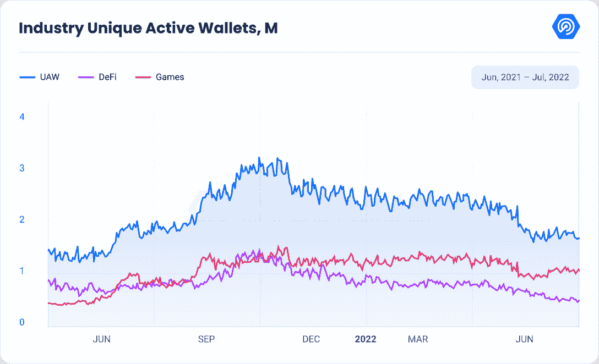
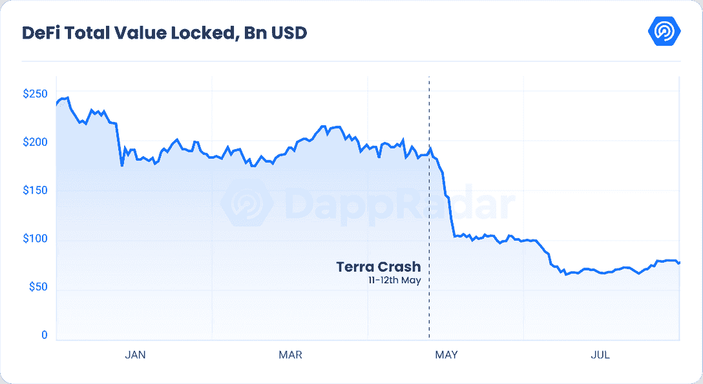
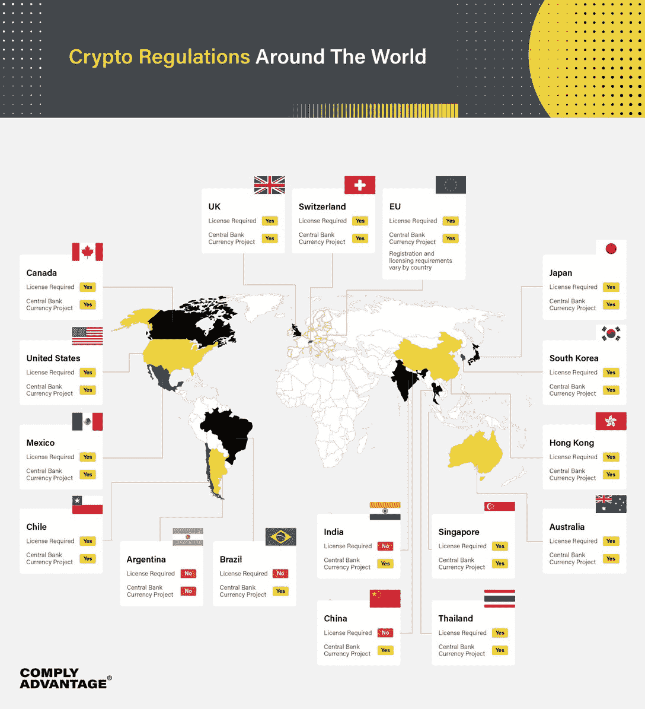
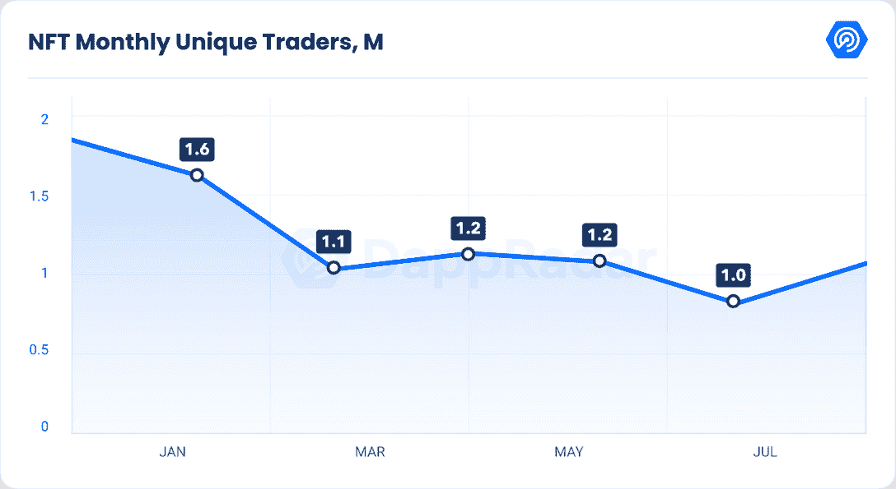
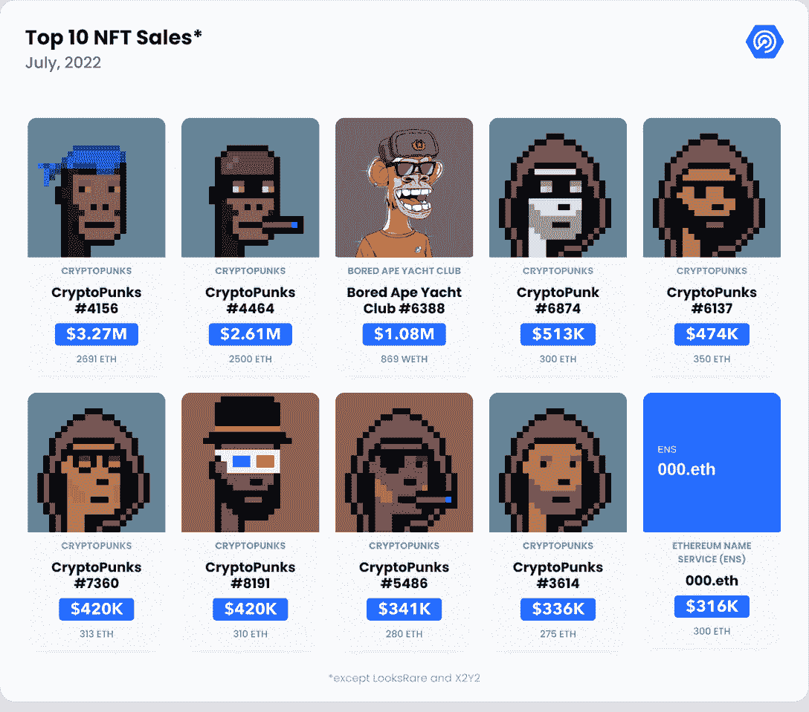
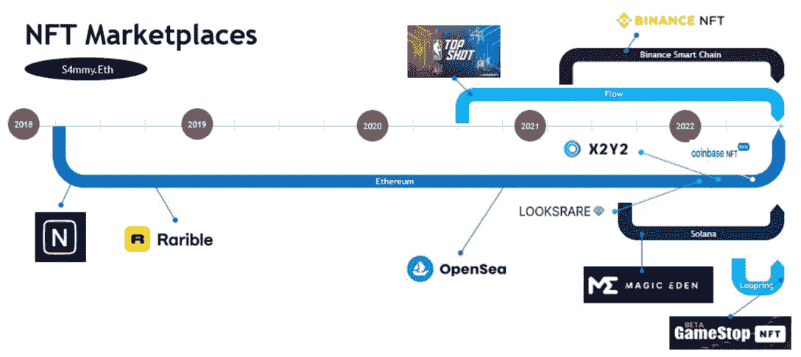
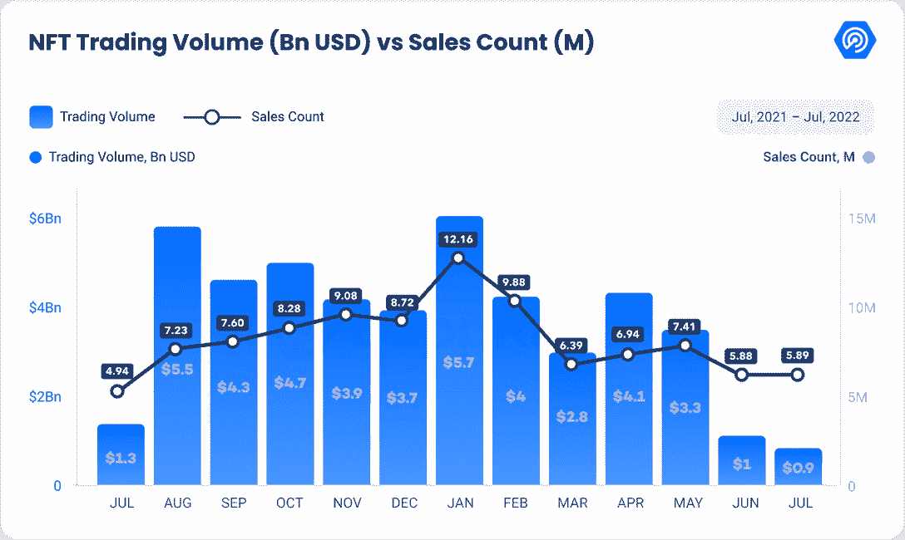
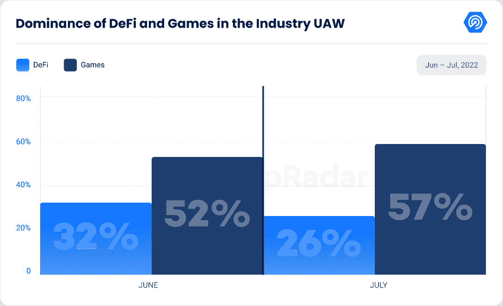

# DappRadar 区块链行业报告–2022 年 7 月

> 原文：<https://web.archive.org/web/https://dappradar.com/blog/dappradar-blockchain-industry-report-july-2022>

## 查看 2022 年 7 月的 dapp 行业亮点

**加密行业仍然被困在熊市中，感受着** [**Terra 的崩溃**](https://web.archive.org/web/20221129083055/https://dappradar.com/blog/dapp-industry-report-q2-nfts-and-web3-games-keep-enduring-market-conditions-as-shockwaves-from-the-terra-collapse-reach-cefi-and-vcs/#How-the-collapse-of-Terra-altered-the-blockchain-landscape) **的影响，这对整个 Web 3.0 世界产生了影响，包括 DeFi、NFTs 和元宇宙。**

[Download Report (PDF)](https://web.archive.org/web/20221129083055/https://wp.dappradar.com/wp-content/uploads/2022/08/dappradar.com-dappradar-dapp-industry-report-july-2022.pdf?utm_source=blog&utm_medium=website&utm_campaign=report&utm_id=reportdownload)

从宏观角度来看，近期美国通胀数据达到几十年来的最高水平，利率上升 75 个基点，2022 年第二季度收缩 0.9%。这也是美国连续第二个季度正式进入衰退。

随着抵押贷款等债务的增加，可支配收入减少。投资者从股票和加密货币市场撤出资金，以偿还贷款和尽量减少负债。这增加了抛售压力，降低了中期交易量，因为发现盈利机会变得更加困难。

加密货币的下降是显而易见的，事实上，dapp 活动已经达到今年的最低点，7 月份有 168 万个每日唯一活跃钱包(UAW)连接到区块链 dapp。这个数字代表了月环比(MoM)下降 4%，尽管仍比 2021 年 7 月高出 20%。

DappRadar data for July

毫无疑问，由于加密货币价格的直接影响，区块链的 DeFi 部门感受到了熊市中的大部分困难。

自 2021 年 4 月以来，UAW 接入 DeFi dapps 的人数首次低于 50 万。这意味着与上月相比下降了 22%,与去年相比下降了 31%。

然而，没有几个区块链能在熊市趋势中脱颖而出。例如，自上个月以来，Flow 的每日 UAW 增长了 200%以上，这主要是由于[最近启动了无许可智能合约部署](https://web.archive.org/web/20221129083055/https://www.onflow.org/post/permissionless-smart-contract-deployment-flow-blockchain)，这意味着任何人现在都可以在 Flow Mainnet 上部署智能合约。

在如此复杂的形势下，NFT 市场也出现了萎缩。然而，在这种情况下，这一领域出现了几个新趋势，可能会伴随我们到 2022 年甚至更久。

与此同时，游戏类别的增长最为显著，同比增长 8%，同比增长 98%，平均每日 UAW 达到 967，662 次。这并不奇怪，因为我们已经看到了多个区块链游戏，它们具有真正身临其境的游戏机制，在最近几个月将娱乐提升到了一个新的水平。

与此同时，在 NFT 这边，UAW 的数量也在不断增加。超过 130，418 每日 UAW 连接到 NFT 相关的 dapps，主要由索拉纳和 BNB 链驱动，这改进了他们的 NFT 替代品。

这份报告旨在涵盖上个月最重要的趋势。

## 关键要点

*   随着 Tron 和 Polygon 的发展，DeFi 开始复苏，环比增长 22%
*   集中式贷款平台 Celsius 申请了第 11 章破产，给储户资金被收回的可能性增加了不确定性
*   自 2021 年 6 月以来，NFT 交易量首次未能达到 10 亿美元
*   作为 NFTs 市场的竞争对手，OpenSea 的市场份额从 5 月份的 84%下降到 58.6%
*   区块链博彩业的主导地位持续上升，目前几乎达到 60%，与熊市趋势背道而驰。

## 内容

*   [DeFi 开始从地面塌陷中恢复——TVL 增加 22%](https://web.archive.org/web/20221129083055/https://dappradar.com/blog/dappradar-blockchain-industry-report-july-2022/#defi-starts)
*   [多边形在熊市期间继续建造](https://web.archive.org/web/20221129083055/https://dappradar.com/blog/dappradar-blockchain-industry-report-july-2022/#polygon-building)
*   [随着 Celsius 申请破产，加密传染病仍在继续](https://web.archive.org/web/20221129083055/https://dappradar.com/blog/dappradar-blockchain-industry-report-july-2022/#crypto-contagion)
*   [对加密监管的呼声越来越高](https://web.archive.org/web/20221129083055/https://dappradar.com/blog/dappradar-blockchain-industry-report-july-2022/#crypto-regulation)
*   NFT 的泡沫终于破裂了吗？
*   [OpenSea 可能很快会卷入一场 NFT 市场的“战争”](https://web.archive.org/web/20221129083055/https://dappradar.com/blog/dappradar-blockchain-industry-report-july-2022/#marketplace-war)
*   [游戏几乎占据了该行业 60%的使用量](https://web.archive.org/web/20221129083055/https://dappradar.com/blog/dappradar-blockchain-industry-report-july-2022/#games-usage)
*   [结束——未来会发生什么？](https://web.archive.org/web/20221129083055/https://dappradar.com/blog/dappradar-blockchain-industry-report-july-2022/#future-expect)

## DeFi 开始从 Terra 崩溃中恢复–TVL 增加 22%

由于加密市场缓慢但稳定的复苏，分散金融(DeFi)行业的整体总价值有所增加。

TVL，或总价值锁定，已成为评估分散应用程序(dapps)有效性的基准。TVL 在 2021 年 12 月 2 日创下 2539.1 亿美元的历史新高。

整个 7 月，TVL 都在增加。7 月 31 日，TVL 为 823 亿美元，比 7 月 1 日的 673 亿美元增长了 22%。这一增长可归因于 TVL 十大智能合同链中的七个的跃升。

DeFi TVL in billions of dollars

Ethereum has the highest TVL by far

7 月，以太坊继续拥有最高金额的价值冻结。7 月 1 日，以太坊 TVL 的市值约为 460 亿美元，到月底，市值增加到 579 亿美元以上。

在 Terra 破产后，BNB 连锁已经接管了价值锁定第二高的连锁。7 月 1 日，BNB 链家的 TVL 价值近 59.7 亿美元，月底达到约 68 亿美元。

过去一个月，各地都观察到类似的增长。

TRON TVL 公司 7 月初的收入为 39.5 亿美元，但在 7 月 31 日，它已经增加到 59 亿美元。雪崩也经历了增长，从 26.8 亿美元增长到 28.1 亿美元。

与此同时，索拉纳(SOL)在 TVL 的收入从 24.7 亿美元增至 32 亿美元。对于 Polygon 和 Cronos，它们的 TVL 分别增加了 2.7 亿美元和 1.1 亿美元。

## 多边形在熊市季节继续建造

除了 DeFi 的增长，这个月多边形网络也有了重大的更新。

Terra 生态系统中的许多项目已经转移到多边形网络中。这主要归功于土地发展基金，一个数百万美元的项目，帮助这些项目重新安置。如前所述，这也可以转化为 DeFi 活性，因为侧链增加了 17%的 TVL。

Polygon 还被选中参与旨在促进创意企业扩张的[迪士尼加速器项目](https://web.archive.org/web/20221129083055/https://dappradar.com/blog/disney-selects-polygon-for-accelerator-program-matic-soars)。人工智能(AI)、不可替代令牌(NFT)和增强现实(AR)技术在今年的迪士尼加速器课程中受到了高度重视。

此外，Polygon 还计划与总部位于伦敦的科技初创公司 Nothing 一起推出一款新的 web3 手机他们新推出的 web3 智能手机的目标是让 NFT 直接使用他们基于 Android 的手机。

## 随着 Celsius 申请破产，加密传染病仍在继续

由于长达一个月的账户提款和引发希望的债务偿还，Celsius 传奇已进入下一章。该集中贷款平台申请第 11 章破产，为储户资金被收回的可能性增加了不确定性。

该公司的破产申请显示负债累累。在投资 7.5 亿美元购买采矿设备后，Celsius 的采矿部门自行累积了 5.76 亿美元的负债。熊市对矿业收益产生了重大影响。比如矿机价格下降 50%。

此外，贷款清算给公司造成了 1 . 35 亿美元的损失。8 . 41 亿美元的系绳贷款被清算，损失 9 400 万美元，而 7 500 万美元的三箭资本(3AC)贷款被清算，损失 4 060 万美元。然而，魅力仍在继续。

Celsius 的第 11 章破产可能没有听起来那么灾难性。这并不一定表明一个企业已经死亡。通用汽车和漫威就是经历了这一过程并变得更加强大的公司。

简而言之，第 11 章破产是指公司通过法院监督的程序进行重组，确定哪些债权人将首先获得偿付。一般来说，最大和最有担保的债务人获得最高的债权优先权，其次是零售商。

在破产的情况下，Celsius 的服务条款规定，存款人“可能无法恢复或保留”数字资产的所有权。

此时，Celsius 打算修复平台，继续为加盟商提供借贷服务。但是，账户提款和转账仍将暂停，并且不会发放新的贷款。尽管存款人可能需要相当长的时间才能知道他们是否能拿回他们的钱。

## 越来越多的人呼吁对加密进行监管

2022 年 6 月底，理事会主席国和欧洲议会就加密资产市场(MiCA)达成初步协议，该协议涵盖数字货币和稳定货币的发行者，以及存储加密资产的交易场所和钱包。

该监管框架旨在保护投资者和维护金融稳定，同时允许创新并增加加密资产行业的吸引力。MiCA 的目标是在整个欧盟范围内提供更大的清晰度，因为一些成员国已经针对加密资产制定了不同的国家立法。然而，在欧盟一级还没有具体的监管框架。

Source: [Comply Advantage](https://web.archive.org/web/20221129083055/https://complyadvantage.com/insights/cryptocurrency-regulations-around-world/)

几乎与此同时，美国财政部发布了数字资产国际参与框架，该框架组织了 G7、G20、金融稳定委员会(FSB)、金融行动特别工作组(FATF)、金融情报机构埃格蒙特集团(FIUs)、经济合作与发展组织(OECD)、其他标准制定机构(SSB)、国际货币基金组织(IMF)、世界银行和世界银行之间的合作。

未来，特定司法管辖区的监管水平和质量很可能与加密货币和稳定货币的采用相关。随着监管确定性影响经济行为，欧盟和美国等大型经济区域正在大步前进，以提供初步方向。

## NFT 泡沫终于破裂了吗？

尽管 NFT 市场自 2021 年 6 月以来首次未能达到 10 亿美元的交易额，但答案可能没有那么简单。

市场正面临历史性的熊市。流动性下降，价格受加密货币价值下降的影响很大，转售的潜在利润不是很高。因此，许多用户决定清算他们在 NFT 市场的投资，等待更好的时机，或者转移到通常被称为“持有”的头寸，这种交易会被阻止，直到“加密冬天”过去。

NFT trading volumes and sales

以美元衡量的交易量显示市场正在收缩，环比下降 25%。此外，自 2021 年 7 月以来，交易商的数量减少了 8%，但仍增加了 40%。

NFT unique trading numbers have gone down

市场主要由宇迦实验室拥有的四个项目主导:CryptoPunks、Bored Ape Yacht Club、Mutant Ape Yacht Club 和 OtherSide 的 Otherdeed，仅这四个项目就代表了 7 月份超过 1.6 亿美元的交易。换句话说，在 2022 年 7 月的总交易量中，宇迦实验室代表了整个 NFT 市场的 20%多一点。

CryptoPunks dominate the top NFT sales

最近的趋势使得公用事业爆炸式增长，主要是以太坊名称服务域名，在过去 30 天内总交易量达到 2000 万美元。大多数无聊的 Ape 游艇俱乐部成员已经开始购买与他们拥有的 Ape 相对应的四位数域名。这个数字大约与他们的猿携带的品牌的域名相匹配。

在熊市时期，交易集中在一个资产类别上，我们观察到交易高度集中，蓝筹股 NFT 收藏品保留了大部分价值。

## OpenSea 可能很快就会卷入一场 NFT 市场的“战争”

在这种演变中，NFT 市场继续着显著的转变。我们正在见证两个新市场的出现:2022 年 7 月 11 日首次亮相的 [Gamestop NFT 市场](https://web.archive.org/web/20221129083055/https://nft.gamestop.com/)，以及 2022 年 7 月 19 日在[推出的](https://web.archive.org/web/20221129083055/https://mobile.twitter.com/nickelodeon_nft/status/1549480228828975105)[Nickelodeon NFT 市场](https://web.archive.org/web/20221129083055/https://nickelodeon.xyz/marketplace/)。

Source: [origins-research.eth](https://web.archive.org/web/20221129083055/https://mirror.xyz/origins-research.eth)

GameStop NFT 市场是一个非托管市场，基于以太坊二层区块链技术，称为 Loopring 二层扩展解决方案。

在运营的头两天，GameStop NFT 市场[超过了比特币基地 NFT 市场](https://web.archive.org/web/20221129083055/https://www.coindesk.com/business/2022/07/19/gamestops-nft-marketplace-opening-week-sales-eclipses-coinbase-volume/)。自推出以来，前 50 名藏品的总交易量约为 1200 万美元。[赛博船员【C4】](https://web.archive.org/web/20221129083055/https://nft.gamestop.com/collection/cybercrew?r=MCwzNzE4Myw1OQ%3D%3D)系列销量领先，3,000 ETH。

GameStop NFT 市场将包含额外的功能，包括 Web3 游戏、额外的创作者和其他以太坊环境。

此外， [Nickelodeon 的 NFT 市场](https://web.archive.org/web/20221129083055/https://nickelodeon.xyz/)的推出也取得了巨大成功；在不到三周的时间里，它见证了超过 200 万美元的总成交量。

市场现在独家出售有史以来第一滴 Nickelodeon NFTs，[“Nickelodeon:rug rats&嗨，阿诺！，"](https://web.archive.org/web/20221129083055/https://opensea.io/collection/nickelodeon-rugrats-heyarnold-eth)通过业内领先的 NFT 市场 OpenSea 完成了超过 1，700 笔 ETH(289 万美元)的交易。

该系列在预售和大减价期间不到十分钟就销售一空。拍卖价格为 50 美元，该系列的底价目前为 94 美元。

Nickelodeon 的 NFT 市场过滤 NFT 类型，角色名称，起源，系列，粘液评分，服装，背景，背景口音，右臂，左臂，道具，眼睛，嘴巴，服装，表情，脸道具，头道具，VFX，这些都是与 Rugrats 和嘿阿诺德相关的特征！

每一个 NFT 都有一个粘液分数，表明它相对于收藏中的其他 NFT 的稀有程度。通过兑换 Nickelodeon NFTs，持有者还可以获得黏液。

粘液使其拥有者更接近于获得稀有的、独一无二的混搭 NFT，它混合了 Rugrats 和嘿 Arnold 的特征！字符来创建新字符。

OpenSea dominates the secondary marketplace

虽然新竞争对手的进入使事情变得更加困难，但 OpenSea 仍然是主导市场，即使其市场份额从 5 月份的 84%下降到目前 7 月份的 58.6%。

X2Y2 的销量大幅上升，超过了[的销量](https://web.archive.org/web/20221129083055/https://looksrare.org/)。使用[希尔多比](https://web.archive.org/web/20221129083055/https://twitter.com/hildobby_)(一位著名的 Web3 数据科学家)[的公式来过滤 wash 交易活动](https://web.archive.org/web/20221129083055/https://dune.com/hildobby/LooksRare-Wash-Trades-Filtering) *，我们看到在社区驱动的市场中，有机交易量在 7 月份增长了 18.7%，达到 1.68 亿美元。

尽管 OpenSea 进军索拉纳市场，Magic Eden 仍以 90%的市场份额控制着索拉纳的 NFT 市场。他们最近宣布了 1.3 亿美元的 B 轮融资，对该公司的估值为 16 亿美元。该公司正在寻求向其他区块链市场扩张，它已经占到了 NFT 所有交易的 7.8%。

随着 NFT 市场的成熟和竞争的加剧，OpenSea 的主导地位无疑已经减弱，X2Y2、Solana 的 Magic Eden 和以太坊的 Foundation(专注于 NFT 艺术品)的交易量都在增加。尽管如此，可以有把握地说，OpenSea 的存在在未来几个月仍将占据主导地位。市场重新设计了布局和外观，带来了全新的用户体验。此外，它于 4 月 27 日收购了 Gem 并发布了 Seaport。这个开源项目被认为可以显著降低令人头疼的天然气费用，这种费用在高需求时期会激增。

NFT trading volumes are down since their January peak

与此同时，所有竞争对手不仅要关注生存，还要构建一个理想的平台来保持或增加他们的市场份额。一旦我们走出熊市，平台和标准无疑会有所不同。

在接下来的几个月里，我们将密切关注 NFT 市场之战的进展。

## 游戏占据了该行业近 60%的使用量

博彩业顶住了熊市的趋势，每天有近 100 万个活跃钱包和 8.57 亿美元的交易。

顶级区块链游戏保留了他们的玩家基础，在排行榜的顶部展示了真正的参与度。此外，元宇宙和区块链的博彩业继续获得越来越多的风险资本。

Games dominate blockchain usage

值得一提的是，游戏在 UAW 的主导地位从 52%上升到 57.39%，这是一个非常乐观的趋势。
要获得更多关于区块链游戏和趋势的见解，如虚拟世界、移动赚钱和领先游戏 dapps，请阅读我们的 [BGA 游戏报道](https://web.archive.org/web/20221129083055/https://dappradar.com/blog/dappradar-crypto-games-report-5-blockchain-games-continue-to-defy-the-bear-market/#Closing)。

## 结束–未来会发生什么？

由于价格下跌、裁员和 Terra-Celsius-3AC 等高调违约，即将到来的“加密冬天”正在吹向比特币和其他数字资产。加密货币市场在不到一个月的时间里经历了三次毁灭性的崩溃，作为行业基石的企业在我们眼前崩溃了。

有必要考虑加密和更广泛市场之间的联系——这种关系在当前的经济低迷中扮演了痛苦的角色。尽管理论上比特币应该独立于主流金融进行交易，但过去一年的情况表明，比特币主要与其他风险敏感资产相关，比如股票，尤其是科技行业的股票。

比特币的价格约为 23，000 美元，比 2021 年 11 月达到的约 69，000 美元的历史高点下跌了三分之二以上。随着 7 月接近尾声，自今年年初以来，该指数已下跌 50%，相比之下，标准普尔 500 的跌幅略低于 20%。在不到八个月的时间里，整个加密行业的市场估值从 3 万亿美元下降到 9450 亿美元，其他货币如乙醚、索拉纳和 Dogecoin 的情况更糟。

然而，crypto、NFT 和 web3 仍然有效，并将继续有效。这场危机可以被视为一次快速的市场调整，它淘汰了那些无法经受住时间考验的有害的“庞氏经济学”投资。是时候保持强大和建设了。成功的项目将为良好的牛市奠定基础。

 NewsletterUnsubscribe at any time. [T&Cs](https://web.archive.org/web/20221129083055/https://dappradar.com/terms) and [Privacy Policy](https://web.archive.org/web/20221129083055/https://dappradar.com/privacy-policy)