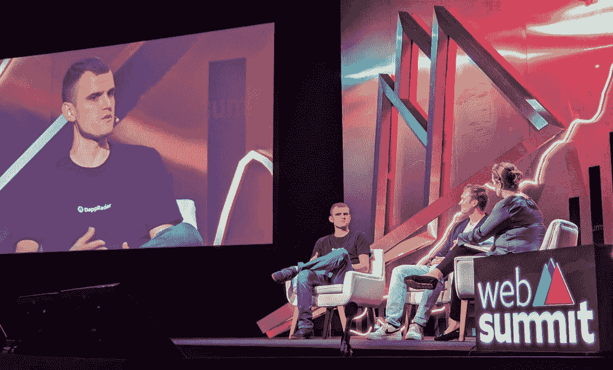

# DappRadar 首席执行官 Skirmantas Januskas 在网络峰会上发言

> 原文：<https://web.archive.org/web/https://dappradar.com/blog/dappradar-ceo-skirmantas-januskas-speaks-at-websummit>

## 谁能更好地解释 Web3 超级应用的重要性？

**11 月 4 日，DappRadar 的联合创始人兼首席执行官在 WebSummit 的 crypto 大会上发表了一篇关于我们世界的演讲。Skirmantas Januskas 与南森的 Alex Svanevik 和主持人 The Blind Spot 的 Izabella Kaminska 就 Web3 应用程序以及去中心化在技术世界中扮演的角色进行了深刻的对话。**

## 突出

*   在里斯本举行的 2022 年网络峰会将几个 Web3 和加密主题纳入议程；
*   Skirmantas Januskas 受邀在欧洲最大的技术盛会上发表关于 Web3 超级应用——我们喜欢称之为 dapps 的演讲；
*   这场争论不仅证明了技术的未来在 Web3，也证明了 DappRadar 已经走了多远。

## Web3 超级应用和 DappRadar

Web3 会成为主流吗？尽管我们离大规模采用加密技术还很遥远，但里斯本的网络峰会让这个话题变得如此现实，看起来的确如此。

在三天的时间里，Web3 的一些最有影响力的人物谈论了他们最了解的事情。

币安的 CZ 谈到了加密货币，[沙盒](https://web.archive.org/web/20221130131805/https://dappradar.com/ethereum/games/the-sandbox)的 Sebastien Borget 谈到了元宇宙，Skirmantas 谈到了 dapps。

*Panel on the importance of Web3 super-apps, WebSummit Lisbon 2022*

当谈到 Web3 超级应用程序如何成为未来不可置疑的一部分时，人们不能不谈到 DappRadar。

> ***“DappRadar 是世界上的 dapp 商店。我们列出了来自世界各地的所有分散式应用程序，不管它们在什么平台上，这样人们就可以很容易地发现它们。可能是任何听说过 NFTs、Axie Infinity、CryptoKitties、以太坊、币安智能链或任何链的人。你可以在我们的平台上免费找到它们，开放给每个人去发现。”***

[Discover Top Dapps Ranking](https://web.archive.org/web/20221130131805/https://dappradar.com/rankings)

社区参与是分散应用的推动力。当 DappRadar 选择成为世界上的 dapp 商店时，它意味着尽可能地为人们所用。

这也让 Skirmantas 与观众分享了组织中真正的分权意味着什么。

## 下放 DappRadar 和 DAO 计划

由于听众中的许多专业人士来自传统金融领域，理解企业去中心化听起来太超前了。然而，DappRadar 的旅程和 DAO(去中心化自治组织)有助于照亮这个问题。

DappRadar 通过推出 RADAR token 开放了社区所有权，从小处开始，最终分散化。当然，在这条大胆的道路上也面临着一些挑战。

> ***“我们有道，但它还不能控制公司做的所有事情。令牌持有者将能够影响 DappRadar 内部正在发生的事情，为什么或如何首先制造产品，以及诸如此类的事情。但这是一个非常缓慢的过程。在我们的论坛上有很多正在进行的教育，与社区内部的人交谈，解释事情为什么会这样，我们如何看待未来，等等。”***

罗马不是一天建成的，达普拉达的刀也不是一天建成的。这不仅仅是关于 DappRadar 公司本身，也不是谁创建了它或谁为它工作，而是该组织提议为社区提供的公共服务——事实上，这越来越接近由社区控制。正如 Skirmantas 在他自己的演讲中所说:

> ***“会非常精彩的。”***

## 加入 DappRadar，迎接去中心化应用的未来

很明显，我们所知的世界正在迅速变化。游戏、金融、艺术和技术作为一个整体是不一样的，去中心化将对我们的联系产生巨大影响。

无论你在世界的哪个角落，DappRadar 都准备好让你知道这种进化是如何发生的。在 [Twitter](https://web.archive.org/web/20221130131805/https://twitter.com/DappRadar) 上关注我们，在 [Discord](https://web.archive.org/web/20221130131805/https://discord.com/invite/4ybbssrHkm) 上加入我们的服务器，成为这个令人惊叹的社区的一部分。

想知道更多关于 DappRadar DAO 的信息以及我们的团队是如何建立全球 dapp 商店的吗？请访问以下链接:

*   [了解达普拉达道&治理](https://web.archive.org/web/20221130131805/https://dappradar.com/token/governance)
*   [认识 DappRadar 团队系列](https://web.archive.org/web/20221130131805/https://dappradar.com/blog/tag/meet-the-team)
*   [为什么每个 Dapp 社区都需要 DappRadar DAO 的声音](https://web.archive.org/web/20221130131805/https://dappradar.com/blog/why-every-dapp-community-needs-a-voice-in-dappradar-dao)

 NewsletterUnsubscribe at any time. [T&Cs](https://web.archive.org/web/20221130131805/https://dappradar.com/terms) and [Privacy Policy](https://web.archive.org/web/20221130131805/https://dappradar.com/privacy-policy)