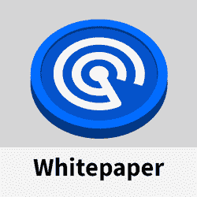

# DappRadar 社区向建立未来的 Dapp 商店发出信号

> 原文：<https://web.archive.org/web/https://dappradar.com/blog/dappradar-community-building-dapp-store-of-the-future>

## 半雷达持有者霍德林。

自从 DappRadar 于 12 月 14 日推出雷达令牌以来，共有 45，197 名 dapp 用户认领了他们的空投。这代表了总合格金额的 30%以上，更好的是，那些声称一半持有并开始直接影响世界 Dapp 商店未来的人。

RADAR 刚刚起步，我们很高兴看到社区分享我们的愿景，即构建一个社区支持的未来 dapp 商店，让分散式应用程序和 web3 对每个人来说都更容易访问，正如我们在 RADAR Token 白皮书—[中介绍的那样——难怪 DappRadar 的 Discord channel](https://web.archive.org/web/20220928002246/https://www.discord.gg/dappradar) 在 Token 发布后立即增长了 25%以上。

自推出以来，RADAR token 已在多个交易所上市。社区成员现在可以在像[Crypto.com](https://web.archive.org/web/20220928002246/https://crypto.com/exchange/trade/spot/RADAR_USDT)和[火币](https://web.archive.org/web/20220928002246/https://www.huobi.com/en-us/exchange/radar_usdt/)这样的交易所，以及 [Hoo](https://web.archive.org/web/20220928002246/https://hoo.com/innovation/radar-usdt) 、 [MEXC](https://web.archive.org/web/20220928002246/https://www.mexc.com/exchange/RADAR_USDT) 和 [ZT 交易所](https://web.archive.org/web/20220928002246/https://www.ztb.im/)上找到 DappRadar 令牌。那些寻找分散交换解决方案的人可以在 [SushiSwap](https://web.archive.org/web/20220928002246/https://app.sushi.com/swap?inputCurrency=0x44709a920fccf795fbc57baa433cc3dd53c44dbe&outputCurrency=ETH) 和 [Uniswap](https://web.archive.org/web/20220928002246/https://info.uniswap.org/#/tokens/0x44709a920fccf795fbc57baa433cc3dd53c44dbe) 上找到 RADAR。

## 用你的雷达，为未来投票

现在，我们正在准备第一次社区投票:将 SushiSwap 的种植期再延长 3 个月。当 DappRadar 治理论坛上的投票[结束时，该提案将移动到快照，社区成员可以用他们的雷达令牌投票。如果你没有，现在就说出你的想法。](https://web.archive.org/web/20220928002246/https://forum.dappradar.com/t/dcp-1-extend-farming-rewards-on-sushiswap-2x-farm/101)

还有很多令人兴奋的事情，包括专门的营销活动、新的交易所上市、进一步的区块链集成和官方 DappRadar 移动应用程序的推出，等等。所以，现在就加入雷达社区，开始影响 DappRadar 的未来吧。

## 更多关于雷达的信息

*   哪里可以找到雷达？
*   [如何在 SushiSwap 上获得奖励](https://web.archive.org/web/20220928002246/https://dappradar.com/blog/how-to-stake-radar-for-rewards-on-sushiswap)
*   [雷达初始效用概述](https://web.archive.org/web/20220928002246/https://dappradar.com/blog/radar-token-utility-overview)

[<picture></picture>](https://web.archive.org/web/20220928002246/https://dappradar.com/token/airdrop)[<picture></picture>](https://web.archive.org/web/20220928002246/https://docs.dappradar.com/v/radar-token/radar-tokenomics )[<picture></picture>](https://web.archive.org/web/20220928002246/https://discord.gg/dappradar)