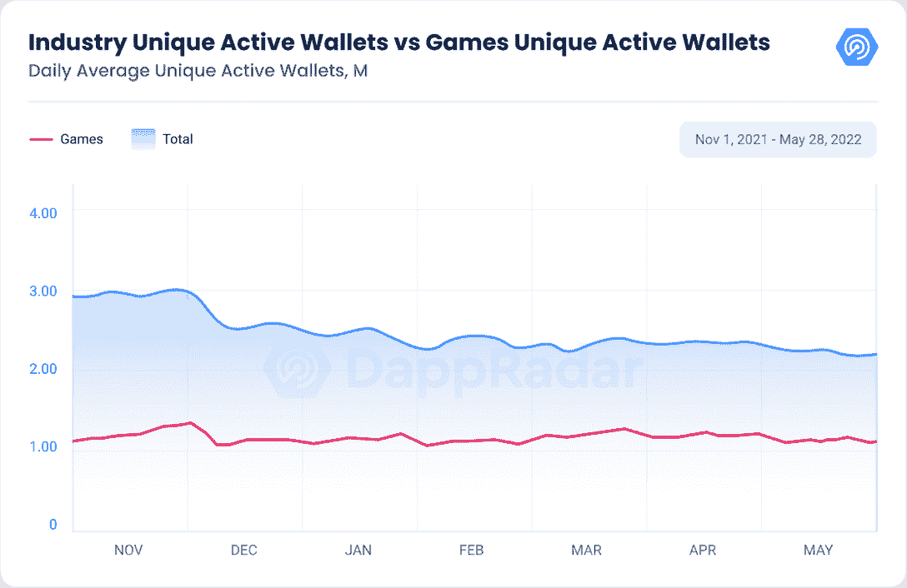
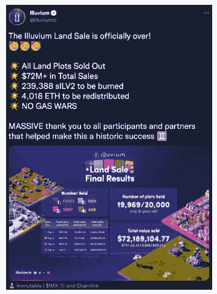
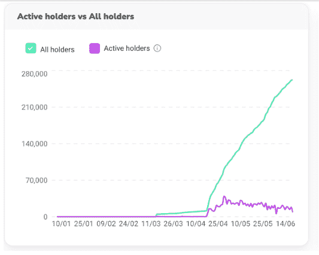
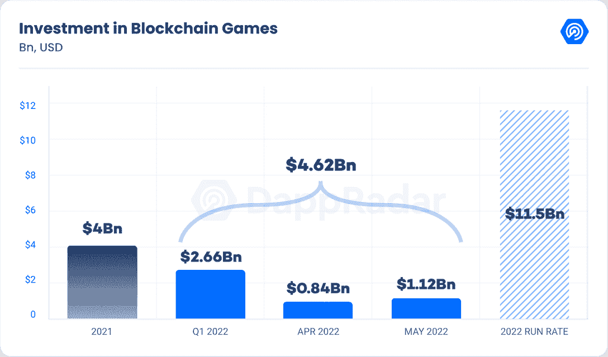
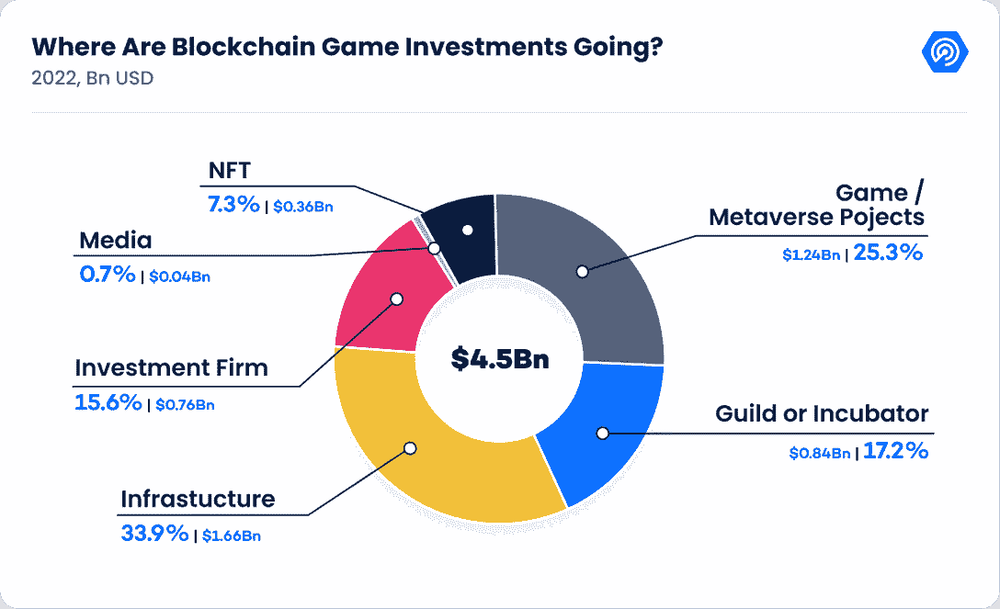
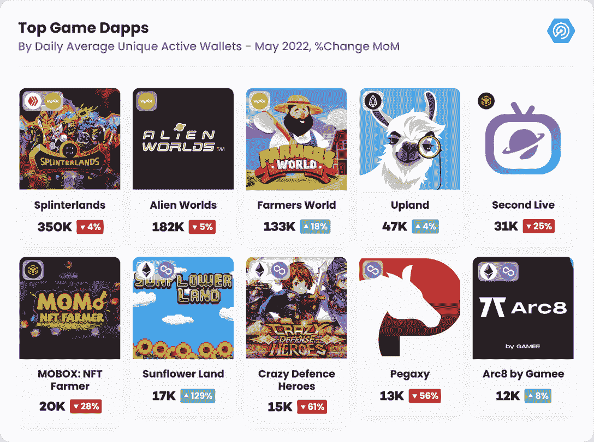

# DappRadar x BGA 游戏报告# 5——区块链游戏继续对抗熊市

> 原文：<https://web.archive.org/web/https://dappradar.com/blog/dappradar-crypto-games-report-5-blockchain-games-continue-to-defy-the-bear-market>

## 区块链游戏正在激烈地挑战熊市，每天有 115 万个独特的活跃钱包与 Splinterlands、Illuvium、GRIT 等游戏互动。

区块链游戏是整个行业在严峻的熊市中保持垂直步伐的方式。Illuvium 的第一次土地出售，Galaverse，和新的移动赚钱项目保持了对这个垂直市场的兴趣。

dapp 行业正在经历影响加密市场的漫长熊市。自 2020 年以来，加密市值首次跌破 1 万亿美元。同样，dapp 行业的活动降至去年 9 月以来的最低点，每天注册 222 万个独立活动钱包(UAW)。

与熊市趋势相反，5 月份平均每天有 115 万 UAW 与区块链游戏互动，仅比上月下降 5%。区块链游戏证实了其作为区块链垂直游戏的地位，这种游戏更好地应对了熊市。

这份报告将涵盖过去几周发生的最重要的事件，这些事件使得区块链游戏成为 dapp 行业中最令人兴奋的类别之一。

## 关键要点

*   Splinterlands 在 5 月份以 35 万的每日 UAW 数保持着区块链顶级游戏的地位，同时向去中心化迈出了一大步
*   Illuvium 的第一笔土地销售收入为 7200 万美元；该事件显示了第 2 层解决方案的优势，如不可变
*   Galaverse 揭示了 Gala 生态系统的主要计划，包括砂砾，土星计划和 TWD 帝国和米兰多斯的主要更新
*   自 5 月份以来，投资继续涌入区块链游戏公司，Web3 游戏公司和相关的元宇宙项目筹集了 14 亿美元
*   STEPN 每月注册 200 万用户，因为移动挣钱模式不断增加锻炼爱好者

## 目录

*   [UAW 股市持续上涨](https://web.archive.org/web/20220815013735/https://dappradar.com/blog/dappradar-crypto-games-report-5-blockchain-games-continue-to-defy-the-bear-market/#Splinterlands)–尽管熊市，日交易量仍达到 35 万
*   [Illuvium 土地销售收入 7200 万美元，为未来 NFT 销售奠定蓝图](https://web.archive.org/web/20220815013735/https://dappradar.com/blog/dappradar-crypto-games-report-5-blockchain-games-continue-to-defy-the-bear-market/#Illuvium)
*   [是时候谈谈银河宇宙了](https://web.archive.org/web/20220815013735/https://dappradar.com/blog/dappradar-crypto-games-report-5-blockchain-games-continue-to-defy-the-bear-market/#Time)
*   [随着 move-to-earn 继续大放异彩，STEPN 每月注册用户达到 200 万](https://web.archive.org/web/20220815013735/https://dappradar.com/blog/dappradar-crypto-games-report-5-blockchain-games-continue-to-defy-the-bear-market/#STEPN)
*   [A16z 和 Dapper Labs 以 13 亿美元的投资领先 May 的游戏和元宇宙投资](https://web.archive.org/web/20220815013735/https://dappradar.com/blog/dappradar-crypto-games-report-5-blockchain-games-continue-to-defy-the-bear-market/#A16z)
*   [顶级游戏抵御市场崩盘](https://web.archive.org/web/20220815013735/https://dappradar.com/blog/dappradar-crypto-games-report-5-blockchain-games-continue-to-defy-the-bear-market/#Top-games)
*   【Avalanche 会成为另一个游戏强国链吗？
*   [关闭](https://web.archive.org/web/20220815013735/https://dappradar.com/blog/dappradar-crypto-games-report-5-blockchain-games-continue-to-defy-the-bear-market/#Closing)

## 《分裂的土地》继续滚动——尽管熊市，每日 35 万 UAW

领先的区块链游戏似乎不承认熊市。连续八个月，Splinterlands 凭借其动态交易卡机制统治了游戏界。5 月份，Splinterlands 吸引了 350，000 的每日 UAW，仅比 4 月份的数字减少了 4%。

但是流行的 Hive 游戏最重要的故事是 SPS 验证器节点许可证的成功销售。5 月 26 日，第一批 2000 个 validators 节点许可证在不到 15 分钟内售罄，烧掉了 1450 万个 sp，并为游戏的 DAO 分配了近 400 万美元。

SPS 节点许可证将有助于 Splinterlands 生态系统的去中心化未来，该生态系统将依赖委托利益证明(DPoS)作为批准所有交易的共识机制。

SPS 持有者将拥有一个治理投票来塑造分裂之岛的未来。除了委托服务提供商赚取属于验证者节点的部分奖励外，玩家将能够在游戏市场中获得节点许可证，从而允许更公平地分配游戏奖励。

## Illuvium 土地销售收入 7200 万美元，并为未来 NFT 销售奠定了蓝图

尽管市场条件不利，最受期待的区块链游戏之一 Illuvium 还是成功售出了游戏的首批地块。

从 6 月 2 日到 6 月 4 日，以太坊的开放世界 RPG 成功出售了 20，000 块土地，在出售时产生了 4，018 ETH，价值 7，200 万美元。伊鲁威姆的土地将会很重要，因为玩家可以直接获得燃料，这是玩游戏的主要资源。

在土地出售之前，在 Q1，游戏推出了它的私人测试版，让少数玩家真正体验了涉及魔法生物 Illuvials 的战斗行动。此外，Illuvium 将发布一个名为 Illuvium Zero 的移动版本，玩家可以在其中建立一个工业虚拟综合体来开采资源。

Illuvium 将在 Immutable-X (IMX)上运行，这是一个以太坊第二层解决方案，可以优化燃气费用，同时享受以太坊的基础设施优势。与另一方铸币厂在残酷的天然气战争中损失了数百万美元相反，Illuvium 的荷兰拍卖阻止了这种情况(avg。土地出售的汽油费是 20 美元，相比之下，其他契约中的汽油费是 4，000 美元。

Illuvium 的土地出售标志着真正的第一届 AAA 区块链运动会的第一个里程碑。此外，它还为 L2 和侧链等扩展解决方案如何成为托管任何类型的区块链游戏交易的首选奠定了蓝图。

除了伊鲁维姆，IMX 还拥有《被解放的神》、《TCG》穿越熊市、《守护者协会》、《灰烬之剑》和其他令人兴奋的游戏，预计将在未来几个月内整合。 [Web3 游戏将在 IMX 蓬勃发展](https://web.archive.org/web/20220815013735/https://dappradar.com/blog/web3-games-can-thrive-on-immutable-x-and-starknet)。

## 是时候谈谈银河了

Gala Games 正在慢慢打造一个区块链游戏帝国。Gala 生态系统对这个领域并不陌生，TownStar 和 Spider Tanks 都有直播游戏，而 TWD 和米兰多斯等游戏的资产已经在以太坊市场上出售，米兰多斯是最受宣传的 Web3 游戏之一。最重要的是，Gala 依赖于玩家运行的分散节点，这些节点为所有 Gala 游戏 dapps 提供动力，使这个生态系统非常独特。

从 6 月 6 日到 6 月 8 日，Gala Games 在马耳他举办了自己的大会 Galaverse，该团队在会上公布了诱人的合作伙伴关系，并透露了他们生态系统中一些 dapps 即将到来的里程碑。

首先，Gala Games 宣布[射击游戏 GRIT 将在 Epic Games 商店](https://web.archive.org/web/20220815013735/https://dappradar.com/blog/epic-games-store-adds-blockchain-game-grit-by-gala-games)发售。区块链游戏将向 3000 万活跃的 Epic 游戏商店用户介绍 Web3 游戏。

Epic Games 是堡垒之夜和 3D 电脑图形游戏引擎虚幻背后的工作室。这与 Steam 的心态相矛盾，Steam 去年 10 月禁止了其平台上的所有区块链游戏。

在 Galaverse 活动中宣布了另一个令人兴奋的合作伙伴关系。土星计划将成为在 Gala Games 生态系统上运行的太空堡垒 Galactica 主题 Web3 游戏。为了获得知识产权，Gala 与环球影业合作。与 AMC 合作开发《行尸走肉帝国》只是大型合作伙伴关系的又一个例子。

此外，Gala Games 还将推出《永远的冬天》(Forever Winter)，这是一款恐怖射击游戏，目前由 Fun Dog 开发，该游戏工作室主要由开发《巫师 Witcher 3)的开发者组成，该游戏被认为是近年来最好的游戏之一。

此外，还有最后一次远征，这是 TPS 备受期待的游戏，由最成功的两个游戏系列 Halo 和 COD 的创作者开发。总的来说，Gala Games 将在未来几年成为一个 Web3 游戏强国。

虽然 GALA 的价格无法抗拒熊市趋势，但值得注意的是，GALA token 遵循与 BTC 类似的逻辑，有上限供应和每年减半。盛大游戏宇宙中的下一个重要事件是米兰度斯范例空投，这将奖励 MTRM，并将被考虑为米兰度斯的下一个游戏测试。

## 随着移动赚钱技术的持续发展，STEPN 每月注册用户数达到 200 万

除了[市场崩溃和生态系统内爆](https://web.archive.org/web/20220815013735/https://dappradar.com/blog/dappradar-industry-report-may-2022)之外，业内最热门的话题之一是移动赚取(M2E)作为 Web3 范式的兴起。顾名思义，M2E 允许用户根据他们的身体活动赚取代币奖励。

据 TechCrunch 报道，STEPN 仍然是最受欢迎的 M2E dapp，每月至少有[200 万用户](https://web.archive.org/web/20220815013735/https://techcrunch.com/2022/05/22/play-move-to-earn-solana-stepn-gamefi/?guccounter=1&guce_referrer=aHR0cHM6Ly93d3cuZ29vZ2xlLmNvbS8&guce_referrer_sig=AQAAABfcWG03C-IyVpI2iOMKY68d7SCsrEpyNXmxO2E9awdML_uK_vYk_x_EONikvoDuiMTw2tkxyFHaf8v2wrHMsnykq6lT2THITehiLwJrsxq7igNQkkjrrpQo6MO9bXMgiKMpgR9SWuI_AUr5NZ2RfM4LXJL56ah1Xby2eBSeWWM_)。该项目的治理标志 GMT 似乎也是投资者的热门选择，因为尽管市场情绪消极，但持有 GMT 标志的独特钱包数量(262，000)仍在不断增加。

虽然， [STEPN 的](https://web.archive.org/web/20220815013735/https://dappradar.com/blog/how-to-get-crypto-on-move-to-earn-platform-stepn) on-chain 活动在 Solana 上停滞不前，但该项目将实现租赁功能，玩家将能够从其他用户那里租赁运动鞋 NFTs，为这个移动赚取生态系统增加了另一个经济层。

此外，随着运动鞋的底价(写作时为 5 索尔)和溶胶价格(29 美元)的下降，STEPN 生态系统的进入壁垒比以往任何时候都更加实惠。

除了 STEPN，少数 dapps 正在 M2E 排名中大步前进，尽管它们中的大多数都处于早期阶段。

Genopets 是 Solana 的另一个赚钱的 dapp，它将游戏化元素提升到了另一个水平。Genopets 遵循类似于 Pokemon Go 的方法，玩家使用 ar 捕捉 Genopets 怪物在现实世界中不同位置的移动。

该游戏最近推出了 Genopets Habitat，这是该项目的虚拟世界，将向用户奖励奖励令牌和水晶收入。尽管游戏是免费的，但 Genopets 怪物 NFT 在二级市场上以 55 索尔的价格出售，为玩家提供了游戏机制方面的优势。Genopets 尚未推出其手机版，但预注册程序已在[游戏网站](https://web.archive.org/web/20220815013735/https://mainframe.genopets.me/sign-up?destination=https%3A%2F%2Fmainframe.genopets.me%2Fdashboard)上开放。

Step App 是一个基于[雪崩](https://web.archive.org/web/20220815013735/https://dappradar.com/rankings/protocol/avalanche)的移动赚取 dapp，遵循与 STEPN 相似的机制。移动 dapp 尚未在未来几周内推出其测试版，尽管 FITFI 赌注池已经向公众开放。

Dotmoovs 是一款在[以太坊](https://web.archive.org/web/20220815013735/https://dappradar.com/rankings/protocol/ethereum)、 [BNB](https://web.archive.org/web/20220815013735/https://dappradar.com/rankings/protocol/binance-smart-chain) 和[多边形](https://web.archive.org/web/20220815013735/https://dappradar.com/rankings/protocol/polygon)上运行的多链 m2e dapp，它提出了一个在锻炼时赚取的有趣命题。Dotmoovs 包括 PvP 战斗，玩家需要记录自己展示舞蹈和足球技能的过程。这款免费游戏可以在 Andorid 和 iOS 中下载，并向用户奖励 NFTs 和 MOOV 令牌。

最后， [OliveX](https://web.archive.org/web/20220815013735/https://dappradar.com/blog/what-is-olivexs-native-dose-token) ，一个独特的移动赚钱生态系统，拥有像 [Dustland](https://web.archive.org/web/20220815013735/https://dappradar.com/polygon/collectibles/the-dustland) 、僵尸快跑和 Lympo 深蹲这样的 dapps。 [OliveX](https://web.archive.org/web/20220815013735/https://www.olivex.ai/) 是一家由 [Animoca Brands](https://web.archive.org/web/20220815013735/https://www.animocabrands.com/) 支持的数字健康和健身公司，专注于通过健身游戏化、增强现实和游戏赚取体验来开发独特的用户体验。这三款 dapp 都可以在 Android 和 iOS 应用商店下载。

总的来说，移动挣钱运动是最近 Web3 中最有趣的概念之一。这些游戏能否建立一个可持续的经济模式还有待观察。然而，在赚钱的同时锻炼可以成为度过熊市的一个好选择。

## A16z 和 Dapper Labs 以 13 亿美元的投资领先于 May 的游戏和元宇宙投资

区块链游戏的另一个有利方面是持续流入元宇宙和游戏项目的资金。2022 年，49 亿美元已被注入游戏和元宇宙，包括区块链基础设施以及行会和孵化器，以提振游戏前景。这个数字还不包括 a16z [承诺用于创建游戏基金 One](https://web.archive.org/web/20220815013735/https://a16z.com/2022/05/18/games-fund-one-building-the-future-of-games/) 的 6 亿美元，这是一个专注于促进游戏工作室和基础设施的分支机构。

另一项引人注目的投资是 Dapper Labs 筹集的 7 . 25 亿美元，用于进一步扩展 Flow 生态系统。Flow 已经与一些最大的体育 IP 品牌合作，即 NBA、NFL、西甲和 UFC，并且是 OG 游戏 CryptoKitties 的所在地。

总之，看到资本流入区块链博彩业是一个积极的迹象，尽管市场动荡，但自 5 月份以来，该行业已筹集了 14 亿美元。截至发稿时，今年筹集的资金中有 33%投向了基础设施项目，而 25%来自元宇宙博彩项目本身。即使在熊市季节，对这一类别的兴趣也没有减弱。

## 顶级游戏推动对市场崩溃的抵抗

正如我们在 5 月份的行业报告中指出的那样，游戏 dapps 是抵御市场崩溃的最强垂直产品。虽然包括移动赚钱 dapps 在内的新游戏在引发这种抵制方面发挥了重要作用，但顶级游戏 dapps 中观察到的参与度是区块链游戏避开市场崩溃的主要驱动力。

Splinterlands 凭借引人入胜的战斗动态和上文解释的节点许可证所代表的诱人的去中心化经济，继续其强劲的表现。Wax 的《外星世界》和《农民世界》完成了前三名。

令人印象深刻的是，Farmers World 在 5 月份的玩家数量增长了 18%，超过了每日 133，000 名 UAW。采矿网络是另一个蜡 Gamefi dapp [张贴高链使用水平](https://web.archive.org/web/20220815013735/https://dappradar.com/blog/the-miningnetwork-game-on-wax-attracted-more-than-800k-users-within-30-days)虽然这些数字是否来自有机或机器人驱动的活动还有待观察。

高地也成了一致性的同义词。自 Q1 2021 以来，EOS 虚拟世界一直是最受欢迎的游戏之一。高地连锁玩家的数量在 5 月份增长了 5%，超过了每天 47，000 的 UAW。自 2021 年 5 月以来，Upland 的玩家数量几乎翻了一番(90%)。

Polygon 的向日葵地和 Arc8 也设法增加了他们的玩家数量，尽管是在熊市季节。在今年早些时候游戏的第一个版本崩溃后,《向日葵之地》正在完成它的转变。与此同时，Arc8 不断增加迷你游戏，随着足球和篮球的更新，这些游戏得到了积极的回应。

除了现任的区块链，值得注意的是，Thundercore，一个 EVM 兼容链，正在建立一个完整的移动区块链游戏产品。Galaxy Blocks 和 Jelly Squish 的活跃度较上月增长了 23%，而 Color Craze 的玩家基数较 4 月份增长了 53%。

另一方面，BNB 的炸弹加密和 Mobox 分别损失了 50%和 28%。炸弹加密的情况有点令人担忧，特别是考虑到币安游戏的背景。

dapp 的玩家数量已经从 Q1 每日 22，000 的 UAW 急剧下降到 5 月份每日 5，000 的 UAW。Mobox 的情况可能与崩溃直接相关，因为游戏严重依赖于 NFTs，而某些项目一直在努力。

Harmony 的 [DeFi 王国](https://web.archive.org/web/20220815013735/https://dappradar.com/multichain/games/defi-kingdoms) (-41%)和 Polygon 的[疯狂防御英雄](https://web.archive.org/web/20220815013735/https://dappradar.com/multichain/games/crazy-defense-heroes) (-61%)这个月也在挣扎。公平地说，这些游戏链上活动的急剧下降与它们各自的令牌——宝石和塔——的崩溃直接相关。

自 4 月份以来，JEWEL 下跌了 99%，而 TOWER 同期下跌了 92%。尽管如此，两款游戏 dapps 的每日 UAW 都超过了 12，000，仍然是市场上区块链游戏的首选。

最后， [Axie Infinity](https://web.archive.org/web/20220815013735/https://dappradar.com/multichain/games/axie-infinity) ，它仍然感受到浪人的桥梁黑客的影响。Axie 的链上活动较 4 月萎缩了-39%，但仍比 2021 年 5 月高出 55%。Axie Infinity 发布了 Origin 移动测试版，这将使游戏更容易被更多的观众所接受。

我们将继续关注区块链奥运会的情况。

## Avalanche 会成为另一个游戏强国连锁店吗？

Avalanche 是一个以其 [DeFi 特性](https://web.archive.org/web/20220815013735/https://dappradar.com/rankings/protocol/avalanche/category/defi)而闻名的网络。到目前为止，游戏类别在很大程度上仍未被开发，红色区块链内的[克拉巴达](https://web.archive.org/web/20220815013735/https://dappradar.com/avalanche/games/crabada)引领着 [GameFi 运动](https://web.archive.org/web/20220815013735/https://dappradar.com/blog/top-10-best-gamefi-projects-to-play-and-earn)。在过去的 30 天里，Crabada 吸引了超过 5，250 个 UAW，比同期减少了 50%。然而，艾娃实验室网络的游戏未来似乎一片光明。

《榴霰弹》是一款 AAA 级第一人称射击游戏(FPS)，将于 2022 年第四季度推出其开放 Alpha 版本。《榴霰弹》的目标是成为首批 AAA 级 FPS 区块链游戏之一，其游戏内经济由游戏的原生标志夏普提供动力。

榴霰弹将允许玩家提取包含锋利奖励以及 NFTs 皮肤和武器的战利品盒。有趣的是，创作者将负责设计地图和一些游戏资产。

乍一看,《榴霰弹》描绘了创造一个自给自足的游戏元宇宙的所有理想因素。最好的情况是夏普勒斯成为区块链的 PUBG。游戏的前五个化身“操作员”的造币阶段于 6 月 9 日开始，将持续五周，每个化身设计都可以在 [OpenSea](https://web.archive.org/web/20220815013735/https://dappradar.com/multichain/marketplaces/opensea) 上以 0.05 ETH 或每周 60 美元解锁的价格购买。公平地说，对于这样一个雄心勃勃的项目来说，造币厂的价格是可以接受的。

Domi Online 看起来是另一个诱人的游戏选择，有望成为雪崩生态系统的一部分。多米的目标是成为一个受 Runescape 启发的 Web3 MMORPG。DOMI，游戏的原生令牌除了雪崩还部署在以太坊和 BNB。alpha 版本，包括它的虚拟世界，预计在 2022 年第三季度发布。

但是雪崩游戏的未来并不止于此。总部位于 NFT 的元宇宙 RPG 游戏 Ragnarok 是最受关注的雪崩项目之一。Ragnarok 已经在以太坊推出了 NFT 头像系列，目前的底价为 0.49 ETH。

Ascenders 是一款科幻开放世界 ARPG，预计将在 2022 年第三季度推出 alpha 赛季，让玩家成为游戏内经济的一部分。观察 Avalanche 能否在区块链奥运会上复制 DeFi 的成功将会很有趣。点击此处了解更多即将推出的雪崩游戏。

## 关闭

区块链游戏被证明是这次熊市中真正的幸存者。我们正处于最终看到大量区块链游戏的风口浪尖，这些游戏具有真正身临其境的游戏机制，将娱乐带到了一个新的水平。我们将完成从玩赚到玩赚的转变。