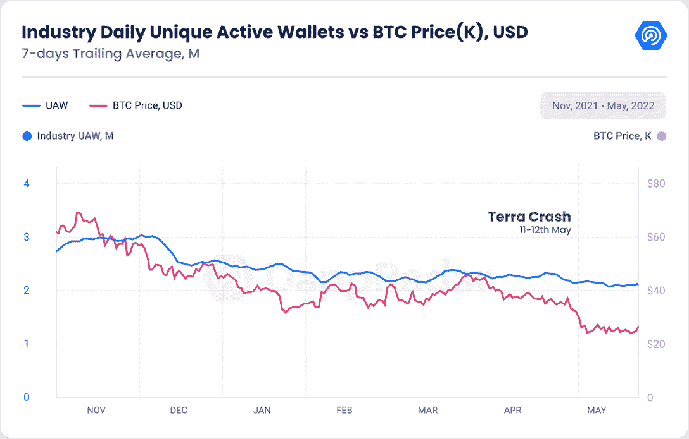
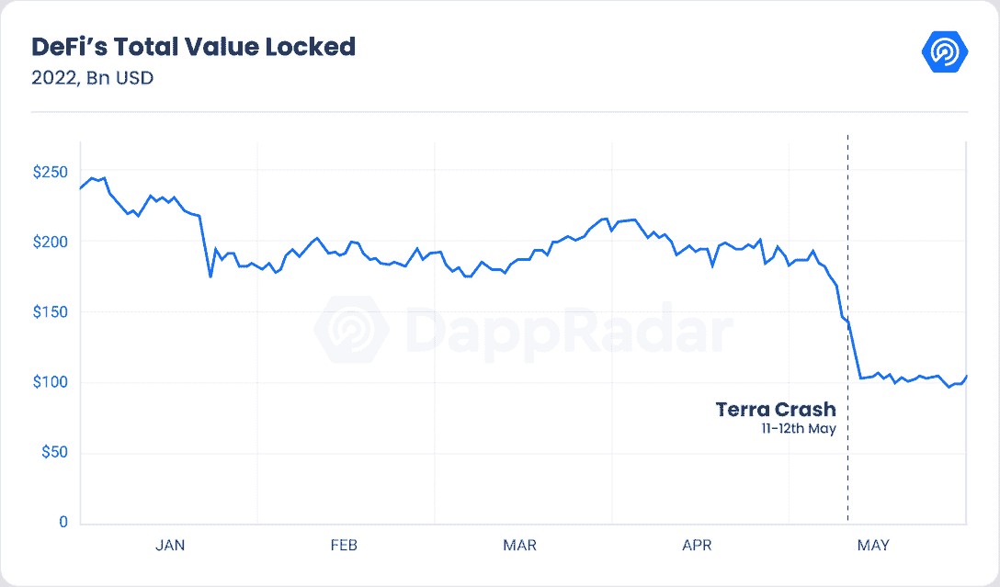
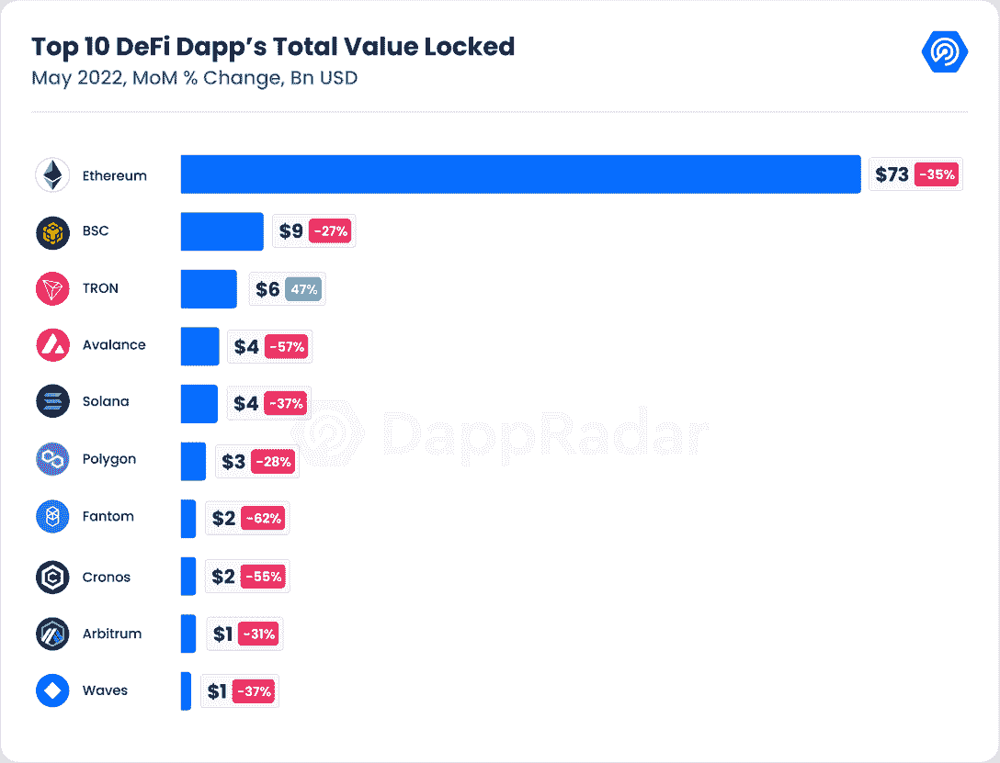
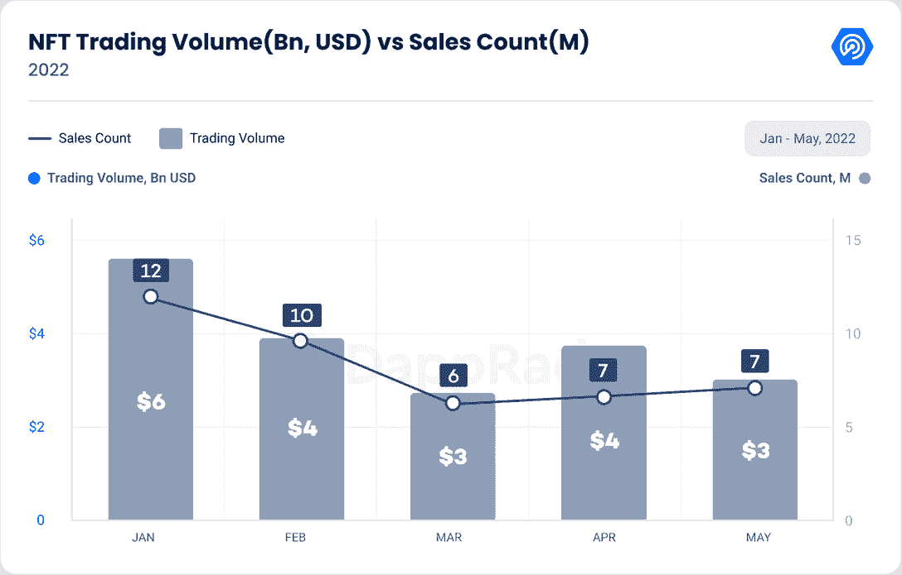
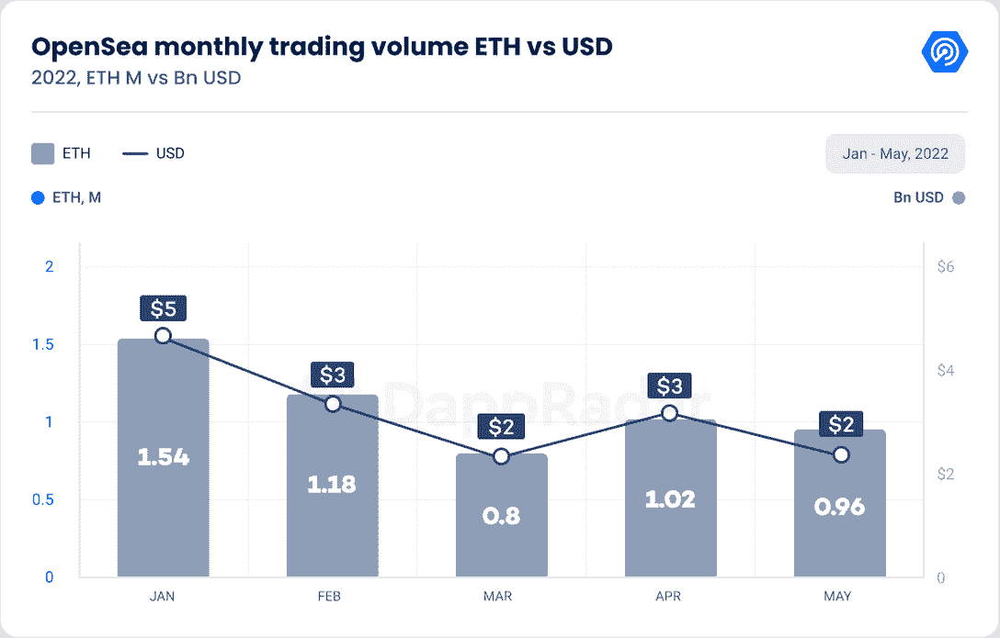
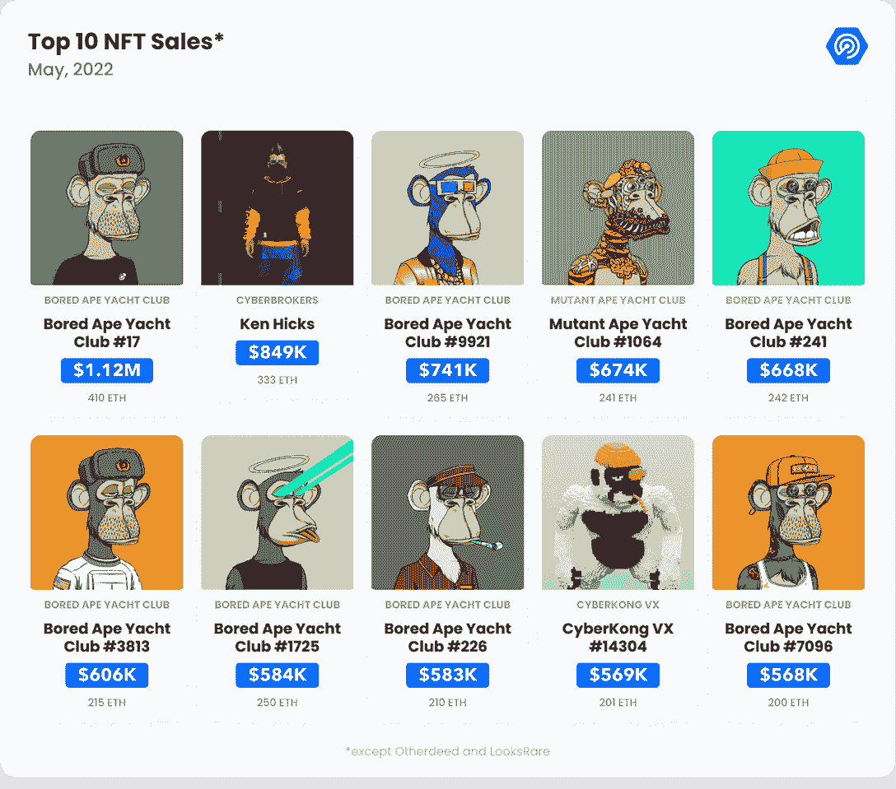
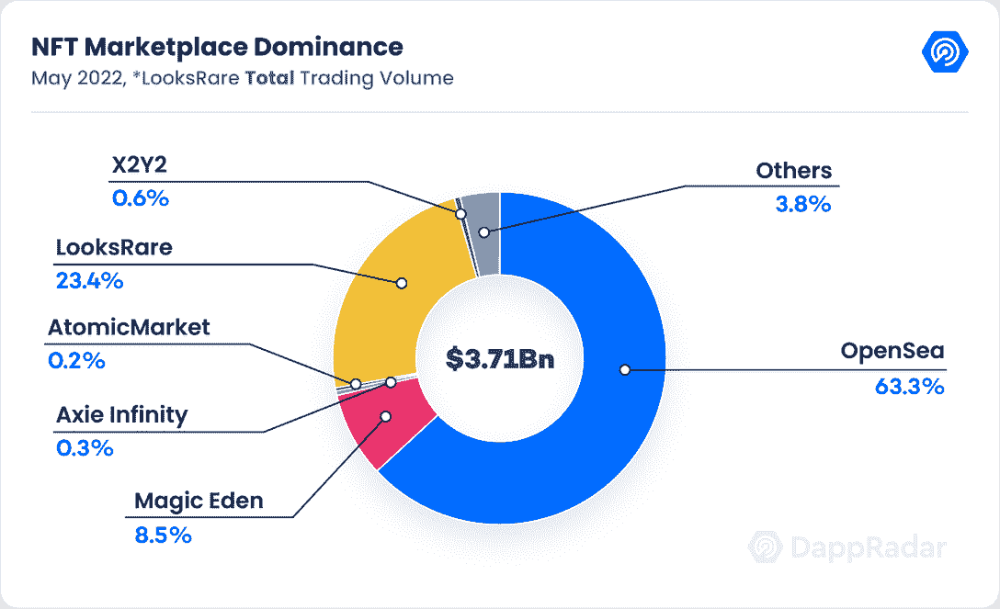
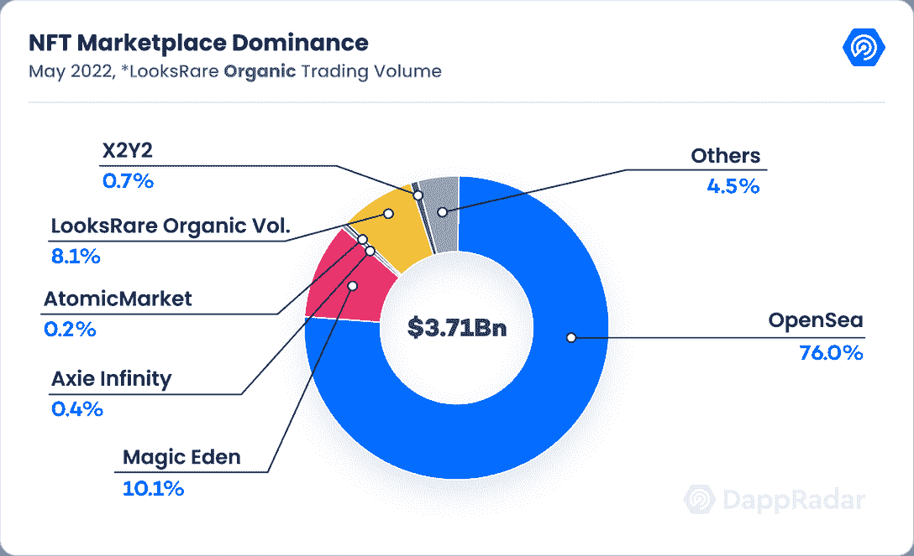
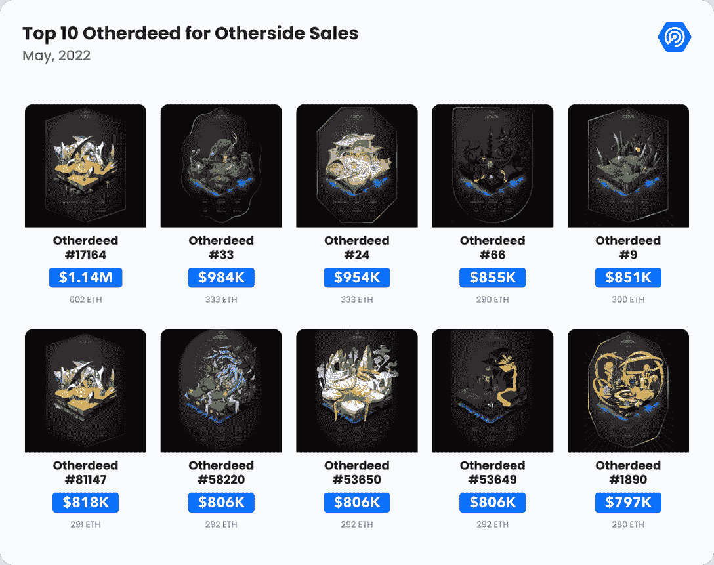

# DappRadar 区块链行业报告–2022 年 5 月

> 原文：<https://web.archive.org/web/https://dappradar.com/blog/dappradar-industry-report-may-2022>

## 查看 2022 年 5 月的 dapp 行业亮点

区块链工业展示了它在因泰拉公司的崩溃而加剧的寒冬中变得多么坚韧。NFT 和游戏保持着进化和成熟的迹象，而 DeFi 似乎开始了复苏之路。

前第二大 [DeFi](https://web.archive.org/web/20230227235143/https://dappradar.com/rankings/category/defi) 生态系统——Terra 的崩溃以及相关的 LUNA token 和 UST [stablecoin](https://web.archive.org/web/20230227235143/https://dappradar.com/blog/these-are-the-best-stablecoins-you-can-trust) 的崩溃，加剧了仍然影响着[隐秘景观](https://web.archive.org/web/20230227235143/https://dappradar.com/rankings)的熊市。

比特币拖累了整个加密市场，自 2020 年 12 月以来首次收于 3 万美元以下。一些替代硬币比去年 11 月达到的峰值下降了 90%。

Dapp 的活跃度达到了今年的最低点，5 月份有 222 万个每日唯一活跃钱包(UAW)连接到区块链 dapp。这一数字代表了 5%的月环比(MoM)下降，尽管仍比 2021 年 5 月高出 32%。

然而，Solana 在网络历史上首次超过了 200，000 日 UAW，尽管基础设施问题经常会中断网络。

从积极的一面来看，并非一切都是悲观和厄运。尽管熊市延长，dapp 行业已经变得相当有弹性。NFT 市场不断发展，涌现出令人耳目一新的项目，如 T2 的 goblin town T3 和 T4 的 other side T5，它们将虚拟世界推向了最好的一个月。

区块链游戏的用户活跃度下降，但继续积累风投投资，以保持看涨势头。最重要的是，领先的 DeFi 网络正在争夺 Terra 留下的市场份额。

## 关键要点

*   在特拉区块链崩溃期间，DeFi 损失了 45%的价值；Uniswap 的历史交易量超过 1 万亿美元，同时将其功能扩展到 Polygon 和乐观主义。
*   NFT 市场 5 月份的交易额为 37 亿美元，比 4 月份的交易额下降了 20%；然而，以代币计量的交易量显示下降了 6.5%。
*   Otherside 的交易量达到 7.5 亿美元，推动虚拟世界在 5 月份达到 8.5 亿美元的最佳月份。
*   投资不断堆积到区块链游戏。游戏类别正在抵御加密崩溃，活动量仅下降 5%，同比增长 197%。

## 内容

*   [泰拉的倒闭对行业造成巨大打击](https://web.archive.org/web/20230227235143/https://dappradar.com/blog/dappradar-industry-report-may-2022/#Terra’s-)
*   在 Terra 的崩溃中，DeFi 损失了 45%的价值
*   [NFT 市场远未死亡](https://web.archive.org/web/20230227235143/https://dappradar.com/blog/dappradar-industry-report-may-2022/#NFT)
*   随着小妖精和其他行为耗尽流动性，蓝筹股集合苦苦挣扎
*   OpenSea 是否在新兴市场面前节节败退？
*   区块链游戏避开了市场崩盘吗？
*   [结束——我们能从目前的情况中得到什么？](https://web.archive.org/web/20230227235143/https://dappradar.com/blog/dappradar-industry-report-may-2022/#Closing)

## 泰拉的倒闭对这个行业是一个巨大的打击

Terra 在 5 月 9 日的崩溃将很难在秘史时间线上被忘记。当时第三大稳定货币 UST 的价格暴跌至 35 美分。其结果是，股价下跌令整个行业不寒而栗，多数稳定的股票暂时失去了挂钩。卢娜基金会警卫队(LFG)使用了 79687 BTC 价值约 35 亿美元，以保持 UST 价值浮动。

此举对生态系统没有效果，因为它无法处理死亡螺旋。LUNA(经典)、ANC 和其他相关网络标志的价值不足以帮助 UST 重新获得联系汇率。

最终，在 5 月 12 日，区块链土地被停止了。Terra 的崩溃见证了 600 亿美元的消失，这是现代史上最重大的财富损失。该事件导致 BTC 价格的抛售压力效应，并在整个加密资产中产生了恐惧情绪，加剧了该行业已经经历的熊市。

此后，Terra 的联合创始人 Do Kwon 宣布了一项复兴计划，其中包括一个名为 Terra 2.0 的 Terra hard-fork，该计划于 5 月 28 日问世。在那一天，LUNA Classic 令牌持有者通过空投获得了新版 LUNA，但价值损失了 99%。不过，跆拳道的情况远未结束，韩国当局正在深入调查这一情况，数千名投资者受到了危机的严重影响。

4 月底，Terra 在 TVL 是一个新兴的 DeFi 生态系统，市值超过 250 亿美元，仅次于以太坊。Terra 将很难在 DeFi 空间重新夺回以太坊亚军的位置。另一方面，peer 区块链将利用这种情况，抓住 Terra 留下的开发人才和观众。

## 在 Terra 的崩溃中，DeFi 损失了 45%的价值

毫无疑问，由于加密货币价格的直接影响，DeFi 是区块链垂直行业中感受最深的熊市挣扎。尽管如此，德菲空间还是能够在崛起的德菲区块链之后的头四个月让东西保持漂浮，包括雪崩、克罗诺斯、Near，当然还有 Terra。尽管 DeFi tokens 在同一时间段内损失了 25%至 40%的价值，但该行业的 TVL 在前四个月仅下降了 15%。

然后，Terra 事件发生了。自从 Terra halt 以来，BTC 和 ETH 已经损失了 25%和 40%的价值。同样，自 4 月底以来，该行业的 TVL 损失了 45%，目前估计为 1，170 亿美元。不过，客观来看，自 2021 年 5 月以来，DeFi space 的锁定价值已经上涨了 11%。

创成为唯一一个 TVL 增长 47%的区块链。以太坊、BNB、Polygon 和 Solana 的股价下跌了 27%至 38%，因为它们本国货币的价格也以类似的比例下跌。Avalanche、Cronos、Fantom 和 Near 失去了约 60%的 DeFi 重要指标。

在更积极的趋势中， [Uniswap](https://web.archive.org/web/20230227235143/https://dappradar.com/hub/token/eth/UNI/ETH?from=0x1f9840a85d5af5bf1d1762f925bdaddc4201f984) 达到了一个重要的里程碑。领先的 [DeFi DEX](https://web.archive.org/web/20230227235143/https://dappradar.com/multichain/exchanges/uniswap-v3) 交易总额突破 1 万亿美元。与此同时，[Solana DeFi](https://web.archive.org/web/20230227235143/https://dappradar.com/defi/protocol/solana)dapp，即 [Orca](https://web.archive.org/web/20230227235143/https://dappradar.com/solana/defi/orca) (77%增长 MoM)[Saber](https://web.archive.org/web/20230227235143/https://dappradar.com/solana/defi/saber)(33%)和 [Solend](https://web.archive.org/web/20230227235143/https://dappradar.com/solana/defi/solend) (11%)的使用正在上升，尽管他们的祖国区块链不断遇到技术问题。

接下来的几个月对这一相关区块链类别的未来至关重要。哪一个区块链生态系统能够取代 Terra 成为以太坊的亚军还有待观察。或者，像[乐观](https://web.archive.org/web/20230227235143/https://dappradar.com/rankings/protocol/optimism)这样的第二层扩展解决方案，以其象征性的空投而新鲜，能挑战一个已建立的第一层区块链生态系统吗？这还有待观察。

## NFT 市场远未死亡

在动荡时期，NFT 类别仍然是 dapp 行业的重要贡献者。这一类别产生的兴趣和炒作是一个容易被忽视的无形因素。区块链行业从 NFTs 获得的风险暴露，使今天的加密市场处于与 2018 年加密冬天完全不同的境地。在那些日子里，该行业的参与度和热情低得惊人。尽管主流媒体不断呼吁 NFT 泡沫破裂，但 NFT 市场的情况却不尽相同。

NFT 市场 5 月份的收入为 37 亿美元，比 4 月份下降了 20%。

虽然以美元衡量的交易量初看起来显示市场正在收缩，但分析以美元计价的市场交易量却显示出不同的情况。

例如，业内最大的 NFT 市场 open sea 5 月份的交易量为 950，000 ETH，仅比 4 月份下降了 6.5%。以美元计的交易量显示了不同的视角，因为 ETH 价格的变化对指标有加权影响。以美元计算的 OpenSea 交易量环比下降 25%。比较这两种观点，美元和瑞士法郎的交易量相差 18.5%。

同样，Solana NFTs 顶住了熊市趋势，发布了该网络历史上最好的交易月份。Solana NFTs 在所有市场创造了 3.35 亿美元的收入，比 4 月份增长了 13%。

尽管整个行业的负面情绪和明显的 NFT 市场收缩，这个空间继续发展，同时不断产生数十亿美元的交易量。几乎每个月，NFT 空间都会见证新系列如何改变整个空间的叙事。

## 随着妖精和其他行为耗尽流动性，蓝筹股集合苦苦挣扎

上个月， [Moonbirds](https://web.archive.org/web/20230227235143/https://dappradar.com/ethereum/collectibles/moonbirds) 和 Solana 的 [Okay Bears](https://web.archive.org/web/20230227235143/https://dappradar.com/blog/new-dapps-report-okay-bears-bulls-in-a-bear-market/) 尽管市场趋势不利，但仍能推动 NFT 销量上升，使自己在各自的市场中处于被视为顶级的地位。五月， [Otherdeeds 将虚拟世界推向了历史上最好的一个月](https://web.archive.org/web/20230227235143/https://dappradar.com/blog/dappradar-metaverse-report-1-virtual-worlds-soulbound-tokens-and-more)。此外， [Goblintown 突然冒出来](https://web.archive.org/web/20230227235143/https://dappradar.com/blog/what-is-goblin-town)，自 5 月 22 日推出以来，已经创造了 3100 万美元的收入。此外，在 [10K 俱乐部](https://web.archive.org/web/20230227235143/https://dappradar.com/blog/new-dapps-report-ens-domains-10k-club-numbers-dont-lie)围绕这些 Web3 域名启动了一个愉快的赛季之后，ENS 本月收集了 41%的总成交量。

对这些项目的巨大需求极大地推高了它们的价格。戈布林顿从免费造币厂变成了位于 6 ETH 的底价，同时有传言称宇迦实验室也是这个神秘项目的幕后黑手。同样，ENS 的平均销售价格从 4 月份的 0.07 ETH 上升到 5 月份的 0.11 ETH，10K 俱乐部和 999 俱乐部分别达到了 0.7 ETH 和 8 ETH 的底价。

与此同时，几个所谓的“蓝筹股”藏品的价值在过去一个月大幅下跌。围绕一些较新藏品的炒作无疑从市场上囤积了流动性。然而，与这些蓝筹股生态系统相关的几个特殊事件是价格下跌的主要原因。

贝克和 MAYC 的案例与另一方的叙述直接相关。这些收藏品的持有者是空投的首映 Otherdeeds NFTs，在快照之前创造了一个炒作周期，导致 4 月底的创纪录价值。一旦造币活动完成，底价开始下跌。自 4 月 30 日以来，BAYC 下限下降了 38%，从 150 ETH 降至 93 ETH。MAYC 在同一时期损失了 57%,交易了 18 ETH。Doodles 也出现了类似的情况，在推出 Dooplicator 后，其价格从 23 ETH 降至 12 ETH，下降了 48%。

但是每个 NFT 系列都有不同的故事。今年 5 月，受动漫启发的志那都红豆系列因一桩丑闻损失了 75%的价值，因为该项目的创始人与多起丑闻有关。底价从 31 ETH 下降到 8 ETH，尽管在 Beanz 的帮助下，该项目设法将一些土地恢复到目前的 12 ETH 底价。

总体而言，顶级 NFT 项目的价值损失导致了前 100 名以太坊收藏的 NFT 市值下降。自 4 月底以来，ETH 的价格下跌了 37%，但蓝筹项目的暴跌使该指标从 4 月份的 180 亿美元降至 100 亿美元，跌幅为 45%。

尽管数量在下降，但蓝筹股集合是交易量最大的，表明它们各自的生态系统只是在经历一个整合期。此外，尽管加密货币价值的价格下降，但在过去几个月中，这些资产的价值下降速度低于基础加密货币。与 2008 年大衰退时的 Art100 指数类似，其价值损失了 26%，相比之下，标准普尔 500 损失了 56%。感觉上，NFT 正在成为一种资产，可能在某个时候与金融市场脱钩。

## OpenSea 正在失去上升的市场吗？

围绕 NFT 市场形成的另一个引人入胜的趋势是市场之间的竞争加剧。OpenSea 仍然是主导市场，但其他竞争对手有机活动的增加显示了 NFT 空间成熟和发展的迹象。

今年前四个月，OpenSea 的市场份额为 90%,而今年 5 月份的市场份额为 84%。尽管本月与市场互动的 UAW 数量环比增长 2%(5 月份为 398，000 UAW)，但这种情况还是出现了。在某种程度上，Gem 和 Genie 等市场聚合器通过提供 NFT 市场的整体视图，提高了 LooksRare 和 X2Y2 的知名度。

今年 5 月，LooksRare 吸引了 30，000 名 UAW 用户，其用户数量比 4 月份增加了 22%。使用 [hildobby](https://web.archive.org/web/20230227235143/https://twitter.com/hildobby_) (著名的 Web3 数据科学家)[公式来过滤 wash 交易活动](https://web.archive.org/web/20230227235143/https://dune.com/hildobby/LooksRare-Wash-Trades-Filtering) *，我们看到在社区驱动的市场中，有机交易量增长了 473%，在 5 月份达到 2.5 亿美元。

同样，收取 0.5%交易费的以太坊市场 X2Y2 的用户数量增长了 93%，5 月份吸引了 11，500 UAW。该市场产生了 2200 万美元的交易量，较上月增长了 286%。

随着 NFT 空间变得更加成熟和竞争激烈，OpenSea 的主导地位无疑已经下降，Solana 的 Magic Eden、Wax 的 Atomic Hub 和以太坊以艺术为中心的 Foundation 的交易量都在上升。尽管如此，可以有把握地说，OpenSea 的存在在未来几个月仍将占据主导地位。市场用新的布局改进了它的外观，提供了新的用户体验。此外，它在 4 月 27 日收购了 Gem，并发布了 Seaport，这是一个开源平台，帮助创作者推出他们的 NFT。

毫无疑问，最大的输家是比特币基地市场，这是一个失败的实验，自 2022 年 4 月 20 日推出以来，仅产生了 250 万美元。在接下来的几个月里，我们将继续密切关注 NFT 市场之战的进展。

## 区块链游戏避开了市场崩盘吗？

区块链游戏一直是行业熊市中最具抵抗力的类别。游戏交易数量和每日 UAW 连接到游戏 dapps 的数量仅比 4 月份的水平下降了 5%。不过，与 DeFi 甚至 NFTs 相比，区块链奥运会受到的影响最小。

顶级区块链游戏继续保持其玩家基础，在排行榜上显示出真实的参与度。此外，元宇宙和区块链基于游戏的项目吸引了越来越多的风险投资。今年 5 月， [Dapper Labs 宣布了一项 7.25 亿美元的基金](https://web.archive.org/web/20230227235143/https://twitter.com/flow_blockchain/status/1524032944439844864?ref_src=twsrc%5Etfw%7Ctwcamp%5Etweetembed%7Ctwterm%5E1524032944439844864%7Ctwgr%5E%7Ctwcon%5Es1_&ref_url=https%3A%2F%2Fboardroom.tv%2Fdapper-labs-fundraise-flow-blockchain%2F)，以加速 Flow 生态系统的增长，同时 a16z 承诺为其 Crypto Fund 4 提供 45 亿美元的巨额资金，重点开发区块链项目。

总的来说，区块链博彩业不断增加更多像 STEPN 或 Genopets 这样的 dapps 高手，将游戏化元素嵌入到“移动赚钱”潮流的体育活动中。最后，另一方面，BAYC 元宇宙项目在 5 月份创造了 7.6 亿美元的收入，促使虚拟世界 NFT 以 8.5 亿美元的收入创下最佳月度纪录。

要获得更多关于区块链游戏的见解，以及虚拟世界、移动赚钱和领先游戏 dapps 等趋势，请务必阅读我们即将发布的 BGA 游戏报告。

## 结束–我们能从当前形势中获得什么？

宏观经济形势和 Terra 事件加剧了熊市的影响，拖累了加密价格，同时对该行业的热情略有下降。不过，这是一个积极的信号，表明用户采用率和 web3 开发者的数量正在上升。同样，令人鼓舞的是，dapp 行业已经发展成为一个多链生态系统，能够抵御 Terra 级别的不利事件。

NFT 股市抵制住了这种负面趋势，在 1 月份的高点后似乎正在盘整。像 Moonbirds、Goblintown 和 Otherside 这样的新系列有助于 NFT 社区保持参与，同时特定的 NFT 系列继续构建有趣的 Web3 生态系统。

同样，NFT 市场显示出明显的演变迹象。在 NFT 排行榜上，索拉纳 not 的作品名列前茅并不罕见。LooksRare 的有机交易量从 1 月份的 2%增长到 5 月份的 35%。NFT 聚合器的受欢迎程度已经一飞冲天，而领先的市场 OpenSea 也在不断发展。

 NewsletterUnsubscribe at any time. [T&Cs](https://web.archive.org/web/20230227235143/https://dappradar.com/terms) and [Privacy Policy](https://web.archive.org/web/20230227235143/https://dappradar.com/privacy-policy)