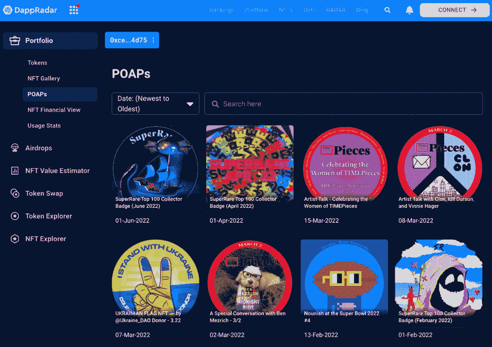

# DappRadar 将 POAPs 集成到投资组合跟踪器中

> 原文：<https://web.archive.org/web/https://dappradar.com/blog/dappradar-integrates-poaps-into-portfolio-tracker>

## 在一个地方找到您的所有出席证明协议 NFT

DappRadar 全面的加密和 NFT 投资组合跟踪系统现在有了新功能。从本周开始，用户可以查看其文件夹中的所有 POAPs(出勤证明协议)。要看到它们，你只需要连接你的钱包。

除了 POAPs，您还可以使用 [DappRadar 的投资组合跟踪器](https://web.archive.org/web/20221003150255/https://dappradar.com/blog/dappradar-portfolio-tracker)来管理您的代币和 NFT。这是帮助跟踪和监督你的投资的完美工具。

此外，如果你很好奇或者想寻找灵感，还有其他钱包可以看看。

通过我们的组合功能，任何人都可以看到名人的加密钱包和他们的 POAPs。

[Snoop Dogg’s POAPs On DappRadar Portfolio Tracker](https://web.archive.org/web/20221003150255/https://dappradar.com/hub/wallet/eth/0xce90a7949bb78892f159f428d0dc23a8e3584d75/poaps)

例如，上面的 POAPs 钱包属于投资者兼说唱歌手 [Snoop Dogg](https://web.archive.org/web/20221003150255/https://dappradar.com/hub/wallet/eth/0xce90a7949bb78892f159f428d0dc23a8e3584d75/poaps) 。

## 什么是 POAPs？

POAP 代表出勤证明协议，简单地说，poap 是事件的 NFT 徽章。它们目前由 [POAP 公司](https://web.archive.org/web/20221003150255/https://twitter.com/poapxyz)管理，于 2018 年首次成立。特别是从 2021 年开始，随着 NFTs 牛市的到来，越来越多的人参加元宇宙的活动，成为 POAP 收藏家。

这是一种保存特殊时刻记忆的新方法，就像保存生日邀请卡或参加研讨会的证书一样。

在 Web3 上，你将 POAPs 或出勤证明 NFT 印在区块链上，放在钱包里作为纪念。每当一个项目发起一项活动并给予其社区 POAP 非功能性测试，它就会变得更加强大和团结。

This [NFT badge](https://web.archive.org/web/20221003150255/https://dappradar.com/hub/assets/poaps/0x22c1f6050e56d2876009903609a2cc3fef83b415/2965465) is to celebrate [Art Blocks](https://web.archive.org/web/20221003150255/https://dappradar.com/hub/nft-explorer/collection/art-blocks-curated) First Anniversary

例如，2022 年 3 月，随着乌克兰和俄罗斯的战争，许多人向乌克兰人捐赠了 ETH，并作为回报获得了 NFT 徽章。无论谁拥有这个徽章，现在他都会为自己所信仰的事业捐款而感到非常高兴。

## 使用 DappRadar 开始跟踪您的加密和 NFT 投资组合

现在，您对 POAPs 以及如何使用 DappRadar 来监督它们有了更多的了解。前往 DappRadar 投资组合跟踪系统开始管理你的投资。

观看下面的视频，了解如何开始的直观解释。

[https://web.archive.org/web/20221003150255if_/https://www.youtube.com/embed/WHL_uYv8riA?feature=oembed](https://web.archive.org/web/20221003150255if_/https://www.youtube.com/embed/WHL_uYv8riA?feature=oembed)

如果你想继续了解 [NFTs](https://web.archive.org/web/20221003150255/https://dappradar.com/blog/category/collectibles) 和令人兴奋的去中心化应用世界，一定要关注 DappRadar [博客](https://web.archive.org/web/20221003150255/https://dappradar.com/blog/)并订阅我们的时事通讯。

保持领先，在 [Twitter](https://web.archive.org/web/20221003150255/https://twitter.com/DappRadar) 上关注我们，获取更多更新和新闻，并加入我们的 [Discord](https://web.archive.org/web/20221003150255/https://discord.com/invite/4ybbssrHkm) 频道，成为我们社区的一员。

***以上不构成投资建议。此处给出的信息仅供参考。请尽职调查并自行研究。***

 NewsletterUnsubscribe at any time. [T&Cs](https://web.archive.org/web/20221003150255/https://dappradar.com/terms) and [Privacy Policy](https://web.archive.org/web/20221003150255/https://dappradar.com/privacy-policy)