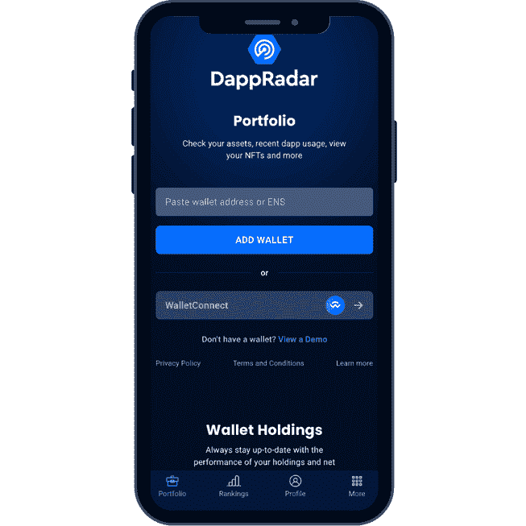
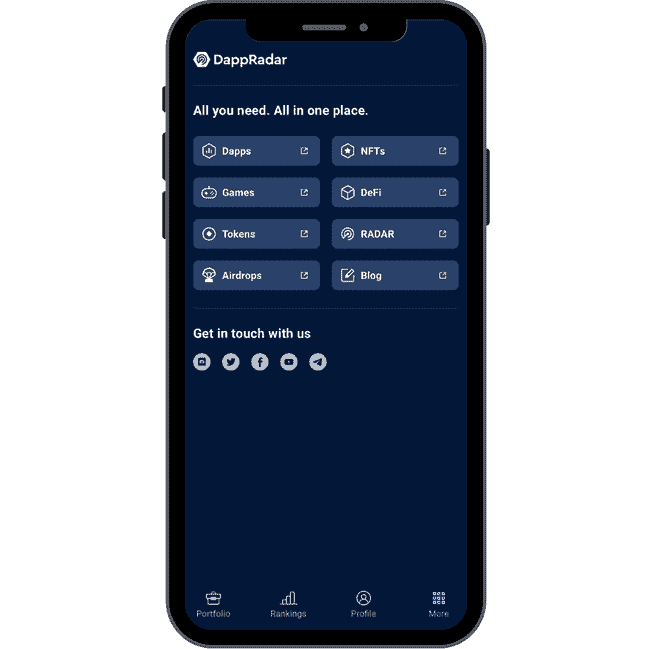

# DappRadar 移动应用程序现已推出公测版

> 原文：<https://web.archive.org/web/https://dappradar.com/blog/dappradar-mobile-app-now-available-in-public-beta>

## 完整版计划于 2022 年 8 月发布。

DappRadar 发布了其移动应用程序的公共测试版，供 Web3 社区的所有人使用。移动应用程序让用户可以访问 DappRadar 最重要的功能，我们将在未来几个月内添加更多功能。

DappRadar 移动应用程序让用户可以直接访问 DappRadar 的所有功能，包括以太坊、BNB 链和多边形。在该应用的核心，他们将发现该应用与他们的常规 DappRadar 帐户同步的能力，获得对他们的投资组合的访问，并很快自定义区块链提醒。当然，非常受欢迎的 DappRadar 排名也可以通过拇指滑动来访问。

## 如何下载 DappRadar 移动应用程序？

该移动应用程序在 iOS 和 Android 上可用。每个人都可以使用以下链接下载公共测试版 DappRadar 应用程序:

### 机器人

[谷歌 Play 商店](https://web.archive.org/web/20220906092117/https://play.google.com/apps/testing/com.portfolio.dappradar)

## ios

iOS [试飞](https://web.archive.org/web/20220906092117/https://itunes.apple.com/us/app/testflight/id899247664?mt=8)*–

Portfolio View

## 专业用户获得更多好处

DappRadar 为整个 Web3 社区提供最新的链上数据，使发现最新的 dapps 比以往任何时候都更容易。那些拥有 DappRadar PRO 会员资格的人可以获得更多的好处，包括 DappRadar 排名中改进的过滤器。

Rankings View

下个月，DappRadar 将正式推出他们应用的第一个版本，让每个人都有能力管理自己的投资组合，跟踪 dapp，并接收警报。DappRadar 将使你进入 Web3 的旅程变得更加容易！

*首先安装 [TestFlight](https://web.archive.org/web/20220906092117/https://itunes.apple.com/us/app/testflight/id899247664?mt=8) ，然后使用链接获取 app。安装并更新它，你就可以开始了！

立即下载 DappRadar 的移动应用程序，将全球 Dapp 商店收入囊中。

More View

## **关于 DappRadar PRO 会员资格的更多信息**

每个在 Web3 钱包中持有 5000 个雷达代币的人都自动有资格成为 DappRadar PRO 会员。此专业会员资格使您能够访问更详细的搜索选项、过滤器和数据点。对于那些积极想要发现新时装、新 NFT 系列和最新潮流的人来说，这是一个理想的会员。

你可以在我们的信息页面上了解更多关于雷达令牌的信息。

## **如何启用 PRO？**

*   只需在您的 Web3 钱包(Metamask、Wallet Connect 等)中放入 5000 个雷达令牌。)，入股 5000 个以上雷达代币或者提供流动资金。
*   在 DappRadar 上创建一个帐户，然后连接包含您的雷达令牌的 Web3 钱包
*   然后，您可以在此页面上查看您的专业会员状态

### 新来达普拉达？

DappRadar 是您在区块链发现分散式应用程序或 dapps 的首选位置。游客可以在 30 多个区块链发现超过 10，000 个 dapps，包括以太坊、BSC、多边形、雪崩、Fantom 和 Flow。

深入了解 DappRadar，直接从 DappRadar 产品组合管理您的钱包、代币和 NFT。

观看下面的视频以了解更多信息，并阅读关于您可以使用 DappRadar 做的[前五件事。](https://web.archive.org/web/20220906092117/https://dappradar.com/blog/things-you-can-do-with-dappradar)

[https://web.archive.org/web/20220906092117if_/https://www.youtube.com/embed/771hPQrDdA0?feature=oembed](https://web.archive.org/web/20220906092117if_/https://www.youtube.com/embed/771hPQrDdA0?feature=oembed)

 NewsletterUnsubscribe at any time. [T&Cs](https://web.archive.org/web/20220906092117/https://dappradar.com/terms) and [Privacy Policy](https://web.archive.org/web/20220906092117/https://dappradar.com/privacy-policy)