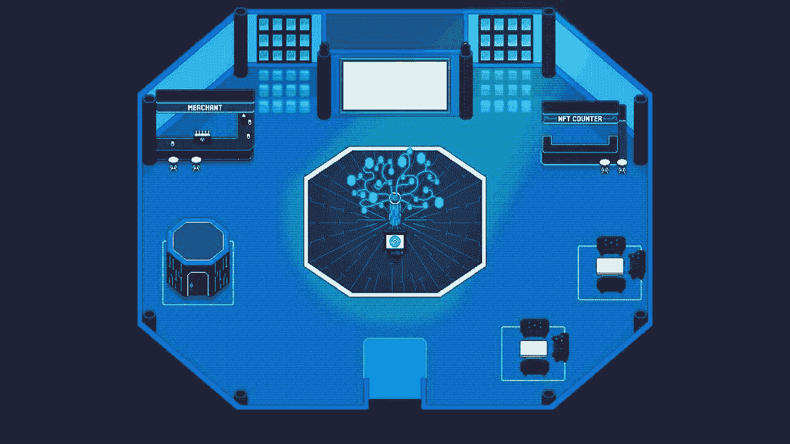
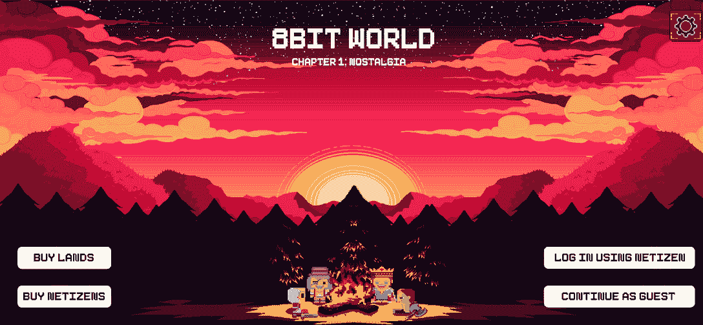
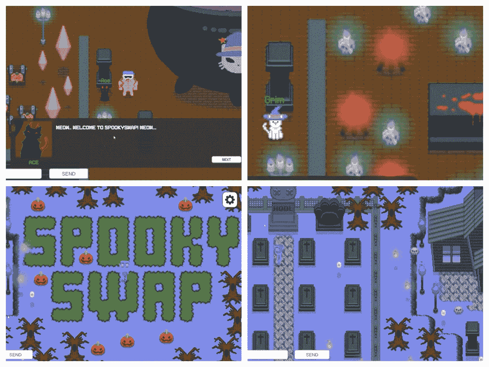
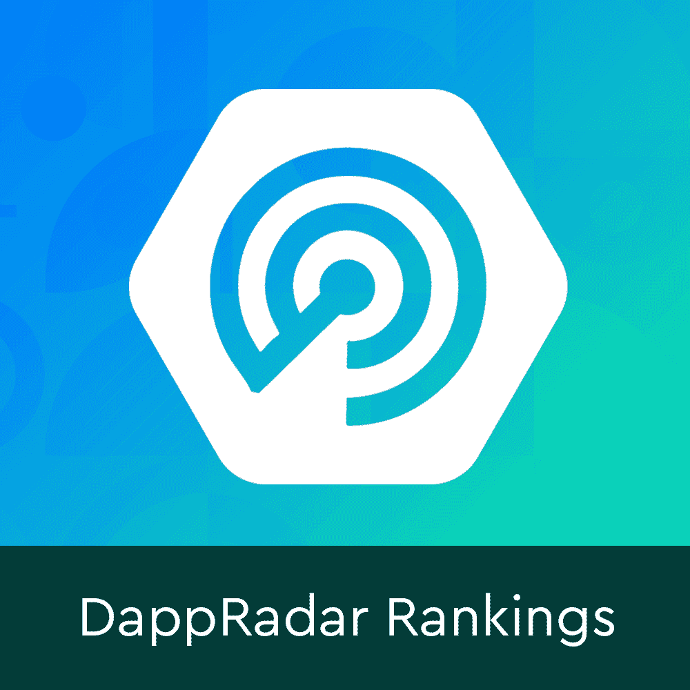

# DappRadar 现在在 8 比特的元宇宙有了自己的大楼

> 原文：<https://web.archive.org/web/https://dappradar.com/blog/dappradar-now-has-its-own-building-in-the-8bit-metaverse>

## 加入 8 位元宇宙的 DappRadar，进行建设、社交、赚钱、创作等活动。

DappRadar 与 8 位元宇宙合作，为其社区带来身临其境的互动产品体验。在 8 位元宇宙中，所有这些用户喜爱的 DappRadar 产品和工具继续帮助用户跟上最新的 dapp 趋势。但是有一个有趣的区别。“8 位 DappRadar”具有有趣的怀旧视觉风格。请继续阅读，立即找到答案！

虚拟现实游戏和社交空间已经存在了至少十年，但只是在最近几年，人们才把元宇宙的发展推到了前沿。理想情况下，元宇宙不仅仅是人们现实世界的延伸。相反，分散经济和网络基础设施将从根本上改变人们与互联网互动和参与互联网的模式。

与此同时，用户很想找到新的方式来使用他们喜欢的产品和服务。作为回应， [DappRadar](https://web.archive.org/web/20221201142057/https://dappradar.com/rankings) 希望为其社区提供一个包容所有人的参与式生态系统。

通过在复古像素世界 8 位元宇宙建立一个场所，DappRadar 让用户踏上身临其境的独特元宇宙之旅。

## 你能对 DappRadar 在 8 比特元宇宙的建筑做些什么？

DappRadar 的社区很大一部分来自游戏领域，我们和其他人一样热爱游戏。

在 8 位元宇宙中建立一个像素化的空间，我们想向游戏的历史致敬。当然，很难提出令人信服的论点来说明为什么我们应该回到像素，因为今天的玩家可以访问引人注目的 3A 级大型多人在线游戏。但通常是这些 8 位艺术收藏了我们童年最美好的记忆。

因此，具有怀旧感的虚拟世界必须在元宇宙占有一席之地！然而，兴奋并不止于此。

</web/20221201142057im_/https://dappradar.com/blog/static/7a2bb2384bf7ec609c17dd6425f829cb/dappradar.com-dappradar-now-has-its-own-building-in-the-8bit-metaverse-dappradar-in-the-8bit-metaverse-1.mp4>

*Our 8-bit building is under construction!* 

8 位元宇宙中的 DappRadar 将具有高度的沉浸感和完全的交互性。我们知道用户喜欢我们的工具和产品，比如[排名](https://web.archive.org/web/20221201142057/https://dappradar.com/rankings)、 [NFT 探索者](https://web.archive.org/web/20221201142057/https://dappradar.com/hub/nft-explorer)、[投资组合追踪](https://web.archive.org/web/20221201142057/https://dappradar.com/hub/wallet)、[等等](https://web.archive.org/web/20221201142057/https://dappradar.com/token/overview)。这就是为什么 DappRadar 将允许用户在 8 位元宇宙中直接体验所有这些功能。

在 DappRadar 的 8 位架构完成之前，请熟悉这些工具，并以前所未有的方式跟踪 dapp 趋势。

[https://web.archive.org/web/20221201142057if_/https://www.youtube.com/embed/HSVvtpxWNWs?feature=oembed](https://web.archive.org/web/20221201142057if_/https://www.youtube.com/embed/HSVvtpxWNWs?feature=oembed)

## 近距离观察 8BIT 的怀旧元宇宙

在 8 位的元宇宙中，用户可以随心所欲地建造、社交、赚钱和创作。此外，用户可以探索空间使用他们的网民，小可爱的 8 位字符的形式。此外，这个复古视觉风格的宇宙将充满迷你游戏，如赛车，战斗，等等。

接下来，我们来做一些被动收入吧！8 位地牢是网民完成一个级别就可以获得代币的地方。每一关都代表着 8 位世界故事中的一个重大事件。

值得注意的是，越来越多的项目正在 8BIT 中扩展他们的社区。以下是一些最突出的例子。

[NFTKEY](https://web.archive.org/web/20221201142057/https://dappradar.com/fantom/marketplaces/nftkey-marketplace) 是一个多连锁店的 NFT 市场，迎合[以太坊](https://web.archive.org/web/20221201142057/https://dappradar.com/rankings/protocol/ethereum)、 [BSC](https://web.archive.org/web/20221201142057/https://dappradar.com/rankings/protocol/binance-smart-chain) 、 [Fantom](https://web.archive.org/web/20221201142057/https://dappradar.com/rankings/protocol/fantom) 、 [Avalanche](https://web.archive.org/web/20221201142057/https://dappradar.com/rankings/protocol/avalanche) 和 [Harmony](https://web.archive.org/web/20221201142057/https://dappradar.com/rankings/protocol/harmony) 用户。作为其与 8BIT 合作伙伴关系的一部分，NFTKEY 拥有一个专用建筑，用户可以在其中访问 NFT 服务的多链平台。

Spookyswap 也在 8 位元宇宙上实现了完全集成。它允许用户在不离开 8 位元宇宙的情况下在 Spookyswap 上进行 T2 DeFi T3 交易。一个激动人心的小细节。它让你想起那些令人毛骨悚然的超级马里奥幽灵关卡！

## 敬请关注并参观 8 位元宇宙的 DappRadar！

我们迫不及待地想在 8 位世界与您见面，并让您在元宇宙体验我们易于使用的工具。此外，DappRadar 将继续监测 8BIT 和元宇宙的最新发展。所以，在推特、[不和](https://web.archive.org/web/20221201142057/https://discord.gg/4ybbssrHkm)和 [Youtube](https://web.archive.org/web/20221201142057/https://www.youtube.com/c/DappRadar) 上关注我们，跟上区块链世界的动态。

点击下面的图标，立即试用我们的工具。轻松追踪市场上最热门的游戏、NFT 和代币。

[<picture></picture>](https://web.archive.org/web/20221201142057/https://dappradar.com/rankings)[<picture></picture>](https://web.archive.org/web/20221201142057/https://dappradar.com/hub/wallet)[<picture></picture>](https://web.archive.org/web/20221201142057/https://dappradar.com/hub/swap)

## 随身携带您的 Web3 之旅

使用 DappRadar 移动应用程序，再也不会错过 Web3。查看最受欢迎的 dapps 的性能，并关注您投资组合中的 NFT。您在 DappRadar 上的帐户会与我们的移动应用程序同步，这样您很快就可以选择实时接收提醒。

[Download the DappRadar app now](https://web.archive.org/web/20221201142057/https://dappradar.app.link/blog)[<picture></picture>](https://web.archive.org/web/20221201142057/https://play.google.com/store/apps/details?id=com.portfolio.dappradar)