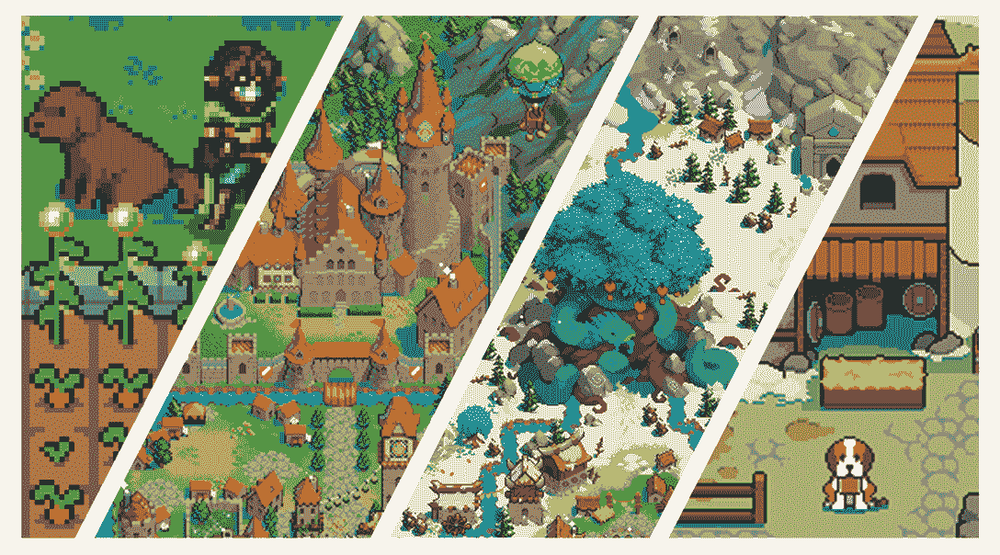
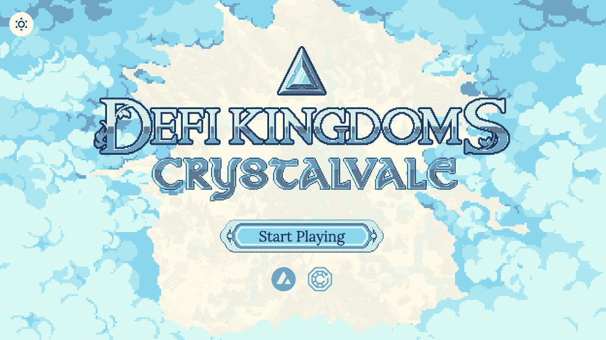

# 达普拉达现在支持 DFK 连锁追踪

> 原文：<https://web.archive.org/web/https://dappradar.com/blog/dappradar-now-supports-dfk-chain-tracking>

## 有了 DappRadar，用户现在可以很容易地掌握 DFK 链，区块链由 DeFi 王国的用户活动。

DappRadar 很高兴地宣布集成了 DeFi 王国区块链或 DFK 链。通过 DappRadar 排名分析，用户可以了解区块链上有多少独立用户钱包被 dapps 吸引，处理了多少交易，产生了多少交易量。此外，该工具为用户提供数据驱动的信息，帮助他们全面了解 dapps 和区块链可持续发展。

## 什么是 DeFi 王国？

DeFi 王国是一个跨链的，玩赚游戏，建立在一个强大的 DeFi 协议。该游戏计划在路线图的后期发展成为一个成熟的 MMORPG，为用户带来充满动作的奇幻冒险。

《德菲王国》是一款将德菲和 NFT 编织成一个动态生态系统的游戏。该游戏的特点是 dex，流动性池机会，以及一个罕见的，由效用驱动的 NFT 市场，这创造了一个沉浸式的怀旧像素艺术在线世界。

[Get more stats about DeFi Kingdoms](https://web.archive.org/web/20221209194815/https://dappradar.com/rankings/protocol/defikingdoms)

## 什么是 DFK 链？

自 2021 年 8 月推出以来，DeFi 王国在加密游戏领域掀起了风暴。这款游戏在推出后不到一个月的时间里，就将交易量推至 300 万美元的单日新高。

2022 年 3 月 30 日，DeFi 王国:Crystalvale 上线。它还为 DeFi 王国发布了自己的 DFK 链，利用雪崩子网技术作为其首次生态系统扩展。

[Explore the DFK Chain](https://web.archive.org/web/20221209194815/https://dappradar.com/rankings/protocol/defikingdoms)

DFK 连锁是一个独立的，功能齐全的分散式网络，有着独特的商业模式。随着项目进入 Crystalvale 领域，DFK 链演变成一个以游戏为中心的网络。它旨在吸引任何寻求高性能、出色的用户体验基础设施的项目。目前，已经有几个 dapps 登陆了 DFKChain，还会有更多的。

随着塞伦代尔王国的迁移，DeFi 王国采用了新的令牌组学来创造一个更有活力的生态系统。

在元宇宙游戏中，珠宝充当主要的价值象征，赋予它超越普通硬币的效用。首先，宝石是用来支付天然气的 DFK 链。此外，珠宝持有者可以参与流动性池、单一赌注以及治理。

持有锁定宝石的人将在宝石、水晶和翡翠分类中获得同等数量的物品。后两个是新的力量令牌，用来升级 DeFi 王国的游戏经济。

## 用 DappRadar 追踪 DFK 链

在 Crystalvale 推出后，DeFi Kingdoms 仅用了 6 周时间就实现了平均每天约 100 万笔交易。值得注意的是，DFK 链自推出以来已产生超过 2.26 亿笔交易，目前每日交易量接近 200 万笔。

此外，近 50，000 个活跃钱包正在与 DFK 链实时互动。由于区块链的即时终结，这些钱包可以在不到 1.5 秒的时间内完成出色的交易

DFK 连锁店准备将 DeFi 王国的用户体验提升到新的高度。如果你想跟上这个蓬勃发展的生态系统，使用 DappRadar 跟踪。

[Explore the DFK Chain](https://web.archive.org/web/20221209194815/https://dappradar.com/rankings/protocol/defikingdoms)

## 随身携带您的 Web3 之旅

使用 DappRadar 移动应用程序，再也不会错过 Web3。查看最受欢迎的 dapps 的性能，并关注您投资组合中的 NFT。您在 DappRadar 上的帐户会与我们的移动应用程序同步，这样您很快就可以选择实时接收提醒。

[Download the DappRadar app now](https://web.archive.org/web/20221209194815/https://dappradar.app.link/blog)[<picture></picture>](https://web.archive.org/web/20221209194815/https://play.google.com/store/apps/details?id=com.portfolio.dappradar) NewsletterUnsubscribe at any time. [T&Cs](https://web.archive.org/web/20221209194815/https://dappradar.com/terms) and [Privacy Policy](https://web.archive.org/web/20221209194815/https://dappradar.com/privacy-policy)