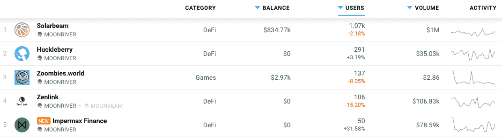
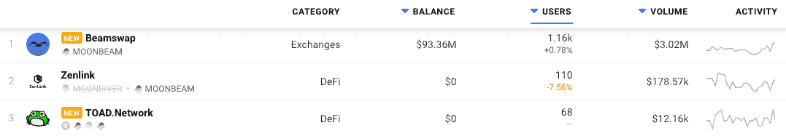

# DappRadar 现在在 Moonbeam 和 Moonriver 上追踪 Dapps

> 原文：<https://web.archive.org/web/https://dappradar.com/blog/dappradar-now-tracking-dapps-on-moonbeam-moonriver>

## Moonriver 是 Moonbeam 的伙伴网络

DappRadar 很高兴地宣布 Moonbeam 网络和它的姐妹链 Moonriver 的整合。Moonbeam 结合了易于使用的以太坊工具的优点和 Polkadot 的可扩展、可互操作的架构，而 Moonriver 是位于草间弥生的 Moonbeam 的一个伙伴网络。

Moonriver 和 Moonbeam 都是独立的第一层网络。新代码首先运送到 Moonriver，在那里可以在草间弥生的实际经济条件下进行测试和验证。一旦被证实，同样的代码就会被运送到波尔卡多特的月光星。Dapp 开发人员可以根据他们希望访问的中继链(Kusama 或 Polkadot)部署到其中一个或两个网络。

在发布时， [DappRadar 将跟踪 15 个 moon river dapp](https://web.archive.org/web/20220925012612/https://dappradar.com/rankings/protocol/moonriver)，其中 10 个集中在 DeFi 类别，其余的分布在游戏、市场和 NFT。Solarbeam 作为网络上领先的 DeFi dapp 脱颖而出，而 Profit Circus 则建立了稳固的 GameFi 观众群。

在月亮光束上完全运行[，我们目前正在跟踪三个 dapps。去中心化的交易所 Beamswap 是明显的领导者，所有三个 dapps 都是金融类别的一部分。](https://web.archive.org/web/20220925012612/https://dappradar.com/rankings/protocol/moonbeam)

## Dapp 开发者

像 Moonbeam 一样，Moonriver 是一个完全兼容以太坊的环境，可以与行业标准以太坊工具、dapps 和协议一起工作。通过镜像以太坊的 Web3 RPC、帐户、密钥、订阅、日志等，Moonriver 最大限度地减少了在网络上运行现有 Solidity 智能合同所需的更改。以太坊项目可以简单地复制他们的 dapp，并使用 Hardhat、Truffle、Remix 和其他流行的部署工具将其部署到 Moonbeam。

dappRadar 邀请 Dapp 开发者将 Moonbeam 和 moon river Dapp 提交给 DappRadar，在世界 Dapp 商店上创造更多的可见性。有兴趣从技术角度了解 Moonriver 更多信息的用户可以从下面开始，并使用提供的链接深入了解。

## 月光

Moonbeam 是 Polkadot 网络上兼容以太坊的智能合约平台，可以轻松构建本地互操作的应用程序。这种以太坊兼容性允许开发人员将现有的 Solidity 智能合约和 DApp 前端部署到 Moonbeam，只需进行最小的更改。Moonbeam 生产主网是 Polkadot 上的一条副链，自 2021 年 12 月 17 日以来一直在生产区块。Moonbeam 具有最高级别的安全性和可用性，受益于波尔卡多特中继链的共享安全性。[了解更多关于月光](https://web.archive.org/web/20220925012612/https://moonbeam.network/networks/moonbeam/)的信息。

## 月亮河

Moonriver 是草间弥生上兼容以太坊的智能合同副链。作为 Moonbeam 的姐妹网络，新代码首先在这里发布，这意味着它总是有最新的版本。Moonriver 也是社区主导的，这意味着绝大多数代币是分发给社区的(零分发给创始人或早期支持者)。月亮河在月亮河之前在草间弥生网络上发射。副链功能是活动的，Moonriver 已被证明是草间弥生网络上最活跃的副链。[了解更多月亮河](https://web.archive.org/web/20220925012612/https://moonbeam.network/networks/moonriver/)。

 NewsletterUnsubscribe at any time. [T&Cs](https://web.archive.org/web/20220925012612/https://dappradar.com/terms) and [Privacy Policy](https://web.archive.org/web/20220925012612/https://dappradar.com/privacy-policy)