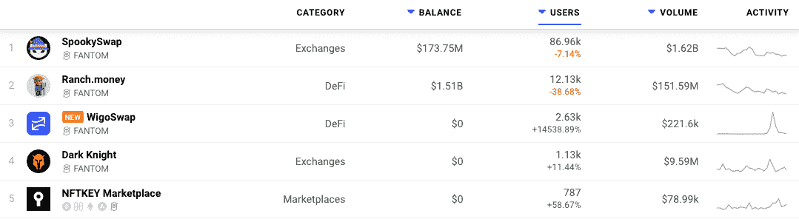
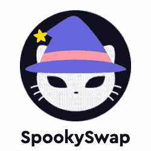

# DappRadar 现在跟踪 Fantom Dapps

> 原文：<https://web.archive.org/web/https://dappradar.com/blog/dappradar-now-tracking-fantom-dapps>

## Fantom 目前持有 TVL 约 5%的 DeFi 股份

**DappRadar 很高兴地宣布**[**Fantom 区块链**](https://web.archive.org/web/20220925074344/https://dappradar.com/rankings/protocol/fantom) **及其 dapp 生态系统的整合。用户可以通过 Fantom 排名分析哪些 dapps 吸引了最多的交易量，独特的用户钱包，或者处理了最多的交易。通过这种方式，每个人都可以深入了解哪些 dapps 和令牌在 Fantom 上构建了稳固的社区和价值。**

像其他以太坊的替代品一样，Fantom 打算提供比以太坊当前的 1.0 设置更大的可扩展性和更低的成本。Fantom 的基础设施通过其异步拜占庭容错利害关系证明共识机制捆绑在一起，维持整个网络的运行效率。此外，Fantom 网络的结构旨在保护网络安全，同时最大限度地提高速度。

## Fantom:专为 DeFi 打造

[Fantom 目前拥有 92.6 亿美元的锁定总价值](https://web.archive.org/web/20220925074344/https://defillama.com/chain/Fantom)，占 DeFi 锁定总价值的 5%左右。考虑到 Fantom 在 2019 年底才推出 mainnet，这是一个令人印象深刻的数字。Fantom 与 BSC 的发展时间大致相同，它迅速建立了坚实的用户基础，并增加了其网络的价值。通过全球 Dapp 商店 DappRadar 增加其 Dapp 的曝光率，将[进一步提高 Fantom dapps](https://web.archive.org/web/20220925074344/https://dappradar.com/rankings/protocol/fantom) 的知名度。

在发布时，DappRadar 将[跟踪 Fantom 生态系统中的 94 个 dapp](https://web.archive.org/web/20220925074344/https://dappradar.com/rankings/protocol/fantom),其中绝大多数面向 DeFi 和金融 dapp 用户。

然而，Fantom 上的游戏、收藏品和市场类别中有越来越多的 dapps。NFTKEY Marketplace 脱颖而出，目前在 Fantom 上排名前五。 [SpookySwap 是明显的领导者](https://web.archive.org/web/20220925074344/https://dappradar.com/fantom/exchanges/spookyswap)，占 Fantom 总 TVL 的近 20%，在过去 7 天内有近 90，000 名用户将他们的钱包连接到 DeFi dapp。

## Fantom Dapp 开发人员

dappRadar 邀请 Dapp 开发者[向 DappRadar](https://web.archive.org/web/20220925074344/https://dappradar.com/submit-dapp) 提交他们的 Dapp，在世界 Dapp 商店上创造更多的可见性。有兴趣了解更多关于 Fantom 和那里的可能性的开发者可以从 Fantom 网站开始[。](https://web.archive.org/web/20220925074344/https://fantom.foundation/about/)

[<picture></picture>](https://web.archive.org/web/20220925074344/https://dappradar.com/fantom/exchanges/spookyswap)[<picture></picture>](https://web.archive.org/web/20220925074344/https://dappradar.com/rankings/protocol/fantom)[<picture></picture>](https://web.archive.org/web/20220925074344/https://dappradar.com/fantom/marketplaces/nftkey-marketplace) NewsletterUnsubscribe at any time. [T&Cs](https://web.archive.org/web/20220925074344/https://dappradar.com/terms) and [Privacy Policy](https://web.archive.org/web/20220925074344/https://dappradar.com/privacy-policy)