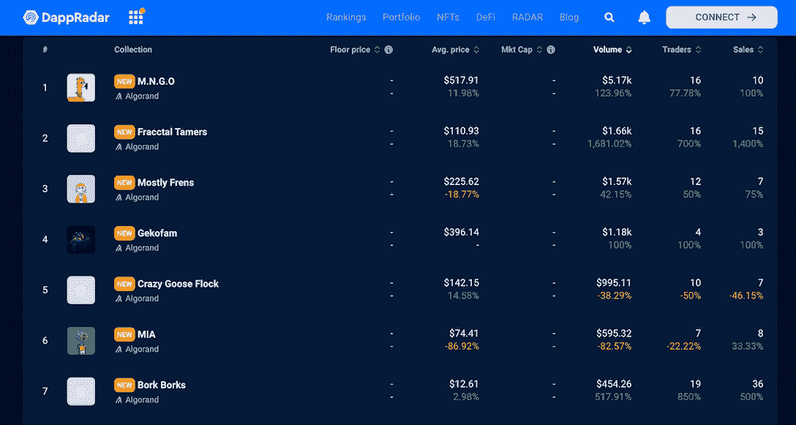
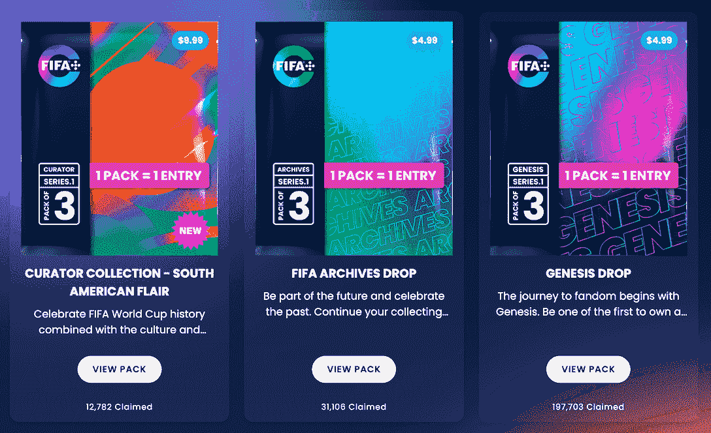
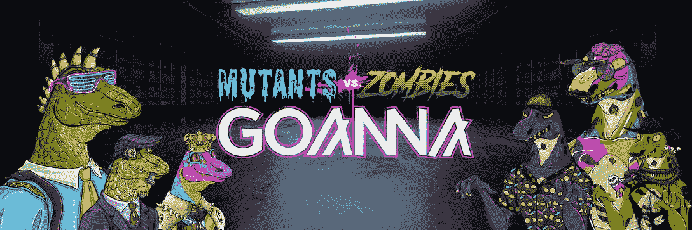

# DappRadar 现在跟踪 Algorand NFTs

> 原文：<https://web.archive.org/web/https://dappradar.com/blog/dappradar-now-tracks-algorand-nfts>

## 与我们一起见证阿尔格兰德·NFT 的崛起

**DappRadar 很高兴宣布整合 Algorand NFTs，及时为用户带来 algrand 网络的最新 NFT 景观。通过 DappRadar NFTs，用户可以跟踪最热门的 NFT 系列的表现，并在阿尔格兰德生态系统中发现有前途的 NFT 项目。**

Algorand 是一个开源的利害关系证明(PoS)区块链。它拥有一个高效、可扩展的平台，可以实现交易的即时终结。此外，阿尔格兰致力于成为最高效、最环保的区块链。自 2021 年 4 月以来，阿尔格兰德通过购买超过其碳排放量的碳信用额实现了碳负。

ALGO 是 Algorand 平台的原生令牌，用于保护网络和奖励生态系统的管理者。本机令牌也是支付交易费用的实用令牌。通过押注 ALGO，持有者可以获得相应的回报，并在区块链和社区问题上投票。

由于 Algorand 非凡的性能，越来越多的团队选择在它的基础上构建他们的项目。现在，网络拥有了一个包罗万象的生态系统。为了获得实时概览，用户可以利用 DappRadar 排名工具。

不仅如此，用户现在还可以在 DappRadar 上探索阿尔格兰德 NFT 的多彩世界。

## 潜入阿尔格兰德的 NFT 空间

Algorand 的技术寻求支持未来金融的所有资产类型，包括不可兑换代币(NFT)。该团队认为，NFTs 将为数字资产的新时代带来长期价值。为此，阿尔格兰德为 NFT 项目提供了强大的基础设施，以确保用户成功地创造、管理和参与这一新兴的数字经济。

[Algorand NFTs](https://web.archive.org/web/20221210121036/https://dappradar.com/nft/protocol/algorand)

## 阿尔格兰德区块链现在流行什么？

### 国际足联+

FIFA+允许足球迷通过 NFTs 形式的档案和数字收藏品拥有来自 FIFA 的难忘瞬间和史诗版。通过 FIFA+，用户可以拥有一生一次的机会来建立个人数字收藏，并成为有史以来最丰富、最真实的足球遗产——FIFA 世界杯的一部分。

更何况 FIFA+是专为球迷打造的娱乐体验。除了收集难忘的时刻，用户还可以在这个平台上观看最伟大的足球纪录片和电影、现场比赛和集锦。值得一提的是，访问这些服务是免费的。

几个可玩的包已经在平台上直播，成千上万的玩家认领了它们。

用户很快就可以在 DappRadar 的 algrand NFT 追踪上实时查看 FIFA+上最热门的项目。

### 世界杯足球赛

Goannas 已经为庆祝世界杯制作了一个特别版的 Algorand 支持的 NFTs。这些 NFT 持有者可以享受各种额外待遇，如赌注福利，参与道社区的治理，以及其他更多。

Goannas 的交易量、销售额和交易量在过去 30 天里都增长了 100%。

[Check out World Cup Goannas](https://web.archive.org/web/20221210121036/https://dappradar.com/nft/protocol/algorand)

## DappRadar 如何满足 NFT 用户的需求？

DappRadar 旨在为快速增长的 dapp 行业提供最全面的数据跟踪。此外，我们还提供行业领先的评估工具以及关于游戏、DeFi、NFT 等的报告。

DappRadar 对 NFT 用户有什么好处？

NFT 用户可以利用 DappRadar 来浏览复杂的行业格局，并找到他们的关键见解。例如， [DappRadar NFT 跟踪](https://web.archive.org/web/20221210121036/https://dappradar.com/nft)允许用户查看最受欢迎的 NFT 收藏、NFT 单品和顶级市场的交易趋势。

[https://web.archive.org/web/20221210121036if_/https://www.youtube.com/embed/fkEaXYLOW-s?feature=oembed](https://web.archive.org/web/20221210121036if_/https://www.youtube.com/embed/fkEaXYLOW-s?feature=oembed)

## 随身携带您的 Web3 之旅

使用 DappRadar 移动应用程序，再也不会错过 Web3。查看最受欢迎的 dapps 的性能，并关注您投资组合中的 NFT。您在 DappRadar 上的帐户会与我们的移动应用程序同步，这样您很快就可以选择实时接收提醒。

[Download the DappRadar app now](https://web.archive.org/web/20221210121036/https://dappradar.app.link/blog)[<picture></picture>](https://web.archive.org/web/20221210121036/https://play.google.com/store/apps/details?id=com.portfolio.dappradar) NewsletterUnsubscribe at any time. [T&Cs](https://web.archive.org/web/20221210121036/https://dappradar.com/terms) and [Privacy Policy](https://web.archive.org/web/20221210121036/https://dappradar.com/privacy-policy)