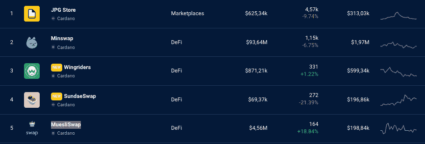

# DappRadar 现在跟踪 Cardano 区块链 Dapps

> 原文：<https://web.archive.org/web/https://dappradar.com/blog/dappradar-now-tracks-cardano-blockchain-dapps>

## 让我们深入充满活力的 Cardano dapp 生态系统！

**DappRadar 激动地宣布整合 Cardano dapps，为用户带来 Cardano 网络的最新 dapp 景观。通过 DappRadar 排名，用户可以跟踪最受欢迎的游戏、DeFi dapps、NFT 市场等的表现！**

## 卡尔达诺是什么？

Cardano 是一个由以太坊的创始人之一 Charles Hoskinson 在 2015 年创建的区块链网络。就像其他区块链的加密货币一样，Cardano 网络由它的本地令牌 ADA 驱动。

[Explore Cardano Dapps](https://web.archive.org/web/20221128124515/https://dappradar.com/preview/rankings/protocol/cardano)

要全面了解卡尔达诺的基本信息和特性，请阅读 DappRadar 的《卡尔达诺区块链终极指南》。

Cardano 提供了一整套可伸缩性、互操作性和可持续性，被认为是大规模应用的首选区块链。

此外，Cardano 的 Vasil hard fork 已经成功实施，它将使生态系统更加强大和可扩展。

此次升级将增强 Cardano 的智能合约和 dapps 的发展，将其性能提升到新的高度。

有很多理由看好卡达诺生态系统。在最新升级的基础上，Cardano 开发实验室 Emurgo 最近宣布，它将投资超过 2 亿美元，以支持生态系统在未来三年的增长。

更具体地说，这些资金将提供给直接建立在 Cardano 之上的项目，以及来自其他网络的项目，这些项目建立的产品将 Cardano 的网络与他们自己的网络整合在一起。

## 达达上的卡尔达诺·达达普斯

Cardano 继承了前几代区块链的优秀属性，比如去中心化、开源和透明。此外，它还在不断发展，以满足用户不断增长的需求，并为开发人员提供一个强大的智能合约平台来构建各种 dapps。

在发布时，DappRadar 将在 Cardano 网络上跟踪[number]个 dapps，范围从游戏、DeFi 和市场部门，还会有更多。

[<picture></picture>](https://web.archive.org/web/20221128124515/https://dappradar.com/preview/rankings/protocol/cardano)

**Source:** Top Cardano Ranking Dapps on DappRadar

### JPG 商店

JPG 商店是卡尔达诺 NFT 市场的领导者，交易额超过 1 亿美元。这是你在一个分散的区块链发现艺术品、支持创作者和加入社区的门户。

在这个平台上，你可以买卖 Cardano NFTs，出价，定制你的个人资料，等等。

创作者由 JPG 商店的 launchpad 支持，艺术家也可以访问一个铸造功能，使他们能够将他们的艺术作品转化为 NFT。

[Explore JPG Store](https://web.archive.org/web/20221128124515/https://dappradar.com/blog/top-nft-marketplaces-for-cardano-compare-choose)

### 牛奶什锦

这个 dapp 是 Cardano 的第一个 DEX(分散式交易所),它拥有大量的流动性(此处的数字)。MuesliSwap 是领先的 Cardano dapps 之一，它通过鼓励 ADA 持有者将资产从交易所转移到个人钱包，在生态系统中引领 DeFi。

[Discover MuesliSwap](https://web.archive.org/web/20221128124515/https://dappradar.com/cardano/defi/muesliswap-1)

MuesliSwap 的治理令牌是牛奶。在撰写本文时，MuesliSwap 支持像 Nami 和 Eternl 这样的 Cardano 钱包。点击此处了解更多关于 Cardano 最佳钱包的信息。

### 小地图

在撰写本文时，MinSwap 是最大的 Cardano DEX，TVL(流动性)为 4205 万美元。它提供了流动性耕作、ADA 本地堆栈，其治理令牌是 MIN。

[Explore Minswap](https://web.archive.org/web/20221128124515/https://dappradar.com/cardano/defi/minswap)

这款广受欢迎的 DEX 在其他 Cardano DEXs 中也以其出色的 UI(用户界面)而闻名。

## 现在就在 Cardano 上看看你最喜欢的 dapps 吧！

Cardano 的支持者认为它可以完善以太坊的关键功能，并通过可伸缩性和互操作性增强区块链体验。

此外，Cardano 的开发经过了领先的学术科学家和程序员的严格同行评审过程，这当然增强了用户对 Cardano 稳定性的信心。

Cardano 的目标是在真实世界的经济和区块链世界之间架起一座桥梁，许多开发者对这一愿景产生了共鸣。目前，超过 650 个项目正在利用 Cardano 提供更好的体验。

现在就加入 DappRadar 的 100 万用户，在卡尔达诺区块链上寻找明星 dapps 吧！

 NewsletterUnsubscribe at any time. [T&Cs](https://web.archive.org/web/20221128124515/https://dappradar.com/terms) and [Privacy Policy](https://web.archive.org/web/20221128124515/https://dappradar.com/privacy-policy)