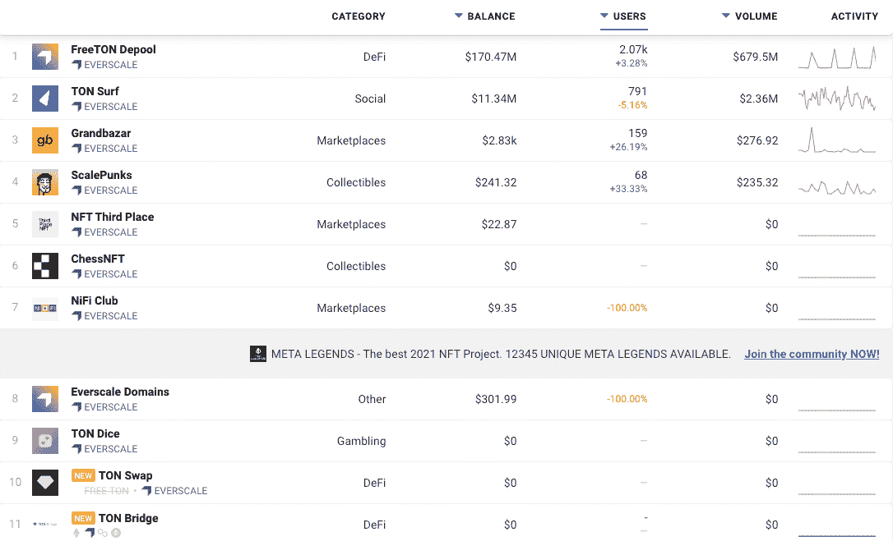
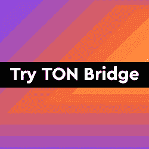
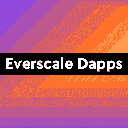
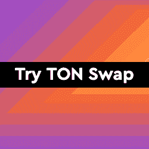

# DappRadar 现在在 Everscale 上追踪 Dapps

> 原文：<https://web.archive.org/web/https://dappradar.com/blog/dappradar-now-tracks-dapps-on-everscale>

## 快速、安全且可扩展的区块链每秒能够处理数百万次交易

DappRadar 自豪地宣布，它现在可以在 Everscale 区块链(原名 Free TON Network)上跟踪 dapps。Everscale 的源代码是由帕维尔·杜罗夫创建的，他是非常成功的 Telegram 和 Vkontakte 平台背后的人。

开发团队离开了 TON 网络，向新的方向推进。团队和社区决定将区块链生态系统命名为 Everscale。这个名字准确地反映了组织在市场中的地位:治理、社区、性能和采用的无限可伸缩性。

Everscale 是一个快速、安全、可伸缩的区块链，每秒能够处理数百万次交易。它还被设计成对用户和服务提供商友好的。可以把 Everscale 想象成一台巨大的分布式超级计算机，或者更确切地说，是一台巨大的“超级服务器”,用于托管和提供各种服务。

## 关于 Everscale

Everscale boats 拥有相对发达的 dapp 生态系统，其中大部分专注于 DeFi 和 exchange 类别。TON Swap 是网络上的本地令牌交换平台，而 TON Bridge 允许用户将加密资产从以太坊、BSC、Polygon 和 Fantom 带入 Everscale。TON Wallet 通过向用户提供允许 dapp 发现和资产分析的区块链钱包来补充生态系统。

最初，DappRadar 将跟踪 11 个 dappss，在接下来的几周和几个月里会有更多的 dapp。开发人员可以独立提交他们的 dapps，并通过[开发人员仪表板](https://web.archive.org/web/20221126220328/https://dappradar.com/dashboard/submit-dapp)获得对数千名参与用户的可见性。

[<picture></picture>](https://web.archive.org/web/20221126220328/https://dappradar.com/rankings/protocol/everscale)

## 对于 Dapp 开发者

Everscale 拥有强大的开发者工具，如 Solidity 和 C++的编译器，SDK 和 API，移植到 20 多种语言和平台的客户端库。此外，还有一系列分散的浏览器和钱包，支持各种产品类别的许多应用程序。区块链支持 DeFi、NFT、令牌化和治理以及许多其他类型的 dapps。此外，TVM 或 TON 虚拟机(EVM 的改进模拟)支持图灵完全智能契约，并允许用 Solidity 和 C ++编写。

Dapp 开发者可以在这里找到更多信息。

[<picture></picture>](https://web.archive.org/web/20221126220328/https://dappradar.com/everscale/defi/ton-bridge)[<picture></picture>](https://web.archive.org/web/20221126220328/https://dappradar.com/rankings/protocol/everscale)[<picture></picture>](https://web.archive.org/web/20221126220328/https://dappradar.com/everscale/defi/ton-swap)