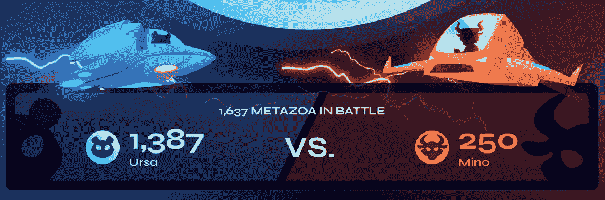
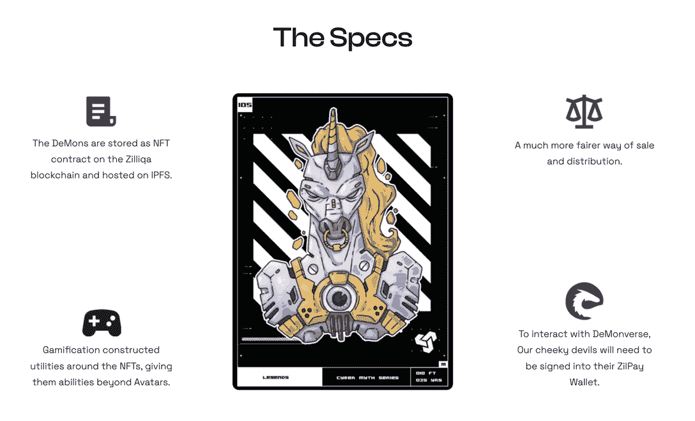

# DappRadar 现在跟踪 Zilliqa NFTs

> 原文：<https://web.archive.org/web/https://dappradar.com/blog/dappradar-now-tracks-zilliqa-nfts>

## 让用户了解不断变化的 NFT 世界

DappRadar 很高兴宣布 Zilliqa NFTs 的整合，及时向用户展示 Zilliqa 网络的最新 NFT 景观。通过 DappRadar NFTs，用户可以跟踪最热门的 NFT 系列的表现，并在 Zilliqa 生态系统中发现有前途的 NFT 项目。

Zilliqa 是一个高吞吐量的公共区块链平台，旨在推动 Web3 的大规模采用。Zilliqa 成立于 2017 年，是率先采用分片技术的首批区块链网络之一。

Zilliqa 工程团队的另一项突破是通过创建 Scilla 来限制对区块链的攻击暴露。它是一种保证智能合约安全的编程语言。值得注意的是，大量 dapps 已经从安全的 Scilla 智能合同中受益。

[Discover Zilliqa NFTs](https://web.archive.org/web/20221130133635/https://dappradar.com/nft/protocol/zilliqa)

利用 DappRadar 排名，你可以找到目前最受欢迎的 Zilliqa dapps。此外，为了让用户更全面地了解快速增长的 Zilliqa 生态系统，DappRadar 在 Zilliqa 上添加了跟踪 NFT 的功能。

## DappRadar 上的 Zilliqa NFT 收藏

成吨的项目正在进入 Zilliqa NFT，以回报他们的社区，丰富他们的游戏，并探索数字艺术的新领域，等等。许多 NFT 供电的项目在 Zilliqa 的网络上引起了轰动。

DappRadar 为您报道了所有这些最新最快的 Zilliqa 趋势。但是，首先，让我们看看 Zilliqa NFT 空间中最强的玩家！

[<picture></picture>](https://web.archive.org/web/20221130133635/https://dappradar.com/nft/protocol/zilliqa)

[Metazoa](https://web.archive.org/web/20221130133635/https://dappradar.com/zilliqa/collectibles/metazoa) 是一个可以在 Zolar 中使用的 NFT 集合，Zolar 是一个锦标赛式的玩家对玩家(PvP)机制的玩家对玩家区块链游戏。玩家可以使用这些 NFT 作为游戏中的角色来探索无尽的佐拉，收集资源，战斗，并赢得游戏中的令牌 HUNY。

[Check out Metazoa](https://web.archive.org/web/20221130133635/https://dappradar.com/zilliqa/collectibles/metazoa)

[分散的怪物(恶魔)](https://web.archive.org/web/20221130133635/https://dappradar.com/zilliqa/collectibles/demons)是恶魔元宇宙的人物。每一个产生的恶魔都有自己的故事和传说，是齐利卡元宇宙的一部分。这些 NFT 可以以 DMZ 代币的形式产生收益，让它们的持有者在恶魔元宇宙中拥有股份。

[Check out DeMons](https://web.archive.org/web/20221130133635/https://dappradar.com/zilliqa/collectibles/demons)

## DappRadar 如何满足 NFT 用户的需求？

DappRadar 旨在为快速增长的 dapp 行业提供最全面的数据跟踪。此外，我们还提供行业领先的评估工具以及关于游戏、DeFi、NFT 等的报告。

DappRadar 对 NFT 用户有什么好处？

NFT 用户可以利用 DappRadar 来浏览复杂的行业格局，并找到他们的关键见解。例如， [DappRadar NFT 跟踪](https://web.archive.org/web/20221130133635/https://dappradar.com/nft)允许用户查看最受欢迎的 NFT 收藏、NFT 单品和顶级市场的交易趋势。

[https://web.archive.org/web/20221130133635if_/https://www.youtube.com/embed/4lnlrnpQbxE?feature=oembed](https://web.archive.org/web/20221130133635if_/https://www.youtube.com/embed/4lnlrnpQbxE?feature=oembed)

此外，DappRadar [NFT 探索者提供了由机器学习算法驱动的价格估计功能](https://web.archive.org/web/20221130133635/https://dappradar.com/hub/nft-value-estimator)。它扫描你的 NFT 过去销售的元数据来分析这些新兴的数字资产。

[https://web.archive.org/web/20221130133635if_/https://www.youtube.com/embed/fkEaXYLOW-s?start=4&feature=oembed](https://web.archive.org/web/20221130133635if_/https://www.youtube.com/embed/fkEaXYLOW-s?start=4&feature=oembed)

在所有这些功能之上，DappRadar 还允许用户在登录他们的[投资组合管理器后，只需点击一下就可以交易 NFT！](https://web.archive.org/web/20221130133635/https://dappradar.com/hub/wallet)

随着我们继续努力建设未来的 dapp 商店，我们邀请社区加入并与我们一起踏上[贡献收入之旅。](https://web.archive.org/web/20221130133635/https://dappradar.com/token/governance)

## 随身携带您的 Web3 之旅

使用 DappRadar 移动应用程序，再也不会错过 Web3。查看最受欢迎的 dapps 的性能，并关注您投资组合中的 NFT。您在 DappRadar 上的帐户会与我们的移动应用程序同步，这样您很快就可以选择实时接收提醒。

[Download the DappRadar app now](https://web.archive.org/web/20221130133635/https://dappradar.app.link/blog)[<picture></picture>](https://web.archive.org/web/20221130133635/https://play.google.com/store/apps/details?id=com.portfolio.dappradar)