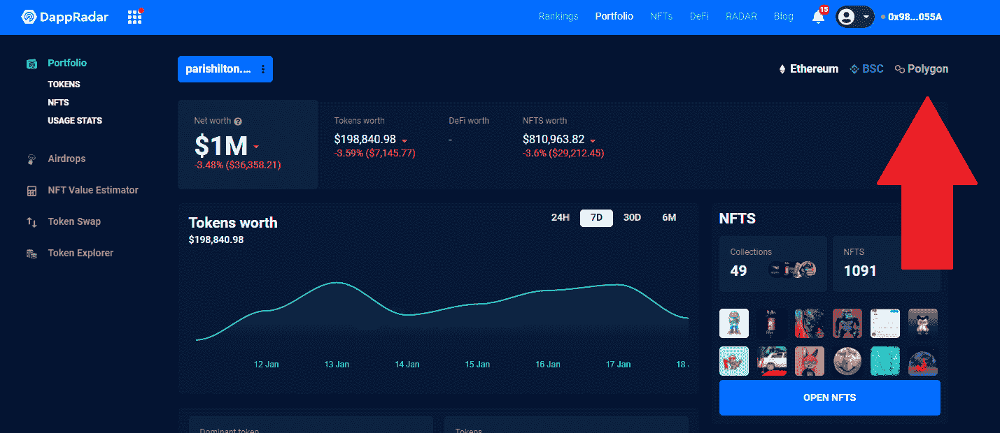

# DappRadar 组合现在支持多边形令牌

> 原文：<https://web.archive.org/web/https://dappradar.com/blog/dappradar-portfolio-now-support-polygon-tokens>

## 全面实现多边形生态系统的第一步

DappRadar 很高兴启动将多边形区块链整合到投资组合跟踪服务的第一阶段。任何人现在都可以使用投资组合跟踪器来查看特定钱包地址的代币持有量和 DeFi 头寸。

DappRadar 的访问者现在可以使用投资组合跟踪器来跟踪他们在多边形区块链上的代币持有量和 DeFi 头寸。这是 DappRadar 整合到其产品组合服务中的第三个区块链，强调了全球 Dapp 商店是对 Dapp、即玩即赚游戏、NFTs 和 DeFi 感兴趣的每个人的一站式商店。

没有 DappRadar 帐户的用户仍然可以[检查他们的投资组合](https://web.archive.org/web/20221208161057/https://dappradar.com/hub/wallet/)，只需连接他们的钱包，然后选择投资组合跟踪器左上角的多边形区块链。目前，对 NFTs 的支持仍在开发中。这一功能预计将在未来几周内推出。

## 如何使用 DappRadar 作品集

*   将您的 Web3 钱包连接到 DappRadar，您可以导航到 DappRadar 投资组合跟踪器来查看您的 DeFi 和 NFT。
*   这也会自动为您创建一个个人资料。添加您的电子邮件地址后，您将能够全面了解最新的产品更新或行业新闻。
*   点击帐户图标，登录或注册，并连接您的钱包。请记住，您需要批准一个签名，但不涉及汽油费。

当你登录[你的投资组合](https://web.archive.org/web/20221208161057/https://dappradar.com/hub/wallet/eth/)时，起始页会给出你所有资产的概览。你可以看到你的代币的价值，你的 DeFi 资产，你的 NFT 收藏。您可以使用左侧的菜单，从概览页面快速转到投资组合的其他部分。

DappRadar 产品组合允许用户深入了解他们的钱包并采取行动。用户可以交易代币，并在市场上直接从钱包中列出 NFT。此外，您可以研究其他钱包，并根据您的分析获得某些资产。

[https://web.archive.org/web/20221208161057if_/https://www.youtube.com/embed/WHL_uYv8riA?feature=oembed](https://web.archive.org/web/20221208161057if_/https://www.youtube.com/embed/WHL_uYv8riA?feature=oembed)

[<picture></picture>](https://web.archive.org/web/20221208161057/https://dappradar.com/token/airdrop)[<picture></picture>](https://web.archive.org/web/20221208161057/https://docs.dappradar.com/v/radar-token/radar-tokenomics )[<picture></picture>](https://web.archive.org/web/20221208161057/https://discord.gg/dappradar) NewsletterUnsubscribe at any time. [T&Cs](https://web.archive.org/web/20221208161057/https://dappradar.com/terms) and [Privacy Policy](https://web.archive.org/web/20221208161057/https://dappradar.com/privacy-policy)