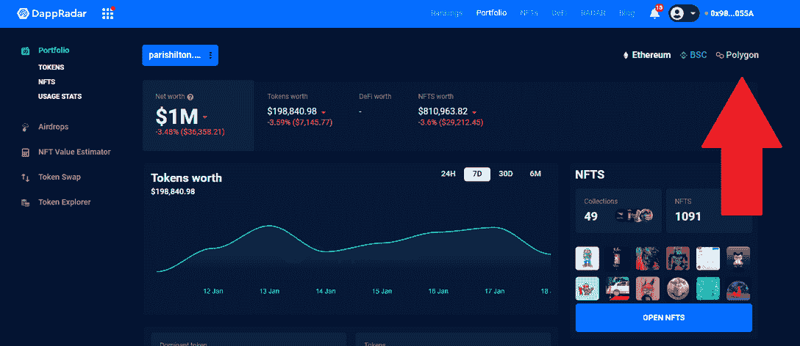

# DappRadar 作品集现在支持多边形 NFT 追踪

> 原文：<https://web.archive.org/web/https://dappradar.com/blog/dappradar-portfolio-now-supports-polygon-nft-tracking>

## 所有您的宝贵多边形 NFT，在一个地方

DappRadar 很高兴启动将[多边形区块链](https://web.archive.org/web/20220630224134/https://dappradar.com/rankings/protocol/polygon)整合到投资组合跟踪服务的第二阶段。任何人现在都可以使用 DappRadar [投资组合跟踪器](https://web.archive.org/web/20220630224134/https://dappradar.com/hub/wallet)来查看某个特定钱包地址的 NFT 资产。

DappRadar 的访问者已经可以使用[投资组合跟踪器](https://web.archive.org/web/20220630224134/https://dappradar.com/hub/wallet)来跟踪他们在多边形区块链上的代币持有量和 DeFi 头寸。现在，他们可以跟踪他们的 NFT 投资组合。

没有 DappRadar 帐户的用户仍然可以[查看他们的投资组合](https://web.archive.org/web/20220630224134/https://dappradar.com/hub/wallet/)，只需连接他们的钱包，然后选择投资组合跟踪器右上角的多边形区块链。

## 机器学习多边形 NFT 价格估计

流行的 NFT 收藏品价格估计由机器学习算法提供支持，该算法查看过去销售的元数据，以确定你最珍贵的多边形 NFT 资产的价值。而交易较少的多边形 NFT 价格估计使用最后销售价格计算。

最初，我们对前 100 个 NFT 集合进行了优先排序，因为 Polygon 上总共有超过 6000 万个 NFT。更多的将被添加，我们将继续提高跟踪能力。

**注意** : *多边形 NFT 目前处于测试阶段，所以你可能看不到所有可用的元数据信息。请使用页面底部的反馈工具添加您的反馈。谢谢！*

## 如何使用 DappRadar 作品集

*   将您的 Web3 钱包连接到 DappRadar，您可以导航到 [DappRadar 投资组合跟踪器](https://web.archive.org/web/20220630224134/https://dappradar.com/hub/wallet)来查看您的 DeFi 和 NFT。
*   这也会自动为您创建一个个人资料。添加您的电子邮件地址后，您将能够全面了解最新的产品更新或行业新闻。
*   点击帐户图标，登录或注册，并连接您的钱包。请记住，您需要批准一个签名，但不涉及汽油费。

当您登录到[您的投资组合](https://web.archive.org/web/20220630224134/https://dappradar.com/hub/wallet/eth/)时，起始页面会概述您的所有资产。你可以看到你的代币的价值，你的 DeFi 资产，你的 NFT 收藏。您可以使用左侧的菜单从概览页面快速移动到您投资组合的其他部分。

DappRadar 产品组合允许用户深入了解他们的钱包并采取行动。用户可以交易代币，并在市场上直接从钱包中列出 NFT。此外，您可以研究其他钱包，并根据您的分析获得某些资产。

[https://web.archive.org/web/20220630224134if_/https://www.youtube.com/embed/WHL_uYv8riA?feature=oembed](https://web.archive.org/web/20220630224134if_/https://www.youtube.com/embed/WHL_uYv8riA?feature=oembed)

 NewsletterUnsubscribe at any time. [T&Cs](https://web.archive.org/web/20220630224134/https://dappradar.com/terms) and [Privacy Policy](https://web.archive.org/web/20220630224134/https://dappradar.com/privacy-policy)