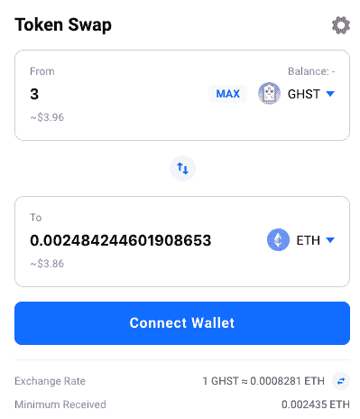
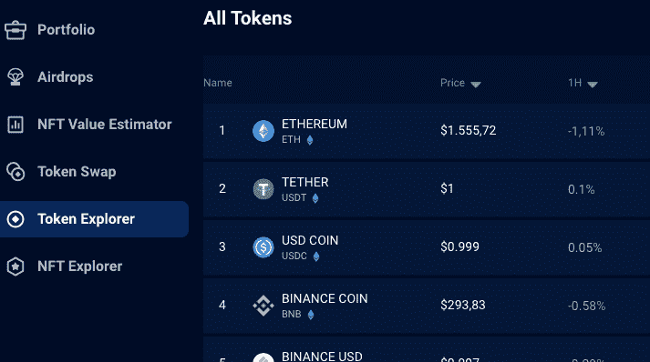
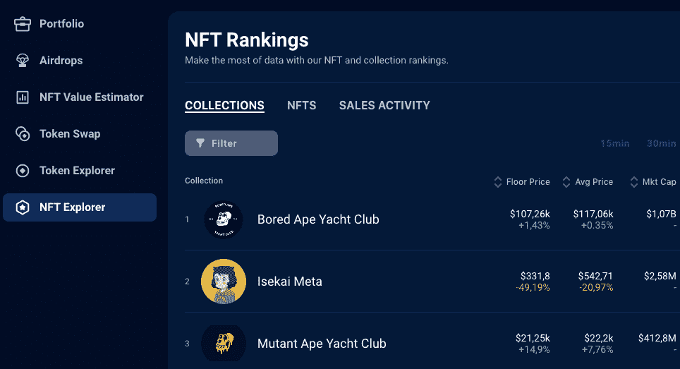

# 通过投资组合跟踪系统获得对资产的全面控制

> 原文：<https://web.archive.org/web/https://dappradar.com/blog/dappradar-portfolio-tracker>

## dapps 空间可能会令人困惑。投资组合追踪器让你的生活更轻松。

DappRadar 的投资组合跟踪器是加密市场中无与伦比的强大工具，它提供实时的可操作数据，并允许用户使用我们的数据从不同的区块链监督和管理他们的数字资产。

dapps 空间可能会让许多人感到困惑。缺乏互操作性、糟糕的用户体验界面和其他 Web3 限制会使人们很难浏览他们的资产。

尤其是当涉及到 DeFi 时，存在分散在多个 dapps 上的储蓄和贷款价值时，这只会增加其复杂性，而且，跟上 NFT 市场的快速发展并不容易。

这是我们掩护你的地方。DappRadar 在以数据为导向、可操作的行业报告方面处于领先地位，使得探索、跟踪和管理 dapps 对所有人来说都是有见地、方便和有益的。投资组合追踪器是其中很重要的一部分。

[https://web.archive.org/web/20221004235758if_/https://www.youtube.com/embed/WHL_uYv8riA?feature=oembed](https://web.archive.org/web/20221004235758if_/https://www.youtube.com/embed/WHL_uYv8riA?feature=oembed)

## 你能用投资组合跟踪器做什么？

跟踪你钱包里所有的加密和 NFT 资产，你会看到你的投资组合随着时间的变化。你可以很容易地想象出你的钱包里有哪些代币和 NFT，以及你的资产的详细估价。此外，您可以跟踪 NFT，让您完全控制您的收藏。

当涉及到 [DeFi dapps](https://web.archive.org/web/20221004235758/https://dappradar.com/defi) 时，这个工具就派上用场了。例如，如果你将价值锁定为抵押品，通常是为了赚取利息，同时利用抵押品将价值作为贷款借入。

### **绝不错过一次空投**

使用投资组合跟踪器，您可以跟踪我们在 DappRadar 每周进行的许多[次空投](https://web.archive.org/web/20221004235758/https://dappradar.com/hub/airdrops/98)。你可以直接加入你最喜欢的空投，并获得有关代币及其背后的 dapps 的有用信息。

### **估计 NFT 值**

NFT 价值估计器是一个非常有用的工具，它使用一种机器学习算法，将不同来源的每个令牌的当前和历史价格结合起来。在几秒钟内获得最准确的实际估价。

### **评估、展示和翻转 NFT**

您可以在投资组合跟踪系统中获得对非金融资产的财务见解。获得对您的 NFT 的宝贵实时洞察，包括:

*   先前底价
*   当前底价
*   价格变化
*   花费的金额
*   当前持有量
*   利润和损失

### **令牌交换**

您可以使用投资组合跟踪器中的[代币交换](https://web.archive.org/web/20221004235758/https://dappradar.com/hub/swap/eth)功能来交换代币。零平台费行动。

### **令牌浏览器**

代币浏览器显示了不同种类代币的详细概述，将它们分为几类:DeFi、交换、赌博、游戏、指数、NFT 和社交。您可以快速查看过去 24 小时内贬值的代币，以及升值的代币。最后，您可以使用这个工具发现新的令牌。

### **NFT 探险家**

您可以使用 NFT 浏览器评估、购买和销售 NFT，获得最准确的市场数据和可操作的见解。有了 NFT 浏览器，你可以深入现有的收藏，以及即将推出的最新项目。在这里，你会看到铸币日期，铸币价格，以及有多少项目是在收集。

**[点击](https://web.archive.org/web/20221004235758/https://dappradar.com/blog/introducing-the-new-dappradar-nft-collection-explorer)** 了解更多 NFT 收藏探索者

### **让 DeFi 更容易**

轻松的可视化和准确的实时数据使您能够及时了解 DeFi dapps 中正在发生的事情，通过监控您的令牌余额来控制一切，并检查您在多个以太坊钱包中的活动。

## 你准备好加入 DappRadar 社区了吗？

将您的钱包连接到 DappRadar，享受数据导向的可操作行业报告的所有优势。我们友好的用户界面让探索、跟踪和管理 dapps 变得有趣且有益。

[https://web.archive.org/web/20221004235758if_/https://www.youtube.com/embed/woduDyWuKHY?feature=oembed](https://web.archive.org/web/20221004235758if_/https://www.youtube.com/embed/woduDyWuKHY?feature=oembed)

 NewsletterUnsubscribe at any time. [T&Cs](https://web.archive.org/web/20221004235758/https://dappradar.com/terms) and [Privacy Policy](https://web.archive.org/web/20221004235758/https://dappradar.com/privacy-policy)