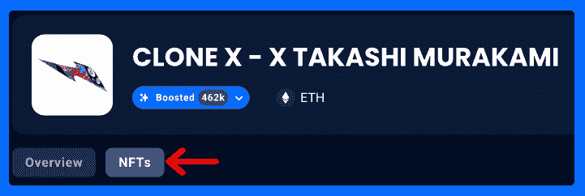
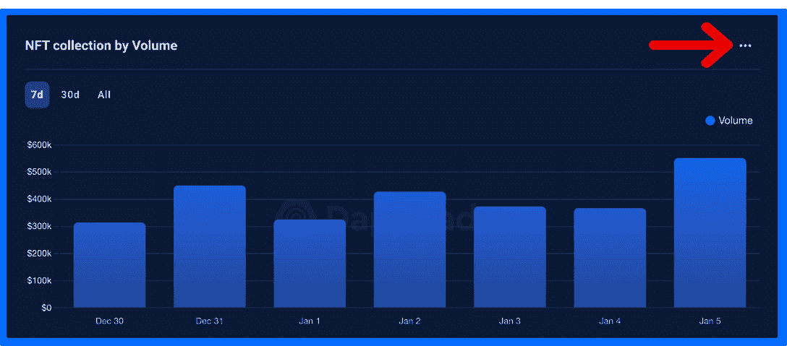
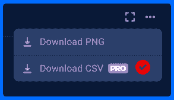
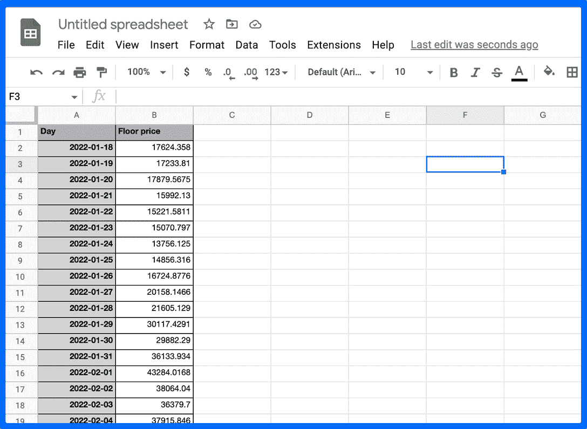
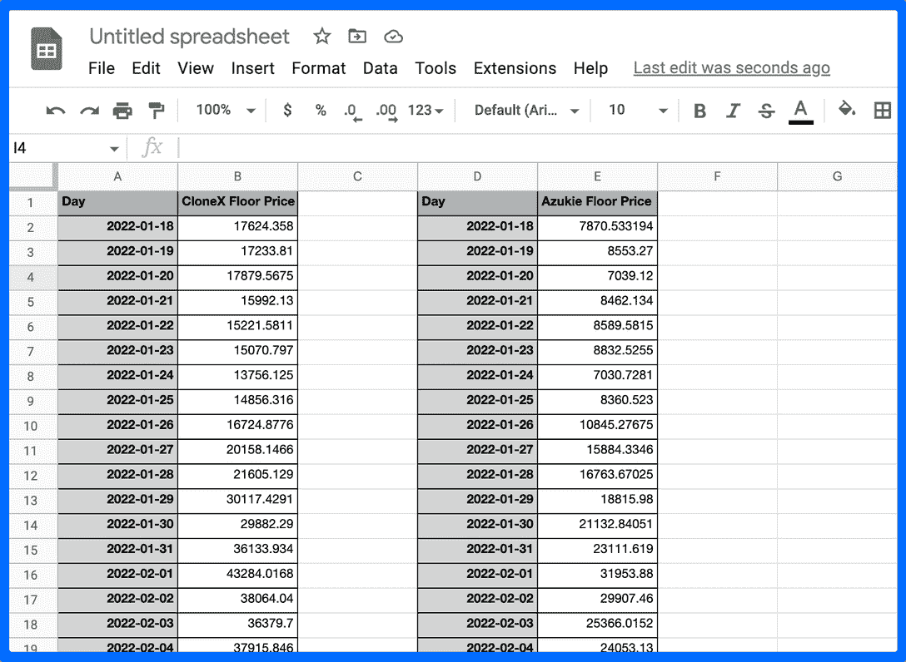
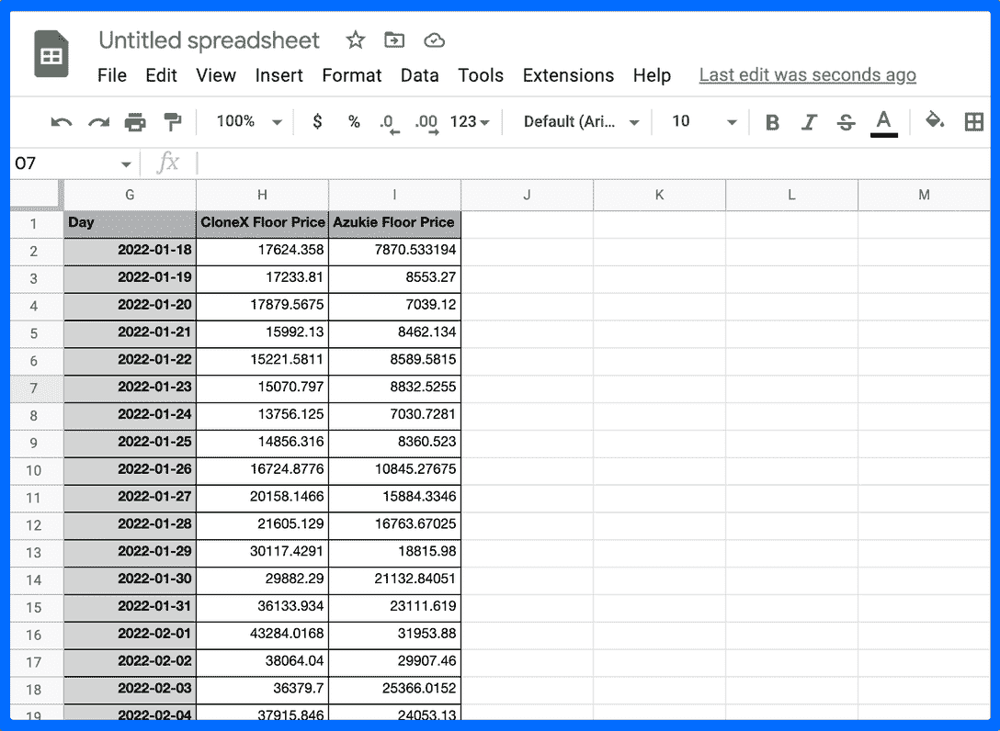
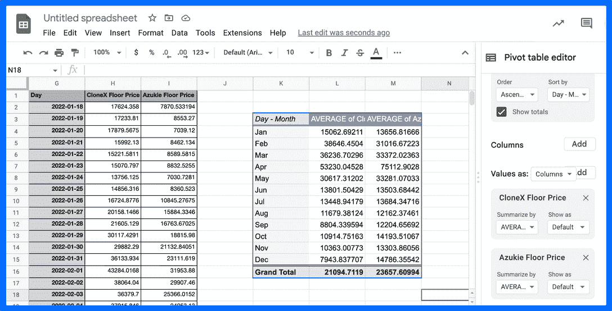
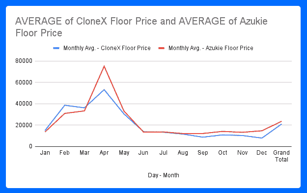
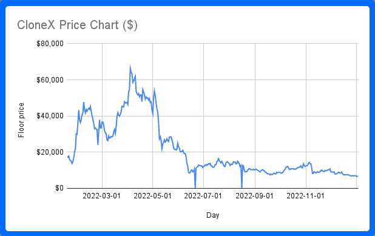
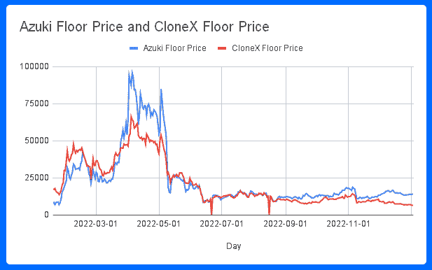

# 利用 NFT 底价发现交易机会

> 原文：<https://web.archive.org/web/https://dappradar.com/blog/dappradar-pro-member-floor-prices-csv-file>

## DappRadar PRO 用户获得更多工具和见解

NFT 底价是标志 NFT 系列成功的常用指标。更高的底价意味着更高的需求，因此波动的底价可以成为套利交易者的交易机会。而且，不断下降的底价可能是进入顶级 NFT 社区的千载难逢的机会。

DappRadar 是世界上最大的区块链数据库之一。现在，我们正在将这些信息的力量传递给我们的用户。[DappRadar PRO](https://web.archive.org/web/20230120000839/https://dappradar.com/token/pro)[M](https://web.archive.org/web/20230120000839/https://dappradar.com/token/pro)[余烬](https://web.archive.org/web/20230120000839/https://dappradar.com/token/pro)可以进入我们的档案，提取历史上的链上数据，并将其操纵成信息。

作为一名专业会员，你可以接触到原始的，但已经清理过的区块链数据。你可以下载一个或多个 CSV 文件，将它们导入 Excel 或 Google Sheets，然后开始变魔术。

在本指南中，我们将解释如何使用 NFT 藏品的底价来分析其价值。下跌的底价可能意味着买入机会。

## 什么是底价？

在确定 NFT 的价值时，当前的底价总是一个很好的起点。底价是卖家在特定收藏中愿意接受的 NFT 的最低价格。

然而，值得注意的是，底价可以被操纵，让一个系列看起来比实际上更受欢迎，它们的用途并不简单。

要了解底价是由整体市场推动还是被人为抬高，可以查看最近的平均销售价格。如果平均销售价格远低于底价，这是一个强烈的信号，表明有人在操纵底价。

进入 [DappRadar 的 NFT 系列](https://web.archive.org/web/20230120000839/https://dappradar.com/nft/collections)页面，查看任何系列的当前底价和平均售价。你可以看到过去 15 分钟或一个项目整个交易历史的数据。只需两分钟，可以为你节省很多钱。

[Become a PRO Member](https://web.archive.org/web/20230120000839/https://dappradar.com/token/pro)

## 如何下载您的 CSV 文件

DappRadar 自 2018 年以来一直在汇编和汇总区块链数据。现在，我们的专业用户可以访问这些原始数据，对其进行操作，然后将其转化为真正的见解，以帮助他们击败 Web3 市场。

以下是如何下载历史 CloneX 数据的 CSV 文件的分步指南:

**1。转到 CloneX single dapp 页面。**

一旦你到达这里，你需要点击 NFTs 标签，带你到所有的信息和 NFT 收集的数据。

Go to the CloneX DappRadar dapp page

**2。找到“下载 CSV”按钮。**

向下滚动到“NFT 集合底价”图表，选择你的日期范围。可以是 7 天、30 天或全天数据。您选择的日期范围将是您下载数据的日期范围。

然后，找到右边的省略号。

PRO Members can donwload for free

**3。点击下载 CSV。**

您的文件将自动开始下载。请记住，您需要成为专业用户才能使用该功能。持有 5，000 个雷达代币将使您成为专业会员。

Turn data into magic

[Check RADAR Price](https://web.archive.org/web/20230120000839/https://dappradar.com/hub/token/eth/RADAR?from=0x44709a920fccf795fbc57baa433cc3dd53c44dbe)

## 如何将 CSV 数据转换成图表

一旦你的电脑上有了 CSV 文件，就该把它们组合起来，创建一个图表了。

*   将 CSV 数据导入您的电子表格软件。
*   您将有一个日期列和一个底价列。

*   如果您想要使用来自各种 dapps 或集合的数据，添加另一个(确保您命名了列，以便您知道哪个是哪个)。

*   现在根据日期排列数据。
*   如果一切顺利，您现在有 3 列:
    *   日期
    *   dapp A 的底价
    *   dapp B 的底价

Aligning the data so the dates match up

*   现在，您可以修改数据表，例如显示每周或每月的数据量，而不是每天的数据集。

Turn the data into a pivot so you can easily manipulate it

*   一旦完成数据集的创建，就该可视化这些数据了。
*   单击您的数据透视表并插入您选择的图表。

A graph comparing CloneX and Azuki floor prices

现在，您有了自己的图表来进行自己的分析。

[Explore NFT Data](https://web.archive.org/web/20230120000839/https://dappradar.com/nft/collections)

## 将数据转化为洞察力

你手中的数据取决于你操纵它的能力。虽然下面的内容既不是专家分析研究，也不是财务建议，但它是一个你可以用 DappRadar 的数据做的事情的例子。

历史不会重演，但它确实经常押韵。从其他蓝筹股集合中获取数据，看看你能否找到它们的价格图表之间的相关性。下面是 CloneX 花了三分钟制作的图表。

CloneX daily floor price chart

如果我对照另一个类似的蓝筹股绘制这个最低价趋势，我会发现什么？志那都红豆和 CloneX 年龄相同，所以让我们看看如果我们比较两者会发生什么。

CloneX vs. Azuki daily floor price trend

我们看到两个底价相当接近，但在 2022 年 11 月底开始背离。现在我们可以调查这一时期发生了什么，并找到为什么这些线会分开的原因。

如果我们现在更进一步，我们知道历史上这些藏品的底价总是密切相关的，那么现在可能是购买 CloneX NFT 的好时机。这是基于一个有根据的假设，即在未来 6 个月的某个时候，金价可能会攀升至志那都红豆的价格水平？

## 当心，底价是由卖家设定的

重要的是要意识到，只有那些在收藏中拥有 NFT 的人才能设定底价。然而，这些人不一定是值得信赖或可靠的价值指标。他们可能试图欺骗买家。

此外，NFT 持有者可能会试图通过同意不以低于某个价格的价格出售来人为抬高藏品的底价，而不管藏品的实际价值如何。例如，如果一群 NFT 持有者合谋不以低于 100 ETH 的价格出售他们的非流通股，即使真实价值更低，他们也可以人为地提高底价。

还有一种叫做“扫地”的做法，即以底价购买一个系列中的多个 NFT。这可能表明该项目正在获得动力，但也可能是单个实体操纵底价的一种策略。

另一种形式的操纵被称为洗盘交易，交易中的买方和卖方是相同的，或者串通在一起。例如，一个 NFT 的所有者可能会以一个膨胀的价格列出他们的 NFT，然后自己买回。

虽然底价对于 NFT 交易者来说是一个有用的工具，可以帮助他们了解购买集合中的 NFT 的受欢迎程度和进入点，但在做出决定之前保持谨慎并考虑多个数据点是很重要的。"

## CSV 数据的其他用例

作为专业会员，您可以访问广泛的数据点。说到 NFT 系列，你可以找到以下数据:

*   NFT 交易量
*   NFT 集合底价

如果这些收藏品与一个分散的应用程序相结合，例如，如果我们正在谈论可以在一个提供令牌奖励系统的游戏中使用的收藏品，那么你也可以下载 dapp 概述数据。

作为 DappRadar PRO 会员，您可以下载 CSV 文件并比较各种 dapps 和 NFT 收藏。它能让你看到趋势。例如，你可以为选定数量的 NFT 系列制作自己的图表，或者跟踪你认为是蓝筹股的 NFT 系列的表现。

[Become a PRO Member](https://web.archive.org/web/20230120000839/https://dappradar.com/token/pro)

## 随身携带您的 Web3 之旅

使用 DappRadar 移动应用程序，再也不会错过 Web3。查看最受欢迎的 dapps 的性能，并关注您投资组合中的 NFT。您在 DappRadar 上的帐户会与我们的移动应用程序同步，这样您很快就可以选择实时接收提醒。

[Download the DappRadar app now](https://web.archive.org/web/20230120000839/https://dappradar.app.link/blog)[<picture></picture>](https://web.archive.org/web/20230120000839/https://play.google.com/store/apps/details?id=com.portfolio.dappradar)