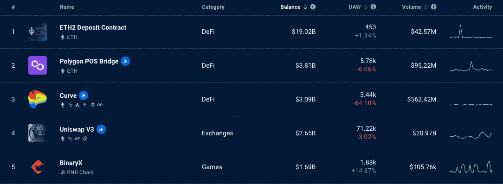
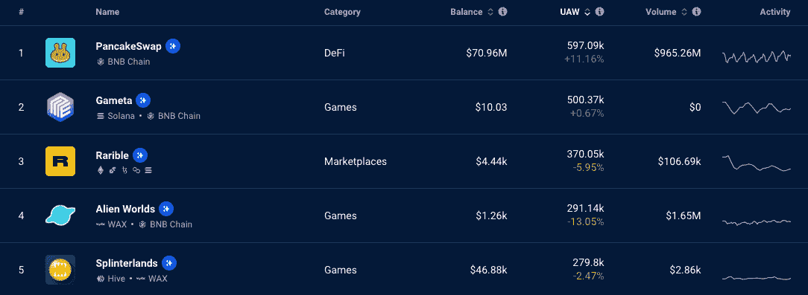
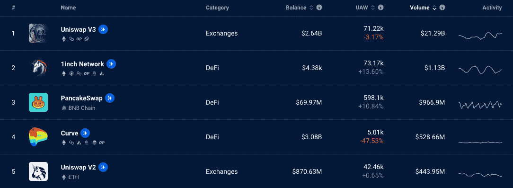

# DappRadar 排名解释

> 原文：<https://web.archive.org/web/https://dappradar.com/blog/dappradar-rankings-explained>

## 发现 dapps 并深入了解链上指标

订购全球的区块链数据是我们 DappRadar 的使命。我们向世界推出的第一个产品是我们的排名页面，在这里我们根据链上指标跟踪不同的分散应用程序。我们根据余额、唯一活跃钱包和交易量对这些 dapps 进行分类，并在三个不同的时间段提供信息。

### **内容**

*   ***[类别](https://web.archive.org/web/20221207034912/https://dappradar.com/blog/dappradar-rankings-explained/#category)***
*   ***[平衡](https://web.archive.org/web/20221207034912/https://dappradar.com/blog/dappradar-rankings-explained/#balance)***
*   ***[独特的活动钱包](https://web.archive.org/web/20221207034912/https://dappradar.com/blog/dappradar-rankings-explained/#unique-active)***
*   ***[卷](https://web.archive.org/web/20221207034912/https://dappradar.com/blog/dappradar-rankings-explained/#volume)***
*   ***[活动](https://web.archive.org/web/20221207034912/https://dappradar.com/blog/dappradar-rankings-explained/#activity)***

在搜索引擎对互联网进行分类之前，用户需要知道特定的网址才能找到特定的网页。同样，在 DappRadar 之前，比较 dappss 并找到市场上最好的 dapp 是一项不可能完成的任务。

DappRadar 现在是世界上的 Dapp 商店，我们帮助我们的用户探索和研究 Web3 空间，找到他们正在寻找的平台。

[Explore DappRadar’s Rankings](https://web.archive.org/web/20221207034912/https://dappradar.com/rankings)

## 种类

Web3 空间包含许多不同的子行业和不同类型的 dapps，以满足不同的兴趣。在 DappRadar，我们跟踪所有这些领域的 dapps，并将它们分类。这些是:

#### [所有类别](https://web.archive.org/web/20221207034912/https://dappradar.com/rankings)

这是我们跟踪的所有 dapp 的完整列表。我们从 50 多个区块链的 dapps 中提取信息，并把它们按顺序排列。这意味着我们的社区可以对整个 Web3 市场做出明智的决定。

#### [游戏](https://web.archive.org/web/20221207034912/https://dappradar.com/rankings/category/games)

游戏是 Web3 产业中增长最快也是最重要的领域之一。我们跟踪近 2000 个区块链游戏的数据，以便用户可以找到最好的游戏。

#### [DeFi](https://web.archive.org/web/20221207034912/https://dappradar.com/rankings/category/defi)

DeFi 是分散金融的缩写。我们的 DeFi 排名列出了自动做市商、赌注平台、跨平台互换网站、加密支付工具等。对赚钱感兴趣的用户可以在这里找到所有最好的 dapps。

#### [赌博](https://web.archive.org/web/20221207034912/https://dappradar.com/rankings/category/gambling)

我们列出了用户可以通过区块链技术在多个市场赌博的 dapps。

#### [交易所](https://web.archive.org/web/20221207034912/https://dappradar.com/rankings/category/exchanges)

这些是 Web3 平台，用户可以在这里获得流动性，并将一种加密货币换成另一种。我们列出了为单一区块链建立的交易所，以及跨越多个区块链的交易所。

#### [收藏品](https://web.archive.org/web/20221207034912/https://dappradar.com/rankings/category/collectibles)

这些 dapps 专用于作为不可替代令牌(NFT)的数字资产。这些排名呈现了关于用户与可收集项目的 dapp 直接连接和交互的数据。要查看 NFT 交易的指标，请访问我们的 [NFTs 概述](https://web.archive.org/web/20221207034912/https://dappradar.com/nft)页面。

#### [市场](https://web.archive.org/web/20221207034912/https://dappradar.com/rankings/category/marketplaces)

我们的市场选项卡显示了与非功能性交易二级市场相关的连锁信息。用户可以购买数字艺术品、游戏内资产、时尚收藏品等。

#### [社交](https://web.archive.org/web/20221207034912/https://dappradar.com/rankings/category/social)

这些是致力于社交活动的 dapps。这里列出了虚拟世界，人们可以在那里见面和互动。我们还展示了锻炼 dapp、社区建设 dapp、社交媒体 dapp 和照片分享 dapp。

#### [其他](https://web.archive.org/web/20221207034912/https://dappradar.com/rankings/category/other)

其他 dapps 在 Web3 领域做了一些稍微不同的事情。在大多数情况下，它们是可以跨多个类别的 dapps。有时，dapp 开发人员没有正确分类他们的 dapp。

#### [高风险](https://web.archive.org/web/20221207034912/https://dappradar.com/rankings/category/high-risk)

高风险 dapps 提供了巨大的回报，但也有很大的潜在负面影响。我们将这些视为高风险，因此我们的用户要谨慎对待。

## 保持平衡

Balance 指的是 dapp 智能合约中的总资产。我们衡量一个 dapp 持有的加密货币的数量，然后用美元价值表示。

下面的列表显示了我们排名中前五位的 dapps。不出所料，其中四个与金融有关。三个与 DeFi 直接相关，而另一个是交易所，需要持有流动资产，以便人们可以交易加密货币。

[DappRadar Rankings sorted on Balance](https://web.archive.org/web/20221207034912/https://dappradar.com/rankings)

余额最高的 dapp 是 ETH2 存款合约。这并不奇怪，因为这是 dapp，利益相关者将他们的 [ETH](https://web.archive.org/web/20221207034912/https://dappradar.com/hub/token/eth/ETH) 放在合并的准备阶段。

以太坊基金会何时发布这种加密货币还没有确定的日期。但对于任何持有这份智能合约的人来说，请放心，这是安全的。

[Check ETH Price](https://web.archive.org/web/20221207034912/https://dappradar.com/hub/token/eth/ETH)

## 独特的活动钱包

Unique Active Wallets 是在给定时间段内连接到 dapp 的单个 Web3 钱包数量的衡量标准。通常简称为 UAW，人们有时会将这一指标与用户计数混淆。

UAW 不同于普通用户，因为一个人可以拥有多个钱包，用于连接 dapp。例如，如果 20 个人有 60 个钱包，并且他们都用他们的钱包连接到同一个 dapp，则 UAW 将是 60，但实际用户数是 20。

在查看 UAW 专栏时，还有一点需要考虑:一些 dapps 持有一些离线数据。例如，与虚拟世界 Decetraland 交互的用户并不总是连接到 dapp 的智能合约。他们登录到网站，但没有连接到区块链。DappRadar 只追踪区块链的数据，所以这就是为什么用户数量不同于 UAW 的数量。

[Learn About UAW](https://web.archive.org/web/20221207034912/https://dappradar.com/blog/dappradar-tracks-unique-active-wallets-but-what-does-that-mean)

当我们查看按 UAW 排序的排名时，我们可以看到，在过去的七天里，有 597，090 个独特的钱包连接到了分散式交换 PancakeSwap。这使得 dapp 成为我们本周排名的首位。

三款游戏——Gameta、Alien Worlds 和 splitter lands——也位列前五。这显示了游戏在 Web3 领域的受欢迎程度。在我们最近的 [Q3 BGA Games 报告](https://web.archive.org/web/20221207034912/https://dappradar.com/blog/dappradar-x-bga-games-report-q3-2022)中，我们写道，游戏目前是“dapp 行业的驱动力”

[DappRadar Rankings sorted on UAW](https://web.archive.org/web/20221207034912/https://dappradar.com/rankings)

## 卷

该指标显示了通过 dapp 智能合同的加密货币的数量，以美元价值衡量。不出所料，当我们按交易量排序时，[交易所](https://web.archive.org/web/20221207034912/https://dappradar.com/rankings/category/exchanges)和 [DeFi](https://web.archive.org/web/20221207034912/https://dappradar.com/rankings/category/defi) 平台超过了我们的[排名](https://web.archive.org/web/20221207034912/https://dappradar.com/rankings)。这是因为用户去这些网站交换和下注他们的加密货币。

人们投入这些平台的所有加密货币，无论是通过赌注还是交换，都被视为通过 dapp 的智能合约。DappRadar 获取这些数据并将其显示在 Volume 列中。

[DappRadar Rankings sorted on Volume](https://web.archive.org/web/20221207034912/https://dappradar.com/rankings)

## 活动

我们排名页面的最后一栏是活动。这是您正在探索的指标的趋势线。如果你对 UAW 进行了七天的排序，这条线会显示 UAW 在这段时间内的涨跌情况。

当你检查 dapp 的平衡时，这个可视化工具特别有用。我们把平衡呈现为一个单一的、离散的数字，它只在当下才是正确的。与 UAW 和交易量不同，您不能在指定的时间段内合计余额。

不过，在一段时间内观察平衡是有帮助的，看看它是如何表现的。通过检查“活动”列，您可以看到余额是上升、下降还是保持稳定。

[Explore DappRadar’s Rankings](https://web.archive.org/web/20221207034912/https://dappradar.com/rankings)

## 随身携带您的 Web3 之旅

使用 DappRadar 移动应用程序，再也不会错过 Web3。查看最受欢迎的 dapps 的性能，并关注您投资组合中的 NFT。您在 DappRadar 上的帐户会与我们的移动应用程序同步，这样您很快就可以选择实时接收提醒。

[Download the DappRadar app now](https://web.archive.org/web/20221207034912/https://dappradar.app.link/blog)[<picture></picture>](https://web.archive.org/web/20221207034912/https://play.google.com/store/apps/details?id=com.portfolio.dappradar) NewsletterUnsubscribe at any time. [T&Cs](https://web.archive.org/web/20221207034912/https://dappradar.com/terms) and [Privacy Policy](https://web.archive.org/web/20221207034912/https://dappradar.com/privacy-policy)