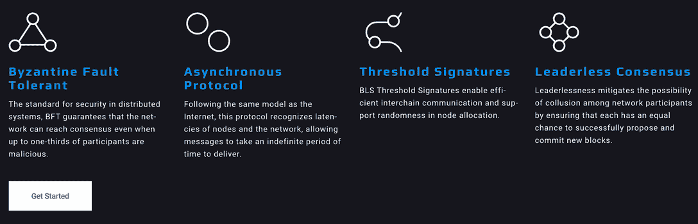

# DappRadar 将整合 Skale 网络

> 原文：<https://web.archive.org/web/https://dappradar.com/blog/dappradar-to-integrate-skale-network>

## Skale 连锁店运行一个基于以太坊的 EVM 客户端

DappRadar 很高兴地宣布，它将很快整合 Skale 网络及其 dapps 生态系统。现在，我们邀请 dapp 开发者和用户了解更多关于可扩展的、兼容 EVM 的网络。

Skale 是一个高度可扩展的多链区块链网络，为用户提供安全的以太坊可扩展性解决方案。与大多数第 1 层和第 2 层网络不同，Skale Network 的架构支持一组不断扩展的 dapp 专用链。它使用以太坊主网来管理和协调关键网络操作，以增强网络安全性和透明度。

用更简单的语言来说，对于开发者来说，这意味着他们可以[在专为他们的 dapp 和生态系统提供的可扩展的快速链](https://web.archive.org/web/20221213112449/https://docs.skale.network/develop/)上运行 dapp，而没有汽油费的限制，与以太坊 Mainnet dapp 开发者、用户和社区想要的所有连接。而[平台 Dappnet](https://web.archive.org/web/20221213112449/https://docs.skale.network/develop/network-details) 服务帮助 dapp 开发者在 Mainnet 产品发布前进行最终的网络和负载测试。

以太坊开发者可以使用所有常用的工具和部署方法(Truffle、Hardhat、Remix、Web3)，获得自己的 Skale Chain RPC 端点。没错–dapp、其最终用户和生态系统的完整 RPC 端点。最重要的是，Skale 支持 Solidity 和以太坊虚拟机，这意味着开发者和用户可以使用相同的工具、钱包、令牌标准等。就像他们现在在以太坊做的一样。

[将合同部署到 Skale Chain 相对容易](https://web.archive.org/web/20221213112449/https://docs.skale.network/develop/deployment)。根据架构和需求，开发人员可以选择在以太坊上保留哪些合同并在 Skale 上提供服务——例如，将更多面向最终用户的交易放在 Skale 上，将需要工作证明安全性的交易放在以太坊上。

## 高级概述

Skale 建立在以太坊网络之上，其整个运营方面通过以太坊上一系列名为 Skale manager 的智能合同进行。这使得 Skale EVM 通过平台的令牌桥与以太坊兼容和互操作。[链间消息代理(IMA)](https://web.archive.org/web/20221213112449/https://docs.skale.network/ima/1.1.x/) 允许在以太坊和 Skale 之间传输任何令牌或消息，使用 BLS 门限加密来保护传输。

该网络在财务上也与以太坊保持一致。Skale 链创建、验证器注册、委托等操作都是以太坊主网上的事务，由 Skale 管理器处理。因此，该网络由以太坊保护，并将采矿费用推回给以太坊矿工。

## 规模就是规模

对于 Skale Network 来说，2021 年是富有成效的一年，随着即将在 Q2 早期集成到 DappRadar，这一势头不会停止。随着六个 dapps 已经上线，十几个将在未来几个月上线，还有 100 多个正在筹备中，该网络将会大规模增长。整合到 dappRadar，现在的世界 Dapp 商店，将为 Skale，其 Dapp 生态系统及其潜力带来更多的可见性。

现在，那些有兴趣更详细地探索 Skale 网络的人可以从下面开始:

*   [网站](https://web.archive.org/web/20221213112449/https://skale.network/)
*   [Skale Docs](https://web.archive.org/web/20221213112449/https://docs.skale.network/develop/)
*   [白皮书](https://web.archive.org/web/20221213112449/https://skale.network/whitepaper)
*   [推特](https://web.archive.org/web/20221213112449/https://twitter.com/SkaleNetwork?ref_src=twsrc%5Egoogle%7Ctwcamp%5Eserp%7Ctwgr%5Eauthor)
*   [媒体博客](https://web.archive.org/web/20221213112449/https://skale.network/blog)
*   [不和](https://web.archive.org/web/20221213112449/https://discord.com/invite/gM5XBy6)
*   [电报](https://web.archive.org/web/20221213112449/https://discord.com/invite/gM5XBy6)

 NewsletterUnsubscribe at any time. [T&Cs](https://web.archive.org/web/20221213112449/https://dappradar.com/terms) and [Privacy Policy](https://web.archive.org/web/20221213112449/https://dappradar.com/privacy-policy)