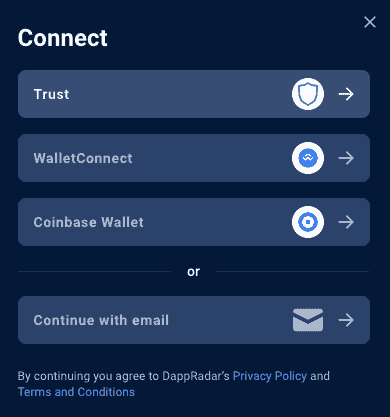

# 使用信任钱包连接到 DappRadar

> 原文：<https://web.archive.org/web/https://dappradar.com/blog/dappradar-trust-wallet-integration>

## Trust Wallet 用户现在可以使用 DappRadar 发现 Web3

DappRadar 用户现在可以使用 Trust Wallet 连接到网站和工具，查看他们的 ETH、BNB 和 Polygon 投资组合。此外，他们可以成为专业用户，享受先进的数据功能，并加入令人兴奋的空投。这标志着 DappRadar 用户的钱包连接与 Metamask、WalletConnect、比特币基地、GameStop Wallet 和 Brave Wallet 的最新成功集成。

Trust Wallet 是一款强大且用户友好的钱包软件，允许您访问许多加密货币硬币，让您可以用资产下注并从中赚取利息。钱包有很多好处，但最大的好处是其出色的安全功能和易用性，让您可以用信用卡购买密码。

DappRadar 用户现在将通过连接自保管加密钱包，在 ETH、BNB 和 Polygon 上看到他们的信托钱包资产。信任钱包用户可以在多个链上购买、接收和发送加密资产，包括以太坊和 EVM 兼容链。

## 如何使用信任钱包连接到 DappRadar

[https://web.archive.org/web/20221209213422if_/https://www.youtube.com/embed/DFMH1qydsbo?feature=oembed](https://web.archive.org/web/20221209213422if_/https://www.youtube.com/embed/DFMH1qydsbo?feature=oembed)

请务必先安装信任钱包扩展，并在钱包设置下将其设置为默认值。当您连接到 DappRadar 时，它将显示为一个选项。您必须在您的信任钱包中签署一项交易，以批准与 DappRadar 的连接，这是一个无缝的过程。

恭喜你。您现在可以使用您的信任钱包连接到 [World 的 Dapp 商店](https://web.archive.org/web/20221209213422/https://dappradar.com/)。要导航到 DappRadar 投资组合跟踪器，请在以太坊上检查您的资产，返回主页，然后单击右上角的图标，现在应该会显示您的信托钱包地址。

点击图标，右边会出现一个带有选项的侧边栏。第一种选择是使用与 Wyre 的集成来使用 Visa 或 Mastercard 购买加密货币。选择设置将允许您进一步个性化您的 DappRadar 帐户，并决定是否加入营销消息。

投资组合选项卡将立即在 [DappRadar 投资组合跟踪器](https://web.archive.org/web/20221209213422/https://dappradar.com/hub/wallet/)中打开您的信任钱包，您可以在其中跟踪和分析您投资组合的实时可操作数据，并通过尖端的行业工具保持领先地位。

## 随身携带您的 Web3 之旅

使用 DappRadar 移动应用程序，再也不会错过 Web3。查看最受欢迎的 dapps 的性能，并关注您投资组合中的 NFT。您在 DappRadar 上的帐户会与我们的移动应用程序同步，这样您很快就可以选择实时接收提醒。

[Download the DappRadar app now](https://web.archive.org/web/20221209213422/https://dappradar.app.link/blog)[<picture></picture>](https://web.archive.org/web/20221209213422/https://play.google.com/store/apps/details?id=com.portfolio.dappradar)