# DappRadar X BGA 区块链游戏报告#7

> 原文：<https://web.archive.org/web/https://dappradar.com/blog/dappradar-x-bga-blockchain-games-report-7>

## 顶级游戏正在蓬勃发展，新的竞争对手已经进入市场。

区块链博彩业正以令人眼花缭乱的速度增长，GameFi 是最热门的词汇之一，行业使用率超过 50%,筹集了 7 . 48 亿美元。顶级游戏正在蓬勃发展，新的竞争对手已经进入市场。在 DappRadar x BGA Games 报告中获取最新更新。

[Download DappRadar BGA Games Report #7](https://web.archive.org/web/20230202103932/https://drive.google.com/file/d/19lhdLY1KotmymwJKCfdM9qLWHXUhbqz_/view?usp=sharing)

web3 不仅仅是一个流行词，它意味着重新设计的互联网，通过分散式应用程序(dapps)为用户提供游戏、社交网络和金融服务，这些应用程序在区块链上运行，由用户自己的钱包管理。

与游戏相关的公司，如总部设在澳大利亚的 [Immutable、](https://web.archive.org/web/20230202103932/https://dappradar.com/rankings/protocol/immutablex)相信[游戏](https://web.archive.org/web/20230202103932/https://dappradar.com/rankings/category/games)将成为总部设在区块链的 Web3 服务的主导领域，并引用风险资本家的热情和流入该领域的资金作为证据。

8 月份，平均每天有 847，000 个独立活跃钱包(UAW)与区块链游戏互动，比上月减少了 11%，但仍超过行业使用量的 50%。

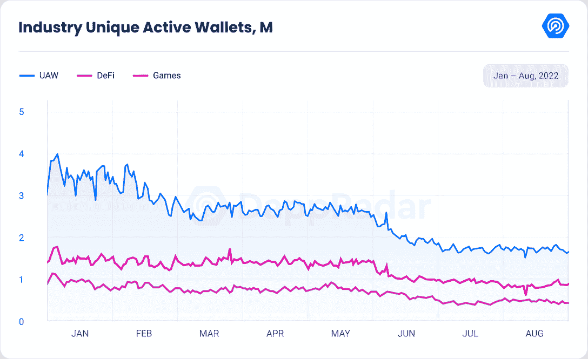

top protocol Wax 的日均唯一活跃钱包数环比下降 8%。尽管如此，40%的游戏活动发生在 [Wax 上。](https://web.archive.org/web/20230202103932/https://dappradar.com/rankings/protocol/wax/category/games) [蜂巢](https://web.archive.org/web/20230202103932/https://dappradar.com/rankings/protocol/hive/category/games)，第二大游戏区块链和[夹板岛](https://web.archive.org/web/20230202103932/https://dappradar.com/multichain/games/splinterlands)的所在地，其活动量攀升至平均每日 169043 架无人机，月环比增长 12%。

同样，BNB 连锁店的 UAW 日均交易量环比增长 8%，超过 92，000 笔。索拉纳继续增长，月环比增长 21%。

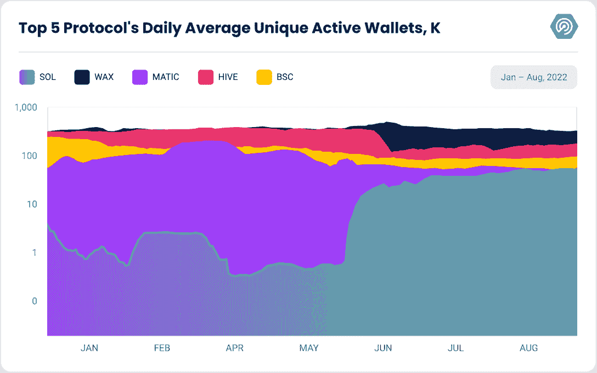

另外两个看涨信号是相关 [NFT](https://web.archive.org/web/20230202103932/https://dappradar.com/nft) 游戏的总交易量，环比增长 13.25%，销售数量增长 83.36%，交易的游戏相关 NFT 超过 130 万。

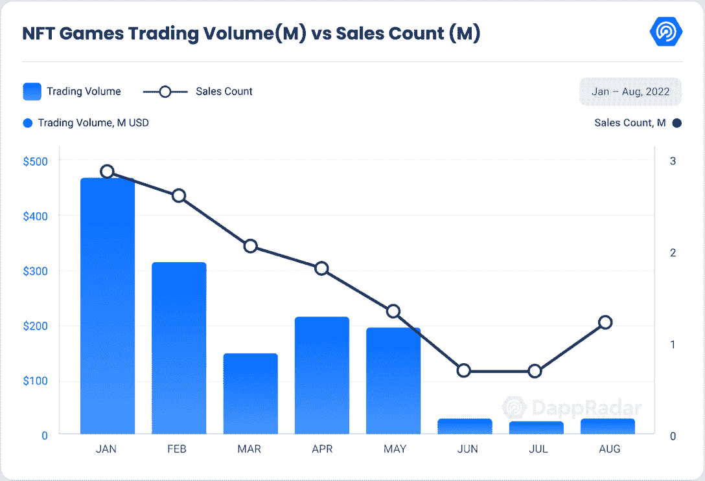

关于协议，以太坊下降了 14.40%，达到 1100 万美元，但索拉纳的月环比增长超过 171%，达到 170 万美元。Ronin 的总交易量也达到了 820 万美元，环比增长 27.64%。

这份报告将重点介绍使区块链游戏成为即将到来的 web3 的领导者的最重要的最新发展。

## 关键要点

*   尽管经济环境充满挑战，但自 8 月 1 日以来，Web3 games 和元宇宙项目已经筹集了超过 7.5 亿美元。
*   新的基于流量的游戏 Trickshot Blitz 在两周内吸引了超过 40 万个独特的活跃钱包(UAW)，同时处理了 460 万笔交易。
*   在去年 6 月改造了游戏的经济后，Splinterlands 连续第三个月复苏。
*   Axie Infinity 在 NFT 的销售额超过了 40 亿美元，而在过去的三个月里，这款游戏平均每天吸引了大约 36，000 名玩家。
*   虚拟世界游戏 NFTs 在 8 月份创造了 2500 万美元的年度新低；沙盒开启阿尔法第三季
*   Xterio 为移动 web3 游戏筹集了 4000 万美元的投资，因为只有 12%的区块链游戏可以在移动设备上玩

## 内容

*   [尽管市场形势不佳，顶级游戏仍在增长](https://web.archive.org/web/20230202103932/https://dappradar.com/blog/dappradar-x-bga-blockchain-games-report-7/#Top-games-)
    *   心流保持蓬勃发展的新游戏特技闪电战
*   [碎片领地超过 30 亿次战斗并保持显著增长](https://web.archive.org/web/20230202103932/http://splinterlands-exceeds/)
*   [虚拟世界销量下降，但销量增加](https://web.archive.org/web/20230202103932/https://dappradar.com/blog/dappradar-x-bga-blockchain-games-report-7/#Virtual-Worlds)
*   [现场观看沙盒阿尔法第三季及其多个名人合作伙伴](https://web.archive.org/web/20230202103932/https://dappradar.com/blog/dappradar-x-bga-blockchain-games-report-7/#Live-look-at-The-Sandbox)
*   [随着移动挣钱的不断发展，STEPN 每月注册用户超过 300 万](https://web.archive.org/web/20230202103932/https://dappradar.com/blog/dappradar-x-bga-blockchain-games-report-7/#STEPN-registers-)
*   区块链奥运会和元宇宙项目筹集了 7.48 亿美元
*   区块链手游会带来 web3 的应用吗？
*   [关闭](https://web.archive.org/web/20230202103932/https://dappradar.com/blog/dappradar-x-bga-blockchain-games-report-7/#Closing)

## 尽管市场形势不佳，顶级游戏仍在增长

8 月，《异形世界》是最受欢迎的区块链游戏，日均 UAW 为 197，555，较上月下降了 4%。他们宣布与 Zilliqa 合作，通过 Unity 软件开发工具包将外星世界整合到他们的平台中。如果你想了解更多关于这种合作关系和他们未来的计划，请观看我们在《我们的日子》中制作的最新 AMA。

基于 Solana 的游戏 Gameta 于 8 月 27 日在 [BNB 链](https://web.archive.org/web/20230202103932/https://dappradar.com/rankings/protocol/binance-smart-chain/category/games)上线，自 7 月以来日均独立活跃钱包增长 33%，成为 BNB 链分散化应用(dApps)中用户数量第二位，GameFi 项目中第一位。

Axie Infinity 已经巩固了其 36k 级别日常钱包的链上玩家基础。本月，这款游戏的 NFT 系列销售额达到 42.4 亿美元，其次是 [CryptoPunks](https://web.archive.org/web/20230202103932/https://dappradar.com/hub/nft-explorer/collection/cryptopunks) ，销售额为 29.2 亿美元。8 月 11 日，他们宣布开始第 0 季，标志着过渡到第 3 阶段。在这个新阶段，奖励系统将被改变，SLP 将被移除。

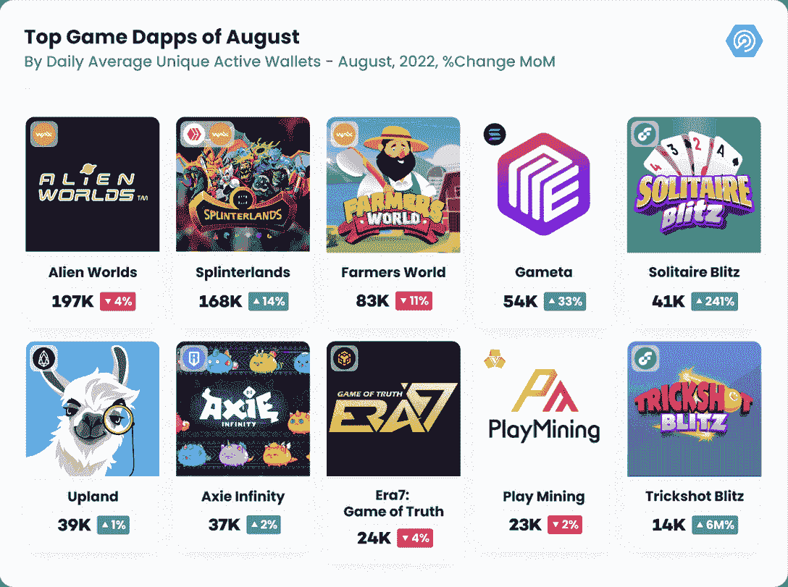

最后，Era7: Game of Truth 和 Play mining 都巩固了他们的基础玩家约 24，000 个日均独立活跃钱包，分别比上个月增长了 4%和 2%。

### 心流保持蓬勃发展的新游戏特技闪电战

本月，游戏发行平台 Joyride Games Inc .在 7 月推出了基于流量的游戏[Solitaire Blitz](https://web.archive.org/web/20230202103932/https://dappradar.com/blog/dappradar-x-bga-games-report-6#:~:text=Joyride%C2%A0%20Games%20released%20Solitaire%20Blitz%20on%20the%20Flow)，也在 15 日发布了 [Trickshot Blitz](https://web.archive.org/web/20230202103932/https://dappradar.com/blog/how-to-play-trickshot-blitz) ，这是一款传统 8 球台球游戏的游戏赚取版本。该游戏在头两周获得了超过 40 万个独特的钱包地址，处理了超过 460 万笔交易。

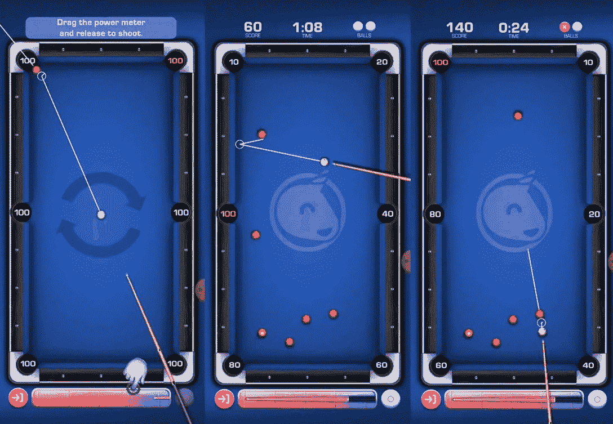

Source: [Trickshot Blitz](https://web.archive.org/web/20230202103932/https://www.onjoyride.com/games/trickshot-blitz)

另一个重要事件是 Ticketmaster 和 Flow 之间的合作，它允许活动组织者将 NFT 附加到他们的门票上。后者可以在活动之前、期间和之后提供这些 NFT，实现定制的体验，例如忠诚度激励或名人见面会，或者只是以 NFT 的形式出售纪念品。

随着世界迅速采用去中心化，Flow 发布了新的去中心化自治组织(DAO)基础设施 CAST。这是一种投票制度，旨在促进社区决策。可以使用流区块链上的任何不可替代的令牌(NFT)或流令牌来门控关于 CAST 的提议。

阅读[我们的区块链综合指南](https://web.archive.org/web/20230202103932/https://dappradar.com/blog/introducing-the-flow-blockchain-home-of-nba-top-shot)了解更多详情。

## 《星际争霸》超过 30 亿场战斗，并保持显著增长

8 月份对区块链蜂巢上的“夹板岛”( Splinterlands)来说也是一个重要的月份。Splinterlands 团队透露，这款游戏已经进行了 30 亿场战斗。如下图所示，这发生在该游戏于 2022 年 3 月达到 20 亿用户后的几个月，表明用户参与度稳步增长。

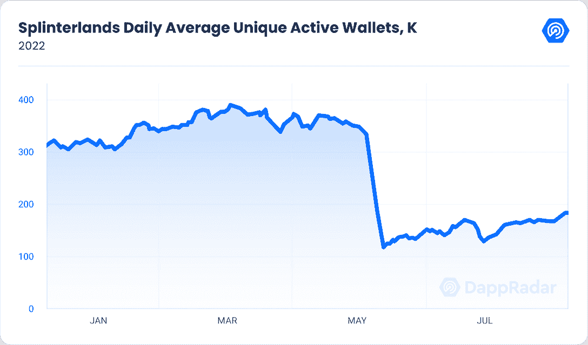

Spinterlands 的独立活跃钱包日均环比增长 14%，达到 168，000 个，这主要是由于以下公告。

8 月 5 日，有消息透露$ SPS(splitter lands)将与 EMP Money 合作在 Huobi 交易所上市，EMP Money 是一种与以太坊挂钩的令牌，玩家可能使用它进行游戏内交易。

美国职业足球大联盟球员协会(MLSPA)于 8 月 8 日宣布，它已与 Splinterlands 合作，建立并开发了一款基于“玩赚”(P2E)的区块链足球游戏，该游戏将使 MLSPA 球员能够通过桌面和移动平台以新的方式与他们的球迷互动。

这两项声明促使 8 月第一周的 Splinterlands 货币(SPS)价格飙升 38%，随后价格开始下跌。根据 [coingecko](https://web.archive.org/web/20230202103932/https://www.coingecko.com/en/coins/splintershards) 的数据，8 月 31 日的 SPS 价格为 0.052，较月初下跌 13%。

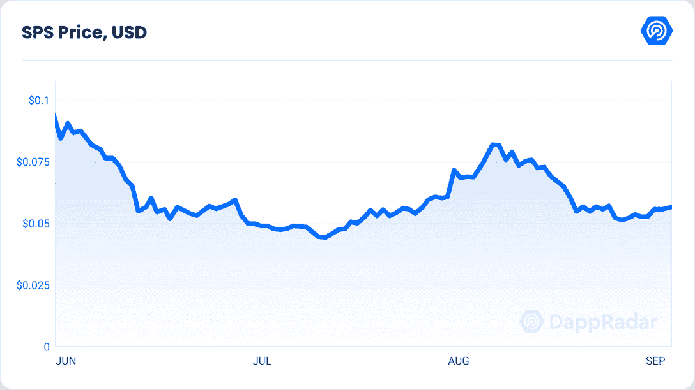

在 8 月 23 日进行了一次测试投票以确保系统运行并衡量参与度后，splitter lands 团队进行了第一次投票，这将影响 splitter lands 的游戏性。这一特定的投票关系到 SPS 奖金分配的重组，这已经引起了争论。

这个想法特别强调了排名战中 SPS 奖励的分配。不是每个人共享一个巨大的 SPS 令牌池，而是有几个较小的池。该计划建议将大部分奖励转移到更高的级别。

虽然这个想法现在以 85%的赞成票通过，但有人担心这项改革只会让富人受益。已经，实现钻石和冠军的排名需要支付。直到你的收集能力超过 250，000，相当于大约 6400 美元的卡，你才被允许参加钻石联盟。

现在，他们想把 SPS 总奖励的 30%提供给占据最高位置的前几百名玩家。更高的级别已经获得了更大的奖励份额和奖金。但是将全部供应量的三分之一分配给一小部分人似乎有些过分。

Splinterlands 团队已经表示，他们愿意在未来改变数字；但是，是否需要新的提案和投票来进行这一调整？我们将密切关注这些事态发展。

## 虚拟世界销量下降，但销量增加

虚拟世界项目经历了一个低迷的月份，该类别的交易量下降了 28.90%，至 2200 万美元。然而，销售数量上升了 38.62%，达到 19，354 个，表明对此类项目的需求仍然很大。

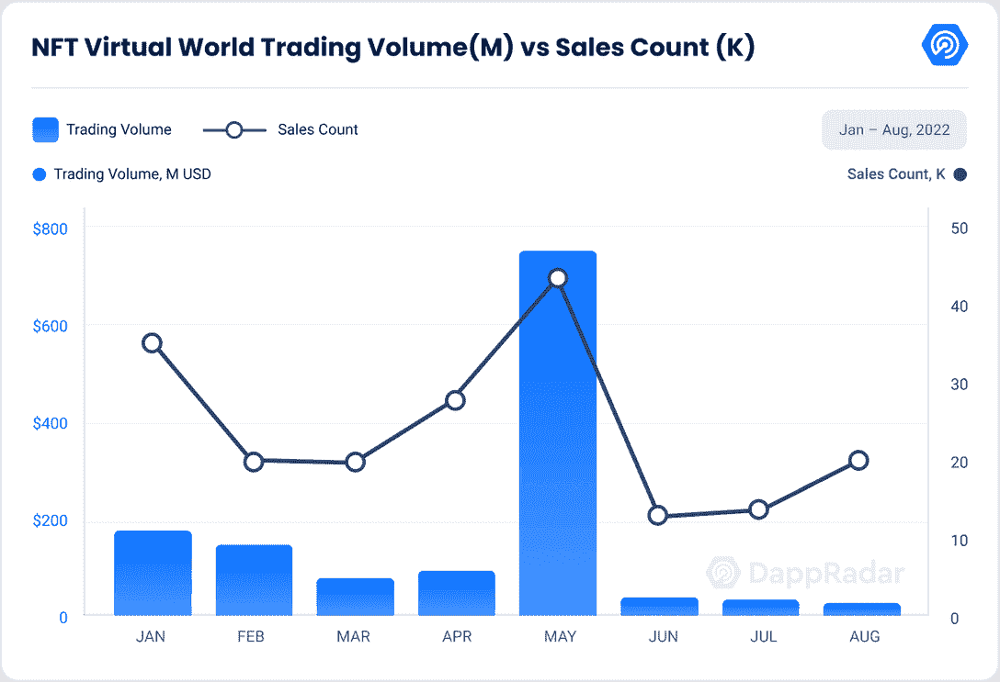

本月，Otherside 的 Otherdeed 与上月相比下降了 27.41%，但仍占虚拟世界总交易量的 73.23%。8 月 28 日，Eminem 和 Snoop Dog 在元宇宙的另一边为年度音乐录影带大奖表演，他们带着 Bored Ape 游艇俱乐部 NFTs。

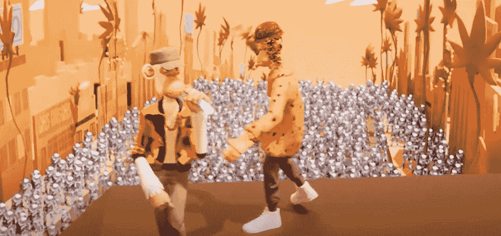

Source: [YouTube](https://web.archive.org/web/20230202103932/https://www.youtube.com/watch?v=cE2E6bj0Hg4&ab_channel=EminemVEVO)

同样，分散的土地每月下降 23.86%，低于 150 万美元，是我们自 2021 年 1 月以来记录的最低水平。此外，NFT 世界下跌了 76.43%，是有史以来最低的交易量。

另一方面，受史蒂文·斯皮尔伯格的电影《一号玩家》启发的 2d 元宇宙《环球韦布乐园》的总交易量同比增长 87.12%，超过 50 万。这种增长是由于最新的公告，用户可以手动提交潜在的集成到其元宇宙。

因此，现在用户可以手动提交他们希望集成的 NFT，而不是必须与全球韦布置地合作才能在全球韦布元宇宙获得其头像的项目。

Somnium Space 也比上个月增长了 36%，这是由该平台推出的新社交媒体平台推动的。它被称为[authentity](https://web.archive.org/web/20230202103932/https://authencity.io/)，它将有一个直接的货币化模式，粉丝可以不受干扰地支持创作者。他们基本上获得了他们支持的每一个配置文件的份额，并将乘着他们成功的浪潮。

此外，由于与 CROS 游戏公司开发的 3D NFT 游戏项目 Ookeenga 的最新合作，Arcade Land 与上月相比增长了 46.24%。

## 现场观看沙盒阿尔法第三季及其多个名人的合作伙伴关系

在沙盒去年的 Alpha 第一季和今年早些时候的 Alpha 第二季之后，玩家们热情地期待着 8 月 24 日发布的第三季。

沙盒阿尔法第三季是免费的，所有玩家都可以玩，但是为了从游戏中获得奖金，你必须有阿尔法通行证或其他沙盒 NFT。此外，沙盒为获奖资格提供了一个新的 KYC 标准。这是不诚实的游戏玩家建立许多帐户来增加他们赢得奖励的机会的结果。

这个阿尔法季节包含了来自众多来源的 90 多种体验。这些体验来自合作伙伴，包括行尸走肉、史努比狗狗和蓝精灵、沙盒团队、游戏制造商基金、12 个用户创建的体验和 16 个以前游戏堵塞的提交内容。

此外，阿尔法第三季允许玩家在游戏中使用来自各种集合的化身 NFT，如史蒂夫·青木、无聊猿和月鸟。

第三季的奖品将会有所修改，包括为特定的 NFT 持有者提供保证奖励。虽然阿尔法通行证持有人继续赢得最多的奖励，但拥有沙盒土地、头像和“NFT”的个人也可以通过完成阶段来获得奖励。

请访问[我们最近的文章](https://web.archive.org/web/20230202103932/https://dappradar.com/blog/3-reasons-why-the-sandbox-alpha-season-3-deserves-the-hype)了解更多关于沙盒阿尔法第三季的信息。

随着新一季的推出，沙盒与[戈登·拉姆齐](https://web.archive.org/web/20230202103932/https://dappradar.com/blog/gordon-ramsay-brings-hells-kitchen-to-the-sandbox)合作，将他获得巨大成功的地狱厨房带入虚拟世界，并与[帕丽斯希尔顿](https://web.archive.org/web/20230202103932/https://dappradar.com/blog/paris-hilton-enters-the-sandbox)合作，帕丽斯希尔顿将在沙盒内复制她的马里布豪宅，并以 DJ 身份举办屋顶派对。

随着所有这些名人合作伙伴关系和新一季的推出，独特的活动钱包比 7 月份增长了 40%，在 Alpha 第三季推出后的第二天达到了 1680 个。

[<picture>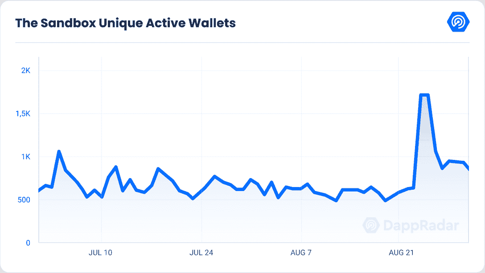</picture>](https://web.archive.org/web/20230202103932/https://dappradar.com/multichain/games/the-sandbox)

9 月 1 日，DappRadar 采访了沙盒的首席运营官 Sebastien Borget，如果你想了解他们的愿景和路线图，请查看这篇文章。

## 随着移动赚取的不断发展，STEPN 每月注册用户超过 300 万

移动赚钱应用程序越来越受欢迎，玩家来自各种可以想象的背景。成千上万的人受到体育锻炼奖励动机的诱惑，全球有庞大的健身应用程序爱好者社区。

STEPN 仍然是最受欢迎的 M2E(移动赚钱)dapps 之一，每月累计用户超过 300 万，挖掘的鞋子超过 70 万双，并正在香港政府运营的初创企业加速器数码港建立其第一个物理办公室，使该市成为其在澳大利亚以外的第一个区域总部。

[<picture>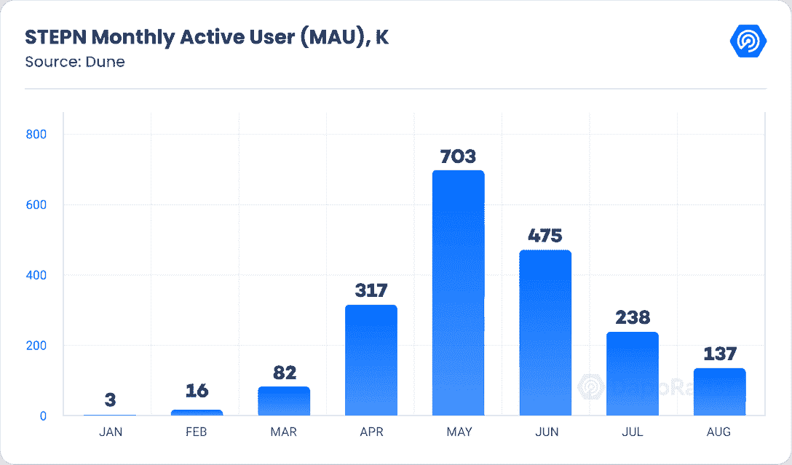</picture>](https://web.archive.org/web/20230202103932/https://dappradar.com/multichain/social/stepn)

Source: [**Dune Analytics**](https://web.archive.org/web/20230202103932/https://dune.com/nguyentoan/STEPN-(GMT-GST)-Core-Metrics)

做出这一决定之际，其他加密货币相关业务正在离开香港，为交易所的新许可制度做准备。与新冠肺炎相关的检疫程序也导致了商业移民。

此外，他们还宣布与马德里竞技和加密货币交易所 WhaleFin 合作开发新系列。该系列将包含 1，001 双马德里竞技运动鞋，有可能赢得俱乐部签名商品和比赛门票。此外，这一系列将与应用程序的跑步赚钱游戏兼容。

除了 [STEPN](https://web.archive.org/web/20230202103932/https://dappradar.com/multichain/social/stepn) 之外，一小部分 dapps 正在攀登 M2E 的行列，尽管他们中的大部分仍处于起步阶段。

Genopets 是 Solana 的另一个赚钱的 dapp，它以类似于 Pokemon Go 的方式利用增强现实，允许用户捕捉在现实世界场所移动的生物，现在已经为其游戏玩家增加了栖息地管理。

在基因宠物中，玩家建造水晶、栖息地和土地形状的种子。在未来，他们还将通过手工制作和水晶提炼提供额外的功能。所有者选择一个费用百分比并指定一个租赁者，该租赁者然后能够利用所选择的栖息地功能。

随着栖息地管理的部署，Genopets 上的移动赚取经济正式开始。beta 期间积累的任何关卡能量都被抹去了，大家必须从头再来。

Sweatcoin 刚刚宣布与 DAO Maker 合作推出自己的数字代币 SWEAT。其 IDO 旨在促进汗水经济向全球 Web3 生态系统的转移。

结合汗水的引入，健身应用的开发团队将提供自己的加密货币钱包，汗水钱包。Sweat Wallet 是以加密为中心的 Sweat 经济的一体化终端，具有诱人的收益率、独特的 NFT 和一套强大的工具。

OliveX 是 Animoca Brands 支持的数字健康和健身公司，拥有 Dustland、Zombies Run 和 Lympo Squat 等 dapps。该公司现在已经发布了一款新游戏 Dustland Rider，在这款游戏中，骑行可以用来收集游戏中的奖品。发布日期尚未透露。

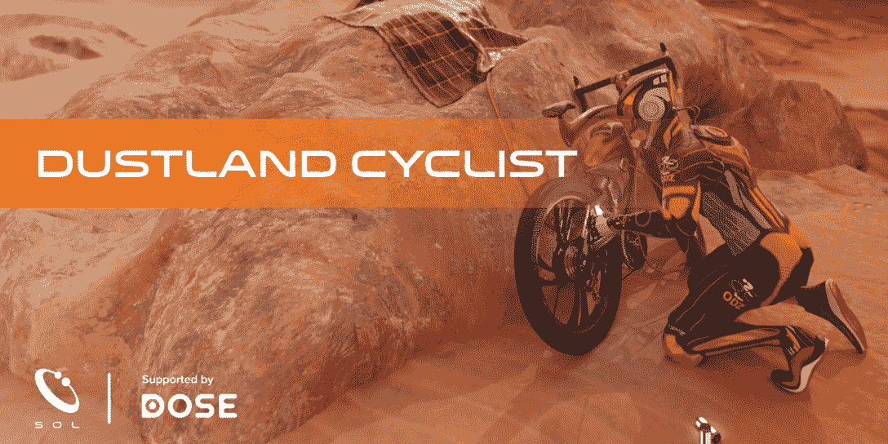

Source: [Dose Token Medium](https://web.archive.org/web/20230202103932/https://medium.com/@DOSEToken/introducing-dustland-cyclist-the-worlds-first-cycle-for-reward-game-886826dba04)

OliveX 的创始人兼首席执行官 Keith Rumjahn 将作为非执行董事加入 Silentmode，作为战略投资计划的一部分，为货币配对、营销和交易所联系等提供建议和见解。

该公司还与游戏开发商 Parasol Corp Pty Ltd 达成协议，在未来三年内合作制作三款新游戏。这些游戏中的每一个都将得到 DOSE utility token 的支持，DOSE utility token 是整个生态系统的令牌。第一个游戏暂定名为“我们与怪物战斗”，是为喜欢体重锻炼的玩家设计的。

从步行者到奥运会运动员，每个人都在使用移动到收入应用程序。有人可能会说，它们从根本上改变了个人与体育锻炼和秘密世界的互动方式。五年前，Web3 和元宇宙只与密码爱好者和 NFT 交易员有联系。然而，许多人越来越多地参与到赚钱的潮流中。

## 区块链奥运会和元宇宙项目筹集了 7 . 48 亿美元

按照全年的趋势，区块链博彩的合作伙伴和投资继续增加，8 月份又筹集了 7.48 亿美元，比上个月增加了 135%，但仍比 6 月份减少了 16%。

一笔引人注目的 2 亿美元投资，占总投资的 27%，是由《战争游戏》和《移动打击》背后的移动游戏工作室 Machine Zone 的创始人兼前首席执行官 Gabriel Leydon 为区块链一家名为 Limit Break 的初创公司筹集的。该项目在其 DigiDaigaku free-mint NFT 系列成功推出后广受欢迎，我们在本[报告](https://web.archive.org/web/20230202103932/https://dappradar.com/blog/new-dapps-report-digidaigaku-genesis-the-free-to-own-revolution)中对此进行了分析。

新加坡国家投资基金、全球最大投资者淡马锡(Temasek)已通过可转换债券向 Animoca Brands 投资 1 亿美元。就在上个月，Animoca 在由现有投资者 Liberty City Ventures、10T 和 Kingsway Capital 牵头的一轮融资中筹集了 7500 万美元。

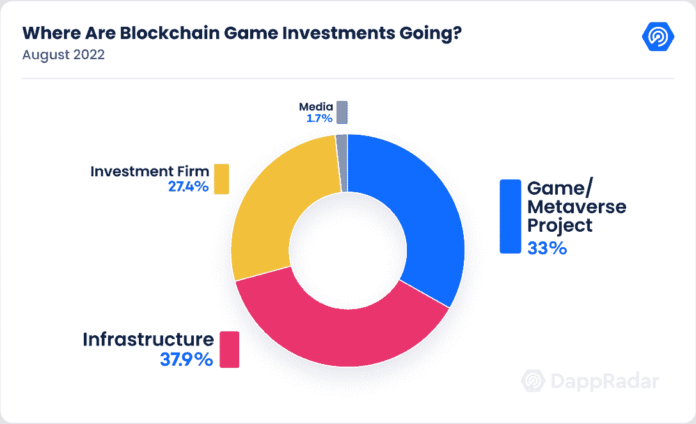

纵观全局，我们发现 38%的投资流向了基础设施，33%流向了游戏和元宇宙项目，27%流向了投资公司。

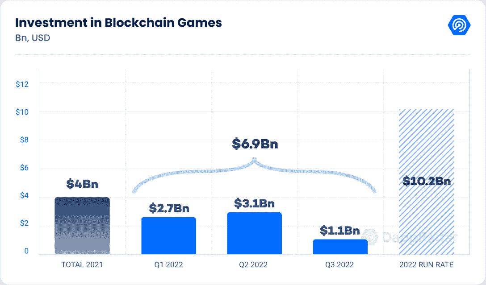

在前一季度，投资者向区块链博彩业投入了 31 亿美元。，对今年这个不断增长的行业的投资总额的预期已经上调了 20%，达到 102 亿美元。

投资金额表明，尽管数字资产市场充满挑战和不确定性，但主要投资实体仍然看好 GameFi 行业。

## 区块链手游会带来 web3 的普及吗？

在过去的二十年里，手机游戏取得了长足的进步。从《贪吃蛇》和《在过时的诺基亚手机上突围》开始，手机游戏业务发展迅速，获得了前所未有的人气，如《糖果粉碎》、《布隆斯塔防》和《愤怒的小鸟》。仅在过去的几年里，移动游戏领域就取得了巨大的飞跃，技术更强大的手机和 web3 技术带来了更身临其境的游戏体验。

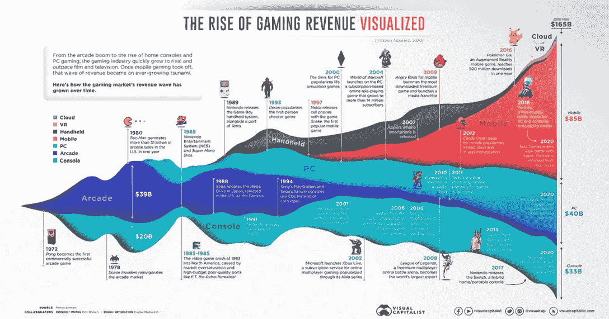

Source: [50 years of Gaming History](https://web.archive.org/web/20230202103932/https://www.visualcapitalist.com/50-years-gaming-history-revenue-stream/)

截至今天，大多数领先的区块链游戏，如 Axie Infinity，Upland，Gemeta，Splinterlands 等。拥有手机版游戏。事实上，[根据镜像世界](https://web.archive.org/web/20230202103932/https://blog.mirrorworld.fun/p/the-future-of-web3-mobile-game-monetization)的数据，只有大约 12%的 web3 游戏可以在移动设备上玩。

本月，Coda Labs 和 Laguna Games 合作发布了四款新的适用于 iOS 和 Android 智能手机的休闲游戏。计划于 2022 年第四季度发布的四款迷你游戏是 Unigatchi、Bumper Corns、Mob Run 和彩虹隆隆。

高质量移动和 Web3 游戏的跨平台发行商和生产商 Xterio 上个月获得了 4000 万美元的投资，这是另一件值得注意的事情。FunPlus、FTX 风险投资公司、创客基金和 XPLA 领投，Hashkey、Foresight Ventures、Headline、Matrix Partners 和 Animoca Brands 也参与其中。

这笔资金将用于开发和发行自己及其合作伙伴的游戏，产生新的世界级知识产权，并继续在 Xterio 平台上工作，该平台将包括一个市场、社交社区中心和其他功能。

尽管经济低迷，乌克兰冲突，通货膨胀上升，加密货币的冬天，以及新的游戏低迷，但这笔融资表明，游戏投资者开始对区块链移动游戏感兴趣。拥有令人信服的提案的 Web3 团队仍可能获得巨额融资。

此外，随着 web3 游戏在移动领域的普及，多个

采用 web3 技术的道路上面临的挑战是现有的摩擦。这一障碍在移动领域尤为明显，因为改变糟糕的用户体验会导致低水平的保留率。

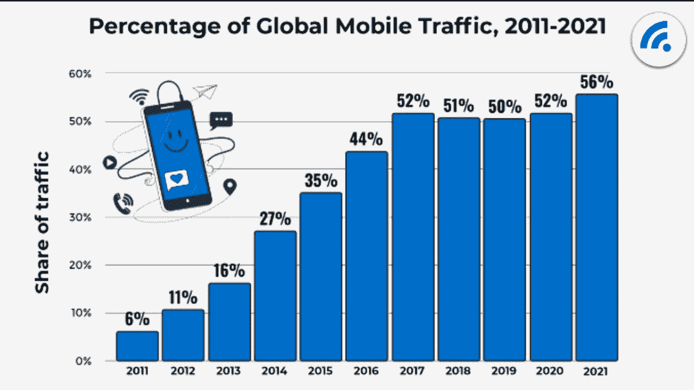

Source: Global Mobile Traffic

跨多个应用程序执行 web3 游戏的典型操作，如登录、完成区块链交易或在 NFT 市场交易，可能会导致客户体验低下。

像 X-terio 和 Mirror World 这样的平台将使整个行业受益。镜像世界 SDK 帮助开发人员以更平滑的方式集成区块链层。Mirror World 的联合创始人兼首席执行官克里斯朱(Chris Zhu)表示，“开发者不需要单独构建自己的堆栈”。

镜像世界在与区块链相关商品互动的同时努力改善用户体验。Chris 提到，“用户通常需要离开应用程序才能与 Metamask 或 Phantom 签署交易，这迫使他们离开你的移动 Dapp，导致当前入职流程中 25%的转化损失，这对任何希望创收和扩大受众的游戏来说都是一个毁灭性的数字。”

考虑到这一点，该平台拥有一体化的登录和认证，用户可以通过社交认证(谷歌、电子邮件、Twitter 等)与游戏互动，并自动绑定一个加密钱包。

用户通常会被要求跳出应用程序，与 Metamask 或 Phantom 签署交易，迫使他们离开你的移动 Dapp，仅现有的入职流程就损失了 25%的转化率，这对任何期望产生收入和增加观众的游戏来说都是一个毁灭性的数字。

在同一页面上，它还有一个移动市场，开发者可以轻松地建立一个内置的 NFT 市场，使用户能够直接从游戏中购买和出售游戏 NFT 资产。

关于 SDK 和类似工具在 web3 准备加入下一波大用户时的重要性，他肯定地说:

> ****
> 
> Chris Zhu, Co-Founder and CEO at Mirror World

## 关闭

区块链游戏是一个仍然年轻的行业的最新成员，它尚未失去神秘感。许多人仍然没有意识到它的重要性，不断变化的游戏生态系统也没有提供什么帮助。

然而，那些大量参与区块链游戏的人认为，它对玩家拥有的资产和循环代币经济的承诺是娱乐的必然发展，这将改变世界对游戏的看法。

我们仍处于具有巨大增长潜力的萌芽阶段。虽然仍有几个领域需要改进，但该部门正在不断发展和创新。

GameFi 的未来看起来很光明，并且正在成为 web3 的领导者。

## 随身携带您的 Web3 之旅

使用 DappRadar 移动应用程序，再也不会错过 Web3。查看最受欢迎的 dapps 的性能，并关注您投资组合中的 NFT。您在 DappRadar 上的帐户会与我们的移动应用程序同步，这样您很快就可以选择实时接收提醒。

[Download the DappRadar app now](https://web.archive.org/web/20230202103932/https://dappradar.app.link/blog)[<picture></picture>](https://web.archive.org/web/20230202103932/https://play.google.com/store/apps/details?id=com.portfolio.dappradar)