# DappRadar x BGA–区块链游戏报告 1 月

> 原文：<https://web.archive.org/web/https://dappradar.com/blog/dappradar-x-bga-blockchain-games-report-january>

## 环比指标和宏观事件表明区块链奥运会前景乐观

抓住游戏赚钱的叙事，Axie Infinity、Splinterlands 和 Sandbox 等游戏 dapps 为游戏范式的转变奠定了基础。Play-to-earn 和 GameFi dapps 为我们如何度过游戏时间构思了一个新的想法。即使在围绕 NFTs 的热潮和持有数十亿总价值锁定(TVL)的不断增长的 DeFi 空间中，区块链游戏去年终于在区块链行业留下了可见的足迹。

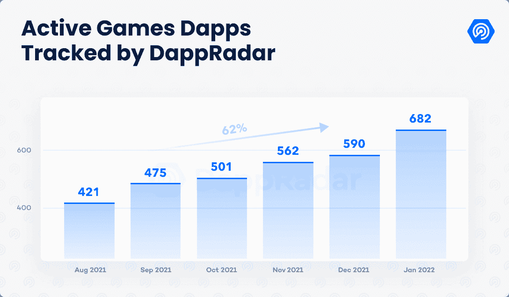

此外，围绕 NFTs 授予的所有权和与元宇宙的交集的主流新闻只是为区块链奥运会的前景增添了燃料。人们对这个领域的兴趣比以往任何时候都高，今年 1 月，区块链游戏和基础设施投资了 10 亿美元，2021 年筹集了 40 亿美元。

这份报告着眼于与区块链奥运会最相关的一月份活动，这一类别占区块链 2022 年活动的 52%。

## 关键要点

*   游戏的宏观指标预示着乐观的前景。游戏 dapp 占 dapp 行业活动的 52%，仅在 1 月份就有 10 亿美元投资于区块链游戏和基础设施，这一事实强调了这一点。
*   DeFi 王国仅在 1 月份就产生了超过 16 亿美元的交易，比 Axie 多 243%；游戏 dapp 持有 7.75 亿美元，占 Harmony 总价值的 60%。
*   Polygon 闪现了其完整游戏生态系统的潜力；《疯狂防御英雄》以平均每天 41，000 的 UAW 成为网络中第二大最常用的 dapp。
*   炸弹加密超越 Mobox 成为玩得最多的 BSC dapp 一月份，游戏 dapp 平均每天吸引近 4 万 UAW。
*   Axie 生态系统中的经济调整可能会在短期内影响游戏的指标，但从长远来看，会改善其可持续性。

## 目录

*   游戏巨头们正在准备进军区块链吗？
*   DeFi 与游戏在和谐上碰撞
*   多边形的游戏前景正在上升
*   顶级游戏保留了他们的观众，尽管加密崩溃
*   炸弹加密成为 BSC 最常玩的游戏
*   前方道路

## 10 亿美元投资区块链游戏和基础设施

公平地说，游戏赚钱和 GameFi 趋势正在改变我们如何度过游戏时间的观念，将赚钱元素嵌入到视频游戏中。顶级游戏 dapps 的持续使用明显增加了该类别的曝光率。

仅在 1 月份，区块链奥运会及其基础设施就筹集了近 10 亿美元。该金额包括对 OpenSea 的 3 亿美元投资，尽管可能不是直接的游戏投资，但 NFT 市场在游戏项目交易市场中发挥着重要作用。

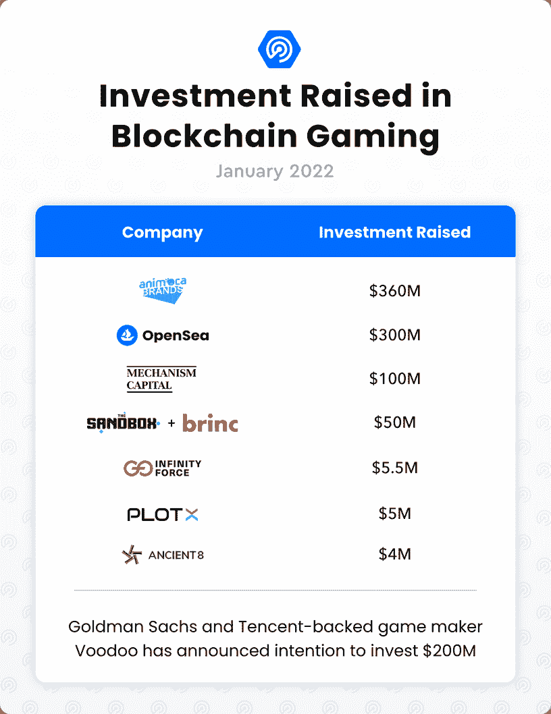

在游戏 dapps 类别中观察到的宏观趋势，确切地说是持续的需求和投入的资本，表明了全球 24 亿活跃用户、价值 2000 亿美元的传统游戏行业的巨大潜力。领先的游戏和科技公司对区块链游戏的潜力及其在元宇宙故事中的角色表现出越来越大的兴趣。

微软、索尼和 Take-Two 在 1 月份签署了涉及顶级游戏公司的有趣收购协议。考虑到过去 13 个月在区块链奥运会和基础设施上投资的创纪录金额，对奥运会和元宇宙的兴趣是不可否认的。这一趋势似乎是由 COVID 疫情和对更多数字交互、通信和虚拟工作环境的普遍推动所激发的。此外，这些区块链奥运会可以为经济困难的家庭提供额外的收入。

然而，通往大规模采用的道路并不容易。来自传统行业的阻力——区块链游戏和 dapps 面临的最具挑战性的障碍之一，是非常潜在的。育碧去年面临这个问题，当时 NFT 市场 Quartz 的宣布引来了《幽灵行动》粉丝群的敌意批评。尽管如此，这家总部位于法国的游戏公司和沙盒公司上周宣布了一项充满希望的合作，表明这个行业的宣传可能刚刚开始。

## DeFi 与游戏和谐碰撞

DeFi 王国(DFK)是 GameFi 的完美例子。DeFi 或 GameFi 的游戏化是一种趋势，游戏自然地将 DeFi 功能融入到他们的游戏机制中。DFK 通过在其像素化的虚拟世界中创造真实的游戏体验，将 GameFi 向前推进了一步。

从技术上讲，DFK 是一个由合约组成的 DeFi 协议，它支持分散的交易所、赌注和流动性池以及 NFT 市场。这些 DeFi 属性由游戏的概念来表示，例如银行、花园或酒馆，游戏的效用和治理令牌宝石需要在那里玩。

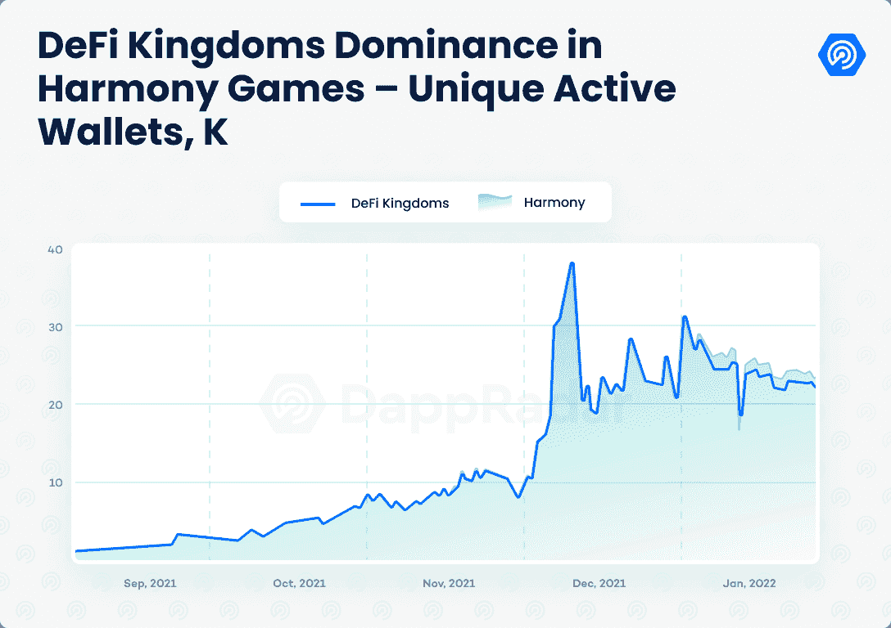

例如，宝石可以被押在银行或用于其他游戏目的。游戏化身或英雄 NFT 可以在酒馆使用宝石购买，为持有者带来额外的效用。王国也有一个交易游戏物品的市场来提高玩家的等级。最后，通过启用 dapp 的流动性池，王国的花园充当了最终的 DeFi 层。

DeFi 王国是一个上升的和谐生态系统的必要 dapp。游戏 dapp 在 1 月份吸引了超过 22，000 的每日 UAW，将其玩家基数保持在 12 月的水平。最重要的是，DFK 持有 Harmony 在 TVL 12 亿美元资产的 60%。

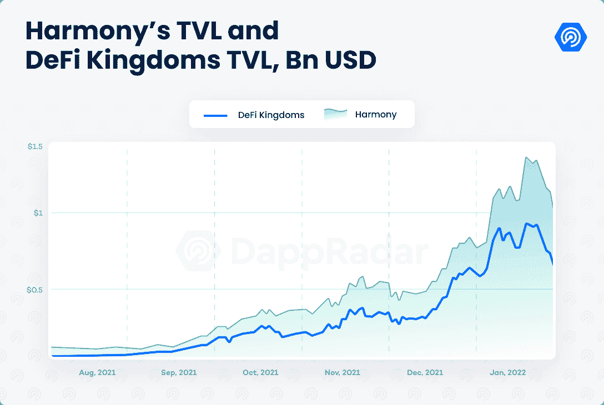

与 TVL 的高水平相一致，DFK 是交易量领先的游戏 dapp，上个月甚至超过了 Axie Infinity。仅在 1 月份，DFK 的交易额就超过了 16 亿美元，比 Axie 高出 243%。DFK 占区块链游戏交易额的 38%。

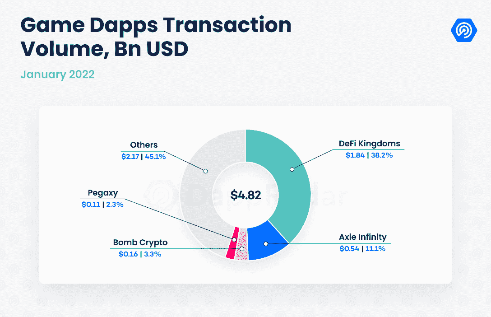

值得注意的是，DeFi dapps 受当前三个月熊市趋势的影响最大。尽管如此，DeFi 王国仍然能够通过将 DeFi 功能流畅地融合到引人入胜的游戏界面中来吸引观众。DFK 在游戏排名中能爬多远？

## 多边形的游戏前景正在上升

在 DappRadar 一月份的行业报告中，我们了解到 Polygon 是采用率提高最多的区块链。连接到侧链的 UAW 数量增加了 76%，平均每天超过 209，000 个 UAW。[多边形的使用受到游戏的支持](https://web.archive.org/web/20221208071954/https://dappradar.com/rankings/protocol/polygon)顺应行业趋势，成为网络的主导类别。

sidechain 已经成为该领域一些最流行游戏的主机。例如，[疯狂防御英雄](https://web.archive.org/web/20221208071954/https://dappradar.com/polygon/games/crazy-defense-heroes) (CDH)，一款也可以在手机上玩的游戏。今年 1 月，CDH 平均每天吸引超过 41，000 名 UAW，是去年 12 月注册玩家数量的两倍。塔防游戏成为网络中仅次于 QuickSwap 的第二大热门 dapp。

Polygon 最近特别关注移动领域。由 Animoca Brands 子公司 Gamee 开发的移动游戏赚钱 dapp arc 8 在 1 月份完成了季前赛，吸引了超过 58，000 名 UAW。移动游戏赚取 dapp 将推出其第一个正式赛季，包括新的迷你游戏。

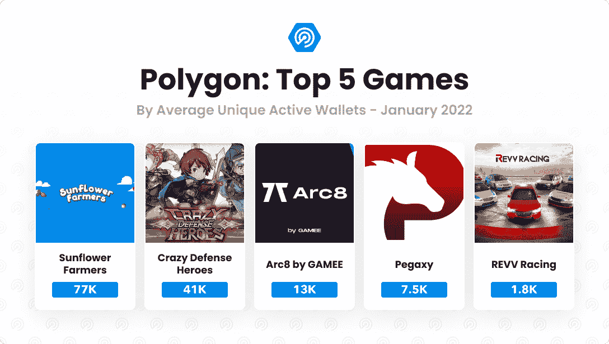

一月份抢了头条的多边形游戏是[向日葵农民](https://web.archive.org/web/20221208071954/https://dappradar.com/polygon/games/sunflower-farmers)。“玩赚”dapp 以一场爆炸开始了这一年，在 2022 年的前七天吸引了超过 40 万 UAW。然而，由于智能合同漏洞，[向日葵农民在游戏拥塞多边形网络后被游戏开发商关闭](https://web.archive.org/web/20221208071954/https://dappradar.com/blog/sunflower-farmers-taken-offline-after-clogging-polygon-blockchain)，导致汽油费价格飙升。然而，智能合约仍然在区块链上运行，人们仍然可以“玩”这个游戏的特定版本。

多边形游戏生态系统看起来已经与 Pegaxy，Aavegotchi，Fear，Phantom Galaxies，REVV Racing，Zed Run，Doctor Who:Worlds apartment，以及即将到来的 Galaxy Fight Club，Riot Racers 等堆叠在一起。此外，该网络通过战略投资和合作伙伴关系不断改进其游戏视角。更重要的是，Polygon 团队在一系列合作伙伴的帮助下推出了 Polygon Studios，这些合作伙伴包括 Animoca Brands、Sandbox、Decentraland 和其他领先的 dapps。

## 顶级游戏留住观众，尽管加密崩溃

在 2021 年第三季度，区块链游戏成为使用量最大的 dapp 类别。当时，区块链游戏占整个行业活动的 45%，现在已经上升到 52%。

游戏最关键的指标之一就是留存。这是玩得最多的游戏玩家正在成功实现的壮举。这些游戏留住了用户，但大多数都在进一步扩大玩家基础。

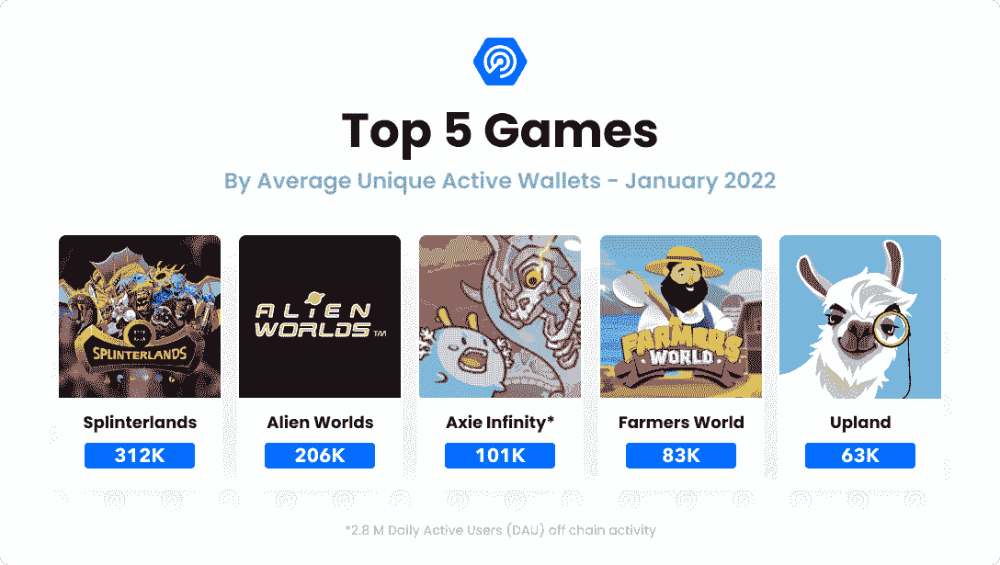

### 夹板地

根据链上活动,成为业内玩得最多的区块链游戏。值得注意的是，dapp 的链上活动是通过在一定时期内与 dapp 互动的唯一活跃钱包(UAW)的数量来衡量的。1 月份，Splinterlands 平均每天吸引约 312，000 名 UAW，其玩家数量比去年年底增长了 4.5%。

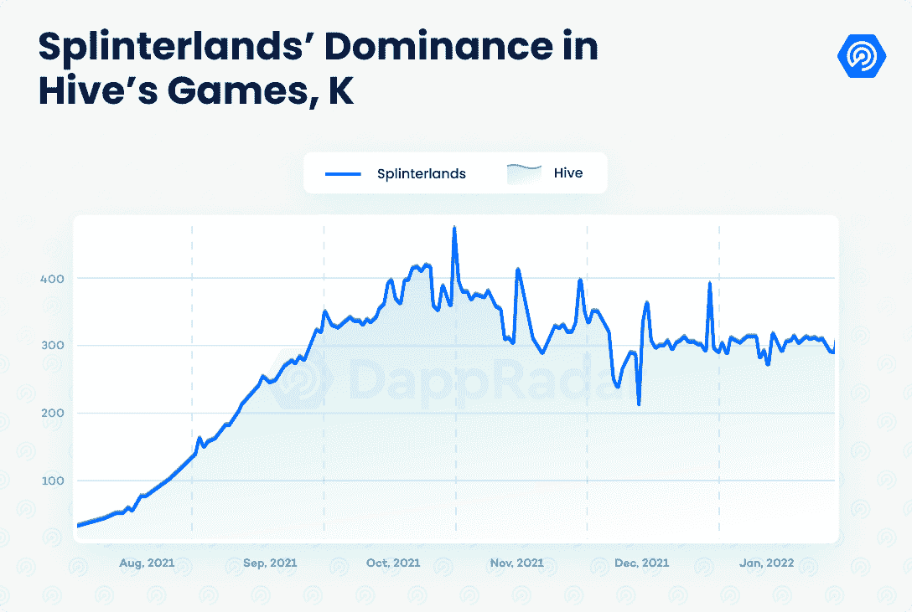

交易卡游戏在 Hive 上运行，占网络独特钱包的近 95%。Splinterlands 之所以成功，是由于多种因素的综合作用。游戏一直在不断更新，防止游戏进入循环。应用于游戏机制的变化向希望优化他们的游戏策略的玩家提出了新的挑战。此外，该团队不断推出新的卡称为混乱军团包。混沌军团第 6 版 24 小时销量超 600 万包，可见游戏需求依然高涨。如果你有兴趣学习用夹板固定资产赚取被动收入的不同方法，你可以看看这篇文章。

### 无限轴

虽然基于 dapp 的链上活动, [Axie Infinity](https://web.archive.org/web/20221208071954/https://dappradar.com/multichain/games/axie-infinity) 是玩得最多的游戏，但考虑到链外活动，它是迄今为止玩得最多的区块链游戏。据天空电视台报道，每天有 280 万活跃用户(DAU)在玩 Axie Infinity。然而，就链上活动而言，Axie 排名第三，1 月份 UAW 日报的平均发行量超过 10 万份。

Axie 的 1 月份活动比 2021 年底略有增加。Sky Mavis 正在不断升级游戏的概念，预计将在今年的某个时候实现虚拟土地功能。另外，[浪人生态系统](https://web.archive.org/web/20221208071954/https://dappradar.com/rankings/protocol/ronin)正在变得平衡。[武士刀](https://web.archive.org/web/20221208071954/https://dappradar.com/ronin/defi/katana)在写作时持有超过 6.2 亿美元的总价值锁定(TVL)，而最近发布的罗恩令牌将让持有者在生态系统的计划中投票。这些活动提升了 Axie 的链上前景，并通过创建一个完整的生态系统来帮助游戏留住更多用户。

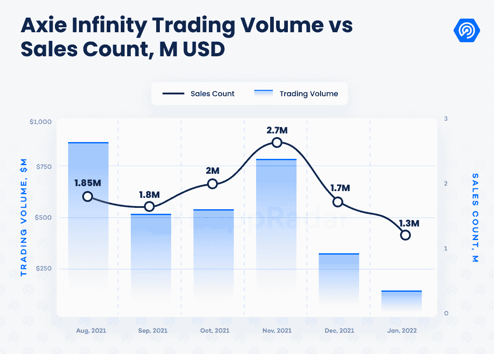

此外，Axie pets 作为 NFT 仍然是有史以来交易量最大的 NFT 系列(不包括 LooksRare 活动)，历史销售额为 41 亿美元，1 月份创造了 1.3 亿美元的收入。而交易量受到基础加密货币价格下跌的影响。销售数量下降幅度小于比例，表明 Axie Infinity 的需求仍然很高。

### **蜡像游戏**

得益于其庞大的游戏活动，[世界资产交易所(Wax)](https://web.archive.org/web/20221208071954/https://dappradar.com/rankings/protocol/wax/category/games) 是业内使用率最高的网络之一。事实上，举办两场最受欢迎的区块链奥运会有助于这项事业。自去年年初以来，[外星世界](https://web.archive.org/web/20221208071954/https://dappradar.com/multichain/games/alien-worlds)成为了区块链的一个参考游戏，每个月都吸引了成千上万的玩家。

尽管因包含重复的游戏任务和缺乏先进的游戏体验而受到批评，但《异形世界》在 1 月份平均每天吸引了超过 205，000 的 UAW，这使它成为基于链上活动的第二大区块链游戏。这个数字包括由于去年在[币安网络](https://web.archive.org/web/20221208071954/https://dappradar.com/rankings/protocol/binance-smart-chain/category/games)上发起的任务而在 BSC 中登记的活动。

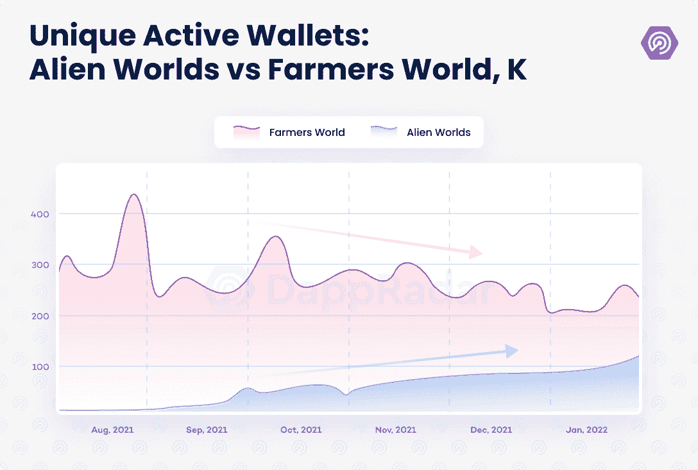

蜡像游戏生态系统还包括 [Farmers World](https://web.archive.org/web/20221208071954/https://dappradar.com/wax/games/farmers-world) ，这是一个 GameFi farming dapp，自去年 9 月以来，其观众人数一直在不断增长。截至 2022 年 1 月底，农民世界是第四大区块链游戏，每天有超过 83，000 名 UAW 连接到 dapp。这比上一年增长了 25%。

尽管两个 dapps 主宰了 Wax 的游戏场景，但新的游戏替代品已经开始着眼于做出一些贡献。游戏赚钱的 dapp 游戏《黑暗国度》(Dark Country)预计将在 Q1 发布其陆地游戏，而《区块链格斗家》(block chain Brawlers)于 2 月份在 NFT 进行了首次发售。

### 山地

[高地](https://web.archive.org/web/20221208071954/https://dappradar.com/eos/games/upland)是业内最古老的区块链游戏之一。《高地》于 2020 年 1 月推出公测版，尽管如此，它仍保持着区块链最受欢迎游戏之一的地位。这款“玩到赚”的 dapp 让人想起“大富翁”，并在其虚拟世界中描绘了曼哈顿、芝加哥和旧金山等重要城市，玩家在其中扮演数字房地产经纪人。1 月份，Upland 每天吸引了超过 63，000 个 UAW，比 12 月的指标提高了 10%。

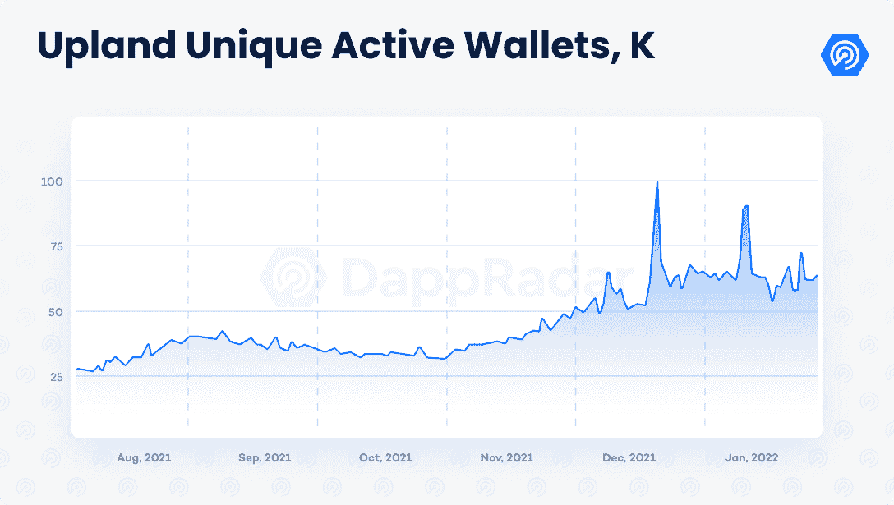

总体而言，重要的区块链奥运会培养了一批固定观众，这对社区的进一步发展至关重要。尽管加密市场出现了负面趋势，但五大最受欢迎游戏中的四个都在扩大受众。如果即将到来的新一波区块链游戏吸引了一个积极参与的用户群，大规模采用可能会比最初想象的更快。

## 炸弹加密成为 BSC 最常玩的游戏

除了 Mobox: NFT 农民，BSC 上的游戏场景在 CryptoBlades 和 CryptoBay 的记录崩溃后似乎也在走下坡路。然而，炸弹加密似乎正在扭转这一趋势。这款基于区块链的游戏受经典游戏《炸弹人》的启发，允许玩家赚取金币。这款非官方克隆的 Konami classic 允许玩家放置炸弹来击败对手并获得奖励。每个炸弹英雄都是可以升级和交易的 NFT。

自从 9 月底推出以来，炸弹加密每个月都在增加玩家数量。今年 1 月，平均每天有近 40，000 名 UAW 连接到 BSC 游戏，比去年 12 月增长了 19%。这样，《炸弹密码》已经超越 Mobox 成为 BSC 游戏生态系统中玩得最多的游戏。

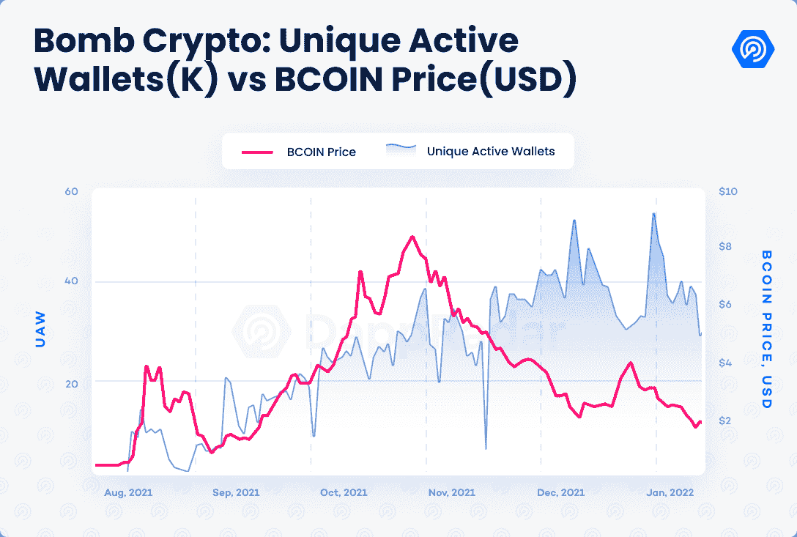

炸弹加密目前产生的价值超过了币安品牌网络中的任何其他游戏。例如，它的交易量比 Mobox 高出 458%。这一成就更加引人注目，因为它是在面临游戏开发延迟的情况下取得的。这些发展障碍使得重复的采矿任务成为唯一的选择。

虽然 BSC 上的其他游戏，如 CryptoBay 和 CryptoBlades，由于经济设计上的错误，几个月后观众人数减少了，但 Bomb Crypto 仍然很强劲。游戏在寻找观众方面的成功和本地硬币的价格之间没有明显的关联。即使价格下降，游戏也能找到更多的观众。此外，该游戏预计将在未来几周推出新的游戏机制及其 NFT 市场。

## 前方道路

一月份的环比指标显示，区块链游戏产业总体表现良好。最受欢迎的游戏 dapps 继续增加其玩家群，新一代游戏 dapps 开始找到观众。像 DeFi 王国，炸弹加密和疯狂防御英雄这样的游戏正在提升不同区块链的类别，如 Harmony，BSC，Polygon 等。

从宏观层面来看，人们对区块链奥运会兴趣的增加迫在眉睫。对于 Solana 和 Ronin 这样的解决方案来说，有必要从技术上为更多的用户做好准备。总而言之，2022 年对于太空来说将是重要的一年。一个将有预期发展的过程，包括即将到来的事件，如:

*   Illuvium 的封闭测试版–illu vium 是有史以来最受期待的区块链游戏之一。这款名为 AAA 级游戏的游戏将允许有限数量的合格玩家在不可变 X 解决方案中测试游戏的一个功能。
*   虚拟世界 alpha——虚拟世界继续无缝扩展。沙盒的第二个阿尔法将带来更多的玩家和新的机制。与此同时，Nifty Island 的开放社交虚拟世界将于 2 月 17 日进行首次 alpha 测试。
*   **Axie Infinity 经济调整**–SLP 奖励率的变化可能会在短期内影响游戏的指标，但从长远来看，将会改善生态系统的可持续性。

[<picture></picture>](https://web.archive.org/web/20221208071954/https://dappradar.com/blog/tag/play-to-earn)[<picture></picture>](https://web.archive.org/web/20221208071954/https://dappradar.com/blog/10-play-to-earn-games-to-watch-in-february-2022)[<picture></picture>](https://web.archive.org/web/20221208071954/https://dappradar.com/rankings/category/games) NewsletterUnsubscribe at any time. [T&Cs](https://web.archive.org/web/20221208071954/https://dappradar.com/terms) and [Privacy Policy](https://web.archive.org/web/20221208071954/https://dappradar.com/privacy-policy)