# DappRadar x BGA 游戏报告–2022 年概述

> 原文：<https://web.archive.org/web/https://dappradar.com/blog/dappradar-x-bga-games-report-2022-overview>

## 随着我们迈向 2023 年，区块链游戏和 dapps 的世界将继续发展和创新。

**尽管 2022 年加密市场大幅下滑，但从游戏到智能合约和代币经济，区块链领域的发展仍在继续向前推进。一些公司和项目被迫关闭，但那些留下来的公司和项目继续带来更新和发布，预计在未来一年将会有更多。**

2023 年将成为发布年，因为我们会看到更多游戏进入 alpha 和 beta 阶段，并增加从 Web2 到 Web3 的集成。当我们探索区块链游戏的新领域时，开发商和发行商仍在寻找实现代币经济和创造有意义的 NFT 的最佳途径。

随着艺术、游戏、音乐和电影领域令人激动的新发展，NFTs 和区块链技术的可能性不断扩大。此外，越来越多的工具和支持服务可供创作者使用，这使得任何人都可以更容易地将他们的游戏创意付诸实践。

## 关键要点

*   游戏仍然是 dapp 行业的驱动力，占 DappRadar 追踪的连锁活动的近 50%。
*   在 2022 年，平均每天有 113 万个不同的活跃钱包连接到游戏 dapps。这比 2021 年的数字增加了 60%。
*   链上游戏交易额达到 74 亿，比上年增长 37%，自 2020 年以来增长了惊人的 3，260%。
*   Wax 仍然是最受欢迎的 web3 游戏区块链，在 2022 年期间平均每天吸引近 35 万 UAW，其次是 Hive 和 BNB 链，分别为 235 万和 167 万 UAW。
*   Polygon 整合为一个游戏链，在 2022 年期间平均每天吸引 97，000 个 UAW。这比上一年增长了 340%，这得益于 Arc8、Benji Bananas、疯狂防御英雄和 Pegaxy 等游戏 dapps 的成功。
*   《异形世界》以近 200，000 的日均 UAW 和 48 亿的连锁交易(包括游戏性、交易和 DAO 活动)结束了这一年。
*   Immutable X 在 NFT 产生了 8700 万美元的交易量，比去年高出 250%。交易卡游戏《被解放的众神》位列全区块链交易量最高的 25 个收藏中。
*   2022 年虚拟世界(土地销售)的交易额预计为 14.5 亿美元，比去年增长 136%。然而，如果我们不计算其他行为，其余的虚拟世界的交易量合计只有 40 万美元。
*   Web3 游戏和元宇宙项目在 2022 年筹集了 76 亿美元，比 2021 年多 59%。此外，25.4 亿美元投资于基础设施项目。

## 内容

1.  [区块链游戏行业概述](https://web.archive.org/web/20230130224653/https://dappradar.com/blog/dappradar-x-bga-games-report-2022-overview/#Chapter-1)
    *   [Wax 成为 2022 年区块链最受欢迎的 web3 游戏](https://web.archive.org/web/20230130224653/https://dappradar.com/blog/dappradar-x-bga-games-report-2022-overview/#Chapter-2)
    *   [不变的 X 见证了游戏 NFT 市场的快速增长](https://web.archive.org/web/20230130224653/https://dappradar.com/blog/dappradar-x-bga-games-report-2022-overview/#Chapter-3)
2.  [顶级游戏见证了每日唯一活跃钱包和交易的大幅增长](https://web.archive.org/web/20230130224653/https://dappradar.com/blog/dappradar-x-bga-games-report-2022-overview/#Chapter-4)
3.  领先的元宇宙 dapps 通过阿尔法或贝塔阶段闪现他们的潜力。
4.  [元宇宙炒作周期后的虚拟世界深度视图](https://web.archive.org/web/20230130224653/https://dappradar.com/blog/dappradar-x-bga-games-report-2022-overview/#Chapter-6)
5.  “移动挣钱”的模式能挺过 2023 年吗？
6.  [风投向区块链游戏和元宇宙项目注入 76 亿美元](https://web.archive.org/web/20230130224653/https://dappradar.com/blog/dappradar-x-bga-games-report-2022-overview/#Chapter-8)
7.  【Animoca Brands 如何建立元宇宙网络 3
8.  [Web2 游戏公司转向 web 3:2023 年游戏的未来](https://web.archive.org/web/20230130224653/https://dappradar.com/blog/dappradar-x-bga-games-report-2022-overview/#Chapter-10)
9.  [结论](https://web.archive.org/web/20230130224653/https://dappradar.com/blog/dappradar-x-bga-games-report-2022-overview/#Conclusion)

## 1.区块链游戏行业概述

dapp 行业在 2022 年继续增长和发展，独特的活动钱包数量显著增加。2021 年，独立活跃钱包(dUAW)的日均数量为 158 万，但 2022 年这一数字增长了 50%，达到 237 万。消费者和企业不断采用区块链，加上投资者越来越多的支持，帮助该行业变得更具弹性。

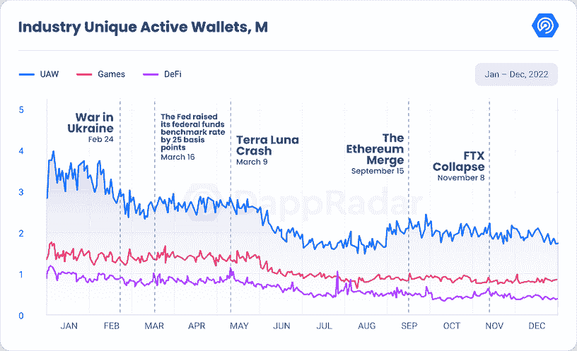

区块链博彩业在 2022 年面临着相当大的挑战，但从 2022 年上半年开始，市场开始整合。区块链博彩业的独立活跃钱包(UAW)数量今年增长了 60%，平均达到 115 万个。游戏占区块链所有日常活动的 49%。

此外，链上游戏交易额达到 74 亿，比上年增长 37%，自 2020 年以来增长了惊人的 3，260%。平均而言，一个独立的活跃钱包今年进行了 25 次游戏链上交易。

### 2022 年，Wax 成为区块链最受欢迎的网络 3 游戏

看看 2021 年和 2022 年区块链顶级博彩公司的独特活跃钱包(UAW ),我们可以看到，与 2021 年相比，大多数区块链上市公司的平均 UAW 在 2022 年有了显著增长。

[最受欢迎的博彩区块链 WAX](https://web.archive.org/web/20230130224653/https://dappradar.com/rankings/protocol/wax/category/games) 在 UAW 出现了大幅增长，2022 年平均每日 UAW 353758 次，较上年增长 57.59%。《异形世界》仍然是 WAX 上最具统治力的游戏 dapp，持有 WAX 在 UAW 46%的统治力。[区块链格斗者](https://web.archive.org/web/20230130224653/https://dappradar.com/wax/games/blockchain-brawlers)也是 2022 年上半年蜡的链上活动的一大贡献者，而探矿者仍然是这个生态系统中一个有趣的游戏选择。

第二受欢迎的游戏协议 Hive 在 UAW 也有大幅增长，与 2021 年相比，日均 UAW 增长了 96.47%。交易卡牌游戏[夹板岛](https://web.archive.org/web/20230130224653/https://dappradar.com/hive/games/splinterlands)负责蜂巢区块链上的大部分活动，[对区块链的 UAW 拥有 97%的控制权。](https://web.archive.org/web/20230130224653/https://dappradar.com/blog/blockchain-and-dapp-adoption-report-2022#:~:text=Splinterlands%20on%20the%20Hive%20blockchain%20had%2091%25%20dominance.)

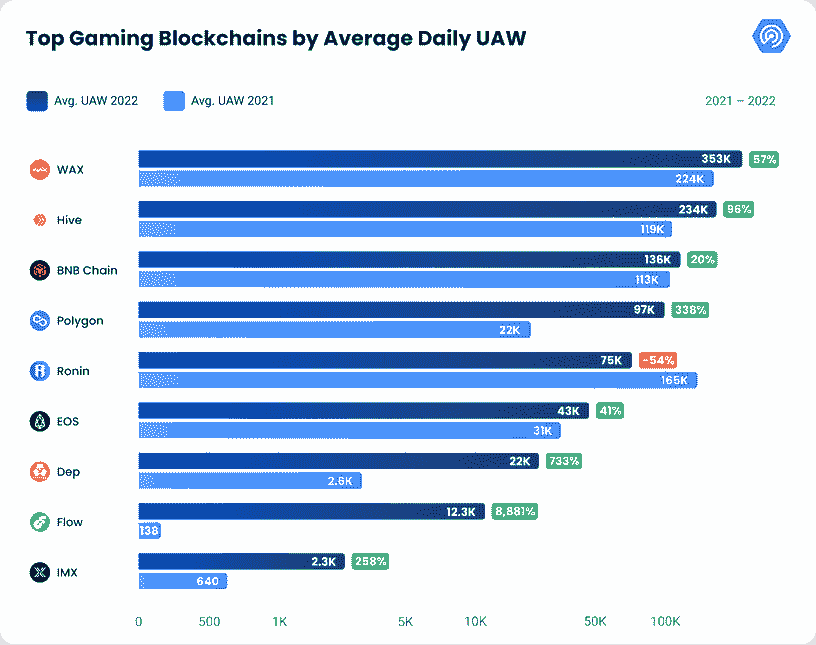

今年增幅最大的是[流量](https://web.archive.org/web/20230130224653/https://dappradar.com/rankings/protocol/flow/category/games)，UAW 的增幅高达 8，881%，平均达到 12，395 dUAW。[纸牌闪电战](https://web.archive.org/web/20230130224653/https://dappradar.com/flow/games/solitaire-blitz)和 [Trickshot 闪电战](https://web.archive.org/web/20230130224653/https://dappradar.com/flow/games/trickshot-blitz)的推出推动了这一大幅增长。如果你想了解更多关于心流的信息，我们的报告是必读的。

[Polygon](//web.archive.org/web/20230130224653/https://dappradar.com/rankings/protocol/polygon/category/games) 也出现了令人瞩目的增长，UAW 同比增长 338.37%，平均达到 97，384 dUAW。这一增长反映了 Polygon 对游戏和元宇宙的高度重视，略微偏离了重质 DeFi 产品。2022 年，UAW 的顶级 dapp 是[疯狂防御英雄](https://web.archive.org/web/20230130224653/https://dappradar.com/polygon/games/crazy-defense-heroes)，拥有 15%的统治地位，尽管塔防游戏的链上活动在下半年有所下降。此外，诸如 [Arc8](https://web.archive.org/web/20230130224653/https://dappradar.com/polygon/games/arc8-by-gamee-1) 、[沙盒](https://web.archive.org/web/20230130224653/https://dappradar.com/polygon/games/the-sandbox)或 Benji Bananas 等游戏为 Polygon 提供了强大的游戏 dapps。

其他在 UAW 有显著增长的区块链包括 [BNB 连锁](https://web.archive.org/web/20230130224653/https://dappradar.com/rankings/protocol/binance-smart-chain/category/games)，增长 20.57%， [EOS](https://web.archive.org/web/20230130224653/https://dappradar.com/rankings/protocol/eos/category/games) ，增长 41.57%。有趣的是，在 EOS 区块链上，[高地在整个 2022 年拥有其 UAW 优势的 79%。](https://web.archive.org/web/20230130224653/https://dappradar.com/blog/blockchain-and-dapp-adoption-report-2022#:~:text=the%20coming%20years.-,Analyzing%20dapp%20dominance%20through%20transactions%20and%20blockchain%20activity,-Analyzing%20the%20dominance)

然而，并不是所有的区块链人都看到了游戏连锁活动的增长。为 Axie Infinity 生态系统打造的定制区块链 Ronin 下降了 54.59%，平均为 75，049 dUAW。这是由于 2022 年 3 月 29 日的一个漏洞。广受欢迎的 Axie Infinity 游戏和 Axie DAO 的创造者 Sky Mavis 的 Ronin validator node 受到了威胁，黑客在 USDC 和以太公司(ETH)窃取了 6.25 亿美元。此外，Axie Infinity 游戏赚取机制没有创造一个可持续的经济，这扼杀了玩游戏的动机。

### 不可改变的 X 见证了游戏 NFT 市场的快速增长

在游戏世界中，NFT 变得越来越受欢迎，允许玩家拥有独特的数字资产，如游戏中的物品和收藏品。然而，正如主流游戏发行商育碧所经历的，在视频游戏中使用 NFTs 仍然有很多不满和抵制。

尽管如此，从 2021 年到 2022 年，顶级游戏区块链的游戏内 NFT 市场已经发生了重大转变。查看交易量和销售计数数据，我们可以看到，不可变的 X 平台作为该领域的领导者脱颖而出，交易量和销售计数都有显著增长。

交易量是衡量以美元交易的所有非金融交易总数的指标。根据我们的链上数据，Immutable X 的交易量增长幅度最大，从 2021 年的 2400 万美元增长到 2022 年的 8700 万美元，增长了 250%。考虑到 ETH 的价格自 2022 年 1 月以来下降了 67%,而 IMX 同期下降了 92%,这一增长就更加令人印象深刻了。

流行卡牌游戏 [Gods Unchained](https://web.archive.org/web/20230130224653/https://dappradar.com/immutablex/games/gods-unchained) 在不变的 X 平台上的成功促成了这一增长。这款游戏在不可变 X 上的交易量占 93 %, UAWs 占 89%。

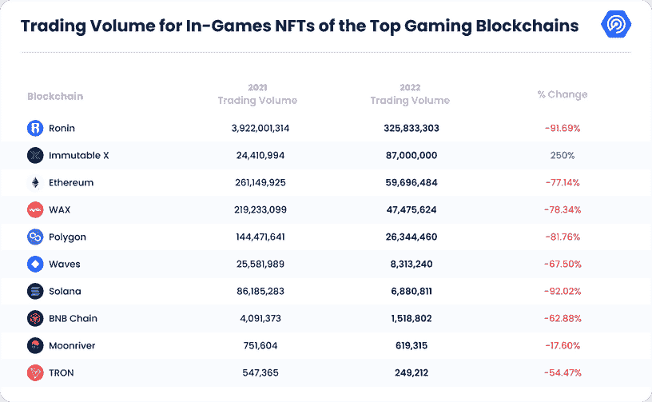

另一方面，Ronin 的交易量下降幅度最大，从 2021 年的 39 亿美元下降到 2022 年的 3.25 亿美元，下降了 91.69%。尽管有所下降，Ronin 仍保持着所有网络中最高的交易量，并占 2022 年游戏内 NFT 总交易量的 57%。

另一方面，销售计数衡量的是在区块链上销售的非功能性食品的总数。数据显示，Immutable X 的销售计数增幅最大，从 2021 年的 230 万增长到 2022 年的 900 万，增幅达 287.04%。

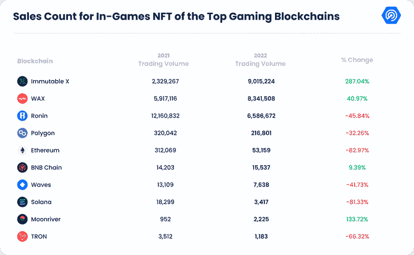

Ronin 的销售数量下降幅度最大，从 2021 年的 12，160，832 辆下降到 2022 年的 6，586，672 辆，下降了 45.84%。WAX 和 BNB 链家是其他仅有的销售数量增加的平台，百分比变化分别为 40.97%和 9.39%。WAX 的增长主要是由于[外星世界](https://web.archive.org/web/20230130224653/https://dappradar.com/wax/games/alien-worlds)的受欢迎程度，该游戏在连锁店的交易计数中占据 49%的主导地位，在 UAWs 中占据 46%的主导地位。

如果你想了解更多关于区块链和 dapp 领养的信息，请阅读[我们的最新报道。](https://web.archive.org/web/20230130224653/https://dappradar.com/blog/blockchain-and-dapp-adoption-report-2022)

总之，虽然不同区块链之间的百分比变化存在一些差异，但从 2021 年到 2022 年，整体趋势是活动减少，包括不可变 x 在内的少数连锁除外。连锁增长除了《被解放的神》的受欢迎程度之外，也可归因于其赌注制度。

Source: [Immutable X Blog post](https://web.archive.org/web/20230130224653/https://www.immutable.com/blog/the-next-evolution-of-imx-staking)

不可变 X 上的新锁定过程包括在 IMX 锁定仪表板中锁定一定数量的 IMX 令牌。此外，用户需要在下注周期内在不可变 X 区块链上交易至少一个 NFT。通过满足这两个要求，用户将能够以 IMX 代币的形式获得奖励，他们可以在不可变的 X 生态系统中用于各种目的。

## 2.顶级游戏见证了每日唯一活跃钱包和交易的大幅增长

2022 年的顶级比赛已经显示出了韧性，他们设法增加了他们的活动。《夹板王国》仍然是最受欢迎的游戏，2022 年平均每天有 235，499 个独立活动钱包(dUAW ),相当于增长了 100.77%。游戏 dapp 每月也有超过 100 万笔交易，这意味着平均而言，一个独特的活跃钱包每月进行五次交易。然而，自从 8 月份改变了他们的游戏经济和奖励系统，dapp 经历了游戏活动的下降，今年以 157，681 dUAW 结束。

尽管游戏的用户群下降，但《夹板大陆》实现了路线图中的重要里程碑。8 月，Splinterlands 宣布与 EMP Money 合作，并推出了他们的代币 EMP。它在火币交易所上市，以促进其用例，并实现 dapp 游戏生态系统中的交易。这次发行允许 EMP 持有者用 EMP 购买分裂大陆的资产，这将成为游戏的收入来源。此外，EMP 财政部可以拒绝接受这种 EMP 返回，这将防止 EMP 挂钩被加压。因此，夹板地玩家和 EMP 持有者可以使用$EMP 系统获得更多奖励。

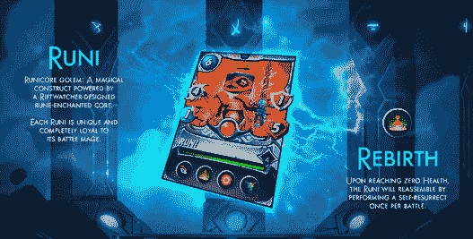

Source: [Splinterlands](https://web.archive.org/web/20230130224653/https://splinterlands.com/)

11 月 11 日，该团队宣布计划为他们的 Runi NFTs 添加额外的用例，因为销售一直很慢。独一无二的，生成性的，PFP 风格的 NFT，将成为碎片领地中的卡片。Splinterlands 希望为以太坊区块链增加一个赌注合同，允许用户在游戏中使用他们的 Runi。每个 Runi 都有一个独特的游戏内卡，所有者也可以将他们的 Runi 作品用于商业用途。此外，11 月 17 日，据报道，由于加密市场的持续恶化和全球经济衰退，Splinterlands 解雇了近 45%的员工。

第二，我们找到了《外星世界》,它在 2022 年的 UAW 略有增加。平均达到 199，499 dUAW，比上一年增长了 7.89%。令人惊讶的是，它以 224，542 dUAW 结束了这一年，在 2022 年 12 月超过了 Splinterlands 成为最受欢迎的游戏。从交易来看，游戏 dapp 每月有超过 480 万笔交易，这意味着每个独特的钱包平均每月进行 25 次交易。

《异形世界》今年继续制作，本季度发布了多个更新。10 月，他们将辛迪加引入该平台，这是一个基于道的管理系统，适用于他们六个星球中的每一个。这次更新允许玩家选举委员会，标志着外星世界的新时代。

11 月，玩家们终于可以使用他们收集的武器和角色了。这些现在可以被送进战斗室，为荣誉、荣耀和奖励而战。值得注意的是，这个 Battledome 不是《异形世界》过去两年承诺的那个，而是一个由一个名为 Restack 的小组开发的第三方应用程序。人工智能和部分资金由来自外星世界的银河枢纽先锋赠款。

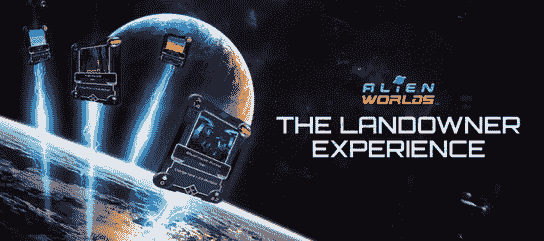

Source: [Medium](https://web.archive.org/web/20230130224653/https://alienworlds.medium.com/)

最后，在 12 月 24 日，外星世界发布了新的土地更新，奖励最积极参与的土地所有者，并通过新功能提供更多土地所有者和矿工之间的互动机会:土地助推。

Axie Infinity 位居第三，其在 2022 年的表现充满了挑战和机遇。尽管游戏的奖励模式进行了重大调整，并且针对浪人桥的 5 亿美元攻击，但 Sky Mavis 已采取措施稳定平台，并对用户做出长期承诺。尽管如此，这些问题也导致 dUAW 的平均人数下降，为 76 104 人，比上一年下降了 40%。此外，每月平均交易次数为 100 777 次，相当于每个 UAW 每月平均 2 次交易。

尽管面临这些挑战，但随着该公司继续创新并适应不断变化的区块链游戏世界，未来仍有希望的迹象。事实上，2022 年 4 月 7 日，Axie Infinity: Origin 通过 Mavis Hub 正式发布。Sky Mavis 在 Axie Infinity 的社交媒体页面上宣布了这一发布，并伴随着一个游戏预告片。由于区块链网络 Ronin 最近遭到黑客攻击，导致价值约 6 亿美元的加密货币被盗，有人担心 Axie Origin 的发布会被推迟。此外，12 月 28 日，该公司宣布了 Axie Infinity Homeland 的第一个 alpha 版本。

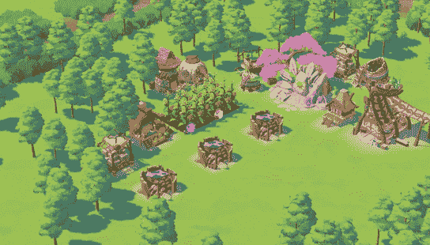

Source: [https://app.axieinfinity.com/games/homeland-alpha/](https://web.archive.org/web/20230130224653/https://app.axieinfinity.com/games/homeland-alpha/) 

Alpha 版本旨在收集反馈，并允许用户探索现有的功能。Axie Infinity Homeland 的发布标志着第一阶段和 Alpha 第 0 季的正式开始。Axie 团队将在游戏明年顺利完成并改进后离开 Alpha，所有进展将被重置。然而，在阿尔法阶段获得独特的链外化妆品的玩家将被允许保留它们。

## 3.领先的元宇宙 dapps 通过阿尔法或贝塔阶段闪现他们的潜力。

区块链游戏领域一直在快速发展，领先的元宇宙玩家已经通过他们各自的 alpha 或 beta 阶段展示了他们的潜力。今年已经推出了许多项目，包括 [Illuvium](https://web.archive.org/web/20230130224653/https://dappradar.com/multichain/games/illuvium-1) 、沙盒、大时代、Axie Infinity Homeland、[传说中的](https://web.archive.org/web/20230130224653/https://dappradar.com/multichain/games/the-fabled)、[幻影星系](https://web.archive.org/web/20230130224653/https://dappradar.com/polygon/collectibles/phantom-galaxies-origin)、[星际地图](https://web.archive.org/web/20230130224653/https://dappradar.com/solana/games/star-atlas)、[我的邻居爱丽丝](https://web.archive.org/web/20230130224653/https://dappradar.com/other/games/my-neighbor-alice)、 [Treeverse](https://web.archive.org/web/20230130224653/https://dappradar.com/ethereum/collectibles/treeverse) 、米兰多斯等等。

游戏是一个行业，通常一个好的游戏需要几年的时间来开发，即使这样，它仍然有缺陷。也许最好的例子就是[赛博朋克 2077](https://web.archive.org/web/20230130224653/https://www.bloomberg.com/news/articles/2020-12-22/cd-projekt-sells-net-13-million-cyberpunk-copies-after-refund#xj4y7vzkg) 。没有理由相信区块链博彩业会有所不同。因此，重要的是，像上面提到的那些领先的项目用测试阶段来回报他们的社区，让他们保持参与和充满热情。

一个在业界引起轰动的项目是沙盒项目。沙盒已经举办了三个阿尔法赛季，为阿尔法通行证持有者提供了一个玩和赚的机会，同时也向公众开放了他们的虚拟墙。玩家可以通过持有土地、进入莱佛士赛季、参加社会竞赛或购买 OpenSea 来获得阿尔法通行证。经过四年的发展，阿尔法第一季于 2021 年 11 月 29 日拉开帷幕，历时 22 天。恰逢脸书一个月前更名为 Meta，它立即推动沙盒成为世界上最受欢迎的区块链游戏之一。

在从脸书更名到 AlphaS1 结束的 7.5 周期间，沙盒的土地上限和土地持有人数量在短短 22 天内分别增长了 46.8%和 8%，而日均交易量达到了 830 ETH。到 3 月 3 日 Alpha 第二季推出时，SAND 的价值和市值已经大幅修正，而 Sandbox 的土地上限刚刚在一周前达到 379，546 ETH 的 ATH。

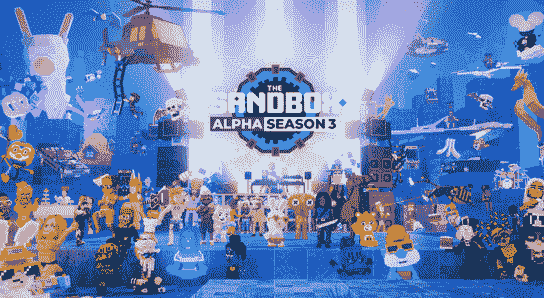

Source: [Medium](https://web.archive.org/web/20230130224653/https://medium.com/sandbox-game/the-sandbox-alpha-season-3-21b1df143aa6)

阿尔法第三季是迄今为止最大的，最容易接近的，最有价值的，最长的一季。它开始于一个隐秘的冬天，沙盒的土地上限自由落体，在第一天触及低点。尽管如此，在 68 天的时间里，该活动通过 98 种全新的品牌体验吸引了 353，000 名不同用户。第一次，游戏玩家可以利用其他 Web3 品牌的化身，展示了沙盒对互操作性的高度关注。沙盒挑战了过去几个月在独特的活跃钱包和交易量方面公布的正数。

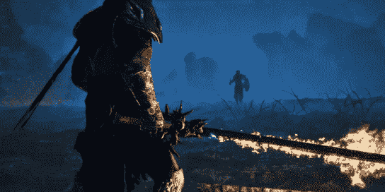

Source: [The Fabled](https://web.archive.org/web/20230130224653/https://www.thefabled.xyz/)

2022 年 12 月，传奇还推出了第一款动作导向型 RPG 的 alpha。玩家需要一个 Mintpass 或者一个 MintKey NFT 来玩这个 alpha。alpha 也对白名单上的人开放，但首轮白名单的开放已经关闭。

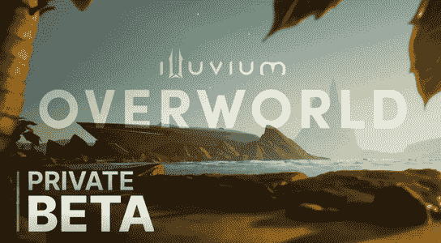

Source: [Illuvium.io](https://web.archive.org/web/20230130224653/https://illuvium.io/news/illuvium-overworld-private-beta-has-arrived)

最后，一个最令人期待的游戏已经为他们即将到来的游戏发布了两个测试版。Illuvium 竞技场的第一个私人测试版引入了新的游戏机制和单位变化，而 Illuvium Overworld 的第二个私人测试版允许玩家测试游戏的主要方面，如世界探索，资源收集和 Illuvium 捕捉。Illuvium 团队继续致力于改进和扩展游戏，玩家可以期待未来更多的更新和功能。

这些只是许多元宇宙 dapps 的几个例子，通过阿尔法或贝塔阶段来展示他们的潜力。随着区块链游戏行业的不断发展，很明显这些项目有潜力革新这个行业，改变我们玩游戏的方式。

## 4.元宇宙炒作周期后的虚拟世界深度视图

元宇宙是一个互联的数字领域，用户可以在其中相互交流、服务和各种形式的娱乐，一直是区块链业界的热门话题。随着 NFTs 的兴起，元宇宙变得越来越容易访问，允许用户拥有和交易数字物品。2022 年，虚拟世界类别的交易量和销售额达到了新的高度，几个元宇宙 dapps 脱颖而出。

根据 2022 年的数据，虚拟世界类别的交易量在 5 月达到顶峰，交易量为 7.48 亿美元。这一增长是由 Otherside 推出的 99，900 块土地推动的，第一个月的交易量达到 7.22 亿美元。

从 6 月开始，下降趋势开始，11 月达到最低点，交易量为 900 万美元。销售计数也出现了类似的趋势，5 月份销售数量最高，为 43，111，11 月份最低，为 10，919。

从积极的方面来看，2022 年结束时，交易量比 11 月份增加了 128%，交易量达到 2000 万美元。销量也呈同样趋势，增长 187%，达到 31，328 辆。

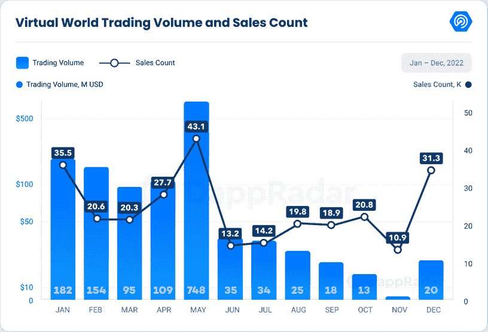

这一领域表现最好的公司之一是 Otherside 的 Otherdeed，该公司今年的交易额为 8.46 亿美元，销售额为 70，480 英镑。NFT 土地出售交易是加密领域最受期待的项目之一，它在 4 月 30 日推出时点燃了购买狂潮。用户为每块土地支付了大约 6000 美元(305 美分硬币)，在高峰时段还额外支付了 6000 美元的燃气费，在造币日这一天总共花费了大约 4.24 ETH。该项目的交易量在 5 月达到顶峰，达到 7.22 亿美元，但此后交易量有所下降，年底交易量为 1，800 万美元。

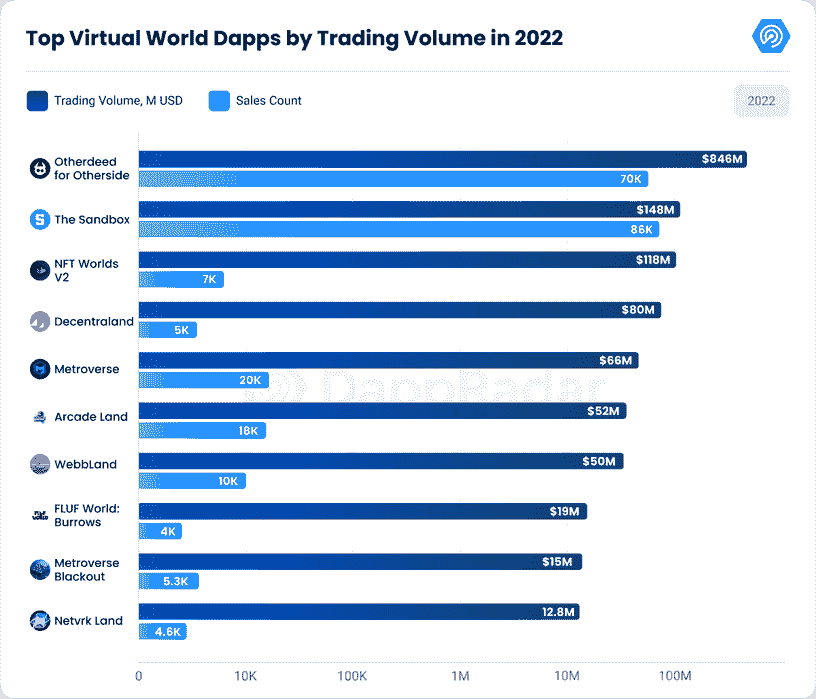

沙盒是另一个受欢迎的元宇宙 dapp，交易量为 1.48 亿美元，销售次数为 86018 次。该项目在其阿尔法成功的推动下增长。与此同时，分散的土地交易量为 8000 万美元，销售计数为 5170。就活动而言，该项目度过了繁忙的一年，包括元宇宙时装周、会议、贸易展览和合作伙伴关系等受欢迎的活动。该平台还有几个社区活动，如艺术周、元宇宙音乐节等，这些活动成为全年的头条新闻。此外，分散土地推出了孵化器计划，以支持创作者和游戏工作室，并举办社区竞赛，如电影俱乐部、游戏果酱、音乐节表情和丑陋毛衣竞赛。

[NFT 世界](https://web.archive.org/web/20230130224653/https://dappradar.com/ethereum/games/nft-worlds)排名第三，交易额达到 1.18 亿美元，Q1 2022 年交易额为 9500 万美元。然而，自 7 月《我的世界》禁令以来，交易量一直呈下降趋势，年底交易量为 620，182 美元，销售额为 624 美元。NFT 世界团队宣布，他们目前正在开发自己的《我的世界》版本，完成了原始游戏多年来缺乏的现代化和积极的发展。

总之，元宇宙是一个快速增长的行业，数据显示，虚拟世界的交易量和销售额在 2022 年达到了新的高度。虽然 Otherdeed for Otherside 在交易量和销售数量方面表现突出，但其他著名的 dapps 如 Sandbox 和 Decentraland 也表现良好。元宇宙是一个充满活力和令人兴奋的空间，看到这些项目在未来如何继续发展将是一件有趣的事情。

## 5.“移动挣钱”模式能挺过 2023 年吗？

2022 年，随着越来越多的游戏玩家和健身爱好者希望通过体育活动获得奖励，移动赚钱应用程序(也称为健身 dapps)的受欢迎程度激增。这些 dapps 已经在全球范围内建立了庞大的用户群体，并越来越多地被用作激励人们保持活跃和健康的一种方式。

根据来自[ResearchAndMarkets.com](https://web.archive.org/web/20230130224653/https://www.researchandmarkets.com/reports/5680983/move-to-earn-fitness-apps-market-by-platform-by?utm_source=BW&utm_medium=PressRelease&utm_code=j8t9tx&utm_campaign=1806800+-+Move+to+Earn+Fitness+Apps+Global+Market+Report+2022%3a+Increasing+Use+of+Wearables+Bolsters+Sector+Growth&utm_exec=como322prd)的最新报告，预计 2022 年赢得 dapps 市场的金额为 4.112 亿美元，预计在 2023 年至 2033 年的预测期内，CAGR 将增长 18.54%。这种增长是由多种因素推动的，包括智能手机使用的增加、医疗成本的上升、肥胖率的上升以及更快、更可靠的网络基础设施的部署。

此外，可穿戴设备使用的增加和技术的进步也有望推动市场增长。然而，诸如缺乏数字素养和技能、网络覆盖、安全性和数据隐私问题等挑战可能会限制这一市场的增长。

[STEPN](https://web.archive.org/web/20230130224653/https://dappradar.com/multichain/social/stepn) ，一款于 2021 年 12 月下旬推出的 Web3 生活方式应用，在最近移动挣钱 dapps 的人气飙升中扮演了关键角色。这种 dapp 利用地理定位数据、物理传感器、增强现实、不可替代令牌(NFTs)和其他现有的区块链技术，使用区块链技术将健身游戏化，并成为该领域其他应用的典范。

2022 年 9 月，STEPN 积累了 300 万月用户，铸造了超过 73.5 万双鞋。然而，自 2022 年 5 月以来，该应用的受欢迎程度有所下降，从第三季度到第四季度，月活跃用户减少了 54%。

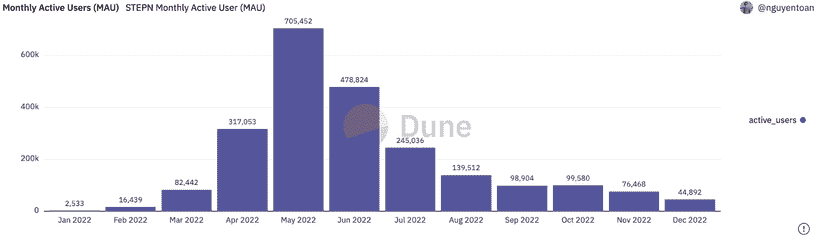

Source: [Dune Analytics](https://web.archive.org/web/20230130224653/https://dune.com/nguyentoan/STEPN-(GMT-GST)-Core-Metrics) 

尽管如此，STEPN 并没有受到 11 月 FTX 崩溃的影响，甚至推出了一项名为“环游世界:运动鞋增强特别活动”的特别应用内活动，以配合 2022 年卡塔尔世界杯，作为“与世界各地的用户庆祝”的一种方式

除了 STEPN，一些 dapps 正在攀登 M2E 的行列。

OliveX 在 2022 年初推出的音频冒险游戏 Dustland Runner 取得了巨大的成功。该游戏利用移动和拥有(MnO)的概念和自己的令牌 DOSE 来支撑其经济，并受到玩家的欢迎。游戏开发者声明他们首先关注游戏、故事和传说，并且很高兴被证明是正确的。2022 年 11 月，Dustland Runner 推出了其制作系统，这是一个重要的里程碑，受到了游戏每月 20，000 名活跃用户的高度期待

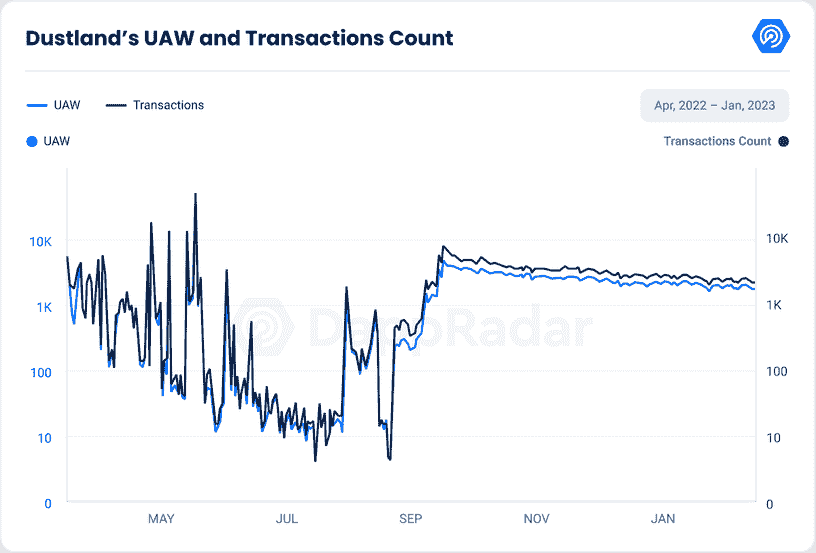

因此，Dustland Runner 一直被评为多边形链上的顶级 MnO 游戏之一，DOSE 也于 11 月加入。Dustland Runner 在 2022 年平均拥有 1788 个每日唯一活跃钱包和 702279 笔交易。

另一个脱颖而出的移动赚钱 dapp 是[gene pets](https://web.archive.org/web/20230130224653/https://dappradar.com/binance-smart-chain/games/genopets)，这是一个结合了遗传学、进化和看护元素的虚拟宠物游戏。玩家可以通过结合各种遗传基因来创造自己独特的宠物，给它一个名字，然后随着它的成长和进化来照顾它。玩家甚至可以饲养自己的宠物，创造独特和定制的生物，可以与朋友分享。

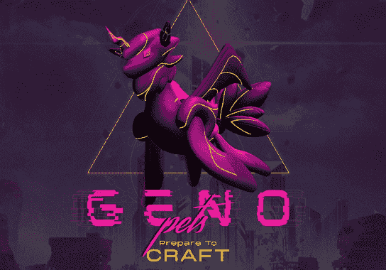

Source: [Genopets](https://web.archive.org/web/20230130224653/https://www.genopets.me/)

Genopets 鼓励玩家探索他们的创造力，并参与令人兴奋的生物创造世界。总的来说，Genopets 已经产生了超过 130，000 SOL 的量，并推出了 Genopets 栖息地，加强了该生态系统的元宇宙概念。

最后， [Step App](https://web.archive.org/web/20230130224653/https://dappradar.com/multichain/social/step) ，一个移动赚钱的 dapp，在 2022 年取得了成功。该应用于 2022 年初进入第一阶段开发，在 8 个月内，它发展到拥有超过 2000 万支持者、爱好者和用户。

该应用程序的正式发布仪式于 12 月 1 日在日本东京举行，全球大使尤塞恩·博尔特(Usain Bolt)和日本职业棒球运动员田口和人(Kazuto Taguchi)等行业领袖分享了他们对移动赚钱行业和健身应用程序未来的见解。

Step App 将自己定位为“一体化”应用程序，在移动赚钱行业中独树一帜，它拥有用户在应用程序中开始健身之旅所需的一切，而无需在不同的网站、应用程序和钱包中导航。这降低了新用户的准入门槛，并推动了大规模采用。

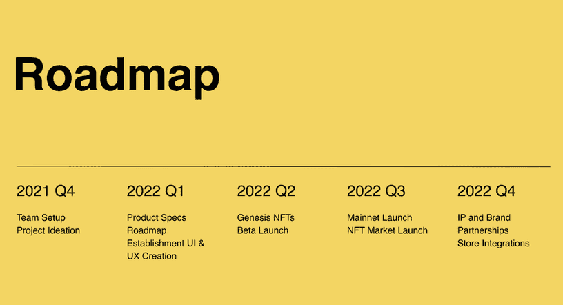

Source: [Step App](https://web.archive.org/web/20230130224653/https://step.app/vision)

此外，Step App 正在建立一个强大的生态系统，使 Web3 和区块链技术可以在全球范围内使用。该应用程序是 Step 生态系统的门户，该生态系统包括一系列产品。Step App 是第一款建立在 Step Network 上的应用，由 FITFI 提供支持，是一款面向大众采用的区块链。Step Network 提供低成本、快如闪电的地理定位技术、NFT 造币、交易功能等，开发人员、团队或在网络上开发的全球品牌可以立即部署这些功能。

Step Launch 上推出的第一个项目 PRIMAL 在不到 30 分钟的时间里达到了 50 万美元的筹集上限。Step App 还发布了他们的分散式交易所 Step Ex，用户可以在这里购买他们的令牌和其他令牌，这些令牌可以在 Step 网络上通过他们的 launchpad 下载。

总的来说，移动挣钱行业向我们展示了各种有趣的创新应用。尽管面临挑战，如缺乏数字素养和技能，网络覆盖，安全和数据隐私问题，该行业已显示出巨大的潜力。移动赚取概念已经被用户很好地接受，并且在最近几年有了显著的增长。随着该领域的新技术和进步，移动赚取范式有很大的进一步创新和增长空间。

## 6.风险投资公司向区块链的游戏和元宇宙项目投入了 76 亿美元

区块链游戏正成为越来越受欢迎的投资领域，近年来该领域筹集的总资本呈指数增长。2019 年筹集的资本总额为 2770 万美元，2020 年增加到 1.91 亿美元。第二年，区块链博彩业的总投资额达到 37 亿美元。2022 年，筹集的总资本达到了惊人的 76 亿美元，这清楚地表明了对该空间的兴趣和信心正在增长。

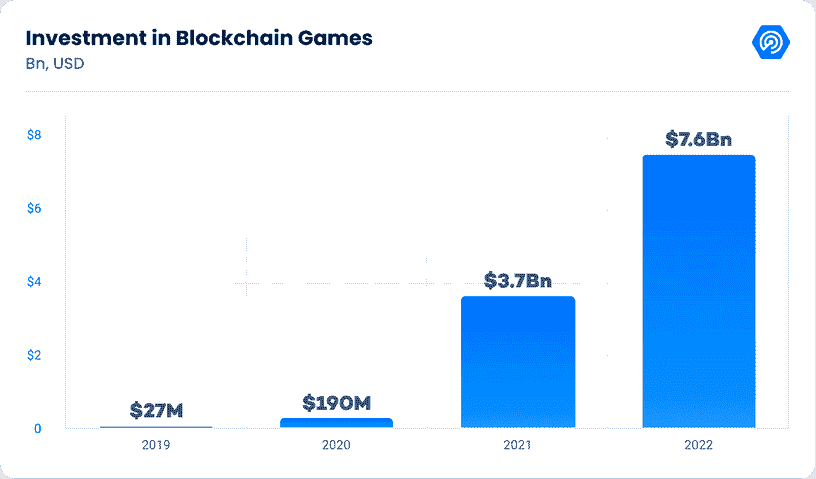

这一趋势反映在 2022 年对区块链博彩的重大投资上，其中有三项尤为突出。第一个是 5 月 5 日由 Flow 宣布的 7.25 亿美元的生态系统基金，这是一个为下一代游戏、应用和数字资产提供支持的 Web3 平台，包括 NBA Top Shot 和 NFL All Day。生态系统基金旨在通过投资、流量令牌赠款和实物支持，为现有和未来的开发者提供在流量区块链上构建应用的支持。

第二笔重大投资是 6 月 17 日由澳大利亚 web3 游戏公司 Immutable 发起的 5 亿美元开发商和风险投资基金。这笔资金将用于资助在以以太坊为中心的第二层平台 Immutable X 上建立 web3 游戏和以 NFT 为中心的公司的项目

第三笔重大投资是宇迦实验室和 Polygon 之间的合作，两家公司都筹集了 4.5 亿美元的资金。宇迦实验室于 3 月 22 日结束了其系列种子资金轮，计划使用这些资金来扩大其快速增长的团队，并吸引创意，工程和运营职能部门的最佳人才。另一方面，Polygon 在 2 月 7 日的新一轮风险融资中筹集了 4.5 亿美元，红杉资本印度公司、Tiger Global、软银、银河数码和其他投资者参与了融资。据追踪加密领域风险投资的网站 Web3 Signals 称，这是许多投资者首次押注以太坊扩展解决方案，或者更广泛地押注区块链基础设施领域。

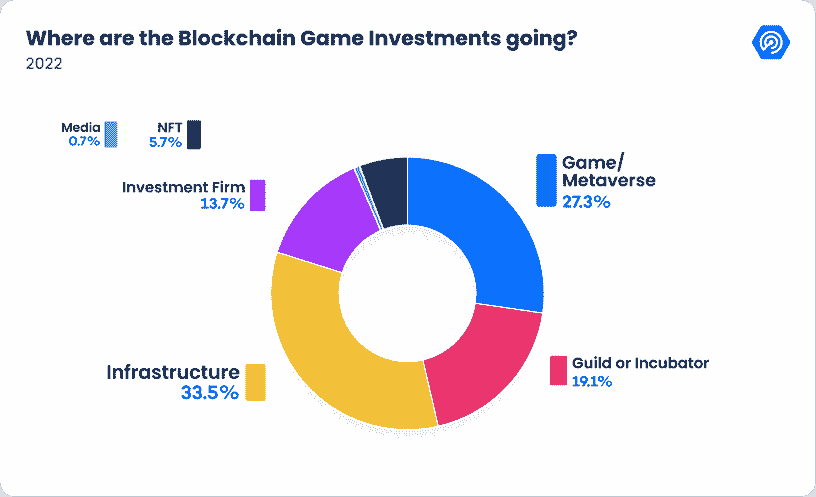

在 2022 年流入区块链博彩领域的 76 亿美元中，区块链博彩基础设施占总投资的 33.5%。个人游戏项目或元宇宙世界获得了 27.3%，而公会和孵化器项目获得了 19.1%。

对基础设施项目的大力投资突显出，该行业将建立一个强大的基础。区块链游戏将需要通过用户友好的体验搭载数百万玩家。当然，游戏玩家会想要高质量的游戏，而不是他们已经在 PC、PlayStation 或手机上玩的游戏的低级版本。

总而言之，这些重大投资表明，区块链博彩业正成为越来越受欢迎的投资领域，该行业正显示出强劲的增长迹象。随着风险投资和区块链行业的主要参与者投资区块链游戏，很明显，该行业未来的增长潜力很大。

## 7.Animoca Brands 如何建立 Web3 元宇宙

总部位于香港的游戏和区块链公司 Animoca Brands 最近的筹资活动在业内掀起了波澜。仅在 2022 年，该公司就筹集了高达 5.9 亿美元的资金，其中最大的一笔投资是在当年 1 月由自由城风险投资公司(Liberty City Ventures)牵头的一轮融资中获得的 3.6 亿美元。

这一令人印象深刻的壮举证明了人们对区块链博彩业日益增长的兴趣，以及该公司利用这一点的能力。2022 年，Animoca Brands 参与了元宇宙和区块链游戏项目的 36 轮投资，进一步巩固了其作为行业领导者的地位。

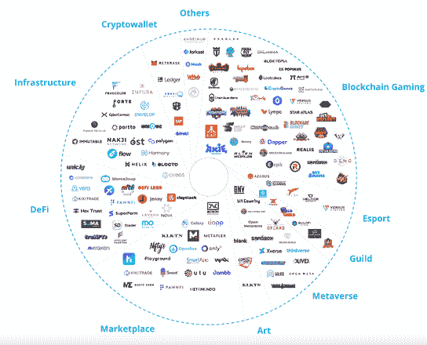

Source: [Animocabrands.com](https://web.archive.org/web/20230130224653/https://www.animocabrands.com/founders-letter-annus-mirabilis-for-animoca-brands-and-the-open-metaverse)

推动 Animoca Brands 成功的关键因素之一是其董事长兼联合创始人 Yat Siu 的愿景。Siu 一直直言不讳地表示，他相信 Web3 或元宇宙的发展取决于用户能够真正拥有数字产品。这一理念反映在该公司专注于创造分散的游戏体验和基于 NFT 的数字收藏品，这使玩家能够真正拥有和控制他们的虚拟资产。

随着区块链博彩业的不断发展，Animoca Brands 已经做好了充分准备来利用这个不断增长的市场。凭借其强大的愿景、令人印象深刻的筹资努力以及对元宇宙和区块链游戏项目的广泛参与，该公司有望成为行业巨头。

### 采访 Animoca Brands 首席执行官 Robby Young

区块链博彩与传统博彩的区别是什么？与传统游戏相比，区块链游戏的优势是什么？

关键的区别在于所有权。在令牌化游戏中，玩家拥有真正的数字所有权，这改变了开发者的商业模式和玩家的价值主张。这改变了玩家参与产品的方式。

**可扩展性一直是区块链技术的主要问题。随着用户数量的增加，区块链游戏能在不牺牲其他功能的情况下扩大规模吗？**

是的，我相信他们可以。聪明人总会找到解决这些挑战的办法，就像我们知道如何让 AAA 游戏在手机上变得有趣，以及我们知道如何降低以太坊(第二层)的油价一样。

用户经常抱怨区块链游戏缺乏多样性和逼真的画面。要使区块链奥运会达到 AAA 级的标准，需要做些什么？

这是一个简单的时间问题。区块链的游戏很少，所以选择有限。我没有官方数据，但如果区块链游戏的数量每个季度都翻一番，我不会感到惊讶。

你认为区块链博彩会带来下一波应用浪潮吗？

如果采用区块链是真的，那么是的，它将由游戏带来。

## 8.Web2 游戏公司转向 web 3:2023 年游戏的未来

随着行业的不断发展和区块链技术变得更加主流，Web2 游戏公司开始在 2022 年转向 web3。传统游戏公司正在认识到区块链游戏的潜力及其带来的机遇，并开始探索将这些新技术整合到现有生态系统中的方法。

然而，并不是所有的公司都接受向 web3 的转变。《《我的世界》》的创作者 Mojang Studios 禁止在他们的游戏中集成任何不可替换的令牌(NFT)。由 Valve 开发的流行游戏平台 Steam 也从他们的平台上删除了所有与区块链相关的游戏。这些公司似乎更喜欢坚持游戏生态系统的现状。

另一方面，一些电子竞技团队、游戏发行商，甚至流行的游戏硬件品牌都已经接受了区块链游戏技术，或者至少正在饶有兴趣地关注 Web3 中的 GameFi 未来会如何发展。

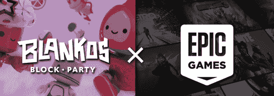

Source: [NFTinsider.com](https://web.archive.org/web/20230130224653/https://nftinsider.io/blankos-block-party-is-now-available-on-the-epic-games-store/)

Epic Games Store 通常被视为 Steam 的竞争对手，但它对区块链游戏采取了不同的立场。该公司与 Blankos Block Party 有合作关系，这是一款开放世界的多人 NFT 游戏，最近在 Epic games 商店推出。他们还对 Gala Games 目前正在开发的《皇家牛仔之战》游戏表现出兴趣。

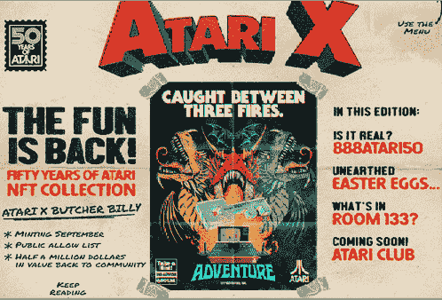

Source: [Atari.com](https://web.archive.org/web/20230130224653/https://atari.com/blogs/newsroom/atari%C2%AE-reveals-50-years-of-atari-nft-collaboration-with-artist-butcher-billy)

领先的街机游戏公司 Atari 最近通过其新的 Web3 游戏平台 AtariX 将其悠久的游戏遗产引入了沙盒元宇宙。该游戏公司还推出了 NFT 系列，其中包括几项额外福利，包括 100 美元的不可阻挡的域名和实体印刷信用。雅达利表示，它坚信区块链技术将有助于未来游戏的开发。

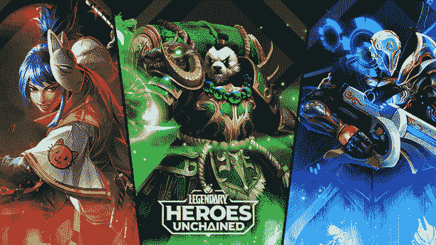

Source: [Legendary Heroes Unchained](https://web.archive.org/web/20230130224653/https://www.legendaryheroesunchained.com/home)

轰动一时的移动 RPG《传奇:英雄游戏》的创作者 N3twork Studios 透露，它正在区块链开发一款名为《传奇:被解放的英雄》的自玩 RPG 游戏。这款游戏以 NFTs 为特色，允许游戏玩家收集英雄与神怪对战，从事 PvP，加入史诗级 GvG 赛事。

Source: [about.fb.com](https://web.archive.org/web/20230130224653/https://about.fb.com/news/2022/08/launching-horizon-worlds-in-more-countries-in-europe/)

脸书去年更名为 Meta，作为成为 Web3 运动主要参与者计划的一部分。这一战略举措随后推出了 Horizon World，这是一款虚拟现实(VR)应用，用户可以通过该公司的 Meta Quest 耳机进行体验。

Fnatic、Navi、Team Liquid 等电子竞技团队在 Web2 游戏领域家喻户晓，现在这些品牌也与 Web3 游戏守护者协会合作。每个团队都成为守护者生态系统公会中的可玩角色。

尽管区块链游戏颠覆了传统游戏发行商的商业模式，但随着 Web3 GameFi 趋势的持续增长，许多人不想落后。《龙珠》、《怪物牧场主》和《数码宝贝》等游戏的开发商 Bandai Namco 宣布将投资 1.3 亿美元建造自己的元宇宙。《最终幻想》和《王国之心》系列游戏的创造者 Square Enix 宣布，其 NFT 交易卡将于 2023 年推出。

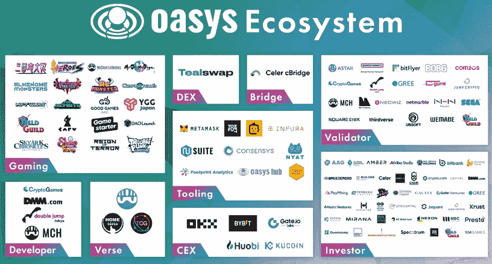

Source: [Twitter](https://web.archive.org/web/20230130224653/https://twitter.com/oasys_games/status/1602125508262899712?ref_src=twsrc%5Etfw%7Ctwcamp%5Etweetembed%7Ctwterm%5E1602125508262899712%7Ctwgr%5E4ee3982b12fa6639ab3b1fb5ec308e8e497e6f27%7Ctwcon%5Es1_&ref_url=https%3A%2F%2Fconseilscrypto.com%2Fblockchain-oasys-a-lance-mainnet%2F)

此外，在今年晚些时候公开发布之前，Square Enix 已经成为游戏区块链 Oasys 的最终初始验证程序。其他著名的初始节点验证器包括 SEGA、Bandai Namco、育碧、Yield Guild Games、WeMade、NEOWIZ、Netmarble 和 Com2Us。

随着游戏行业的不断发展，很明显，web3 和区块链技术将在塑造游戏的未来方面发挥重要作用。愿意接受这些新技术并适应不断变化的环境的公司将会在这个激动人心且快速发展的行业中取得成功。

## 9.结论

总之，区块链博彩业在 2022 年将会有显著的增长和发展。像 Animoca Brands 这样的公司已经成为该行业的巨头，已经筹集了 5.9 亿美元的资金，并参与了元宇宙和区块链游戏项目的 36 轮投资。

其他公司也接受了区块链游戏技术，Epic Games Store 与 Blankos Block Party 合作，并对 Gala Games 的 project Grit 表现出兴趣。与此同时，一些游戏工作室，如 Mojang Studios 和 Steam，则更加谨慎，禁止在他们的游戏中加入任何 NFT 元素，或者从他们的平台上删除所有与区块链相关的游戏。

然而，值得注意的是，区块链博彩业仍处于起步阶段，要完全成熟并充分发挥其潜力还需要时间。这是一个新兴的、快速发展的行业，仍在试图找到自己的立足点并站稳脚跟。

尽管如此，重要的是要记住这个行业正在迅速发展和变化，所以保持消息灵通和适应新的发展是很重要的。DappRadar 将通过我们的 [BGA 游戏报道继续每月报道区块链游戏领域的最新趋势。](https://web.archive.org/web/20230130224653/https://dappradar.com/blog/category/bga-game-reports)总而言之，区块链博彩业仍有很大的发展空间，我们很期待看到未来的发展。

**免责声明**

DappRadar 跟踪随着时间的推移，与去中心化应用程序的智能合约交互的唯一活动钱包(UAW)的数量。这也称为“链上”或“区块链”活动。然而，多个 dapps 不需要执行区块链事务来执行某些动作。

区块链生态系统之外的活动被称为“链外”或“Web 2.0”活动。传统上用日活跃用户数(dau)来衡量链外活跃度。离线活动的一个例子是用户访问沙盒或分散的虚拟世界，或者用户在区块链上玩 Axie Infinity 而不要求奖励。