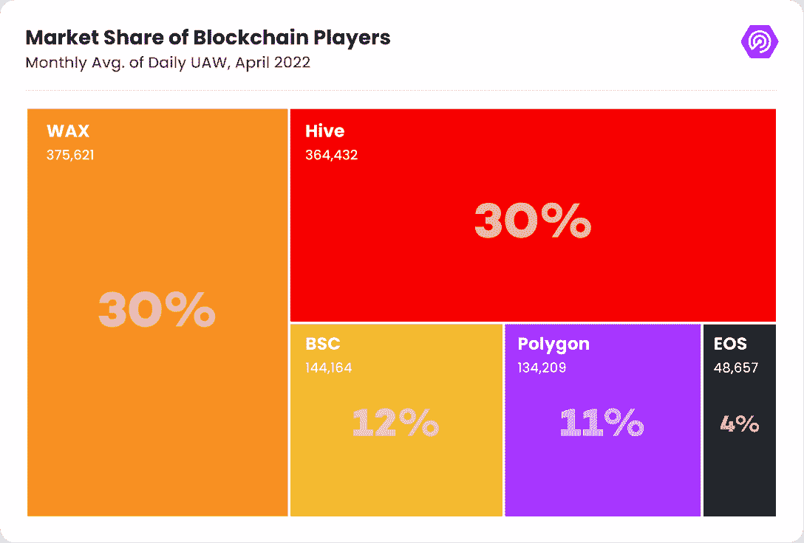
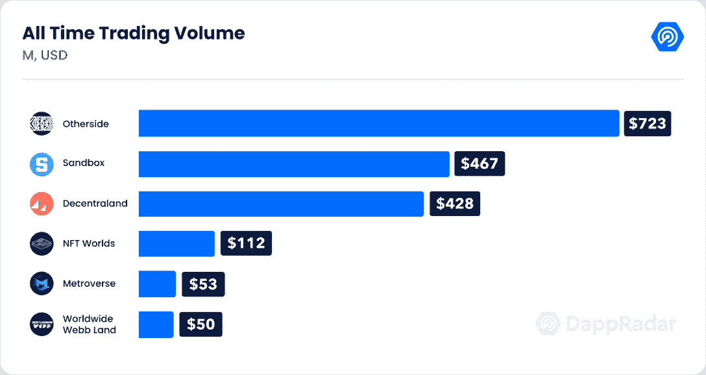
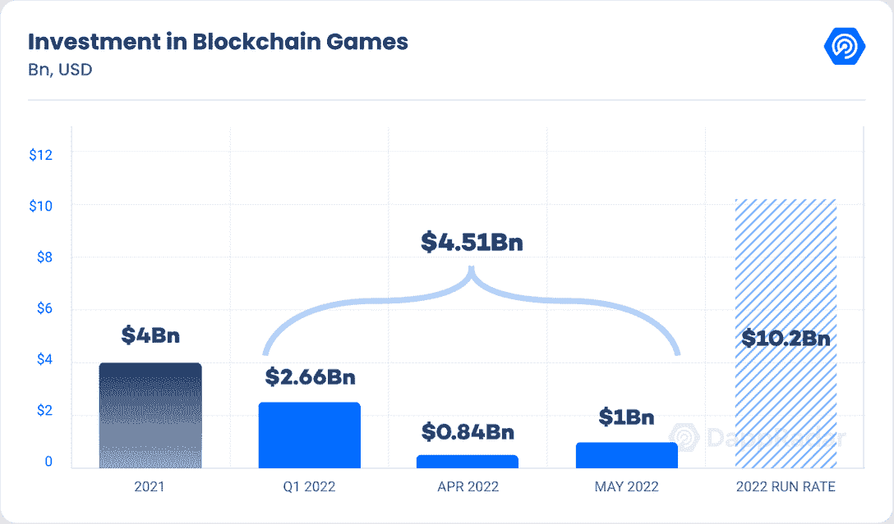
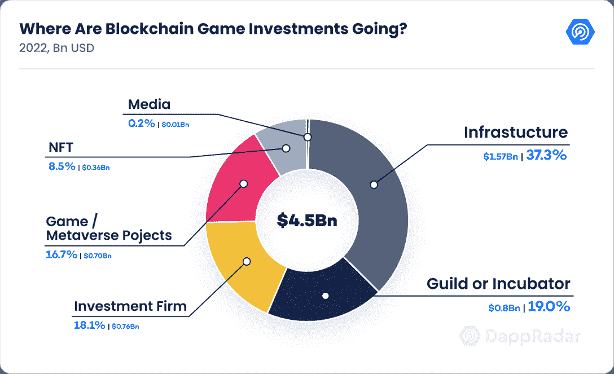

# DappRadar x BGA 游戏报告# 4——尽管市场崩溃，区块链游戏仍在继续增长

> 原文：<https://web.archive.org/web/https://dappradar.com/blog/dappradar-x-bga-games-report-4-blockchain-games-continue-to-ascend-despite-collapsing-markets>

## 《碎片之地》仍然领先，因为《另一边》宣称占据了虚拟世界的宝座

在最近的行业动荡和不利的宏观经济形势下，加密市场正在经历最具挑战性的时期之一。尽管复杂的情况下，即使是著名的替代硬币也损失了 90%的价值，但游戏类别一直是暴风雨时期的一个亮点。

游戏 dapps 的活跃度创下历史新高，4 月份平均每天有超过 123 万个独立活动钱包(UAW)与区块链游戏互动。该指标显示，尽管加密市场情绪消极，但环比增长 1%，自 2021 年 4 月以来增长了 4，125%。

在四月结束时，夹板地、[外星世界](https://web.archive.org/web/20221013052052/https://dappradar.com/multichain/games/alien-worlds)和[农民世界](https://web.archive.org/web/20221013052052/https://dappradar.com/wax/games/farmers-world)都成为了最受欢迎的游戏，每天都有超过 10 万的 UAW。此外，随着该空间今年融资超过 45 亿美元，超过 2021 年的融资额，投资不断堆积。与此同时，作为一种新的 Web3 范式，移动赚取的兴起为日常活动添加了游戏化元素。

## 关键要点

*   尽管市场趋势不佳，区块链游戏公司仍然表现良好；4 月，UAW 与区块链游戏的日活跃人数达到 123 万，创下历史新高。
*   Splinterlands 仍然是领先的区块链游戏，4 月份平均每天有 35 万 UAW。
*   Otherside 以 7 . 23 亿美元的销售额成为迄今为止交易量最大的虚拟世界项目；宇迦实验室元宇宙项目在短短两周内就超过了分散土地和沙盒的历史交易量。
*   投资不断涌入这个领域；2022 年区块链奥运会和基础设施项目筹集了 45 亿美元，超过了去年的 41 亿美元。
*   移动赚钱 dapps 的受欢迎程度正在上升；自 3 月底以来，商品及服务税(STEPN 的公用事业令牌)唯一持有者的数量增长了 350%。

## 内容

*   [splitter lands 创下 200 天游戏排名第一的记录](https://web.archive.org/web/20221013052052/https://dappradar.com/blog/dappradar-x-bga-games-report-4-blockchain-games-continue-to-ascend-despite-collapsing-markets/#Splinterlands)
*   [蜡像驱动了 30%的区块链游戏活动](https://web.archive.org/web/20221013052052/https://dappradar.com/blog/dappradar-x-bga-games-report-4-blockchain-games-continue-to-ascend-despite-collapsing-markets/#Wax)
*   [他方改变了虚拟世界的现状](https://web.archive.org/web/20221013052052/https://dappradar.com/blog/dappradar-x-bga-games-report-4-blockchain-games-continue-to-ascend-despite-collapsing-markets/#Otherside)
*   今年区块链奥运会项目筹集了 45 亿美元
*   [移动挣钱的兴起](https://web.archive.org/web/20221013052052/https://dappradar.com/blog/dappradar-x-bga-games-report-4-blockchain-games-continue-to-ascend-despite-collapsing-markets/#rise)
*   [Polygon 作为游戏网络成立，每天有超过 100，000 名区块链玩家](https://web.archive.org/web/20221013052052/https://dappradar.com/blog/dappradar-x-bga-games-report-4-blockchain-games-continue-to-ascend-despite-collapsing-markets/#Polygon)
*   [Sky Mavis 开始复苏之路](https://web.archive.org/web/20221013052052/https://dappradar.com/blog/dappradar-x-bga-games-report-4-blockchain-games-continue-to-ascend-despite-collapsing-markets/#Sky)
*   不可改变的 X 会迎来突破之年吗？
*   [关闭和前方道路](https://web.archive.org/web/20221013052052/https://dappradar.com/blog/dappradar-x-bga-games-report-4-blockchain-games-continue-to-ascend-despite-collapsing-markets/#road)

## Splinterlands 创下了 200 天游戏排名第一的记录

在区块链蜂巢上运行的交易卡牌游戏(Splinterlands 已经连续 7 个月在 DappRadar 的游戏排名中领先。在 2021 年 3 月推出后，夹板地已经成为最受欢迎的区块链游戏，每日 UAW 超过 350，000。这比下一款游戏《外星世界》每天多了 15 万 UAW。

尽管目前市场崩溃，但夹板岛依然坚挺。该项目的治理标志 SPS 在撰写时的交易价格为 0.07 美元，比 10 月份的 0.90 美元下跌了 92%。尽管如此，链上指标显示，游戏的需求正在变得强劲。自 2 月份以来，每天与该游戏互动的 UAW 数量增长了 10%，而该游戏在 4 月份创造了近 7500 万笔交易。

除了积极的活动指标之外，Splinterlands 的卡市场一直保持活跃，并受益于蜡的额外交易选项，其中这些 NFT 在 AtomicHub 市场上产生了超过 600 万美元的空前交易量。此外，游戏内市场支持租赁系统，这是区块链游戏最吸引人的地方之一。

在分裂之地，交易卡是 NFT，可以出租给其他玩家，以改善他们的游戏策略，从而最大化他们的收益。这些卡片的市场价值估计为 1 . 5 亿美元。

《分裂之地》已经成为区块链游戏的一个参照对象。TCG 承载了整个生态系统，占 Hive 活动的 97%，只有 Ronin 的 Axie Infinity 和 EOS 的 Upland 可以部分与之相比。此外，Splinterlands 的治理过程将在未来几周内开始。这一阶段将允许 SPS 持有者在战略决策中下注和投票，这些决策将塑造新兴游戏社区的未来。

就博彩活动而言，世界资产交易所(Wax)是领先的区块链。Wax 在 4 月份见证了超过 375，000 的每日 UAW 与它的任何游戏 dapps 互动，推动了 30%的区块链游戏活动。两个 GameFi dapps 是 Wax 的主要驱动程序——外星人世界和农民世界，这两个游戏每天都吸引超过 100，000 个 UAW，为碳中和的利害关系证明(PoS)区块链提供了坚实而成熟的玩家基础。

## 蜡驱动了 30%的区块链游戏活动

太空采矿游戏 dapp 以其原生的延龄草(TLM)奖励用户，它领导着 Wax 游戏生态系统。上个月,《外星世界》吸引了 19.2 万的每日 UAW，仅次于《碎片之地》。从长远来看,《异形世界》的发展引人注目。该游戏的日活跃量比今年 3 月增长了 2%，比 2021 年 3 月增长了惊人的 1，370%。

然而，2022 年最热门的蜡像游戏是《农民世界》。除了《异形世界》和《碎片之地》，Wax 的《农民世界》是 4 月份唯一一款日 UAW 超过 10 万的游戏 dapp。

农民世界是一个农业 dapp，玩家在那里收获资源以提高他们的游戏技能或在兼容的市场上出售。GameFi dapp 在 4 月份平均吸引了 112，000 个每日 UAW，较上月增长 12%，自 2021 年底以来，每日 UAW 量几乎翻了一番。自四月中旬以来,《农民世界》的日常活动速度超过了《外星世界》。在 NFT 指标方面，Farmers World 也公布了正数，因为该游戏的 NFT 产生了超过 2500 万美元的交易，以补充 2022 年期间区块链活动的增加。

总而言之，Wax 拥有业内顶级的区块链游戏生态系统。事实证明，区块链能够处理高达 8,000 tps 的游戏，是原子市场中最受欢迎的市场之一。事实上，Atomic Market 是 4 月份交易量排名第九的市场，在 175 万笔交易中处理了近 1400 万美元。值得注意的是，在这条链上运行的一款名为 Blockchain Brawlers 的游戏，占据了该市场每月交易量的 45%。

## 另一边改变了虚拟世界的现状

宇迦实验室是广受欢迎的 NFT 收集无聊猿游艇俱乐部(BAYC)背后的团队，随着其虚拟土地其他事迹的下降，再次在加密市场引起轰动。对令人垂涎的虚拟地块的高需求使以太坊网络拥堵了几个小时，导致在铸造过程中超过 2.5 ETH 的额外汽油费，并留下了价值 450 万美元的 14，000 笔失败交易，该团队在上周偿还了这些交易。

尽管有争议的下降，Otherside 已经改变了虚拟世界的现状，分散土地和沙盒是领先的。在铸造后不到两周的时间里，Otherside 已经产生了超过 7 亿美元的交易量，超过了分散的土地(5.08 亿美元)和沙盒(4.67 亿美元)的历史销售额。同样，ApeCoin (APE)是 BAYC 生态系统的原生代币，已经超过了元宇宙代币，如 SAND、MANA 和 AXS，成为市值最大的元宇宙代币。

“彼岸”的到来预示着虚拟世界排名的彻底改变。4 月份，虚拟土地 NFTs 的交易量估计为 6，000 万美元，比 3 月份下降了 33%。《沙盒世界》和《NFT 世界》中的土地成交额最高，分别为 1400 万美元和 1200 万美元。分散之地和以太坊虚拟世界游戏赚钱 dapp metro verse 都超过了 500 万美元。Otherside 在二级市场活动的最初几个小时内产生了超过 150，000 ETH(4.2 亿美元)的交易，远远超过了整个虚拟房地产市场。

宇迦实验室希望在游戏赚钱领域复制其在 NFT 的成功。尽管像“分散土地”、“沙盒”和“金恩”这样的项目已经开发了多年，并签署了有趣的合作伙伴关系，但“另一边”将改变整个虚拟世界市场。这个虚拟世界的目标是成为一个雄心勃勃的可互操作的游戏赚取元宇宙平台，由 APE 推动，由 Animoca Brands 支持，Animoca Brands 是一家领先的 Web3 风险投资公司，拥有丰富的游戏专业知识，去年 2 月在宇迦投资了 4.5 亿美元。此外，值得注意的是，宇迦将从 Otherside NFT 交易中收取 10%的版税，而不是与 BAYC 和 child collections 相关的 5%，这给了宇迦更多的资本来投资他们的虚拟世界项目。总体而言，宇迦实验室及其 BAYC 生态系统在通往元宇宙的道路上处于有利位置。

## 今年区块链奥运会项目筹集了 45 亿美元

谈到投资，区块链奥运会和基础设施项目筹集的资金数额已经超过了 2021 年的筹集总额。在不到五个月的时间里，风投和其他类型的投资者已经投入了创纪录的 45 亿美元，已经超过了去年筹集的 41 亿美元。考虑到币安实验室和 Animoca Brands 为弥补 Ronin 的过桥损失而投资的 1.5 亿美元，该金额将达到 46.5 亿美元。然而，公式中不考虑该操作，因为资金不会用于增强游戏生态系统，而是用于帮助减轻财务损失。

值得注意的是，筹集的资金中有 37%投资于基础设施类项目，如领先的以太坊第二层解决方案 Immutable X (IMX)或 Dapper Labs 本周宣布的最近对区块链流的 7 . 25 亿美元投资。

在以前的报告中，人们已经注意到风险资本家对这个领域越来越感兴趣。按照这种速度，今年的投资可能会超过 100 亿美元，给元宇宙和游戏项目一笔理想的资金，以继续增强他们的产品，建设行业的未来。尽管加密领域的悲观前景可能会在短期内降低投资兴趣。

## 移动挣钱的兴起

在过去的几周里，dapp 行业最引人注目的趋势之一是移动赚取作为区块链游戏范式的兴起。移动以赚取 dapps 允许用户在完成特定级别的日常身体活动后在 crypto 中赚取奖励。移动赚钱 dapps 中的游戏化元素是日常活动和通过加密将其货币化之间的桥梁。这个概念是去年夏天由 Genopets 首次提出的。然而，STEPN，一个索拉纳的 dapp，吸引了大部分的头条新闻。

STEPN 将自己定义为一个具有 GameFi 元素的生活方式 dapp，允许用户通过散步、慢跑或跑步来赚取 GST(绿色 Satoshi 令牌)。商品及服务税的供应是无限的，尽管 dapp 的象征经济学设计得很好(大量的燃烧机制)以确保项目的长期可持续性。为了参加比赛并赢得商品及服务税，跑步者必须获得一双 NFT 运动鞋，以启用游戏化元素，通过移动应用程序中的 GPS 跟踪身体活动。商品及服务税可以交换或用来升级 NFT 运动鞋。

在撰写本文时，有超过 380，000 个商品及服务税唯一持有人，比 3 月底增加了 350%,显示了该项目的快速增长。此外，STEPN 运动鞋已经积累了超过 38，300 索尔或 350 万美元的终身交易，并将很快可供出租，增加了另一个货币化层。

Source: [Solscan](https://web.archive.org/web/20221013052052/https://solscan.io/token/AFbX8oGjGpmVFywbVouvhQSRmiW2aR1mohfahi4Y2AdB#analysis)

STEPN 只是众多冒险进入日益兴起的移动挣钱运动的 dapps 之一。Fitfi、Genopets、Dustland、Dotmoovs、Olive X 和其他一些 dapps 也在引领这一趋势。尽管 Stepn 目前是领先的移动收入 dapp，但它仍然是整个区块链游戏行业最陡峭的入门级壁垒之一(以 SOL 的当前价格计算，一双 NFT 运动鞋约为 780 美元)。

## Polygon 是一个游戏网络，每天有超过 100，000 名区块链玩家

Polygon 培育了业内正在崛起的区块链游戏生态系统之一。以太坊侧链只是四个区块链之一，四月份的日游戏 UAW 超过 10 万。事实上，Polygon 游戏 dapps 上个月吸引了 134，000 个每日 UAW，比 3 月份少 23%，但仍比 2 月份高 30%。

Polygon 的优势依赖于多样化的游戏产品，在 4 月份，五款基于 Polygon 的游戏进入了区块链最受欢迎游戏的前 20 名。Pegaxy 是一家以赛马和育种赚钱的游戏 dapp，以超过 30，000 的每日 UAW 领先于 Polygon 的最常玩游戏，比 3 月份增加了 25%。该游戏通过允许玩家通过游戏赚取代币，使用代币来增强他们的 Pegas NFTs，或用它们交换另一个代币，清楚地展示了“玩到赚”的表现，但最重要的是，Pegaxy 的市场允许玩家出租他们的 Pegas，从而创造了一个自今年 1 月推出以来显示出自我可持续潜力的经济。

除了 Pegaxy 之外，Polygon 还有一个深度和多样化的游戏生态系统。现已解散的 GameFi dapp Sunflower Farmers 的第二个版本《向日葵土地》在 4 月份吸引了超过 15 万的 UAW 和 2.7 万的每日 UAW，消除了对游戏最初发布的所有担忧。向日葵地[在遭受了迫使开发者关闭游戏的漏洞两个月后成功推出了测试版](https://web.archive.org/web/20221013052052/https://dappradar.com/blog/sunflower-land-finds-tremendous-success-after-relaunch)。

Aavegotchi 是另一款近几周用户增长明显的多边形游戏。在 3 月 31 日推出这个元宇宙平台后，Aavegotchi 的虚拟世界 Gotchiverse 内部的活动每月激增 1900%。像素化的 ghost GameFi dapp 在 4 月份吸引了超过 70，000 名 UAW，因为该游戏引入了新的游戏机制和一套新的虚拟世界资源。这些资源将允许玩家提高他们在游戏中的物品和技能，并装饰和定制 Gotchiverse 中的土地。

另一方面，塔防游戏赚取 dapp 疯狂防御英雄遭受了重大的 71%的区块链活动崩溃。4 月份，CDH 平均每天吸引近 4 万名 UAW，而 3 月份的注册人数为 13.5 万。CDH 4 月份的在线活动回到了 1 月份的水平，当时游戏 dapp 吸引了 4.1 万的每日 UAW。Animoca Brands 的 Tower Experiment 能否恢复 2 月和 3 月的增长水平仍有待观察，尽管自 2021 年 11 月以来，TOWER token 的价值损失了 92%，但参与度仍发出了积极的信号。

多边形已经成为区块链奥运会和元宇宙舞台上最重要的演员之一。除了蓬勃发展的游戏生态系统，Polygon 刚刚宣布了与 Meta 的合作，可能是为了他们的 Instagram NFT 集成。

## Sky Mavis 开始复苏之路

对于曾经领先的游戏 dapp 来说，过去几周都是关于复苏的。3 月 31 日，一名黑客能够利用浪人之桥(Ronin's Bridge)，这是一个支持以太坊和浪人侧链之间跨链资产交易的平台，在以太网和 USDC 窃取了超过 6 亿美元，使其成为历史上最大的加密攻击之一。

在 Sky Mavis 宣布对游戏收入比率进行经济调整以帮助 SLP 的长期可持续发展之后，Axie 的区块链活动已经在下降。不过，Axie 的连锁活动较 3 月份下降了 16%，自今年年初以来下降了 67%。在写作时，Axie 是第 15 个最受欢迎的游戏，每天有超过 18，000 个 UAW。

尽管 Sky Mavis 经历了更光明的时期，但复苏之路已经开始。为了弥补大桥袭击的损失，币安实验室、Animoca Brands 和其他投资者筹集了 1.5 亿美元。此外，Sky Mavis 宣布了一项 100 万美元的 bug 赏金计划，以帮助增强其生态系统的安全性。

至于 Axie Infinity，这款游戏已经有了相关的里程碑。[最后一个“经典”赛季目前正在进行](https://web.archive.org/web/20221013052052/https://dappradar.com/blog/the-end-of-an-era-for-axie-infinity-season-21-is-live/)，为下一代阿邪战:起源做铺垫。Origin 将带来新的游戏机制和新的收入比率，旨在加强生态系统的长期可持续性。此外，[团队透露了他们在 Lunacia 的土地标桩](https://web.archive.org/web/20221013052052/https://axie.substack.com/p/axie-land-staking?s=r)方面的进展，这是 Axie 生态系统的一个重要特征，旨在改善项目的长期前景，首先是在短期内增加 AXS 的所有权。

## 不可变 X 今年会突围吗？

另一方面的下降再次向我们展示了对规模和成本最优解决方案的需求，当谈到区块链游戏时，这种情况甚至更为重要。这些扩展解决方案之一是 IMX，这是一个以太坊 L2 网络，允许用户进行基本无燃气交易，同时仍然继承以太坊安全基础设施。

今年，在 IMX 的活动显著增加。在 Q1 2022 期间，IMX 产生的交易比 2021 年全年多 109%。像 [Gods Unchained 这样的游戏在区块链的活动有所增加](https://web.archive.org/web/20221013052052/https://dappradar.com/blog/gods-unchained-mortal-judgement-launch-pushed-trading-activity),随着《凡人审判卡》资料片的发布，这款游戏今年的平均日 UAW 超过了 1000。在过去的 30 天里，TCG 吸引了近 15000 名 UAW 人。

Source: [Immutable-X](https://web.archive.org/web/20221013052052/https://www.immutable.com/)

除了《被解放的神》, NFT 市场的代币宝藏和“玩到赚”的 dapp 守护者协会也有不错的表现。从 NFT 的角度来看，由 Gary Vee 领导的 Vee Friends 生态系统的 NFT 收藏部分在 4 月份产生了近 800 万美元的交易量。

如前所述，IMX 在 3 月份筹集了 2 亿美元，为团队提供了进一步扩展解决方案和加强基础设施的资金。此外，最受期待的区块链游戏之一 Illuvium 向少数玩家开放了封闭测试版，并将在 6 月举行首次[土地销售，暗示该项目可能会在今年看到曙光。](https://web.archive.org/web/20221013052052/https://www.playtoearn.online/2022/05/03/the-illuvium-zero-land-sale-draws-closer/)

IMX 是另一个很好的扩展解决方案，可能在几年后成为游戏巨头。除了《被解放的神》、《守护者协会》、《书籍游戏》和《伊留威姆》,该网络还将是《余烬之剑》( Ember Sword)的故乡，这是另一款 MMORPG 游戏。

## 关闭和前方道路

加密市场正在经历一个严重的下降趋势，这使得大多数加密令牌的价格降到了历史最低水平。尽管如此，即使在围绕市场的负面情绪中，区块链游戏继续积极表现。4 月份，游戏 dapps 的活跃度达到了历史最高水平，每日 UAW 达到 123 万，而风投和私人投资者的投资达到了 45 亿美元，超过了 2021 年筹集的投资总额。

同样，看到《夹板地》、《异形世界》和《农夫世界》成为最常玩的前三款游戏，并且仍然保留着它们的玩家基础，这是一个积极的因素，这是游戏增长潜力的最重要指标之一。

公平地说，区块链博彩是业内最令人兴奋的类别之一。即将到来的宇迦实验室游戏赚取虚拟世界已经完全改变了 Web3 元宇宙的叙事，而移动赚取 dapps 的兴起可能会带来下一个重要的采用浪潮。当加密货币崩溃时，区块链游戏将继续发展。

 NewsletterUnsubscribe at any time. [T&Cs](https://web.archive.org/web/20221013052052/https://dappradar.com/terms) and [Privacy Policy](https://web.archive.org/web/20221013052052/https://dappradar.com/privacy-policy)