# DappRadar x BGA 游戏报告#6

> 原文：<https://web.archive.org/web/https://dappradar.com/blog/dappradar-x-bga-games-report-6>

## 区块链游戏占行业使用量的近 60%，交易额为 8.57 亿美元。

区块链游戏公司(Blockchain games)顶住了熊市，筹集了 3 亿美元的资金，每天有超过 100 万个独特的活跃钱包。顶级游戏正在蓬勃发展，新的竞争对手正在加入市场。在 DappRadar x BGA Games 报告中获取最新更新。

区块链游戏几乎占行业使用量的 60%，每天有 110 万个独特的活跃钱包和 8.57 亿美元的交易。

虽然行业的大部分注意力都集中在最近的集中金融(CeFi)和分散金融(DeFi)危机上，但区块链奥运会比其他类别的奥运会更好地悄悄度过了熊市。

[Download DappRadar BGA Games Report #6](https://web.archive.org/web/20221210021607/https://drive.google.com/file/d/1wOocXmJ742PYR_PPpu7eMRrIDpF6HP6H/view?usp=sharing)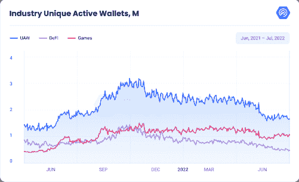

Source: DappRadar

最相关的市场部门经历了行业每日唯一活跃钱包(UAW)的大幅下降，但游戏行业已被证明是最具弹性的。区块链游戏平均每天达到 967，662 UAW，环比(MoM)增长 8%，比上年增长 98%，令人印象深刻。

考虑到让全球经济处于掌控之中的熊市已经恶化，这是相当强劲的表现。区块链游戏在更小、更便宜的网络上蓬勃发展，如 Flow、Hive 和 Solana。

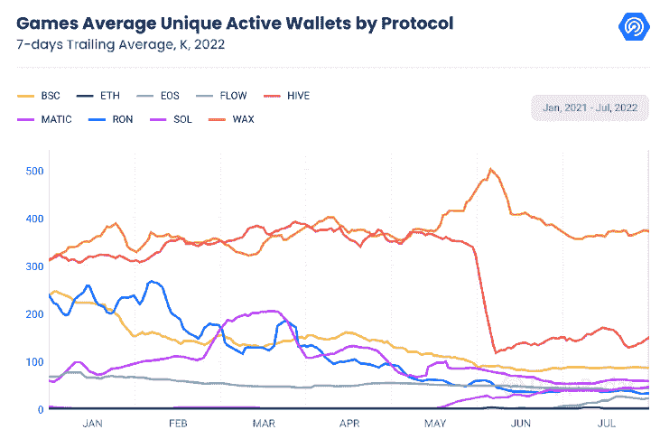

Source: DappRadar

区块链领先的博彩协议 Wax 的日均 UAW 为 362，524，比 6 月份下降了 13%。尽管如此，Wax 仍占游戏活动的 42%。在另一条不同的轨迹上，区块链第二大游戏公司 Hive 的活动量平均达到了 148，414 架无人机，环比增长 8%。

同样，币安智能链上的平均每日 UAW 数量比上个月增加了 2%，超过了 85，000。Solana 继续扩张，月环比增长 38%，而 Flow 本月增长创纪录，增长 921%，日均 UAW 为 17，595。Flow 有机增长的主要驱动力是 Dapper Labs 对 Flow 区块链的大量投资，对基于 Flow 的 NFTs 的支持，Instagram 向 NFTs 的扩展以及他们新的热门游戏 Solitaire Blitz 的推出。

此外，调查主要市场类别的交易量为游戏玩家的持久兴趣提供了更多证据。

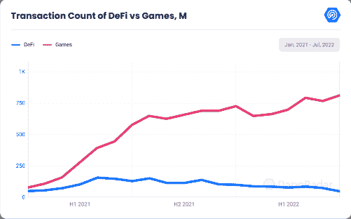

Source: DappRadar

与游戏相关的交易金额远远大于任何其他市场领域，目前总额为 8.07 亿美元，较 6 月份增长 6%，较上年增长 41%。第二大行业是 DeFi，为 5100 万美元，环比下降 33%，同比下降 61%。

这份报告将重点介绍使区块链游戏成为 dapp 市场中最吸引人的领域之一的最重要的最新发展。

## 关键要点

区块链游戏代表了该行业近 60%的使用量，每天有 110 万个独特的活跃钱包和 8.57 亿美元的交易

《我的世界》禁止非功能性交易，非功能性交易世界的交易额增长了 88%，达到近 300 万美元；然而，自 7 月 1 日以来，该系列的平均交易价格下跌了 67%。

由区块链游戏公司和元宇宙项目筹集的投资有所降温，但仍有 3 亿美元的风投资金投入这一领域

本月流量创下历史新高，增长了 921%，日均 UAW 达到 17，595 次，其中 Solitaire Blitz 是主要驱动力

虚拟世界经历了一个低迷的月份，交易量下降了 8%，达到 3200 万美元；Otherdeeds 的销售额超过了 10 亿美元，而我的邻居爱丽丝举办了第四次土地销售，沙盒宣布阿尔法第三季。

## BGA 报告#6

### 内容

《我的世界》禁止 NFT——来自传统游戏的阻力

西庇太带回了区块链的复古游戏

区块链奥运会和元宇宙项目筹集了 3 亿美元

尽管上个月有所下降，但虚拟世界项目仍创造了 3200 万美元的收入

顶级游戏推动对熊市的抵抗

关闭

## 《我的世界》禁止传统游戏抵制 NFT

Web3 面临的最大挑战之一是来自传统用户的抵制。《我的世界》的开发商 Mojang 在最近的一篇博客中宣布，该游戏最终将禁止粉丝和开发者独立运行的游戏服务器上的区块链，以及在 NFT 项目中使用《我的世界》图形。

《我的世界》的团队表示，区块链和 NFTs 的使用产生了基于稀缺和排斥的数字所有权，他们认为这与游戏的核心理念不兼容。

此外，该小组认为，非功能性测试是不可靠的，因为它们是由身份不明的第三方产生的，他们可能会消失，并以欺诈性的高利率提供。通过这种方式，他们将创造作为《我的世界》固有的美德之一进行宣传，但却在努力建立一个安全的市场，让发明的价值得到认可。

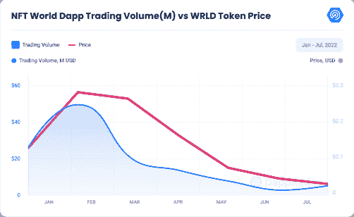

Source: DappRadar

像 NFT 世界和我的虚拟世界这样的项目已经把《我的世界》的资产转化成了 NFT 的收藏品。在《NFT 世界》中，用户可以拥有虚拟的土地，这些土地可以在定制的《我的世界》服务器上使用。

鉴于最近的《我的世界》争议，NFT 的交易量经历了 88%的月增长，达到近 300 万美元。然而，NFT 世界 WRLD 代币的价值立即下降，而平均售价从 7 月初的 3 ETH 下降到目前的不到 1 ETH。

这一潜在的不稳定消息成为 NFT 世界的转折点。与熊市中的许多其他公司类似，该公司别无选择，只能继续发展。NFT 世界团队在一份冗长的公开声明中宣布，他们目前正在开发自己版本的《我的世界》，完成“《我的世界》多年来一直缺乏的现代化和积极的发展”

与新的《我的世界》限制相矛盾的是，微软在 2021 年 2 月推出了官方的《我的世界》主题 NFTs。随着 NFT 市场开始升温，该公司与区块链游戏开发商金恩合作，在国际女性科学日分发免费 NFT。一旦法规改变，微软是否会继续允许金恩的插件存在不确定性，该插件使服务器能够支持 NFT 的商品。微软联合创始人比尔盖茨(Bill Gates)今年早些时候表示，加密货币和 NFT“100%基于大傻瓜理论”。

随着加密业务，特别是 NFT 市场经历了一个加密的冬天，最近《我的世界》NFT 禁令似乎相当出人意料。然而，可能还有另一个考虑:当一个主要的游戏开发商宣布包含 NFTs 时，玩家经常会做出负面反应。当育碧宣布其名为 Digits 的 NFTs 的育碧石英平台时，公众严厉批评了它。当《侠盗猎车手 6》可以加入比特币激励计划的谣言开始流传时，粉丝们非常不高兴。

因此，Mojang 和微软很可能对 NFTs 保持警惕，因为他们非常关心《我的世界》的游戏玩家。去年，Valve 宣布不允许在其 Steam 平台上使用 NFT 或加密货币。

在一次采访中，Valve 的联合创始人加布·纽维尔解释说

加布·纽维尔解释说，“NFT 空间的人往往会卷入许多犯罪活动和不当行为。”

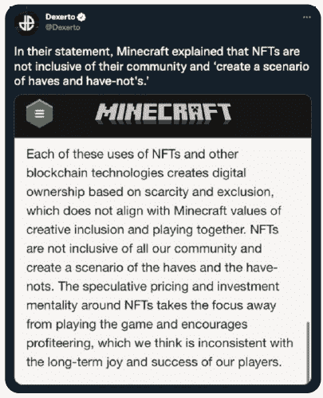

Epic Games 表示，他们“将欢迎使用区块链技术的游戏，只要它们遵守相关法律，披露它们的条款，并由适当的团体进行年龄分级，”但该公司不会使用加密技术或 NFTs。

## 西庇太带回了区块链的复古游戏

比特币游戏公司 Zebedee 已经从《最终幻想》角色扮演视频游戏系列的制作人 Square Enix 获得了约 3500 万美元的新一轮特许经营权 B 投资。

虽然现有的大多数区块链游戏都是在多边形、蜡像、流和 BNB 链生态系统上进行的，但 Zebedee 打算将其游戏基于比特币网络的效率。

有了 Zebedee，游戏开发者通过闪电网络(Lightning Network)创建微支付变得很容易，闪电网络是比特币网络之上的第二层支付协议，允许以很低的费用进行快速交易。通过与移动游戏工作室 VIKER 的最新合作，Zebedee 将使用 Lightning 网络实现三种经典视频游戏的比特币奖励:数独、纸牌和失踪的字母。

Zebedee 和 Viker 并不是唯一带回经典游戏的公司。6 月初，Joyride Games 在 Flow 区块链上发布了 Solitaire Blitz。这是一个流行的克朗代克纸牌游戏的抛光版本，有一个新的外观，一些有趣的转折，和不同类型的玩家不同的游戏模式。目前，该应用是 7 月份拥有 17，522 名用户的前 10 大区块链游戏，比 6 月份增长了 1，033%，是流量链上排名第一的 dapp。

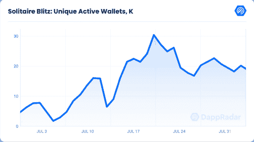

Source: DappRadar

Zebedee 通过为 Valve 著名的在线射击游戏《反恐精英:全球攻势》(CS: GO)建立定制服务器，打破了传统游戏和区块链游戏之间的壁垒。

在演示期间，区块链的游戏业务使参与者能够在玩在线比赛的同时赚取比特币。加入游戏时，每个人都会投入一点比特币。在比赛中，那些被击中的人会损失一些钱，而成功的玩家则通过射击对手来赚取比特币。

一名商业官员拒绝提供积极使用该平台的人数，但表示 Fumb Games 的比特币矿工和 Vestly，以及 Zebedee 的几个应用程序，“经历了持续的参与。”

## **、区块链奥运会和元宇宙项目筹集了 3 亿美元**

随着全年趋势的延续，区块链博彩公司的合作伙伴和投资在 7 月份又增加了 3 亿美元。然而，这是今年融资额最低的一个月。上个月，元宇宙游戏倡议筹集了 55%的资金，而基础设施项目达到了总额 3 亿美元的 20%。

Animoca Brands 筹集了 7500 万美元，占 7 月份投资资本的 25%，用于资助战略收购、投资和产品开发，获得流行知识产权的许可，推进开放的元宇宙，并促进在线用户的数字产权。

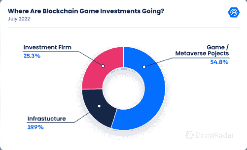

Source: DappRadar

在前一季度，投资者向区块链博彩业注入了 25 亿美元。，对今年这一增长行业投资总额的预期已经上调了 18%，达到 100 亿美元。

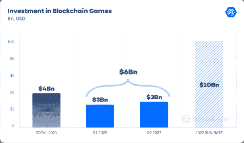

Source: DappRadar

看到资本流入区块链博彩业是一个真正的看涨指标，尤其是在这个艰难的市场时期。

## **尽管上个月有所下滑，虚拟世界项目仍创造了 3200 万美元的收入**

虚拟世界项目经历了一个低迷的月份，该类别的交易量下降了 8%，至 3200 万美元。然而，销售数量上升了 6%，达到 13，962，表明对此类项目的需求仍然很大。

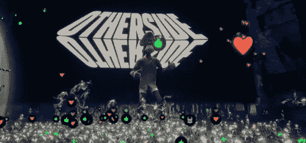

另一方面，交易量最大的虚拟世界项目的历史交易量超过了 10 亿美元，是最快的交易量。7 月，宇迦实验室的游戏项目聚集了 4300 名“旅行者”进行首次技术演示，并参观由 implementable 开发的沉浸式猿类导航互联网环境。

这些玩家都穿着彩虹机器人的服装，只有一只名叫“柯蒂斯”的无聊猿猴指导数千名游戏玩家体验解释机制，并让他们第一次体验彼岸平台。

尽管如此，Otherside 的交易量还是下降了 5%,平均 UAW 在过去 30 天里下降了 7.69%。

同样，领先的元宇宙平台分散土地和沙盒分别有 29%和 21%的月跌幅。这两个平台的总交易额约为 200 万美元。这是自今年初以来，这两个项目的最低交易量。

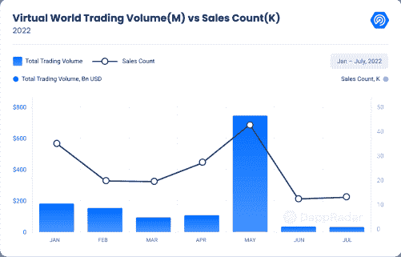

Source: DappRadar

另一方面，Somnium Space 的成交量增长了 156%。这一成功主要来自 Somnium Space Creators Fund 活动，在该活动中，社区成员向评委小组提出了虚拟现实公司的想法。

Somnium Space 在 2021 年资助了价值 6 万美元的项目。然而，今年，Somnium Space 加入了各种公司和个人，使他们能够为创作者基金筹集近 100 万美元。

Oasis Meta Games 创新的 VR 技术使演示者能够管理大型浏览器并显示他们的幻灯片。他们甚至可以在陪审团后面的屏幕上播放幻灯片，只有他们自己能看到。

只需点击几下，用户就可以在演示文稿之间导航。有时，这种体验似乎比物理显示更无缝。在那两个七月的夜晚，历史在 Somnium 空间被创造。

此外，Treeverse 与上个月相比增长了 51%，这主要是由于其最新游戏视频的发布，该视频在未来几天发布的动作预告片之前，提供了游戏当前开发的信息。

在游戏中，热情的冒险者将探索移动优化的 Arboros 大陆，在那里他们将参与合作游戏和社交互动。这是通过大量出色的合作和巨额融资实现的。

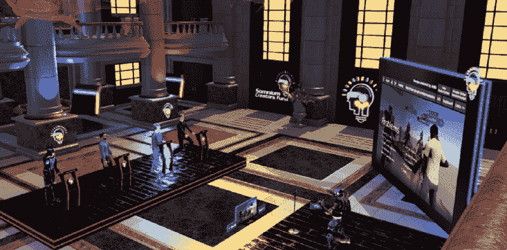

Source: Somnium Space

鉴于新一轮 550 万美元的投资，Mavia Labs 的总体交易量增加了 25%。币安实验室领导了这轮融资，包括来自 Genblock Capital、Delphi Digital、Mechanism Capital、YGG 海、ExNetwork Capital、双峰风险投资公司和一些天使投资者的参与。英雄的 Mavia 的可观的财政支持，从最大和最强大的投资者在业内证明，它是准备成为一个领先的游戏赚取。

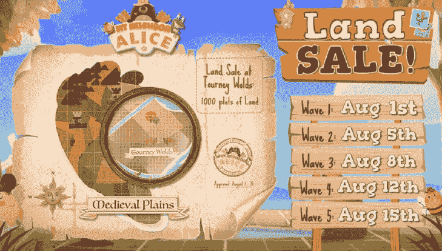

Source: My Neighbor Alice Medium

在接下来的几个月里，元宇宙平台将继续推出激动人心的活动。我的邻居爱丽丝，一个受任天堂的动物穿越和 BNB 链上运行启发的社交模拟游戏，在 7 月 26 日建立其在线市场后，正式宣布新的土地销售。直到 8 月 15 日，游戏将提供一组新的土地，或游戏中的目的地。

新的拍卖将包括 1000 块以中世纪平原岛为主题的土地，其中 25 块将随机抽取。剩余部分将分批出售，直到造币厂关闭。那些提交更多土地投标的人将有更大的机会获得免费地块之一。

此外，沙盒已经宣布计划在 2022 年推出第三个游戏赚阿尔法季，有趣的 NFT 头像功能尚未透露。

## 顶级游戏推动对熊市的抵抗

7 月，《异形世界》是最受欢迎的区块链游戏，日均 UAW 达到 205，285 次，较上月增长 8%。

开发人员刚刚完成了一份冗长的游戏增强列表，其中包括降低蜡像区块链和其他 API 和节点的工作负载。《外星世界》将在我们的 DappDays 举办 AMA，他们将为公司的未来提供线索。

与此同时，Splinterlands 的巨大成功仍在继续，每月增长 8%，并在其战斗行列中增加了野生和现代格式。在 6 月份玩家数量急剧减少后，这款游戏再次显示出增长的迹象。

球员可以参加任何一个或两个联赛；然而，他们的任务奖励箱和季节性奖励箱取决于他们在联盟中的最高排名。看到这如何影响玩家的参与度和排行榜将会非常有趣。

现代模式应该给新玩家一个更容易进入的入口，因为他们可以从市场上购买混乱军团增强包和便宜的卡片，而不必与更老、更贵的卡片竞争。

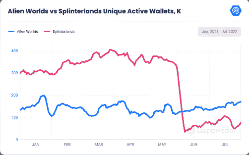

Source: DappRadar

BNB 的 Era7: Game of truth 也见证了平均 UAW 53%的增长，这主要归功于今年 8 月份世界杯赛事的宣布。一个新版本的 NFT 标题将推出一个公众可访问的“嘉年华会”

此外，另一款基于币安的游戏“X 世界游戏”的独立活跃用户平均数量较上月增加了 50%，这主要是因为与 Btok 建立了新的关系，Btok 是一个完全基于区块链技术的 Web3 社交网络。x 世界游戏已经和 Btok 的合作

集成的钱包可以在 Android 和 iOS 设备上存储 XWG 令牌，允许您在任何地方使用 X World Games 平台。

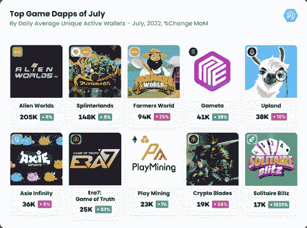

Source: DappRadar

Polygon 的《向日葵之地》的玩家基数本月增长了 332%，考虑到该游戏的初始版本在今年早些时候崩溃，这是一个了不起的成绩。相反，Arc8 的玩家数量在上个月减少了 31%，然而第四季从 8 月 8 日开始，季前赛从 8 月 1 日持续到 7 日。

除了宣布第四季，Arc8 还将发布 Qube 2048。在这个游戏中，玩家必须组合立方体来产生那些有大数的立方体；一个立方体可能拥有的最大数是 2048。

最后，Axie infinity 继续经历浪人的桥牌黑客的影响和他们的经济变化。Axie 的连锁活动环比下降 6%，同比下降 65%。

Origin 移动测试版于 6 月发布，使游戏更容易被更多的观众所接受。土地桩最终是活的，并承诺让生态系统回到正轨。Axie 将出现在我们的 DappDays 中，他们将提供有关该公司在我们 AMA 的未来的更多信息。

## 关闭

区块链游戏正在改变游戏规则，并将新一代玩家融入区块链生态系统。如今，游戏行业的规模估计超过 1750 亿美元，GameFi 的市值不到 62 亿美元的 4%。

我们目前正处于萌芽阶段，有巨大的发展空间。虽然仍有一些改进的机会，但该行业仍在不断发展和创新。

博彩活动的下降与市场低迷同时发生，这对财务状况不佳的企业来说可能是个问题。那些成功地将金融整合到游戏中，并专注于在这种环境下发展的公司，在本轮周期中处于更有利的地位。

GameFi 的未来是充满希望的，因为业界最具创新性的概念和传统游戏公司合作在一起。