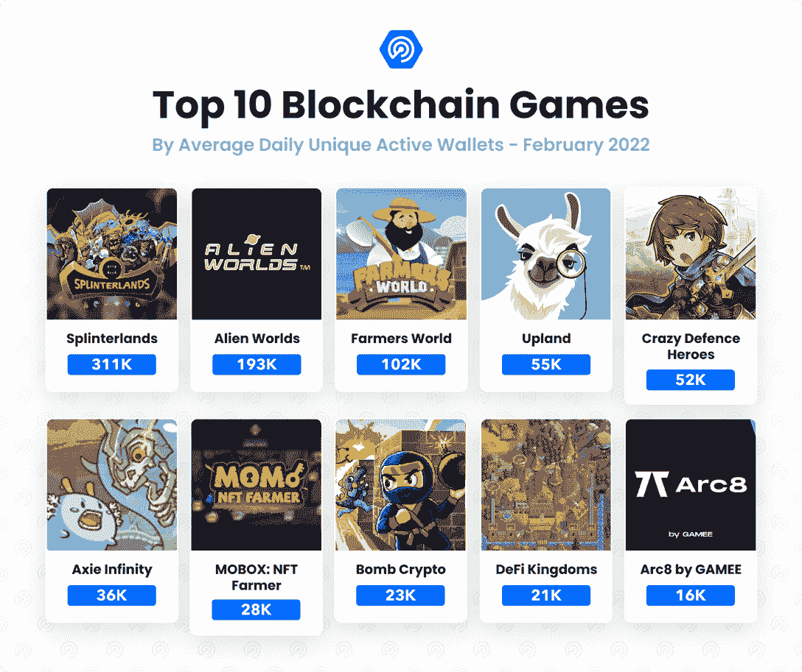
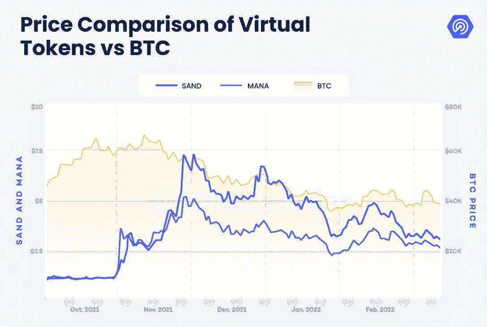
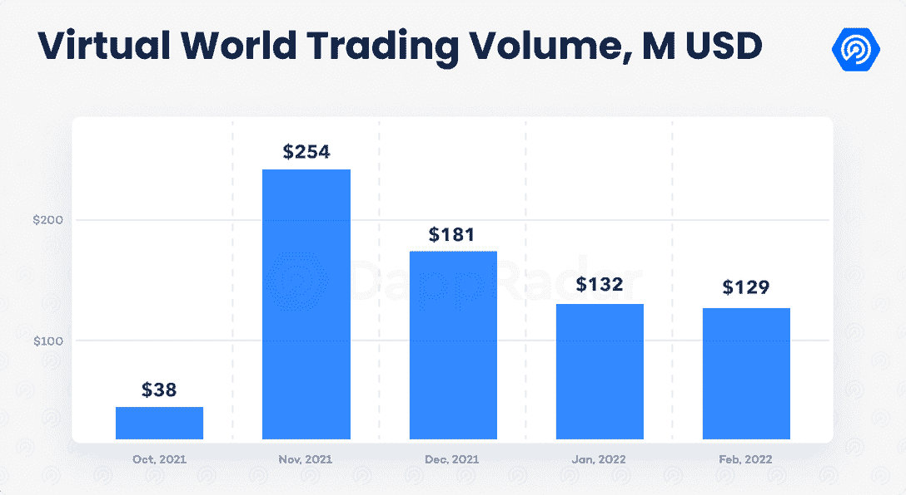
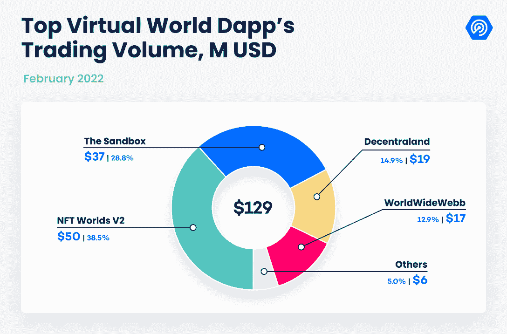
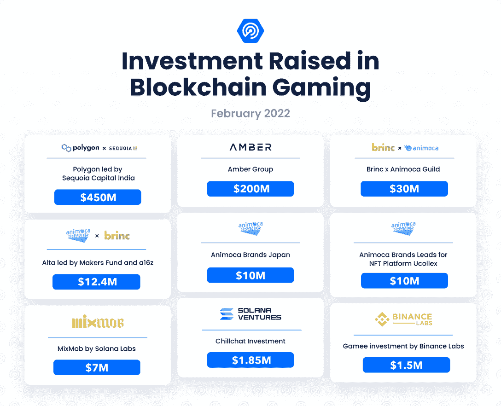
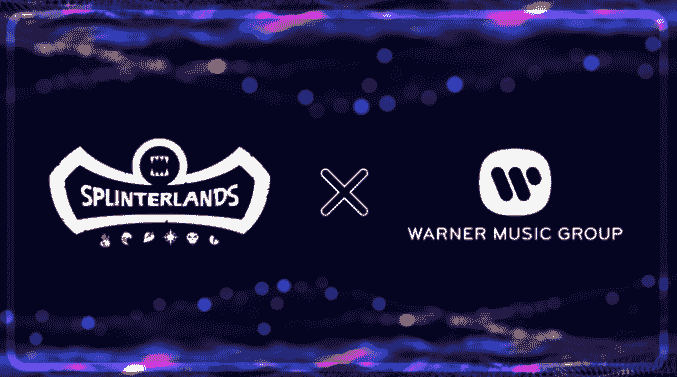
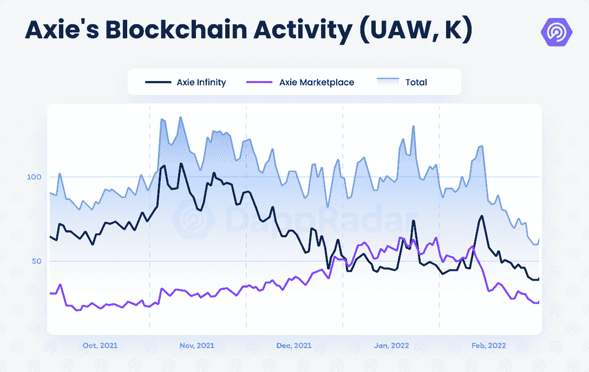
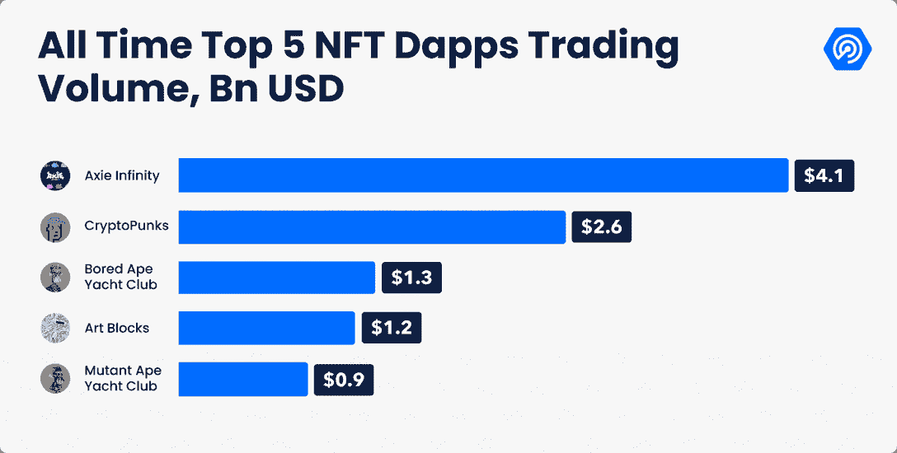

# DappRadar x BGA 运动会报告–2022 年 2 月

> 原文：<https://web.archive.org/web/https://dappradar.com/blog/dappradar-x-bga-games-report-february-2022>

## 找出你需要知道的关于二月份区块链奥运会的一切

乌克兰冲突加剧了加密市场的负面趋势，该市场已经经历了三个月的熊市。随着这种情绪，游戏 dapps 在 2 月份的日均使用量下降了 13%。上个月，平均每天有 110 万个独立活跃钱包(UAW)连接到一款区块链游戏，占区块链整个行业使用量的 49%。

然而，尽管短期内注意力从区块链游戏转移，游戏趋势和模式表明这一类别的前景是乐观的。投资于游戏项目和基础设施的资金不断流入。与此同时，不同区块链的顶级“玩到赚”和 GameFi dapps 已经建立了稳定的玩家基础。

## 关键要点

*   区块链游戏跟随行业下行轨迹；游戏 dapps 的每日活动下降了 13%，但在 2 月份仍然吸引了超过 110 万的平均每日 UAW。

*   以 NFT 世界为首的新一波虚拟世界抵制了这种消极趋势；该系列的底价飙升了 250%，达到 12 ETH 以上，月销售额接近 5000 万美元。

*   投资持续流入区块链的游戏和基础设施；2 月份筹集了 7.2 亿美元，Animoca Brands 成为主要参与者。

*   Splinterlands 继续巩固作为一个首要的即玩即赚 dapp，平均每天连接超过 310，000 个钱包；与知名音乐公司的合作也很突出。

*   多边形确立了自己作为第四区块链在游戏活动方面落后于塔防玩赚 dapp 疯狂防御英雄。

## 目录

*   [元宇宙和游戏代币的熊市](https://web.archive.org/web/20221007152716/https://dappradar.com/blog/dappradar-x-bga-games-report-february-2022/#bear)
*   [NFT 世锦赛无视市场趋势](https://web.archive.org/web/20221007152716/https://dappradar.com/blog/dappradar-x-bga-games-report-february-2022/#NFT-Worlds)
*   [投资持续涌入——2 月份筹集了 7 . 22 亿美元](https://web.archive.org/web/20221007152716/https://dappradar.com/blog/dappradar-x-bga-games-report-february-2022/#investments)
*   [领先的 dapp Splinterlands 获得一个强大的合作伙伴](https://web.archive.org/web/20221007152716/https://dappradar.com/blog/dappradar-x-bga-games-report-february-2022/#leading)
*   [Axie Infinity 在经济变化中的交易额超过 40 亿美元](https://web.archive.org/web/20221007152716/https://dappradar.com/blog/dappradar-x-bga-games-report-february-2022/#axie)
*   [顶级游戏不断巩固其受众](https://web.archive.org/web/20221007152716/https://dappradar.com/blog/dappradar-x-bga-games-report-february-2022/#top)
*   [前方道路](https://web.archive.org/web/20221007152716/https://dappradar.com/blog/dappradar-x-bga-games-report-february-2022/#road)

## 元宇宙和游戏代币的熊市

区块链游戏和元宇宙项目无法逃脱拖累加密市场的宏观趋势，尽管本月初表现强劲。去年 11 月 Meta 更名后经历的 FOMO 阶段已被一个恐惧的市场所取代，该市场将注意力转向人们认为更安全的资产。

SAND、MANA、GALA 等令牌在 11 月份大幅上涨，达到历史最高水平；然而，这些密码经历了明显的价格下跌。举例来说，沙子的价格从历史高点下跌了 66%，但仍比 10 月 30 日的交易价格高出 205%。

当前的市场形势只是行业内经历的波动的一个例子。它还提醒我们，这一领域的项目是为长期发展而构建的。虽然短期内的收益可能不仅仅是回报，但有必要承认 dapp 行业还处于早期阶段，这尤其适用于游戏类别。

## NFT 世界无视市场趋势

根据元宇宙的叙述，自从去年 11 月 Meta 宣布以来，代表虚拟土地的 NFT 已经获得了巨大的价值。2 月份，精选的虚拟世界项目显示了真正的创新和实用性，继续对抗熊市趋势，并在价值上升值。

NFT 世界就是这样一个项目。这个虚拟世界由 10，000 个陆地 NFT 组成，允许它们的所有者定制它们的地块，以提供游戏体验。这些项目利用了《我的世界》创建的现有生态系统，该生态系统现归微软所有。在测试和空投项目的本地货币 WRLD 期间，一些土地是可访问的，对这个项目的需求飙升，在这个过程中提高了价格。2 月份，这些 NFT 的底价飙升了 250%，达到 12 ETH 以上，而需求比 1 月份翻了一番，月销售额达到近 5000 万美元，是任何其他虚拟世界 dapp 的最高水平，甚至超过了沙盒。 ***注:撰写本文时，楼面价已经盘整在 8 ETH 以上。***

其他呈现独特特征的虚拟世界也增加了它们的价值和需求。可互操作的虚拟世界 Webbland 的底价从 1.4 ETH 上涨了 75%，达到 2.5 ETH，产生了近 1700 万美元的交易量。以太坊塔是为数不多的垂直虚拟世界之一，其需求较 1 月份增长了 1，024%，产生了近 100 万美元的交易。

同样，像沙盒、分散土地和其他许多已建立的元宇宙项目都抵制了资本和加密市场的下行趋势。总体而言，虚拟世界项目产生了 1.29 亿美元的销售额，仅比 1 月份下降了 2.4%。随着元宇宙的故事在传统领域越来越流行，虚拟世界项目再次凸显了这个空间的潜力。

## 投资持续涌入——2 月份筹集了 7 . 22 亿美元

区块链游戏的资本投资金额表明游戏的整体趋势是积极的。今年 2 月，投资者以至少 7.225 亿美元支持区块链游戏项目和基础设施。此前，区块链游戏相关项目在 1 月份筹集了近 10 亿美元。如果投资保持这一速度，2021 年积累的 40 亿美元将被超过。

在这方面，Animoca Brands 已经成为 web3 行业最重要的参与者之一。这家总部设在香港的风险投资机构不仅获得了 50 亿美元的估值，还成为了越来越多地参与开发区块链项目的战略合作伙伴。与韩国娱乐公司 Cube entertainment 的合资企业就是一个例子，Cube entertainment 希望围绕韩国流行文化创建一个 NFT 市场。

另外值得注意的是，红杉资本领投了 Polygon 4.5 亿美元。这家区块链公司已经改进了其游戏产品，目前是每日连锁活动“疯狂防御英雄”第五大游戏的所在地。另外，sidechain 是第四大游戏网络，仅次于 Hive、Wax 和 BNB 链。Polygon 也是 Sandbox，Pegaxy，Aavegotchi，Fear，Phantom Galaxies，REVV Racing，Zed Run，Doctor Who:Worlds apartment，以及即将推出的 Galaxy Fight Club，Riot Racers 等游戏的所在地。

## 领先的 dapp Splinterlands 得到一个强大的合作伙伴

根据 2 月份的日均在线活动,《碎片之地》仍然是最受欢迎的区块链游戏。该交易卡游戏在 2 月份成功售出了 700 万个混沌军团包，并吸引了超过 50 万 UAW，仅比 1 月份的活动下降了 2%。平均而言，在二月份，UAW 每天吸引超过 331，000 人。

除了强劲的区块链游戏活动，Splinterlands 关闭了两个关键的合作伙伴关系，以增加他们的路线图。首先是与说唱歌手瓦卡·福尔卡·弗雷姆合作的 NFT 发布会。这一系列的 NFT 不仅会在游戏的策略中引入独特的卡片，而且 NFT 还将作为收藏品，可以通过 AR 在 Snapchat 中佩戴。

**Source**: Splinterlands

此外，[splitterlands 还与华纳音乐集团](https://web.archive.org/web/20221007152716/https://dappradar.com/blog/splinterlands-warner-music-artists-games)合作，后者是一家唱片公司集团，控制着全球音乐版权产业约 [16%的份额。这项合作不一定会涉及到交易卡游戏本身，但可能会将游戏作为音乐家和艺术家的额外收入来源。音乐和区块链游戏之间的交集值得关注，因为像](https://web.archive.org/web/20221007152716/https://www.toptal.com/finance/market-research-analysts/state-of-music-industry#:~:text=According%20to%20Music%20%26%20Copyright%2C%20the,of%20the%20music%20recording%20market.)[《沙盒游戏》](https://web.archive.org/web/20221007152716/https://dappradar.com/ethereum/games/the-sandbox)和 [Gala Games 这样的项目也在探索](https://web.archive.org/web/20221007152716/https://dappradar.com/blog/music-flows-through-the-crypto-world)这种模式。

## 在经济变革中，Axie Infinity 的交易额超过 40 亿美元

在成功发射罗恩之后，Axie Infinity 在区块链的活动中失去了一些地盘。盈利模式的改变及其对 AXS 和 SLP 价格的负面影响已经对游戏的活跃程度造成了影响。Axie 在 2 月份吸引了超过 16 万 UAW，比 1 月份下降了 35%。尽管如此，Axie Infinity 仍是每日使用量排名第六的游戏，每天有 3.6 万 UAW 连接到该游戏。

尽管 Axie 的链上活动下降了，每天有超过 250 万的活跃用户，但考虑到链外数据，Sky Mavis dapp 是玩得最多的区块链游戏。Sky Mavis 也在准备一系列更新，这些更新将极大地影响 Axie 生态系统。

Origin 的测试版预计将于 2022 年 Q1 奥运会结束时推出，将涉及游戏机制和经济的变化，包括更流畅和更动态的战斗控制，卡片策略的变化，以及基于 NFT 的电源的实施等。同样，Axie 也一直在寻找奖励创作者的方式，正如 3 月 7 日生效的市场 1%版税所指出的那样。

随着游戏准备有趣的更新，包括起源和其虚拟土地 Lunacia 的最终发布，承认 Axie NFTs 的影响也很重要——它是第一个历史交易量超过 40 亿美元的集合，不包括人工交易(LooksRare)。

## 顶级游戏不断巩固他们的观众

尽管游戏活跃度较前几个月略有下降，但令人鼓舞的是，top play-to-earn 和 GameFi dapps 在保持甚至扩大玩家基础方面取得了巨大成功。

Splinterlands、Axie Infinity、Upland 和 Wax 的《异形世界》和《农夫世界》至少六个月以来一直位列最常玩游戏的前十名。尽管《外星世界》的日常活动有所减少，但这些“玩赚”和 GameFi dapps 可以被视为一致性的衡量标准，是游戏的关键指标。

此外，下一波游戏 dapps 也显示出持续增长和过去几个月的一贯表现。其中包括 Harmony 的 DeFi 王国，BNB 的 Mobox 和 Bomb Crypto，以及至少几个多边形游戏——疯狂防御英雄和 Arc8，Pegaxy 似乎也在整合。

总而言之，我们必须承认，游戏品类是在不断发展和扩大的。虽然游戏趋势可能不像两个月前那样稳固，但看到大量拥有统一受众的游戏 dapps 是一个强有力的指标。

## 前方道路

随着行业的整体情绪，游戏类别经历了一个下降趋势。衡量活动和需求的区块链指标比年初略有下降，尽管从宏观角度来看，信号不断显示该领域的兴趣和潜力非常大。

人们对区块链奥运会的兴趣持续上升，2 月份投资 7.2 亿美元就证明了这一点。这样，2022 年这一类别的投资几乎相当于 2021 年全年融资总额的一半。同样，虚拟世界在元炒作周期后正经历一个巩固阶段，进一步巩固这种类型的 dapps 的地位。随着空间的不断建设和发展，即将到来的事件值得关注，包括:

*   Axie Infinity Origin: Axie 正在准备对其生态系统进行重要的改变，包括预计发布的 Origin 赛季，带来更具活力的游戏模式。
*   Gala Games:分散式游戏网络正在进行治理投票，以将第三人称合作射击游戏 Superior 纳入其游戏目录；《StarTown》的改版也可能转化为游戏区块链活动的显著增加。
*   NFT 世界和沙盒第二阿尔法:这些更新提供了进一步的机会，获得一些最受欢迎的元宇宙游戏 dapps 的实践经验。

幻影星系 Alpha 和 Skyweaver 公测:在[补偿了一次不和谐攻击的受害者](https://web.archive.org/web/20221007152716/https://dappradar.com/blog/phantom-galaxies-discord-scam-victims-can-now-claim-compensation)之后，幻影星系发布了第二集——游戏的第二个 Alpha 赛季；与此同时，Horizon 的交易卡游戏 Skyweaver 已经向等候名单上的 30 多万名玩家开放了测试阶段。

 NewsletterUnsubscribe at any time. [T&Cs](https://web.archive.org/web/20221007152716/https://dappradar.com/terms) and [Privacy Policy](https://web.archive.org/web/20221007152716/https://dappradar.com/privacy-policy)