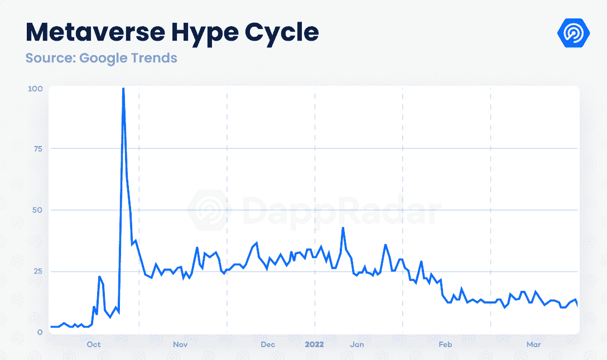
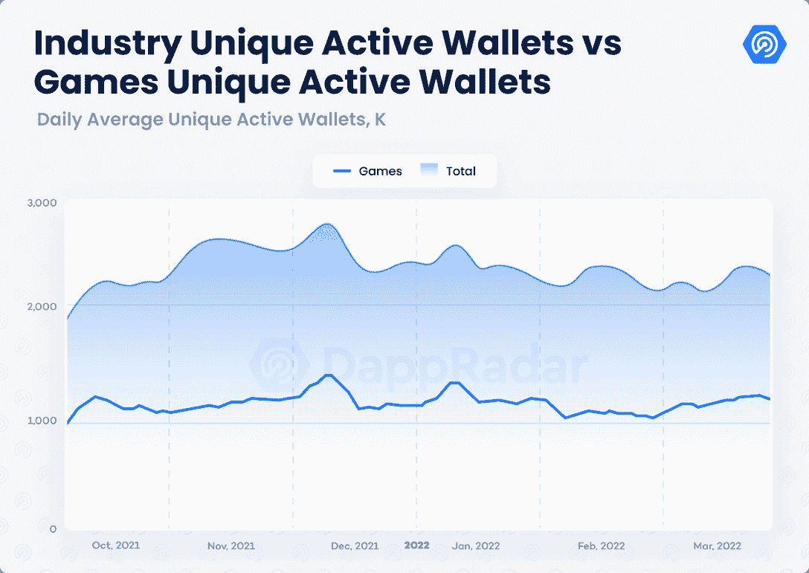
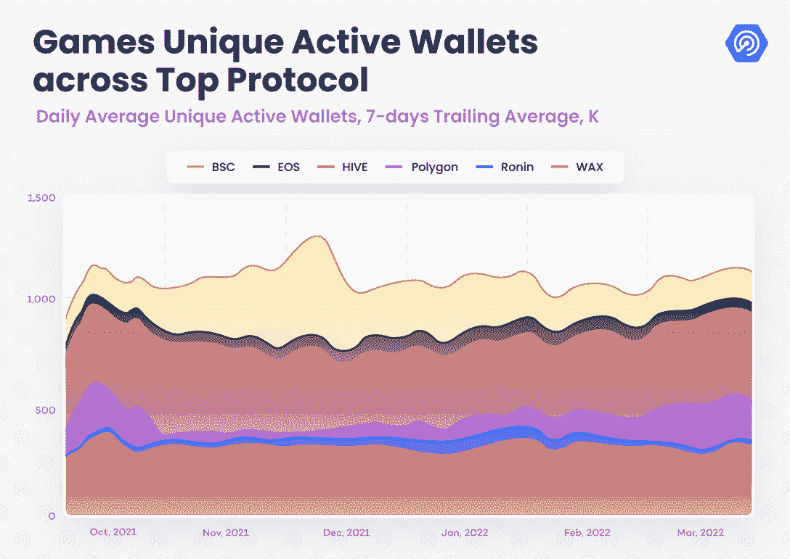
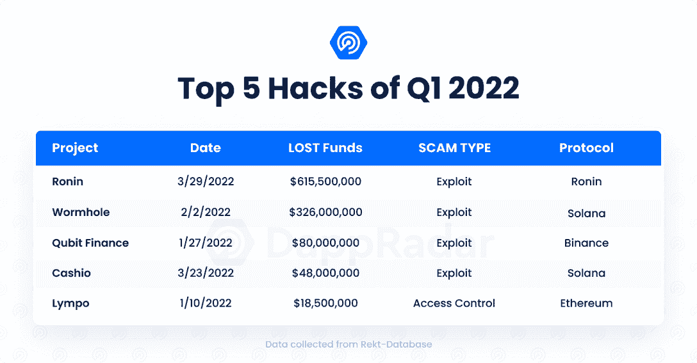
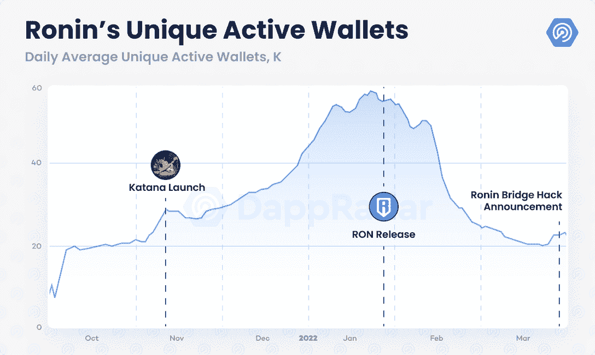
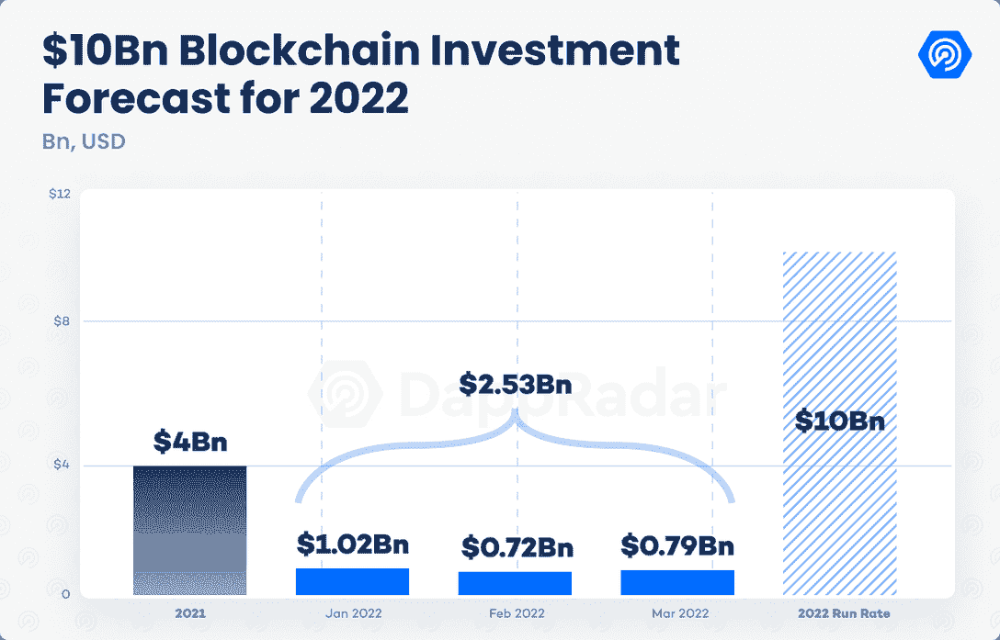
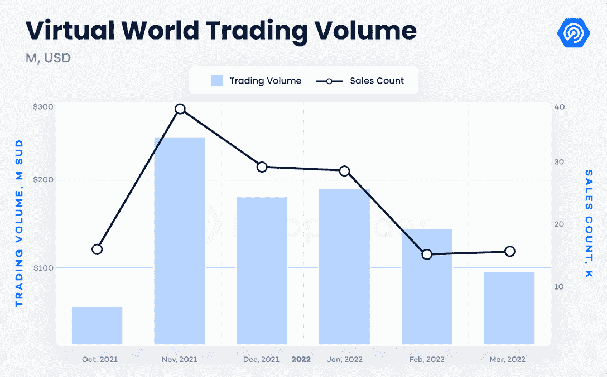
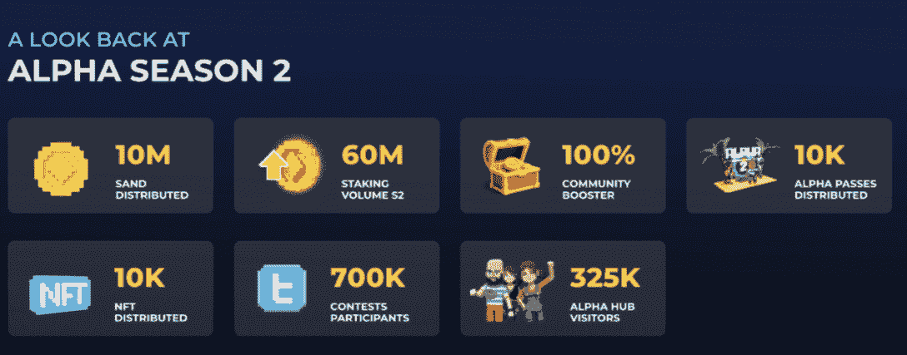
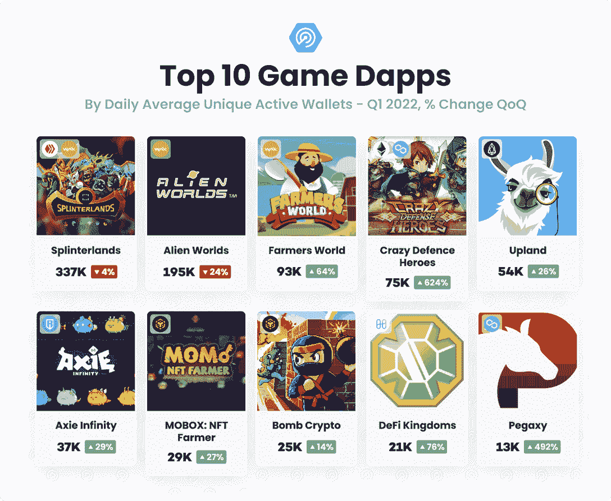

# DappRadar x BGA 运动会报告–Q1 2022

> 原文：<https://web.archive.org/web/https://dappradar.com/blog/dappradar-x-bga-games-report-q1-2022>

## 区块链游戏活动比上一年增长了 2000%。

**尽管微观和宏观经济前景充满挑战，但区块链博彩活动趋于稳定。安全事件，包括最近的 5 亿起 Ronin Bridge 黑客事件，提醒我们互操作性是有代价的。与此同时，乌克兰战争和加密货币市场的负面表现阻碍了游戏在去年的持续增长。不过，从长远来看，区块链的博彩活动较上年增长了 2000%。**

Source: Google Trends

游戏 dapps 继续他们正在进行的开发，元宇宙不断闪现区块链行业最令人兴奋的机会之一。风投和其他投资者不断向区块链奥运会和元宇宙项目注入资金，投资额超过 25 亿美元。与此同时，金融机构正在评估分散化的元宇宙成为至少 8 万亿美元市场的[的经济潜力。](https://web.archive.org/web/20230228010145/https://blockworks.co/morgan-stanley-sees-8-trillion-metaverse-market-eventually/)

## 关键要点

*   随着 25 亿美元在 Q1 筹集，投资继续涌入区块链奥运会；按照这个速度，2022 年的投资将比去年高出 150%。
*   区块链游戏 3 月吸引了 122 万 UAW，占行业活跃度的 52%；虽然短期使用似乎稳定，但区块链奥运会的使用比 Q1 2021 增加了 2000%。
*   Sky Mavis 在遭受了加密史上最严重的攻击之一后，经历了一个具有挑战性的时期；尽管如此，Axie Infinity 在 3 月份吸引了 2.2 万的每日 UAW，而币安领导了 1.5 亿美元的基金，以追回罗宁大桥黑客的资产
*   元宇宙在继续发展；沙盒阿尔法第二季，分散的时装周，NFT 世界的价值评估展示了空间的潜力。
*   夹板地、外星世界和疯狂防御英雄推动了区块链游戏活动，三月份平均每日 UAW 超过 650，000。

## 目录

*   [52%的区块链活动来自游戏 dapps](https://web.archive.org/web/20230228010145/https://dappradar.com/blog/dappradar-x-bga-games-report-q1-2022/#52%-of-blockchain-activity-comes-from-game-dapps)
*   [天空专家的挑战期](https://web.archive.org/web/20230228010145/https://dappradar.com/blog/dappradar-x-bga-games-report-q1-2022/#Challenging-period-for-Sky-Mavis)
*   Q1 的游戏和元宇宙项目筹集了 25 亿美元
*   [我们身边酝酿的区块链元宇宙](https://web.archive.org/web/20230228010145/https://dappradar.com/blog/dappradar-x-bga-games-report-q1-2022/#The-blockchain-metaverse-brewing-around-us)
*   [热门游戏回顾](https://web.archive.org/web/20230228010145/https://dappradar.com/blog/dappradar-x-bga-games-report-q1-2022/#Review-of-top-games)
*   [前方道路](https://web.archive.org/web/20230228010145/https://dappradar.com/blog/dappradar-x-bga-games-report-q1-2022/#Road-ahead)

## 52%的区块链活动来自游戏 dapps

在充满挑战的情况下，区块链游戏保持了稳定的使用水平。在 Q1 期间，平均每天有 117 万个独立活跃钱包(UAW)连接到区块链游戏，比去年第四季度的日均水平下降了 2%。然而，3 月份的日均 UAW 超过了 122 万，显示出复苏的迹象。

从区块链活动的角度来看，Matic 作为领先游戏生态系统 [Wax、Harmony 和 BNB 链](https://web.archive.org/web/20230228010145/https://dappradar.com/rankings/category/games)的挑战者，保持着发展势头。以太坊侧链上的游戏 dapps 在 Q1 期间平均每天吸引了 114，000 UAW，在 3 月份吸引了令人印象深刻的 173，000。像[疯狂防御英雄](/web/20230228010145/https://dappradar.com/blog/how-crazy-defense-heroes-came-to-dominate-play-to-earn-gaming/)、 [Pegaxy](/web/20230228010145/https://dappradar.com/blog/pegaxy-the-ultimate-mix-of-horse-racing-earning-and-ownership/) 、 [Arc8](/web/20230228010145/https://dappradar.com/blog/arc8-grabs-the-top-spot-with-season-1-launch/) 和 [Aavegotchi](/web/20230228010145/https://dappradar.com/blog/how-to-earn-aavegotchis-gotchus-alchemica-and-craft-the-le-golden-aaltar/) 这样的游戏已经推动 Polygon 的游戏活动从 12 月底开始增长了 219%。

另一方面，[浪人](https://web.archive.org/web/20230228010145/https://dappradar.com/rankings/protocol/ronin)和 [BNB 链家的上链活跃度](https://web.archive.org/web/20230228010145/https://dappradar.com/rankings/protocol/binance-smart-chain/category/games)从去年年底开始有所下降。除了 [Mobox](/web/20230228010145/https://dappradar.com/blog/mobox-takes-over-gaming-on-bsc-as-play-to-earn-gains-traction/) 和 [Bomb Crypto](/web/20230228010145/https://dappradar.com/blog/bomb-crypto-takes-over-bsc-gaming-in-january/) 之外，在某种程度上，大多数游戏 dapps 在币安品牌网络中的使用主要是不稳定的。尽管如此，BNB 连锁仍是区块链博彩活动的第三大网络，Q1 的每日 UAW 为 16.5 万，比去年 12 月下降了 33%。

与此同时，Ronin 正在经历自近一年前成立以来最具挑战性的时期。

## Sky Mavis 的挑战期

3 月 29 日， [Sky Mavis 团队宣布](/web/20230228010145/https://dappradar.com/blog/axie-infinity-activity-plummets-after-600-million-ronin-exploit/)在 Ronin bridge 几乎一周前遭受攻击后，175，000 ETH 和 2，550 万 USDC 被盗。黑客成功控制了 8 个 multisig 钱包中的 5 个，这 8 个钱包是批准大桥托管合同的存款和取款所必需的，窃取了历史上第二大数量的密码。

虽然这次黑客攻击迫使罗宁的本地 dapps 停止运营，但 Axie 在区块链活动的减少并不完全是最近一次攻击的结果；事实上，它已经在下降。该游戏的链上活动在 1 月份达到顶峰，当时该游戏平均每天注册超过 55，000 个 UAW，而在 3 月份已经下降到几乎每天 22，000 个 UAW。

UAW 的数量在二月中旬开始减少，这是由于天空 Mavis 改变了 SLP 的奖励比例，以使 Axie 的游戏内货币从长远来看是可持续的。尽管如此， [Axie Infinity 仍然是按日使用量排名的前 10 名](https://web.archive.org/web/20230228010145/https://dappradar.com/ronin/games/axie-infinity)最常玩的游戏之一，该游戏仍然吸引着超过 150 万的日活跃用户，衡量离线数据。

Ronin bridge 的漏洞对 Sky Mavis 来说是一个沉重的打击。但是，Ronin 是一个完整的生态系统。在主持了第一个采矿项目后，武士刀被证明是一个有用的 DeFi 选项，网络和社区都由它的令牌 RON 管理。此外，来自 Axie Infinity 用户群和 Web3 社区的普遍支持已经被感受到。币安带领 Animoca Brands 和 a16z 进行了一轮 1.5 亿美元的融资，以补偿受攻击影响的用户资金。为了帮助巩固和加强其生态系统的核心， [Sky Mavis 启动了一项价值 100 万美元的 bug 赏金计划](https://web.archive.org/web/20230228010145/https://decrypt.co/97580/axie-infinity-developer-launches-1m-bug-bounty-after-622m-ronin-hack)。

Axie Infinity 很可能在几个月内仍将是领先的即玩即赚选择。在这个充满挑战的时期，人们很容易忘记 Axie NFTs 成为第一个历史交易量超过 40 亿美元的收藏，不包括人工交易(LooksRare)。此外，根据 Sky Mavis 的说法，Origin 的测试版在 4 月份成功部署，吸引了超过 220，000 名测试者。起源意味着[阿谢的虚拟世界](https://web.archive.org/web/20230228010145/https://dappradar.com/blog/6-things-you-need-to-know-about-axie-infinity-land-alpha)又近了一步。

## Q1 的游戏和元宇宙项目筹集了 25 亿美元

Q1 区块链奥运会的投资金额超过了 2021 年筹集的 40 亿美元。在 2022 年的前三个月，风投和投资者已经向区块链游戏及其底层基础设施投入了至少 25 亿美元。按照这种速度，从玩到赚和元宇宙相关的项目今年将增加 100 亿美元，以继续建设这个行业的未来。

Animoca Brands 以 50 亿美元的估值筹集了 3.6 亿美元的投资，使其成为领先的 Web3 品牌之一。上个月，红杉资本(Sequoia Capital)对 Polygon 进行了 4.5 亿美元的投资，该网络培育了最具吸引力的区块链游戏生态系统之一。

今年 3 月，超过 7.85 亿美元投资于不同的项目。著名的 NFT 收藏无聊猿游艇俱乐部(BAYC)背后的工作室宇迦实验室获得了由 Animoca Brands 牵头的 4.5 亿美元投资，沙盒、FTX 和比特币基地参与了这笔交易。这项投资进一步巩固了宇迦实验室的地位，使其成为 Web3 叙事中的一个名字。这也促进了团队的元宇宙计划，因为他们准备推出另一边。Otherside 将成为一个可互操作的元宇宙平台，涉及游戏、时尚和媒体。

还值得强调的是淡马锡对 Immutable-X (IMX)的 2 亿美元投资。这项投资使悉尼以太坊扩展解决方案的 C 轮估值达到 25 亿美元。IMX 举办了两个流行的区块链游戏《被解放的神》和《守护者协会》。在接下来的几个月里，Illuvium 和 [Ember Sword](/web/20230228010145/https://dappradar.com/blog/top-10-best-gaming-metaverse-worlds/) 将加入这些 dapps。筹集的资金将带来灵活性，继续建设和扩大 IMX 的产品。

## 我们身边酝酿的区块链·元宇宙

在 2021 年第四季度 [Meta 的品牌重塑](/web/20230228010145/https://dappradar.com/blog/mark-zuckerberg-and-meta-dont-understand-web3-economy/)公告推动的炒作周期之后，人们对元宇宙的兴趣已经降温。虚拟世界的交易额比 2021 年第四季度下降了 12%，在 Q1 2022 年达到超过 4.3 亿美元。分散土地中的[土地和沙盒](/web/20230228010145/https://dappradar.com/blog/metaverse-land-in-decentraland-ahead-of-bored-apes-top-10-nft-sales/)中的[土地的平均价格暴跌了 40%，而这两个平台的交易量分别下降了 20%和 60%。尽管如此，元宇宙平台的总体前景预示着此类项目的乐观前景。](/web/20230228010145/https://dappradar.com/blog/the-sandbox-land-valuation-report/)

[沙盒](https://web.archive.org/web/20230228010145/https://dappradar.com/ethereum/games/the-sandbox)完成了第二个 Alpha 赛季，吸引了超过 325，000 名游客参加了为早期玩家开放的 35 个体验。第二季在[发放了大约 3000 万美元的沙币](https://web.archive.org/web/20230228010145/https://dappradar.com/hub/token/eth/SAND/ETH?from=0x3845badade8e6dff049820680d1f14bd3903a5d0)。此外，[品牌如华纳兄弟](/web/20230228010145/https://dappradar.com/blog/the-sandbox-welcomes-hsbc-to-the-metaverse/)、育碧和汇丰都与这个游戏赚钱的虚拟世界建立了密切的合作关系。

与此同时，分散地和[玻色子](/web/20230228010145/https://dappradar.com/blog/boson-protocol-to-sell-physical-fashion-in-a-virtual-world/)礼宾[在三月的最后一周举办了时装周](/web/20230228010145/https://dappradar.com/blog/three-fashion-nft-collections-generate-137-5-million-in-three-months/)。D & G、雅诗兰黛和 Forever 21 等知名时尚品牌在该平台的时尚区展示了身临其境的体验，这是一个被元宇宙集团以 240 万美元收购的虚拟包裹。

同样值得注意的是 [NFT 世界](/web/20230228010145/https://dappradar.com/blog/nft-worlds-pushing-the-limits-10-eth-for-land-nfts-avatars-dropping-soon/)的性能，这是一个由 10，000 个土地 NFT 组成的虚拟世界，允许它们的所有者定制他们的地块以提供游戏体验。该项目通过其 WRLD 空投和打桩池显示了其效用因素，导致对 NFTs 的需求激增。就交易量而言，NFT 世界是第二个元宇宙项目，产生了 9500 万美元的交易，仅次于沙盒(1.13 亿美元)。

以区块链为基地的元宇宙的潜力迫在眉睫。像微软、谷歌、迪斯尼、索尼和其他一些领先的组织无疑会尝试在元宇宙发展他们的品牌。然而，理解由 NFTs 授权的所有权和由加密货币和玩赚游戏支持的底层金融生态系统将从局限于虚拟增强现实的传统元宇宙转移范式是完全相关的。

## 热门游戏回顾

感觉就像顶级的 play-to-earn 和 GameFi dapps 已经找到了一种参与各自社区的方式。Splinterlands 是公认的第一大赚钱游戏。今年 3 月，Hive 的交易卡游戏吸引了超过 366，000 的每日 UAW，比 2021 年 12 月增长了 15%。卡牌供应的更新，包括盈利率，已经在游戏周围建立了一个稳固的社区。关于即将到来的虚拟世界的想法也有助于这项事业。

[多边形游戏](https://web.archive.org/web/20230228010145/https://dappradar.com/rankings/protocol/polygon/category/games)疯狂防御英雄(CDH)和 Pegaxy 一直是表现最好的游戏。塔防游戏 CDH 的玩家数量稳步上升，3 月份吸引了超过 134，000 的每日 UAW。这代表着自 12 月底以来令人印象深刻的 540%的增长。同样，Pegaxy 的链上活动在同一时间内上升了 420%，并在 3 月份吸引了超过 16，000 UAW。

BNB 的 Mobox 和 Harmony 的 [DeFi 王国](/web/20230228010145/https://dappradar.com/blog/how-to-get-started-in-defi-kingdoms-crystalvale/) (DFK)设法保持他们的链上指标为正。得益于围绕 Momoverse 的[坚实路线图，Mobox 上的区块链活动比上一季度增加了 10%。至于 DFK，尽管 DeFi 空间呈负向下降趋势，游戏的原生令牌 JEWEL 的价格下跌了 12%，但链上活动仍然相对停滞。随着 DeFi 和游戏之间的界限开始模糊，这两款游戏都展示了 GameFi 的潜力。](https://web.archive.org/web/20230228010145/https://dappradar.com/blog/mobox-planning-avatar-airdrop-for-vembox-holders)

另一方面， [Wax 的《外星世界》](/web/20230228010145/https://dappradar.com/blog/minecraft-players-can-now-earn-tlm-in-alien-worlds-metaverse/)和币安的[炸弹密码](/web/20230228010145/https://dappradar.com/blog/bomb-cryptos-bcoin-explained/)努力将他们在区块链的活动保持在与去年相同的水平。《外星世界》在去年 8 月吸引了超过 30 万的每日 UAW 后失去了一些地盘。太空采矿游戏 GameFi dapp 每天仍吸引超过 188，000 UAW，而其 TLM 代币已成为最受欢迎的游戏加密货币之一。由于[和其他 BNB 游戏](https://web.archive.org/web/20230228010145/https://dappradar.com/rankings/protocol/binance-smart-chain/category/games)的历史，即 CryptoBlades 和 CryptoBay，炸弹加密案值得关注。

虽然[十大区块链游戏](https://web.archive.org/web/20230228010145/https://dappradar.com/rankings/protocol/category/games)已经初步确立，但请注意其他游戏 dapps，如雪崩的[克拉巴达](/web/20230228010145/https://dappradar.com/blog/what-is-crabada-new-play-to-earn-game-on-avalanche/)或 IMX 的《被解放的众神》挑战游戏区块链活动的最大份额。

## 前方道路

总而言之，区块链游戏仍然是 dapp 行业最吸引人的方面之一。尽管对区块链游戏的需求似乎已经停滞，但游戏 dapps 仍在推动该行业的大部分连锁活动。值得注意的是，在充满挑战的 Q1，顶级游戏仍然吸引着他们的玩家群。

对一个分散的、可互操作的元宇宙的支持迫在眉睫，区块链奥运会将是这个支持的基础。风投和投资者正以创纪录的速度向 Web3 游戏项目投入资金。与此同时，像育碧、华纳兄弟和阿迪达斯这样的顶级品牌开始在这个领域崭露头角。

此外，摩根士丹利等金融机构估计，元宇宙的经济潜力至少有 8 万亿美元。沙盒的第二个阿尔法季节，分散地的时装周，以及 NFT 世界的高需求为这个行业指明了正确的方向。

然而，诸如 Ronin bridge 漏洞之类的安全问题以及实现完全互操作性的挑战提醒所有相关人员，主流的采用还有几步之遥。

区块链游戏将需要在这个等式中发挥至关重要的作用，才能达到这一点。除了 NFTs 之外，游戏 dapps 将是实现大众采用点的关键，这是将 Web3 带到下一个级别所必需的。

 NewsletterUnsubscribe at any time. [T&Cs](https://web.archive.org/web/20230228010145/https://dappradar.com/terms) and [Privacy Policy](https://web.archive.org/web/20230228010145/https://dappradar.com/privacy-policy)