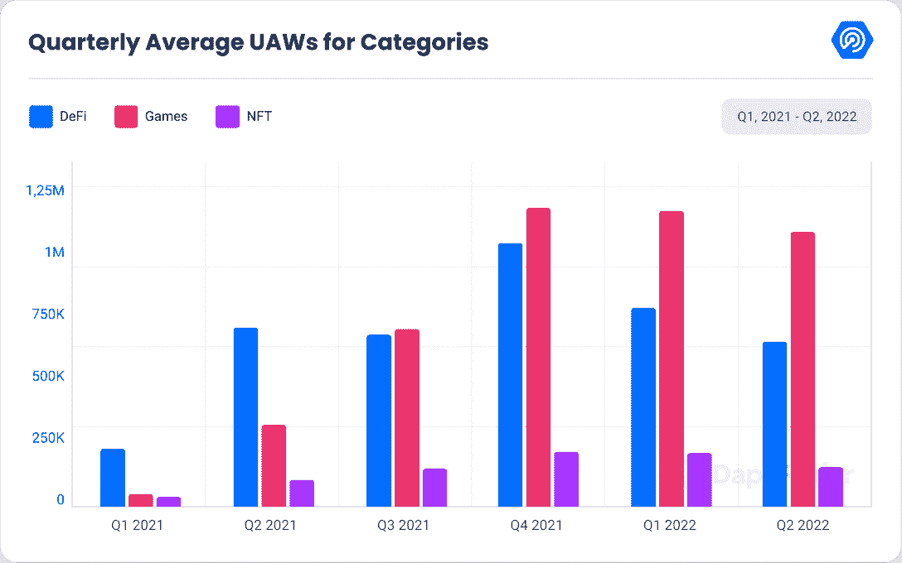
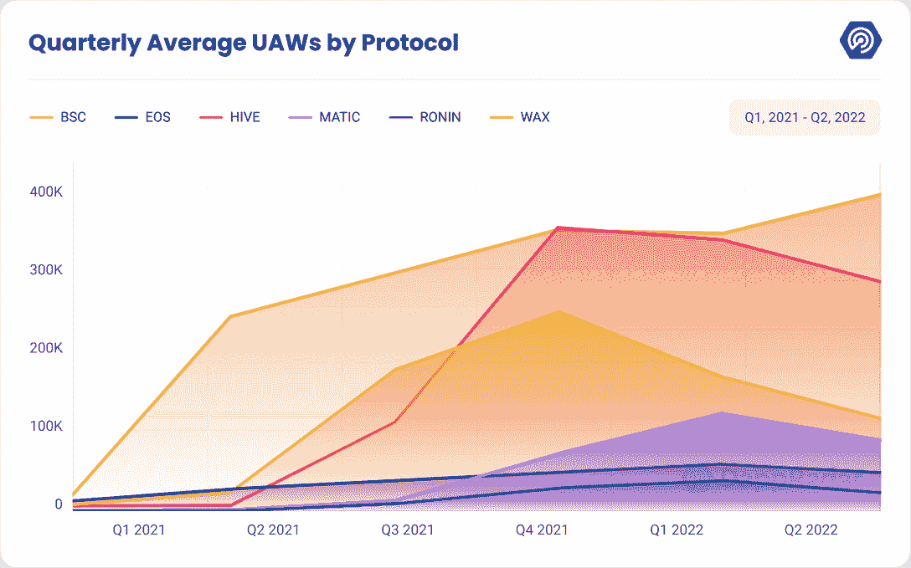
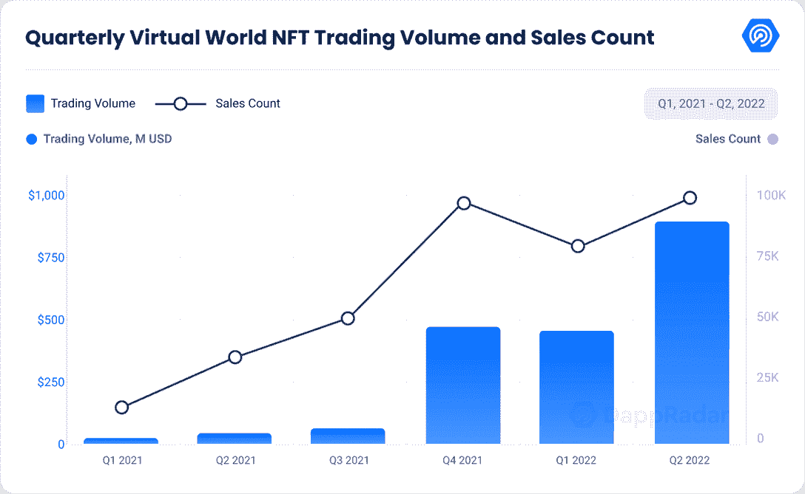
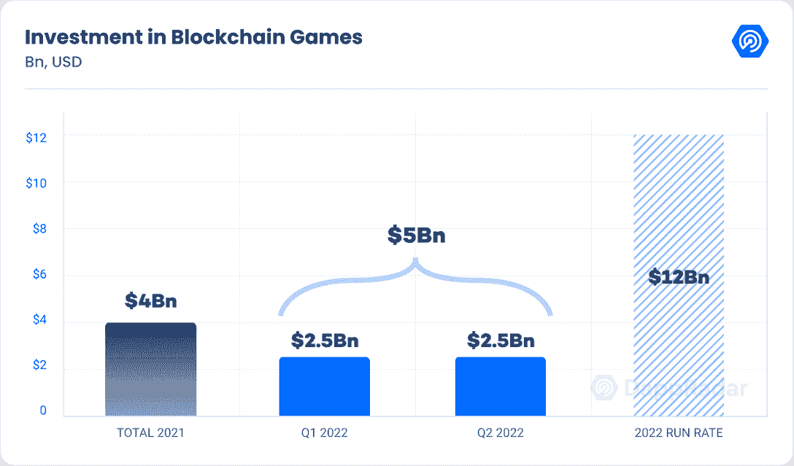
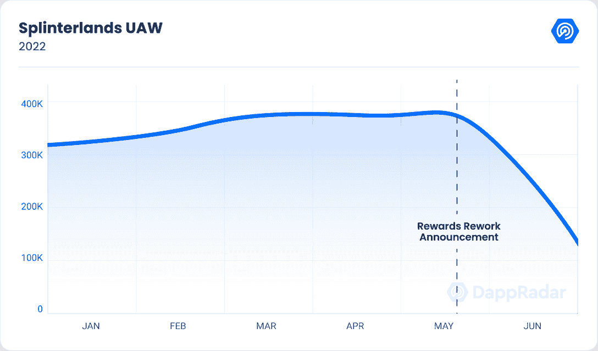
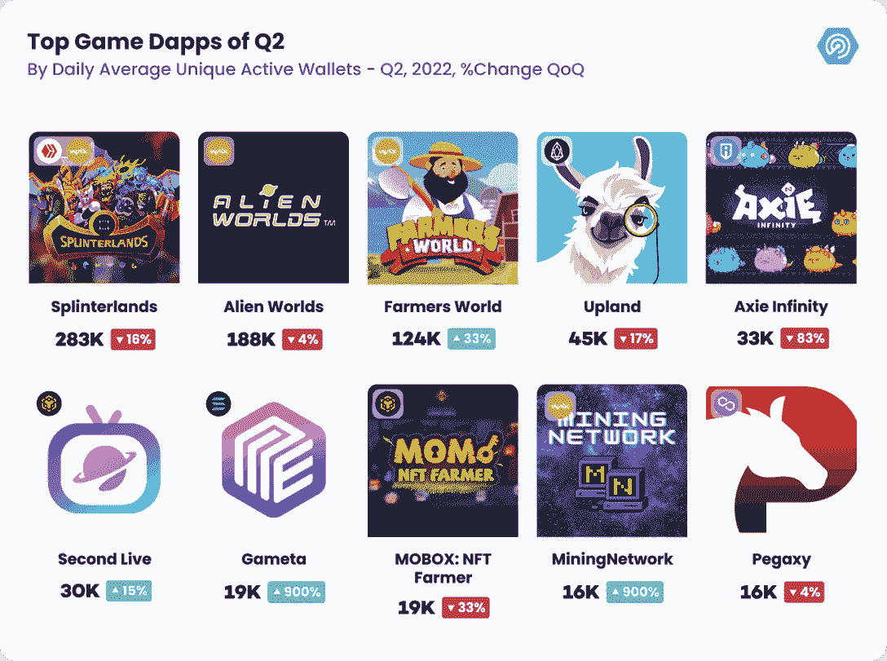
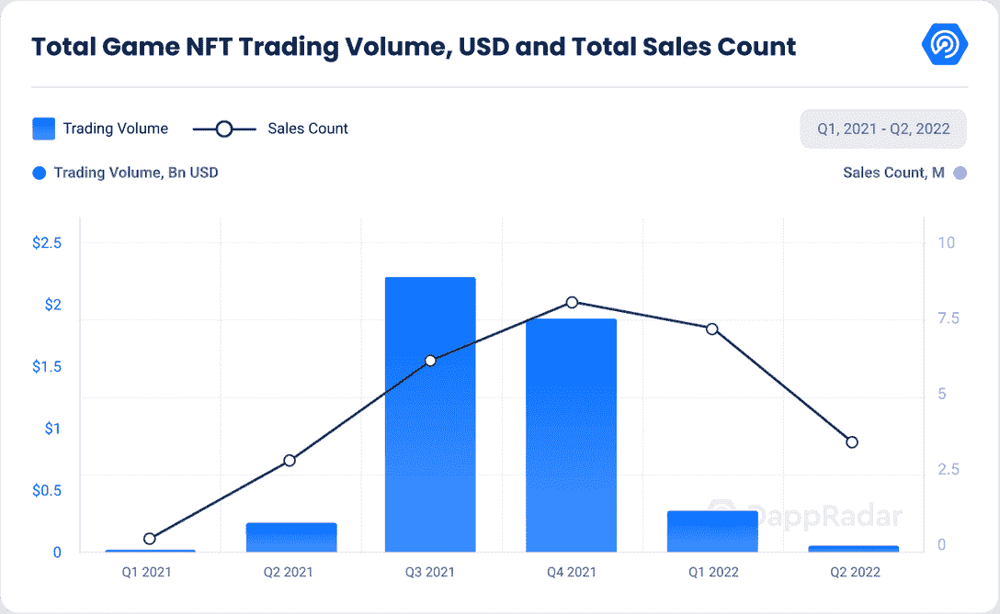

# DappRadar x BGA 运动会报告–Q2 2022

> 原文：<https://web.archive.org/web/https://dappradar.com/blog/dappradar-x-bga-games-report-q2-2022>

## 游戏活动占所有独特活动钱包(UAW)的 52%，在 Q2 有近 110 万台无人机。

## 区块链游戏受熊市的影响最小，因为区块链的活动受到了轻微的挫折。

在熊市期间，区块链游戏和游戏相关的 NFT 的表现优于其他加密垂直行业，并且没有受到太大的影响。这种出色的表现在 6 月份达到顶峰，当时该行业出现了放缓。

[通过 DappRadar 的终极指南了解更多游戏知识](https://web.archive.org/web/20221216112253/https://dappradar.com/blog/gaming-dappradars-ultimate-guide)

由于宏观经济压力，加密行业的许多垂直行业都步履蹒跚。Terra 生态系统的崩溃导致了级联效应，导致了 DeFi 和 NFT 基础设施的倒退。区块链游戏挺过了风暴。

Source: [DappRadar](https://web.archive.org/web/20221216112253/http://www.dappradar.com/)

投资者将他们的韧性解读为继续投资区块链游戏的看涨信号。在 Q2 投资了 25 亿美元，保持了在 Q1 设定的速度。这些投资已经超过了 2021 年设定的 40 亿美元的年度里程碑。按照这种速度，我们预计到今年年底的投资额将达到 120 亿英镑。

## **关键要点**

*   风险投资依然强劲，在 Q2 投入了 25 亿美元。2022 年的总投资已经超过 2021 年的 33%
*   在 Q2 期间,《夹板地》仍然是玩得最多的区块链游戏，平均每天有 283，729 个独特的活动钱包(UAW)。由于奖励结构的调整，游戏在 6 月的 UAV 数量减少了 61%。
*   尽管自 Q1 以来，NFT 的有机销售额下降了 29%，但游戏 NFT 的销售额同比增长了 19%。
*   自从 Q1 事件以来，Axie infinity 由于浪人入侵和 SLP 币贬值而失去了 40%的用户。Axie:起源更新试图改变叙事。
*   自上个季度以来，虚拟世界的 NFT 交易量增长了 97%，销售额增长了 27%。

## **目录**

*   [区块链 52%的活动都是由游戏玩家驱动的](https://web.archive.org/web/20221216112253/https://dappradar.com/blog/dappradar-x-bga-games-report-q2-2022/#The-gaming-dapps-drive-52%-of-all-blockchain-activity)
*   [元宇宙代币暴跌，而数字土地销售一空](https://web.archive.org/web/20221216112253/https://dappradar.com/blog/dappradar-x-bga-games-report-q2-2022/#Metaverse-based-tokens-plummet-while-digital-lands-sell-out)
*   [投资与 Q1 并驾齐驱，25 亿美元投资于 Q2](https://web.archive.org/web/20221216112253/https://dappradar.com/blog/dappradar-x-bga-games-report-q2-2022/#Investments-keep-the-pace-of-Q1-with-2.5-Billion-Invested-in-Q2)
*   [小牌手洗牌——弱牌手弃牌](https://web.archive.org/web/20221216112253/https://dappradar.com/blog/dappradar-x-bga-games-report-q2-2022/#Splinterlands-shuffles-the-deck--weak-hands-fold)
*   [Axie Infinity 试图从原点转向](https://web.archive.org/web/20221216112253/https://dappradar.com/blog/dappradar-x-bga-games-report-q2-2022/#Axie-Infinity-attempts-a-turnaround-with-Origins)
*   [Wax 顶级游戏参与度和十大游戏概述](https://web.archive.org/web/20221216112253/https://dappradar.com/blog/dappradar-x-bga-games-report-q2-2022/#Wax-tops-gaming-engagement-and-Top-10-Games-Overview)
*   [Galaverse 和其他新闻](https://web.archive.org/web/20221216112253/https://dappradar.com/blog/dappradar-x-bga-games-report-q2-2022/#Galaverse-)

## **区块链 52%的活动都是由游戏玩家驱动的**

自上个季度以来，区块链游戏在区块链活动中的份额已经大幅增加了 3 个百分点。游戏活动占所有独特活动钱包(UAW)的 52%，在 Q2 有近 110 万台无人机。

自上个季度以来，UAW 整体活动中的游戏部分已经下降了 7%。与 Defi 的 17%和 NFTs 的 24%相比，这只是一个小挫折。在更广泛的时间范围内，与 2021 年的 Q2 相比，区块链的游戏活动增加了 232%，将其他类别远远甩在身后。

参与区块链游戏的普通无人机数量全面下降了 17%。区块链游戏在 Wax、Hive 和 Solana 等更小更便宜的链上蓬勃发展。

Wax 成为最突出的游戏区块链，本季度平均有 393，933 架无人机，比上一季度增加了 14%。第二大游戏区块链 Hive 平均拥有 283，934 架无人机，其活跃无人机数量下降了 16%。

索拉纳本季度实现了创纪录的增长，增幅高达 612%。经过 Dapper labs 在 Flow 区块链的多次投资，它继续增长和发展，本季度增长了 376%，尽管整体活动仍然很低，Q2 的平均 UAW 仅为 801。

Source: [DappRadar](https://web.archive.org/web/20221216112253/http://www.dappradar.com/)

币安智能连锁一直是最大的游戏区块链之一，但从上一季度开始失去了 32%的用户群，目前平均 UAW 为 113，326。同样，Ronin 失去了 40%的用户，目前在 Q2 平均拥有 22，777 台无人机

许多与游戏相关的基础代币(如 BSC 以太坊和[多边形](https://web.archive.org/web/20221216112253/https://dappradar.com/rankings/protocol/polygon))的价值下降，对游戏内 NFT 资产的价格产生了负面影响，并增加了它们的整体销售数量。

本季度 NFTs 的交易量下降了 82%，销售额也下降了 51%。在一个前所未有的发展中，与去年同期相比，销售量也大幅下降了 75%，而销售量仅略微增加了 19%。

## **元宇宙代币暴跌，而数字土地销售一空**

许多元宇宙的土地令牌已经全线暴跌。受打击最大的是 Axie 和 Mobox，降幅分别为 90%和 95%。

然而，[去中心化](https://web.archive.org/web/20221216112253/https://dappradar.com/hub/token/eth/MANA/ETH?from=0x0f5d2fb29fb7d3cfee444a200298f468908cc942)和[沙盒](https://web.archive.org/web/20221216112253/https://dappradar.com/multichain/games/the-sandbox)本地令牌稍微好一点，损失了 83%的价值。虽然这一挫折非常严重，但并没有对元宇宙的交易量和销售额产生重大影响。这个季度的销售量全面上升了 97%。

相比之下，Polygon 的销量自上个季度以来下降了 26%。以太坊成交量回升，自上个季度以来翻了一番，达到 102%。销售统计描绘了一幅乐观的前景。

以太坊和多边形的销售额分别增长了 17%和 152%，自上一季度以来总体增长了 27%。与 Q2 2021 相比，尽管经历了熊市，但销量仍增长了 2007%，销售数量同样令人印象深刻，增长了 220%。

这种乐观的活动表明，虚拟世界的参与并不取决于它们对最终用户的盈利能力。它表明，尽管本地令牌贬值，虚拟世界对最终用户来说仍然是有趣的，因为社区仍然活跃。

[了解什么是元宇宙:下一代虚拟世界](https://web.archive.org/web/20221216112253/https://dappradar.com/blog/what-is-the-metaverse)

Source: [DappRadar](https://web.archive.org/web/20221216112253/http://www.dappradar.com/)

## **投资紧跟 Q1 的步伐，在 Q2 投资了**25 亿美元。****

 **Q2 继续看好区块链的合作和投资。本季度投资了 25 亿美元，与上一季度的投资保持一致。虽然我们看到了逐渐减少，因为 6 月是投资最慢的一个月，只有 5 亿美元。

尽管如此，今年的投资总额预测已经增加到 120 亿英镑，比上一季度增加了 20%。

Source: [DappRadar](https://web.archive.org/web/20221216112253/http://www.dappradar.com/)

### **RLTY**T2—元宇宙司仪

[RLTY](https://web.archive.org/web/20221216112253/https://rlty.live/) 是一家成立于 2022 年 1 月的元宇宙活动公司，旨在解决与 covid 相关的锁定所带来的会议问题。他们帮助主办和组织数字会议、贸易展览、节日或聚会等娱乐活动以及时装秀。

RLTY 已经创建了易于使用的事件构建工具，可与[体素](https://web.archive.org/web/20221216112253/https://dappradar.com/ethereum/collectibles/voxels)相媲美，用户可以在其中创建空间并与他们的化身互动。它最近宣布成功完成了一轮 400 万€的种子前期融资。

像 Sorare、The Sandbox 等著名项目的创始人，以及基马风险投资公司、Blue Wire Capital、Stake Capital 和 Monoceros Venture 等风险投资基金都参与了这轮融资。

### **A16 投资看好区块链游戏**

Andersen Horowitz，又名 A16 Investments，是一家专注于新兴技术的著名风险基金。去年 5 月，他们宣布建立一个 45 亿美元的加密基金 4。该基金将推动的倡议清单很广。最值得注意的方面是 web3 游戏、DeFi、第 1 层和第 2 层基础设施、桥梁、Dao、NFT 社区和创作者货币化。该基金是 A16 正在进行的一系列投资的一部分，使其总额达到 76 亿美元，以促进 web3 的增长。

### 不变的 X 射线把我们从过去带到了未来。

对于许多在 2000 年代末熟悉 flash 游戏的玩家来说，Kongregate 将是一个熟悉的名字。Kongregate 成立于 2006 年，是一个知名的平台和聚合器，为有抱负的游戏开发者发布他们的游戏。

他们最近发布了 Bitcerse，这是一个 web3 游戏和区块链游戏的数字图书馆。Kongregate 和 Immutable X 合作创建了一个由 IMX 土著代币组成的 4000 万美元的基金，授予有抱负的区块链开发者。

## 小牌手洗牌-弱牌手盖牌。

Source: [DappRadar](https://web.archive.org/web/20221216112253/http://www.dappradar.com/)

Q2 仍是玩得最多的游戏，有超过 283，000 名 UAW 玩家，但它已经在六月被取代了在位国王的位置。它失去了 61%的用户群，降至 136，703 UAW。

虽然最近的许可证节点销售取得了巨大的成功，几分钟内售出了 2000 个验证器笔记，烧掉了 1450 万个 sp，并为游戏的 DAO 增加了 400 万美元，但最近对奖励结构的改变可能没有。

在六月中旬，开发者改变了奖励结构，以抑制每日登录奖励和对新手卡的过度依赖。他们将注意力转移到持续赢得游戏、完成日常任务和创造竞争平台上。

这些变化使得许多低努力的参与者流失，并大幅削减了严重依赖游戏免费方面的用户比例。现在的社区反映了 dapp 活跃的玩家基础。

## **Axie Infinity 尝试与 Origins 的一次翻盘。**

Source: [DappRadar](https://web.archive.org/web/20221216112253/http://www.dappradar.com/)

自 1 月份以来，Axie 就一直在走下坡路，本季度又遭受了一次打击。它失去了 40%的用户群，Ronin bridge 黑客事件加剧了这一趋势，导致超过 6 亿美元被盗。

黑客事件的新进展已经曝光。Sky Mavis 的一名首席工程师陷入了一场高度协调的社会工程骗局。

有人在 LinkedIn 上找到了这位工程师，向他提供了一份非常丰厚的工作，他已经和假想的雇主进行了多次面试。最终，他收到了一份包含工作邀请的 PDF，其中执行了一个恶意脚本，该脚本接管了验证器笔记并劫持了系统。

一些好消息是，Axie 正试图扭转局面，最终允许 Axie 的土地所有者用他们的土地做赌注，并获得 AXS 代币。奖励金额高度依赖于所标土地的稀有程度，但从 0.08 到 32 AXS 不等，最高可达 473 美元！

而且，Axie 打算用 Axie: Origins 彻底更新系统。在 PvP 或 PvE 中组队和战斗的基本前提不变。然而，几乎其他一切都被改变了。

虽然列表很大，但一些重要的变化包括免费的轴，使用月亮碎片和 SLP 的改进工艺系统，技能的返工，以及使用符文和符咒的更深入的定制机制。

所有这些变化都让 Axie 走上了正轨，因为无人机的平均数量在 6 月份增加了 247%。

## **Wax 顶级游戏参与度和十大游戏概述**

Source: [DappRadar](https://web.archive.org/web/20221216112253/http://www.dappradar.com/)

如前所述，令牌组学的最新发展深刻影响了本季度前 10 大游戏的排名。尽管许多游戏代币的价格大幅回落，但玩家的活动或多或少保持不变。这是一个乐观的指标，再次证实了区块链游戏除了为玩家提供金钱奖励之外，还有着内在的吸引力。

《外星世界》仍然是稳定的灯塔，自上个季度以来，平均 UAW 仅下降 4%，自《2021 年 Q2》以来，略有上升 4%。这些都是好消息；然而，底层游戏过于简单的玩法导致一些人怀疑参与游戏的实际玩家数量。在冷却时间之外点击几个按钮的重复性可以很容易地自动化。这让人们猜测，链上活动的一部分是人为的。

Farmers world 仍排在第三位，本季度用户数量比上季度增加了 33%。增长似乎正在放缓，因为该游戏在 6 月份的月平均无人机数量减少了 4%。

就像《异形世界》一样，高地公司发现自己处于一个舒适的位置，看不到自己朝任何方向前进。自上个季度以来，整体用户量小幅下降了 17%；然而，在第二季度，广泛的玩家基础保持稳定，每月在 40，000 人上下波动。

Source: [DappRadar](https://web.archive.org/web/20221216112253/https://dappradar.com/ethereum/collectibles/voxels)

同样， [DeFi 王国](https://web.archive.org/web/20221216112253/https://dappradar.com/multichain/games/defi-kingdoms)、[炸弹加密](https://web.archive.org/web/20221216112253/https://dappradar.com/binance-smart-chain/games/bomb-crypto)和 [Mobox](https://web.archive.org/web/20221216112253/https://dappradar.com/binance-smart-chain/games/mobox-nft-farmer) 的用户群也出现了严重的下滑，因为它们的原生令牌基本上失去了 90%的价值。

Defi 王国继续下滑，Q1 流失了 32%的用户，自 5 月以来流失了 20%。自上个季度以来，BombCrypto 失去了 71%的用户。Mobox 也是同样负面趋势的一部分，因为它的 Q2 结果比上一季度低 33%，6 月是迄今为止最糟糕的一个月，平均 UAW 刚刚超过 9000。

随着老巨头为即将到来的新项目让路，并非一切都是灰暗的。本季度，我们见证了[矿业网络](https://web.archive.org/web/20221216112253/https://dappradar.com/blog/the-miningnetwork-game-on-wax-attracted-more-than-800k-users-within-30-days)的崛起。这是一个免费游戏和游戏赚取，让玩家模拟采矿的经验。

这款游戏为玩家提供了一个免费的 ASIC 芯片，NFT 用它来挖掘股票，这是游戏的内部货币。然后，这些股份可以兑换成 BTK 代币，或者直接用于升级 ASIC 芯片。

BTK 代币可以购买新的 ASIC 或者在公开市场上交易。随着越来越多的人连接到网络，这种复杂的正反馈循环允许 devs 调整产生的份额数量。BTK 价格在 6 月中旬达到 0.80 美元的峰值，目前为每 BTK 0.20 美元。

Source: [DappRadar](https://web.archive.org/web/20221216112253/http://www.dappradar.com/)

[向日葵地](https://web.archive.org/web/20221216112253/https://dappradar.com/blog/sunflower-land-and-its-sfl-token)是 Polygon 对 Wax 的[农民世界](https://web.archive.org/web/20221216112253/https://dappradar.com/wax/games/farmers-world)的回答。它已经从其母项目向日葵农民(Sunflower Farmers)取得了重大转变，向日葵农民在早期开发阶段遭到黑客攻击，迫使开发人员进行重组。

自从向日葵地的测试版发布以来，这个项目已经有了巨大的发展。从 4 月份只有 10 个钱包到 6 月份超过 11000 个。季度环比增长超过 9000%，是本赛季增长最快的游戏！

最后，我们在索拉纳区块链也有了一个新的孩子，他正在获得牵引力——Gameta。Gameta 是一款堪比 Mobox 的 dapp。这是一个有趣的盒子，充满了许多不同的子 dapps，构成了它的生态系统。

连接到 Gameta 的玩家支付少量的连接费，就可以访问许多“玩赚”游戏、编辑视频、制作字体和其他创意应用的工具，以及奖励用户完成教程的“学赚”材料。

Gameta 的经济由 HIP 令牌和 W3G 令牌组成，HIP 令牌通过完成动作获得，W3G 令牌充当高级货币。此外，玩家可以获得应用内 NFT，这提高了玩家的运气，能量和效率属性。这些属性增加了令牌的生产，但是不能在 dapps 之间转移。

该平台面向广泛的受众，让人们轻松进入 web3 的世界。dapp 于 5 月下旬在 Solana 上发布，6 月份注册了近 30，000 个平均 UAW。

## Galaverse 和**其他新闻**

### Gala 集游戏、电影和音乐于一身。

以《蜘蛛坦克》和《帝国的回声》等热门游戏而闻名的 Gala，今年 6 月举办了一场 Galaverse 活动，宣布了他们的许多计划和即将到来的项目。

作为他们游戏项目的一部分，他们用射箭测试小游戏展示了米兰多斯的新机制。只有钱包里有米兰多斯样品 NFT 的人才能玩这个迷你游戏。

此外，他们还推出了自由式足球 2、第三人称足球游戏、冠军竞技场、回合制 RPG 等游戏，当然，还有他们第一次以[勇气](https://web.archive.org/web/20221216112253/https://dappradar.com/blog/epic-games-store-adds-blockchain-game-grit-by-gala-games/)进入传统游戏的聚光灯下。一个狂野西部主题的皇家战役将出现在 Epic 游戏商店。

除了奥运会，Gala 还通过制作 Gala 电影和 Gala 音乐创建了自己的元宇宙，探索艺术、娱乐和 NFTs 的可能性。

### 沙盒迁移到多边形

沙盒准备迁移到多边形区块链，以降低交易费用并加快处理时间。此举对 polygon 来说意义重大，它可能会在未来几个月内看到其平均无人机的大幅增长。

沙盒的所有者 Animoca Brands 及其子公司 T2 Quidd 已经推出了一个铸造/非铸造解决方案——Mintables。Mintables 简化了创建 NFTS 的过程，并允许用户“取消铸造”他们的数字收藏品，以便在其他区块链上铸造。

Animoca Brands 最近收购了 Notre Game，进一步扩大了其开发商的名单，Notre Game 是一家捷克开发商，以 NFT 的卡片收藏游戏 Scratch Wars 而闻名。

Scratch Wars 是一款在捷克和斯洛伐克发行的游戏，销售额达 300 万美元。Notre Game 目前正在开发这款游戏的继任者，具有类似的机制，名为 Scratch Lords。

### 冲积层土地出售

Illuvium 出售了它在 NFTS 的第一块土地，并且取得了巨大的成功。所有四层的 20，000 块土地很快销售一空，总收入为 7，200 万美元。

由于荷兰式拍卖，人们可以以他们都满意的价格购买地块，从而避免了天然气战争。此外，Illuvium 已经宣布，在不久的将来，他们将释放出售 Ultivars。

终极战士是玩家最喜欢的生物的可定制化身，可以用所有的衣服装饰，并被铸造成游戏中的化身。

Ultivars 的发布日期尚未公布，但根据官方网站，100%的销售额将进入 Illuvium vault 进行收入分配。

### 烬剑挑战和迁移

6 月，Ember Sword 开展了为期一个月的社区活动。在运动期间，提供了 20 块土地作为为期一周的社区挑战和抽奖的奖品。该游戏还最终使玩家能够迁移到不可变的 X，以促进以太坊的活动，并允许无气交易。

## **前进**

对于区块链奥运会来说，这是一个喜忧参半的季度。虽然游戏活动仍然主导着整体格局，但我们也开始看到行业中出现的第一条裂缝，许多顶级区块链游戏在 6 月底开始表现疲软。

对一些人来说，这可能是一个拉响警报并逃之夭夭的机会。虽然这些数字不值得担心，但其他因素可以很容易地解释它们。

首先，今年 6 月是宏观经济数据最严峻的一个月。美联储利率上升，通货膨胀达到自 20 世纪 70 年代以来的最高水平。

秘密市场比传统资本市场更加不稳定，因此对经济事件的反应也更加敏锐。另一方面，我们也正处于暑假的高峰期。许多人都出去度假了，所以很自然，没有像寒冷的月份里那样多的人玩游戏了。

总体而言，前景依然乐观。投资仍以与上一季度相同的速度涌入，而我们已经创造了新的投资记录，并寻求在年底前攀升至 120 亿美元。

在花旗银行最近的评估中，元宇宙将在未来八年内成长为一个 13 万亿美元的产业。区块链游戏正在慢慢从传统游戏行业挖走资深人才。

例如，来自暴雪、Bungie 和 Activision 的开发人员都过渡到 web3 项目，区块链游戏在 Epic Games 这样的主流商店中占据重要位置。这种现象将使采用变得容易，并保证体验的质量。

最后，尽管在这些困难时期，加密货币遭到了诈骗和负面报道，但人们仍然对加密货币和 NFTS 持积极态度。万事达卡最近的一项民意调查显示，35，000 名参与者中有 47%对 NFTs 和密码行业表示了积极的看法。

 NewsletterUnsubscribe at any time. [T&Cs](https://web.archive.org/web/20221216112253/https://dappradar.com/terms) and [Privacy Policy](https://web.archive.org/web/20221216112253/https://dappradar.com/privacy-policy)**