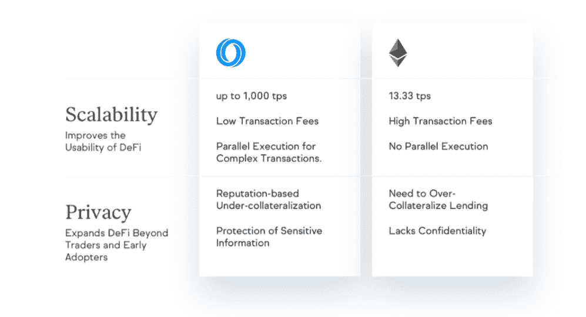

# DappRadar X Oasis Network 50 万美元的加速器计划

> 原文：<https://web.archive.org/web/https://dappradar.com/blog/dappradar-x-oasis-network-500000-accelerator-program-2>

## 10 个团队，每个团队最高可获得 5 万美元

***更新:加速器计划于 2021 年 2 月 9 日启动—[获取更多信息并在此申请](https://web.archive.org/web/20221129153156/https://airtable.com/shreZAEcjcrTFpwT0)。***

**[这一令人兴奋的新合作伙伴关系](https://web.archive.org/web/20221129153156/https://dappradar.com/blog/introducing-the-500000-dappradar-x-oasis-accelerator-program)将使 10 个区块链团队每个团队获得高达 50，000 美元的资金，以及他们启动项目所需的资源和技术知识。一旦 DappRadar 与 Oasis 网络的整合完成，团队将获得在全球 Dapp 商店增加可见性的额外好处。**

成功将其 Dapp 部署到 Oasis Network 的团队将有机会在推介日获得来自[2 亿美元 Oasis 生态系统基金](https://web.archive.org/web/20221129153156/https://oasisprotocol.org/ecosystem-fund)的进一步投资，这是加速器计划的高潮。

Oasis Network 是领先的、可扩展的、支持隐私的区块链，专为开放金融和负责任的数据经济而设计。结合其高吞吐量和安全架构，该网络可以为私有、可扩展的 DeFi 供电。其独特的隐私功能可以重新定义 DeFi，并创建一种称为令牌化数据的新型数字资产，使用户能够控制他们生成的数据，并通过应用程序获得回报。

dappRadar 现在[是全球 dapp 商店](/web/20221129153156/https://dappradar.com/blog/why-users-will-love-the-worlds-dapp-store/)，是领先的 Dapp 发现门户，拥有一个由积极进取的 Dapp 开发者组成的坚实社区，致力于增强用户体验。[Oasis x DappRadar 加速器项目](https://web.archive.org/web/20221129153156/https://dappradar.com/blog/introducing-the-500000-dappradar-x-oasis-accelerator-program)将为被选中的项目提供工程和营销支持，这些项目可以使用拨款移植到 Oasis，或者建立一个全新的项目。最终目标是将 dapps 集成到 Oasis 网络中，供社区使用。将优先考虑绿洲本地项目建设 DeFi，P2E 博彩，数据隐私解决方案，但我们欢迎所有提交。

## 为什么选择绿洲网络？

除了通过新的加速器计划提供的资助，还有许多令人信服的理由让 dapp 开发者选择 Oasis 作为发布 dapp 的平台。Oasis 网络具有可扩展性，是 DeFi 的理想选择，因为它具有即时终结性、比以太坊低 99%的燃气费、高吞吐量、隐私保护和 MEV 防御。

该网络的尖端可扩展性功能有助于解决困扰其他第 1 层网络的高交易费用和低吞吐量问题。结合起来，Oasis 提供可扩展的私有 DeFi 的独特能力有望使其成为解锁下一代 DeFi 用例的领先平台。此外，该网络每秒可以处理多达 1000 笔交易，而以太坊的每秒处理量为 13.33 笔。

Oasis Network 拥有一个由节点运营商、开发人员、企业合作伙伴、大使和数千名参与全球社交渠道的社区成员组成的繁荣社区。我们将很快发布更多关于加速器的详细信息。

确保[将 DappRadar](https://web.archive.org/web/20221129153156/https://dappradar.com/blog) 加入书签，并关注更多更新。同时，您可以通过以下网址了解有关 Oasis 的更多信息:

*   [了解更多关于绿洲生态系统基金的信息](https://web.archive.org/web/20221129153156/https://oasisprotocol.org/ecosystem-fund)
*   [了解更多关于绿洲网络的信息](https://web.archive.org/web/20221129153156/https://oasisprotocol.org/community)

 NewsletterUnsubscribe at any time. [T&Cs](https://web.archive.org/web/20221129153156/https://dappradar.com/terms) and [Privacy Policy](https://web.archive.org/web/20221129153156/https://dappradar.com/privacy-policy)