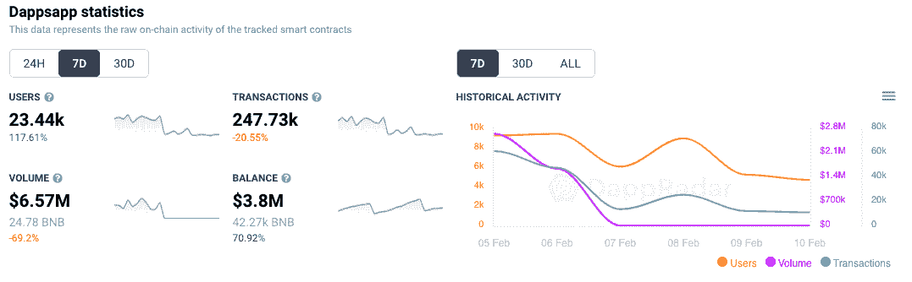
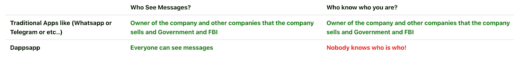

# Dappsapp 为区块链带来安全消息

> 原文：<https://web.archive.org/web/https://dappradar.com/blog/dappsapp-brings-secure-messaging-to-the-blockchain>

## 在过去 7 天内，活跃用户增加了 100%以上

随着连接到消息服务的活跃钱包数量增长超过 117%，新的多链消息服务 Dappsapp 本周引起了人们的关注。该应用程序，保持用户身份完全隐藏运行在币安智能链，雪崩，多边形。

随着消费者寻找 Whatsapp 或 Facebook Messenger 的替代品，对消息服务的需求总是存在的。切换 messenger 服务的原因通常与隐私有关。像 Dappsapp 这样的新信使服务试图利用这一点。

截至发稿时，Dappsapp 的活跃钱包数周环比增长超过 117%，达到 23440 个。交易量超过了 247，000 笔，比上周下降了 20%，因为用户来回发送信息只需要很少的费用。有趣的是，每个网络的价格不同，在 Polygon 上发送消息是最便宜的，每条消息仅 0.02 美元。在 BSC 上发送每条消息的费用为 0.50 美元，在 Avalanche 上为 0.25 美元。

## 那么 Dappsapp 是如何工作的呢？

该网站非常简单，底部有一个横幅，说明 Dappsapp 和其他流行的消息平台之间的区别。问题的关键在于，虽然每个人都可以在 Dappsapp 上看到消息，但身份是完全隐藏的，没有人知道谁是谁。

要开始聊天，用户可以选择一个网络，然后发送一个私人链接。或者，在“交谈”部分写下朋友的元掩码地址，以便彼此交谈。

如前所述，这项服务现在感觉非常简单，只有简单的功能，没有应用程序技术方面的文档。此外,“如何使用”页面链接直接导致 404 错误。然而，鉴于最近对消息平台安全问题的高度关注，这可能正是人们正在寻找的。超级安全、简单易用的[区块链消息应用](https://web.archive.org/web/20220930085955/https://dappradar.com/multichain/social/dappsapp)。单纯从数据来看，它似乎正在获得牵引力。我们将继续关注它，并努力在短期内揭示更多的细节。