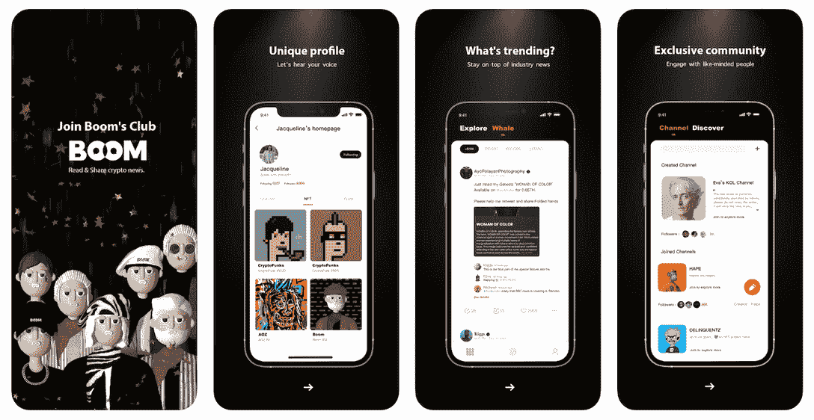
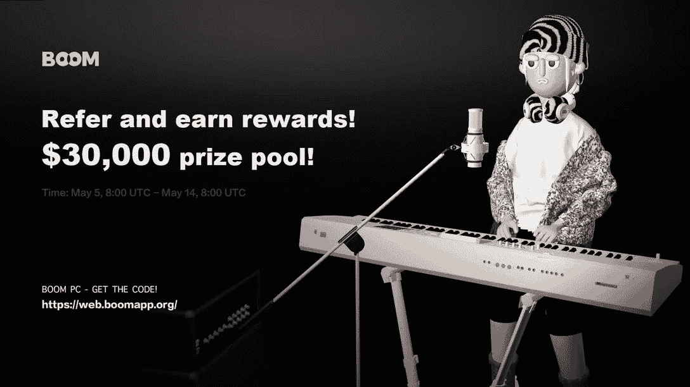
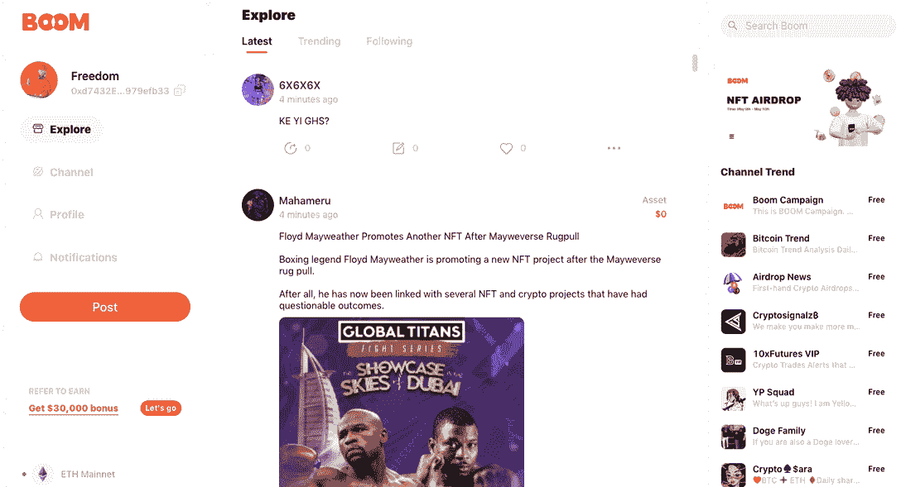
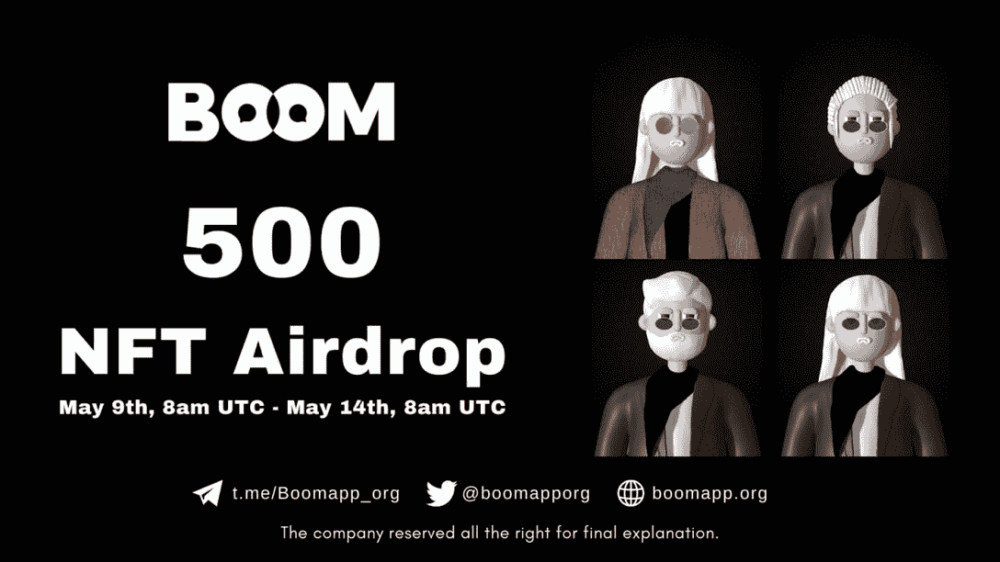

# 分散的元宇宙社交网络繁荣宣布 NFT 空投

> 原文：<https://web.archive.org/web/https://dappradar.com/blog/decentralized-metaverse-social-networking-boom-announces-nft-airdrop>

## 用户可以推荐朋友，并为不断扩大的 Boom 生态系统赢得代币

**Boom 致力于构建一个 Web3 社区驱动的社交网络，通过创新转型，将重点放在社区而不是看门人的兴趣上，从而为内容创作者和消费者提供支持。Boom 适用于桌面和移动设备，而第一个 NFT 系列将于本月推出。**

**概要:**

*   Boom 在桌面和移动设备上都提供了用户友好的 dapps。
*   Boom 推出了一项参考赚取计划，以 3 万美元的奖金推动生态系统的扩张。
*   **BOOM NFT 空投活动启动，超过 100，000 人加入“推荐-赚取”活动**

社交媒体已经成为 Web 2.0 最重要的发明之一。根据 Hootsuite 的数据，现在全球有 46.2 亿人使用社交媒体，超过世界人口的一半。此外，人们每天花近 7 小时使用互联网，其中 2 小时 37 分钟花在社交媒体上。

社交媒体超越地理限制将人们联系在一起，并为任何人提供表达自己的平台。毫无疑问，社交媒体在我们的日常生活中扮演着重要的角色。然而，集中式社交媒体平台也引发了担忧。其中包括导致回音室的透明算法、不必要的审查、数据滥用以及对广告盈利的依赖。

[Boom](https://web.archive.org/web/20220925084515/https://dappradar.com/ethereum/social/boom) 利用区块链技术和不可替代的代币，不仅解决了上述问题，还为用户提供了大量的赚钱机会。

## 什么是 Boom？

Boom 是一个去中心化的 SocialFi 平台，用户可以拥有并展示他们的数字资产。它致力于通过为全球用户提供一个更加分散和透明的网络来分享思想和建立联系，同时获得奖励，从而在数字世界和现实世界之间架起一座桥梁。

Boom 为用户提供 PC 版和移动版 dapps，界面精简，功能强大。因此，事不宜迟，让我们深入了解 Boom 提供的功能:

*   **探索**:最新版本的 Boom 允许用户创建不同形式的内容，并与其他用户的帖子进行互动。此外，用户可以使用“最新”、“趋势”和“关注”等过滤按钮轻松浏览信息
*   **频道** : Boom 鼓励用户成为自己创意的策展人。在“频道”中，用户可以创建更复杂的内容并收取订阅费。
*   **Web3 简介**:用户可以在这里展示他们的 Web3 成就，包括 NFTs 和数字资产组合。未来它将支持更多类型的 Web3 数据。

## Boom 邀请用户加入其推荐计划以获取奖励

最近，Boom 推出了一项名为 Refer-to-Earn 的推荐计划，以激励忠诚和活跃的用户。邀请其他人加入 Boom 生态系统的人有机会分享价值高达 3 万美元的奖品。该活动从 2022 年 5 月 5 日持续到 5 月 14 日。

该计划的成功显而易见，吸引了超过 100，000 名成员加入 SocialFi 生态系统。

要参与该活动，用户需要从 Boom PC 版本获得一个推荐代码。一旦用户登录到平台，他们会看到一个“参考赚取”按钮在右上角的网页。

Boom 将使用此代码作为标识符来跟踪邀请活动的参与者，并相应地结算奖金。很简单，用户邀请越多，就能获得越多的奖励。最后，值得注意的是，所有奖品将在活动结束后七天内发送到每位参与者的 Boom 钱包地址。

## 不要错过繁荣 NFT 空投

这颗繁荣的星球将为其特权居民发放 NFT 形式的身份证。该系列将有鲸鱼、影响者、消费者、创作者和艺术家等角色，每个人都扮演其指定的角色，并共同努力建立 Boom 的生态系统。拥有 Boom NFT 将为持有者带来许多好处，包括获得 Boom token 空投、增加活动奖励、获得治理权等。

NFT 空投活动将在 2022 年 5 月 9 日至 5 月 14 日的推荐赚取计划之后开始。更多关于 Boom NFT 空投的细节可以在这里找到。

## 与 boom 一起踏上社交之旅

Boom 致力于建立一个 Web3 社交网络，将权力转移回社区。Boom 团队已经为 2022 年制定了一个稳健的路线图。更多高级功能、盈利计划和代币优惠即将推出。此外，Boom 平台将于 2022 年 5 月加入 OKC 生态系统，作为其首个 SocialFi 项目。2022 年 5 月 9 日，两个平台之间将举行 AMA 会议。如果你想听到更多关于 Boom 令人兴奋的计划，请圈出日期。

了解有关 Boom 的更多信息:

[网站](https://web.archive.org/web/20220925084515/https://boomapp.org/)
[推特](https://web.archive.org/web/20220925084515/https://twitter.com/boomapporg)
[电报](https://web.archive.org/web/20220925084515/https://t.me/Boomapp_org)
[媒体](https://web.archive.org/web/20220925084515/https://boomapp-org.medium.com/)

**免责声明** —这是一篇赞助文章。DappRadar 不认可本页面上的任何内容或产品。DappRadar 旨在提供准确的信息，但读者应该在采取行动之前总是自己做研究。DappRadar 的文章不能被认为是投资建议。