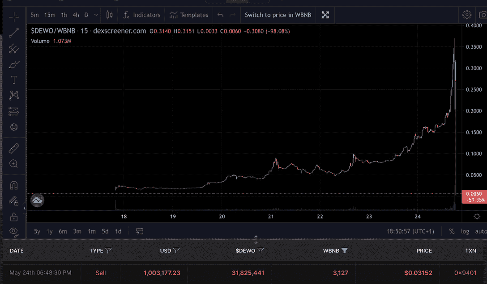
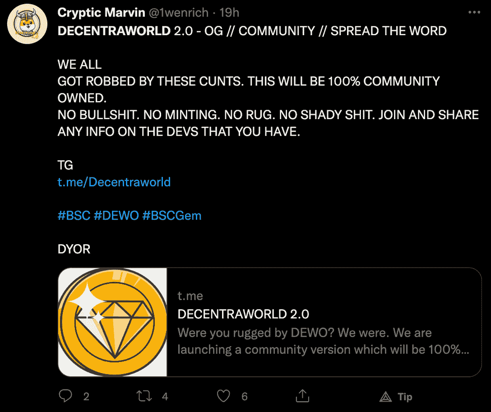

# 分散世界地毯拉漏超过 100 万美元在 BNB

> 原文：<https://web.archive.org/web/https://dappradar.com/blog/decentraworld-rug-pull-drains-over-1-million-in-bnb>

## 社区的愤怒和指责接踵而至，BNB·钱恩承担了责任

昨晚，分散世界令牌出现了惊人的价格下跌。 **这发生在创始人耗尽 BNB 国库和取消项目的时候。结果，骗子带着价值超过 100 万美元的 BNB 代币跑了。**

## 总结:

*   分散世界[沃德代币价格暴跌](https://web.archive.org/web/20220706105049/https://dappradar.com/blog/decentraworld-rug-pull-drains-over-1-million-in-bnb/#rug)，同时该项目的官方网站和推特账号被删除
*   分散的世界社区在推特上表达了他们的愤怒和愤慨
*   衍生项目已经开始涌现
*   [BNB 链承担了一些热量](https://web.archive.org/web/20220706105049/https://dappradar.com/blog/decentraworld-rug-pull-drains-over-1-million-in-bnb/#magnitude)，因为这不是第一个地毯拉在这个区块链

## 分散世界地毯拉流失数百万资金

昨晚，Twitter 上响起了警钟，分散世界的本土标志沃德在几秒钟内失去了大部分价值。价格下跌是出乎意料的，因为该项目，其原生令牌已经看到了一个非常积极的发展趋势，直到那一刻。

不幸的是，正如后来披露的那样，价格下跌是由当时价值超过 100 万美元的地毯引起的。分散世界的创始团队抽干了项目的金库，偷走了 3127 BNB。

Source: [Twitter](https://web.archive.org/web/20220706105049/https://twitter.com/Amy16486454/status/1529158222300471296/photo/1)

一些 Twitter 用户声称，就在 SafeMoon 将分散世界地址列入安全交换合作伙伴白名单几小时后，就发生了这场闹剧。即使是这种情况，SafeMoon 官方[禁止](https://web.archive.org/web/20220706105049/https://twitter.com/SafeMoonNewsBot/status/1529166350375084033)与 rug pull 相关的钱包地址。

随着沃德代币的价格大幅下跌，用户和代币持有者开始试图调查到底发生了什么。不幸的是，该项目的所有官方链接和社交媒体资料都被删除了。当然，这导致了社区成员的巨大愤怒。

## 社区愤怒和分散世界 V2

在数百万资金被盗和广泛的社区愤怒的背景下，一群用户决定开始衍生项目。虽然一些社区成员在损失了数千美元的沃德代币后仍然耿耿于怀，但其他人渴望再试一次。

V2 分散世界组织声称完全由社区所有。不过，值得注意的是，投资此类衍生项目是有风险的，尤其是在经历了如此大规模的并购之后。

## BNB·钱恩承受了一些压力

Twitter 上爆发了关于沃德价格下跌和分散世界地毯拉仇恨的评论。然而，并非所有的负面情绪都针对项目本身。一些用户发现 BNB 连锁店也是造成这种情况的罪魁祸首。

不幸的是，这不是 BNB 链上的替代硬币第一次变得粗糙。最近比较令人印象深刻的一个案例是[鱿鱼令牌](https://web.archive.org/web/20220706105049/https://dappradar.com/blog/squid-game-token-scam-rugpull)。随着鱿鱼游戏迷开始投资，该项目越来越受欢迎，他们中的一些人认为网飞秀和令牌之间有官方联系。

虽然 SQUID token 创下了 2860 美元的历史新高，但它最终损失了 99.9%的价值。这件事发生在该项目的开发者套现并关闭了该项目的网站和社交媒体简介之后。听起来熟悉吗？

考虑到这两种情况下的损失程度，密码爱好者必须彻底研究他们投资的项目。虽然分散世界的创始人只接受了 100 万被盗资金，但他们本可以进一步推动这一骗局，等待进一步提高沃德代币的价值，就像鱿鱼的情况一样。

然而，人们也需要知道 BNB 链的影响到底在哪里。任何人都可以启动令牌，用户也可以自由地这样做。问题是是否有人应该投资它，也许这一切都归结于教育。

随着熊市将更多骗子和虚假项目推到聚光灯下，DappRadar 将继续监测加密空间。查看[这篇有用的文章](https://web.archive.org/web/20220706105049/https://dappradar.com/blog/4-tips-on-blockchain-cybersecurity-stay-safe-in-crypto/)，了解如何在加密领域保持安全并保护您的投资。此外，你可以在 [Twitter](https://web.archive.org/web/20220706105049/https://twitter.com/dappradar) 上关注 DappRadar，以首先获得最新的加密更新。

 NewsletterUnsubscribe at any time. [T&Cs](https://web.archive.org/web/20220706105049/https://dappradar.com/terms) and [Privacy Policy](https://web.archive.org/web/20220706105049/https://dappradar.com/privacy-policy)