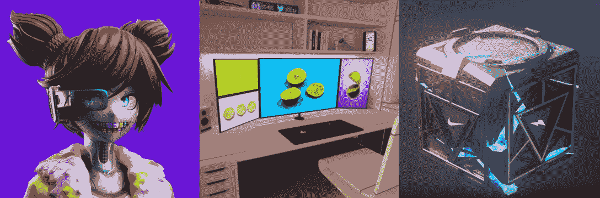
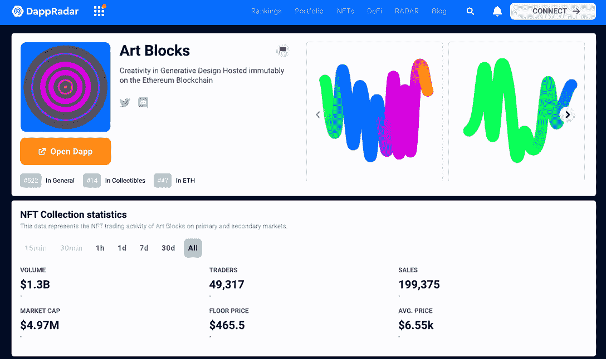
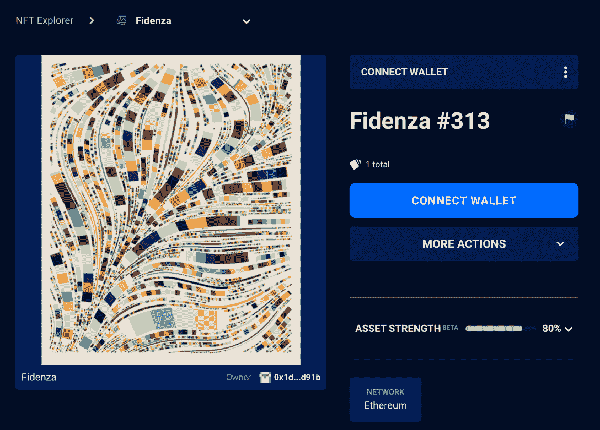

# Deep Objects 让每个人都可以穿上时尚的人工智能设计的运动鞋

> 原文：<https://web.archive.org/web/https://dappradar.com/blog/deep-objects-lets-everyone-wear-stylish-ai-designed-sneakers>

## Deep Objects 将于 10 月 10 日发售 10000 台 NFT，持有者可以参与品牌的产品设计和创作。

Deep Objects 希望通过使用人工智能来使设计民主化。该项目将发行 10，000 份国家森林公园，并邀请持有者参与其最终产品的策划和发行。

内容:

*   人工智能和生成艺术已经成为人们创造艺术和设计的重要工具。
*   Deep Objects 是一种分散化的设计，它采用自下而上的方法，利用人工智能来创建运动鞋等时尚物品。
*   该工作室将于 10 月 10 日发布由 10，000 枚代币组成的 NFT 系列。
*   这些 NFT 的持有者将在运动鞋设计过程中有发言权，并从产品的未来收入中受益。
*   引领虚拟时尚空间的创新，RTFKT、Fabricant、Deep Objects 都有自己独特的卖点。

去年 11 月，耐克收购了虚拟运动鞋公司 RTFKT，这是 CloneX NFT 系列背后的团队，以加速其元宇宙游戏。这一事件标志着大公司步入数字化的趋势。

一个类似于 RTFKT 但不太为人所知的团队是 F T R，这是一个创意工作室，通过人工智能和区块链等新兴技术带来文化转变的想法。秉承其愿景，F T R 推出了分散式设计工作室 Deep Objects。

这个设计工作室利用 NFT 技术和各种社区驱动的方法来孵化不同的商品，第一期是运动鞋。但是，值得注意的是，Deep Objects 的野心远不止于此。请继续阅读，了解所有相关信息。

[Check out Deep Objects’ collection](https://web.archive.org/web/20221130135345/https://dappradar.com/hub/nft-explorer/collection/deepobjects-ai-collection-001)

## 什么是深度对象的问题 01？

根据 Deep Objects 的说法，第 01 期 NFT 收藏版不是一个 PFP 项目、游戏、元宇宙或电视节目。也不是另一个通过事件、merch、access 等为用户增值的专属“俱乐部”。作为一个设计工作室，Deep Objects 对他们需要做什么有一个具体的想法。

第 01 期将结合人工智能，设计师的创造力和社区合作，创造一种独特的运动鞋，人们可以在现实生活中穿着。拥有 10，000 枚代币的 NFT 系列致力于革新运动鞋设计和生产，并影响行业。

[Deep Objects NFT Collection](https://web.archive.org/web/20221130135345/https://dappradar.com/hub/nft-explorer/collection/deepobjects-ai-collection-001)

## 01 期 NFT 持有者如何参与运动鞋设计？

这个项目有一个实验性的倡议，结合了设计师策展、人工智能和社区参与来输出想法。全程将带来“100 万个选择下降到 1”。

它从启发式无监督实体(H.U.E)的内容生成过程开始，这是一个由 Deep Objects 训练了两年的机器学习框架。首先，人工智能将产生无限版本的初始和独特的设计。接下来，深度对象设计团队将策划 100 万件作品，并向社区发布。

之后，一个三阶段的社区参与过程开始发挥作用，以进一步缩小设计方案。

1.  发行 01 项目将在 10 月 10 日售出 10，000 张 NFT 门禁卡。这些卡片允许持有者参加一个策展和设计过程，将收藏从 1，000，000 件设计物品增加到 10，000 件。
2.  然后，社区将投票选出 10，000 个设计对象，组成 30 个集合。只有 30 个社区选择的 NFT 将演变成运动鞋的高分辨率 3D 模型。
3.  现在到了最后一个阶段，天选之子的诞生。这是另一个投票过程，将 30 个 3D 模型策划为 Deep Objects Collection One 的最终设计对象。

通常，定义扬声器文化的总是大品牌或名人。然而，让这些趋势不可阻挡的真正驱动力是其背后充满活力的用户。

Deep Objects 打算改变这种情况，建立一个对设计有同样热情的社区。它不是最初与运动鞋品牌或设计师合作，而是完全在其生态系统内孵化其第一款产品。这就是深度对象的意义所在。

[Learn more about Deep Objects](https://web.archive.org/web/20221130135345/https://dappradar.com/hub/nft-explorer/collection/deepobjects-ai-collection-001)

## RTFKT vs. Fabricant vs. Deep Objects

运动装和时装公司积极参与了 NFT 空间。自去年以来，阿迪达斯、耐克和彪马等运动品牌已经涉足元数据领域。[随着 NFT 的采用率上升](https://web.archive.org/web/20221130135345/https://dappradar.com/blog/nft-financials-falling-in-q3-but-on-chain-metrics-remain-bullish)，时尚引领者正试图找到技术和设计的交叉点，为 Web3 时代的品牌建设铺平道路。

但是元宇宙本土的团队引领着这一领域的创新。

[NFT Explorer](https://web.archive.org/web/20221130135345/https://dappradar.com/hub/nft-explorer)

### RTFKT

RTFKT Studios 是一家元宇宙时装公司，是非凡的蓝筹 CloneX NFTs 背后的团队。现在被耐克全资拥有，RTFKT 不仅仅针对运动鞋头。相反，它旨在帮助人们在元宇宙更好地表达自己，为用户带来时尚的可穿戴设备和数字及物理用途的物品。

RTFKT 继续发展成为一个生态系统，拥有几个破纪录的 NFT 系列，它们都有不同的用途和使用案例。最著名的包括[克隆 X、](https://web.archive.org/web/20221130135345/https://dappradar.com/hub/nft-explorer/collection/clonex)元宇宙化身、[、太空舱](https://web.archive.org/web/20221130135345/https://dappradar.com/hub/nft-explorer/collection/rtfkt-space-pod)、虚拟家园和 [MNLTH](https://web.archive.org/web/20221130135345/https://dappradar.com/hub/nft-explorer/collection/rtfkt-mnlth-v2-1) ，一个装有虚拟运动鞋的神秘盒子。

### 制造者

Fabricant 工作室是一个平台和设计室，它创造纯数字服装。与 RTFKT 的大多数卡通项目不同，Fabricant 工作室设计的数字时尚项目非常逼真，可以通过现实生活中的模型进行演示。

[Source](https://web.archive.org/web/20221130135345/https://www.thefabricant.com/id-digital-fashion)

Fabricant 工作室设想通过将时尚带入虚拟世界，让每个人都为元宇宙做好准备。此外，它的目标是到 2025 年让所有公民穿上纯数字服装，名人已经是 Fabricant 的早期采用者。

### 深层物体

与上述两个项目不同，Deep Objects 更侧重于真实世界的对象。对于设计工作室来说，NFT 是实现自下而上方法的载体。Deep Objects 希望利用这项技术颠覆目前由把关者控制的设计格局，而不是利用 NFT 的炒作。

## AI 会取代人类成为创造力的主宰吗？

上个月，艾的一幅作品在美术比赛中获得了一等奖。这一事件引发了围绕人工智能是否会在设计和艺术等许多创新驱动的行业中取代人类的热烈讨论。

在区块链世界， [Art Blocks](https://web.archive.org/web/20221130135345/https://dappradar.com/ethereum/collectibles/art-blocks) 是最具开拓性的生成艺术平台，它将算法创作的艺术带给了成千上万的收藏家，积累了 13 亿的交易量。

[Source](https://web.archive.org/web/20221130135345/https://dappradar.com/ethereum/collectibles/art-blocks)

此外，Art Blocks 平台上的许多收藏都非常受欢迎。例如，泰勒·霍布斯(Tyler Hobbs)设计的菲登扎收藏系列(t [he Fidenza collection](https://web.archive.org/web/20221130135345/https://dappradar.com/hub/nft-explorer/collection/fidenza) 的交易量为 5,200 ETH，底价为 92 ETH。

[Source](https://web.archive.org/web/20221130135345/https://dappradar.com/hub/nft-explorer/collection/fidenza)

其实无论是艺术块上的艺术，还是深物的球鞋，创作过程都不是 AI 一个人完成的。这些项目探索了人机互动和合作中可能出现的潜在火花。

很难说人工智能是否会在艺术制作方面取代我们。但如果我们因为害怕被人工智能取代而停止探索这些技术，也许那将是我们最大的损失。

达普拉达将继续关注深层物体、生成艺术和[NFT 领域的最新发展。](https://web.archive.org/web/20221130135345/https://dappradar.com/nft)在 [Twitter](https://web.archive.org/web/20221130135345/https://twitter.com/dappradar) 、 [Discord](https://web.archive.org/web/20221130135345/https://discord.gg/4ybbssrHkm) 和 [Youtube](https://web.archive.org/web/20221130135345/https://www.youtube.com/c/DappRadar) 上关注我们，跟上区块链世界的动态。

[NFT Explorer](https://web.archive.org/web/20221130135345/https://dappradar.com/hub/nft-explorer)

## 随身携带您的 Web3 之旅

使用 DappRadar 移动应用程序，再也不会错过 Web3。查看最受欢迎的 dapps 的性能，并关注您投资组合中的 NFT。您在 DappRadar 上的帐户会与我们的移动应用程序同步，这样您很快就可以选择实时接收提醒。

[Download the DappRadar app now](https://web.archive.org/web/20221130135345/https://dappradar.app.link/blog)[<picture></picture>](https://web.archive.org/web/20221130135345/https://play.google.com/store/apps/details?id=com.portfolio.dappradar)