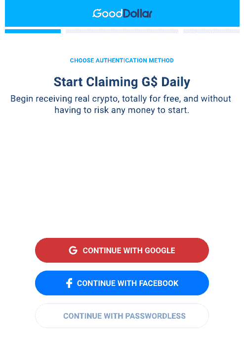
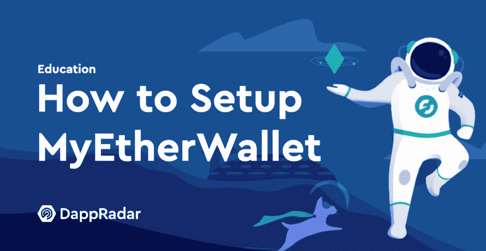

# DeFi 2.0 专注于安全性、可用性和移动性

> 原文：<https://web.archive.org/web/https://dappradar.com/blog/defi-2-0-focus-on-security-usability-mobile>

## 快速增长不能以牺牲安全和 UX 为代价

DeFi 2.0 承诺更加关注用户体验、轻松入职，并以用户已经理解的方式提供分散的金融服务。

DeFi 1.0 是一场令人兴奋的创新和采用浪潮，crypto 成为主流头条新闻，吸引了数百万人的关注。然而，尽管 DeFi 在为用户提供的服务方面取得了长足的进步，但它在减轻用户加入和安全方面的痛苦方面做得很少。

像 Crypto.com 和比特币基地这样的平台吸引了大量做梦也想不到的财富，以及参与下一次技术革命的机会。然而，这些交流是集中的，对真正 DeFi 的发展没有什么帮助。

此外，仅在 2022 年，DeFi 协议(尤其是网桥)的黑客攻击、漏洞利用和盗窃就造成了超过 10 亿美元的损失，很容易理解为什么人们可能仍然不愿意放弃传统银行业务，转而支持真正的分散金融。

在牛市中，专注于丰厚的收益、流动性回报和更具财务动机的机制来吸引用户。此外，尽管大部分服务仍处于测试阶段，但它确实为所提供服务的进步创造了奇迹。

然而，在更不景气的时期，协议正在寻求改进和定位，以延长寿命，更重要的是，可持续性。可以说，我们将会看到越来越少的[insertname]互换突然出现，并收集流动性，但只是为了拉地毯。而想要为数百万用户服务的更严重的 DeFi 协议则是为未来而建。

## 安全性和可用性是关键

在面向大众时，有两件事非常重要:安全性和可用性。几个协议在不同的区块链上解决这两个问题，取得了不同的成功。有些专注于提供最准确、最安全的服务，有些则追逐 UX 和 Web2 feels。可以说，长期赢家会把它们都结合起来。

虽然我们认为 UniSwap、Sushi 和 PancakeSwap 显然是当今 DeFi 的领导者，但它们似乎都不太关心吸引新手或首先成为移动用户。使用这三个平台中的一个需要知识和一些先决条件，例如已经设置了一个区块链钱包来连接到 dapp。

新来者需要通过体验区块链上的基本金融活动来学习，如获取和存储种子短语、购买、销售和交易，然后才能从事更高级的活动，如贷款、赌博和耕作。如果用户想要有一个愉快的第一次体验，更重要的是，想要不断回来，一小步一小步是至关重要的。

## 人们害怕未知

行话如 dapps、协议、DEX、汽油费、滑点等。，对于不懂技术的人来说太专业了。此外，虽然千禧一代和年轻一代掌握了技术和设备，但他们并不是最有钱的人。

可以说，老一代人有更多的可支配收入、时间和投资倾向。任何网络 3 业务忽视它们都是自杀。此外，鉴于移动使用率每年攀升 10%左右，在构建 DeFi dapps 时应考虑移动优先。

在这篇文章中，我们深入探讨了各种区块链中的几个[DeFi dapp，它们旨在为用户提供高级别的安全性以及简单的 UX，如一键赌注、社交登录、云密码存储或菲亚特 onramps。](https://web.archive.org/web/20221201144423/https://dappradar.com/defi)

我们正在寻找适合初学者的 DeFi dapps，它可以提供三个核心要素:简单、透明和有文化。可以说，Web2 的建设者们在二十多年前引入网站和电子商务时面临着同样的挑战。

剧透警报！现在还没有很多，但我们预计在未来几年将会看到更多以移动为中心的非监禁 DeFi dapps。该列表包括几个 dapp，虽然不是严格意义上的 DeFi，但无疑会让用户熟悉 DeFi dapps 的机制。我们鼓励那些开始他们的加密之旅的人去尝试它们并学习基础知识。

*   [运动钱包——走进密码](https://web.archive.org/web/20221201144423/https://dappradar.com/blog/defi-2-0-focus-on-security-usability-mobile/#Sweatwallet---Walk-into-crypto-)
*   [good dollar——面向所有人的免费加密](https://web.archive.org/web/20221201144423/https://dappradar.com/blog/defi-2-0-focus-on-security-usability-mobile/#GoodDollar---Free-crypto-for-all)
*   [Volt App–口袋里的 DeFi](https://web.archive.org/web/20221201144423/https://dappradar.com/blog/defi-2-0-focus-on-security-usability-mobile/#Volt-App---DeFi-in-your-pocket-)
*   [我的以太钱包——从零到加密](https://web.archive.org/web/20221201144423/https://dappradar.com/blog/defi-2-0-focus-on-security-usability-mobile/#My-Ether-Wallet---From-zero-to-crypto)
*   [Maiar——欢迎来到金钱的未来](https://web.archive.org/web/20221201144423/https://dappradar.com/blog/defi-2-0-focus-on-security-usability-mobile/#Maiar---Welcome-to-the-future-of-money)
*   [总结定义 2.0](https://web.archive.org/web/20221201144423/https://dappradar.com/blog/defi-2-0-focus-on-security-usability-mobile/#Defi-2.0-in-summary-)

## 运动钱包——走进密码

[Sweatwallet](https://web.archive.org/web/20221201144423/https://dappradar.com/multichain/other/sweat-economy) 是 iOS 和 Android 应用 Sweatcoin 的姊妹应用。该平台为其用户简单的行走行为提供免费代币奖励，是移动赚钱趋势的一部分。

用户有两种选择。他们可以在 Sweatcoin 中收集然后留下应用内奖励，并使用它们在该生态系统中进行购买和升级。或者，他们可以[下载 SweatWallet](https://web.archive.org/web/20221201144423/https://dappradar.com/multichain/other/sweat-economy) ,然后把它们送到那里，用它们的密码来换取奖励。很快，用户将能够用汗水交换其他密码，并兑现为法定货币。这将在不知情的情况下向平台的数百万用户介绍更先进的 DeFi 机制！

用户可以通过下注他们的奖励在他们的汗水代币上获得收益。拥有更高股份的用户可以获得更好的奖励和优化的应用体验，包括更低的交易费、优质服务和更高的每日出汗限制。

这个简单的机制允许引入移动到收入 dapps，不花任何钱收集密码的机会，然后让用户了解赌注是如何工作的，以及他们可以为此获得什么奖励。

根据[今天汗水的市场价值](https://web.archive.org/web/20221201144423/https://www.coingecko.com/en/coins/sweat-economy)为 0.02 美元，每天 5000 步的收入上限，你将获得 5 汗水。这大约是每天 0.10 美元或每月 3 美元左右。足够买一杯咖啡了。尽管如此，前提不是用户变得富有；这是通过一个熟悉的媒介来介绍加密和[区块链钱包](https://web.archive.org/web/20221201144423/https://dappradar.com/blog/what-is-metamask/)的概念。

## good dollar——面向所有人的免费加密

[GoodDollar](https://web.archive.org/web/20221201144423/https://dappradar.com/multichain/defi/gooddollar-1) 是一个分发[全球基本收益](/web/20221201144423/https://dappradar.com/blog/gooddollar-generates-a-universal-basic-income-economy/)的平台。或者，更简单地说，任何想要的人都可以通过他们的代币 G$获得免费的加密。像 SweatWallet 一样，我们强调 GoodDollar，因为它易于访问，参与成本低，更重要的是，让用户熟悉日常交易和接收加密到钱包中。

好美元经济围绕着两种主要的用户类型:索取者和支持者。申请人是以 G 元硬币形式申请每日基本收入的个人。支持者是个人或机构，他们相信基本收入和自下而上的增长，并通过投入资本支持良好的美元经济来资助 G 美元硬币的供应。

用户再次有两个选择，做索赔者或者做支持者。如前所述，支持者通常是高净值个人，他们希望从自己的资产中赚取一些东西，同时也回报社区。最有可能的情况是成为 G 美元的索赔人。

通过使用[网站](https://web.archive.org/web/20221201144423/https://wallet.gooddollar.org/)，用户可以访问 GoodDollar 钱包，只需使用谷歌或脸书账户登录，或者无需密码即可开始接收 G 美元。无密码时，用户提供一个电话号码并用短信确认。

简单的入职步骤完成后，将为每个用户创建一个钱包。一旦钱包建立起来，用户就可以保管他们所要求的 G 美元，也就是说，没有所有者的允许，任何人都不能访问、冻结或移动它。

索赔每天都在发生，用户需要去 GoodDollar 网站签署交易，然后接收加密。收到的金额取决于当天有多少人索赔。值得注意的是，这个数额很小，同样，这个想法不是创造一夜暴富的百万富翁，而是让人们熟悉钱包和密码。

越来越多的当地企业和贸易商接受 G 美元。感兴趣的人可以联系一位地区美元大使，找到在哪里花美元。您可以向 [Ukraine_DAO](https://web.archive.org/web/20221201144423/https://twitter.com/gooddollarorg/status/1498797925509570562) 捐款，加入 GoodGiveBack 活动或与社区保持联系以寻找其他公益事业。

G$可以通过 [GoodSwap](https://web.archive.org/web/20221201144423/https://goodswap.xyz/#/swap) 兑换成其他加密货币，但这需要建立一个区块链钱包，如 MetaMask 或 TrustWallet，并在教育领域走得更远。我们强调 GoodDollar，因为这是在习惯钱包和日常交易的同时开始收集密码的好方法。

[https://web.archive.org/web/20221201144423if_/https://www.youtube.com/embed/majhjDb-a6A?feature=oembed](https://web.archive.org/web/20221201144423if_/https://www.youtube.com/embed/majhjDb-a6A?feature=oembed)

## Volt 应用程序–DeFi 在您的口袋里

名单上第一个真正的竞争者是最近重新推出的 [Volt 应用](https://web.archive.org/web/20221201144423/https://dappradar.com/fuse/defi/voltage-finance)，它在一个易于使用的移动应用中提供了一套 DeFi 产品和服务。重要的是，Volt 收购了一个名为 Fuse Cash 的平台，该平台专注于易用性和易于创建的钱包，而 [Voltage](https://web.archive.org/web/20221201144423/https://dappradar.com/fuse/defi/voltage-finance) 则提供完整的链上 DeFi 服务。

他们正一起试图解开大规模收养之谜，早期迹象看起来不错。Voltage 符合中列出的许多条件，它对用户友好，不需要保管(你的钥匙，你的密码)，有平坦的入口，云备份恢复，无感觉交易，可在 Android 和 iOS 上使用。简单地说，他们试图在口袋里制造防守。

你没看错。使用 Volt 应用程序交换密码时没有汽油费。在 Volt，天然气由 [Voltage Finance](https://web.archive.org/web/20221201144423/https://dappradar.com/fuse/defi/voltage-finance) 流动性池覆盖，以使更多无摩擦 DeFi 更接近主流用户。

另一个令人兴奋的功能是，除了标准的备份模板，创建和存储种子短语，Volt 用户将能够将 Volt 应用程序连接到他们的 Google Drive，恢复文件的云备份将存储在那里。

您的恢复文件的云备份受到保护，Volt 无法访问您驱动器上的其他文件。最重要的是，用户可以通过指纹映射等生物识别技术保护他们的 Volt 应用程序。

Volt 的第一个版本主要是为每个人设计的入门产品。也就是说，伏特表示，他们将逐步丰富应用程序，并添加久而久之 DeFi 功能。预计在未来几个月，电压生态系统下将会出现打桩、耕作、治理等更多内容。

## 我的以太钱包——从零到加密

我的以太钱包，或众所周知的 MEW，是名单上最成熟的玩家，三年多来一直通过其非托管的 iOS 和 Android 应用程序提供轻松定义。MEW 是一款帮助用户与以太坊区块链互动的免费应用。它易于使用，允许您生成钱包，与智能合同交互，等等。

更重要的是，它符合许多新手需要的条件。用户可以使用银行卡或 Apple Pay 购买 [MEW 钱包](https://web.archive.org/web/20221201144423/https://dappradar.com/blog/how-to-setup-myetherwallet)内的 ETH，并将其存储在非托管的以太坊钱包中。这意味着你和只有你有机会进入你的资金。

[<picture></picture>](https://web.archive.org/web/20221201144423/https://dappradar.com/blog/how-to-setup-myetherwallet)

MEW 也理解用户还不熟悉使用私钥的能力，所以它将教你如何在加密世界中保持安全。MEW 通过使用最先进的加密技术并将您的密钥存储在您设备上的安全保险箱中来保护您的帐户安全。同时，他们还可以帮助备份钱包，以便在设备丢失或被盗时能够追回您的资金。

[https://web.archive.org/web/20221201144423if_/https://www.youtube.com/embed/0KVRZIvEEp4?feature=oembed](https://web.archive.org/web/20221201144423if_/https://www.youtube.com/embed/0KVRZIvEEp4?feature=oembed)

Maiar 是一个数字钱包和全球支付应用程序，允许用户在手机上兑换和安全存储金钱。你可以使用 Maiar 通过一个电话号码或 herotag 几乎即时地向世界各地的任何人发送和接收资金。

## 欢迎来到金钱的未来

你需要一部运行 iOS 或 Android 的 SIM 卡智能手机才能启动。由于 Maiar 是非保管型数字钱包，在任何国家都不需要验证。

Maiar 应用程序可以免费下载和使用。然而，该平台运行的埃尔隆德区块链的支付费用低至每笔 0.001 美元，以支持交易的安全性和速度。

值得注意的是，该应用程序将始终清楚地显示任何收费，所以没有惊喜或隐藏的成本。Maiar 支持埃尔隆德黄金(eGLD)、币安(BNB)、以太坊(ETH)和比特币(BTC)。随着时间的推移，Maiar 打算支持其他数字货币。

使用加密和验证技术保护资产和用户数据，以确保它们得到安全存储。如果手机丢失或被盗，私钥恢复短语可以安全地用于恢复您的资金。

## Defi 2.0 总结

在撰写本文时，真正的分散、点对点金融仍然是经验丰富的区块链用户的游戏，而新手或临时散户投资者则倾向于像比特币基地这样的集中交易所。为什么？因为它们提供了更直观、更易于使用的移动应用程序，人们很快就明白了。它们还提供了快速进出现金的能力。

对于 DeFi 来说，要想摆脱能够安装区块链钱包并与 dapps 互动的少数人，它必须接受 Web2 中明确列出的教训。也就是说，简单的入门和用户的无摩擦体验。虽然像 MEW 这样的项目从一开始就以这种方式建立，但其他人已经开始看到向用户提供他们想要的东西的潜力。

然而，就目前而言，真正去中心化、大众化的竞赛仍在继续。DappRadar 用户可以使用排名分析[哪些 DeFi dapps 正在采取行动](https://web.archive.org/web/20221201144423/https://dappradar.com/rankings/category/defi)，哪些被落下[。与此同时，继续您的教育之旅，跳进上面的一个项目，第一次体验 crypto。](https://web.archive.org/web/20221201144423/https://dappradar.com/defi)

 NewsletterUnsubscribe at any time. [T&Cs](https://web.archive.org/web/20221201144423/https://dappradar.com/terms) and [Privacy Policy](https://web.archive.org/web/20221201144423/https://dappradar.com/privacy-policy)