# DeFi 活动凸显 Dapp 行业抵御 FTX 灾难的能力

> 原文：<https://web.archive.org/web/https://dappradar.com/blog/defi-activity-highlights-dapp-industrys-resilience-against-ftx-disaster>

## 11 月，每日唯一活跃钱包数量仅下降 5%，至 190 万个。

**11 月，**[**【UAW】**](https://web.archive.org/web/20221214025408/https://dappradar.com/blog/dappradar-tracks-unique-active-wallets-but-what-does-that-mean)**【区块链】日均活跃钱包数达到 190 万，比 10 月下降 5%。这一下降表明了该行业在不确定时期的弹性。游戏在 UAW 的主导地位从 45%下降到 42%。然而，主导地位的下降也归因于对其他类别的兴趣的上升，特别是 DeFi。**

[BNB 链](https://web.archive.org/web/20221214025408/https://dappradar.com/rankings/protocol/binance-smart-chain)以平均 651，669 dUAW 位居最活跃协议榜首。 [WAX](https://web.archive.org/web/20221214025408/https://dappradar.com/rankings/protocol/wax) 以 382，412 的平均 dUAW 排名第二，由协议上的各种游戏 dapps 驱动。与此同时，[索拉纳](https://web.archive.org/web/20221214025408/https://dappradar.com/rankings/protocol/solana)协议由于[靠近 FTX 而受到最大的冲击。](https://web.archive.org/web/20221214025408/https://dappradar.com/blog/ftx-causes-chaos-on-solana-after-tvl-dropped-66)

DeFi 平台(也称为 TVL)锁定的总价值受到了 FTX 金融危机的影响。TVL 本月损失最大的是索拉纳，下跌了 71%，至 3.66 亿美元。以太坊仍然以 321 亿美元的 TVL 领先，比 11 月份下降了 24%。11 月，其统治地位从 61.97%降至 49%。BNB 链和 Arbitrum 是受影响最小的协议，分别减少了 3%(79.5 亿美元)和 5%(14.3 亿美元)。

[诸神被解放](https://web.archive.org/web/20221214025408/https://dappradar.com/multichain/games/gods-unchained)仍然是交易量最多的游戏，11 月份达到 1830 万美元和 326592 的销售额，环比下降 47%和 61%。 [Axie Infinity](https://web.archive.org/web/20221214025408/https://dappradar.com/multichain/games/axie-infinity) 位居第二，在过去 3 个月中一直呈下降趋势，其 NFT 交易量下降了 38%(332 万美元)，本月销售额下降了 37.63% (3186)。

此外，NFT 的交易量和销售数量分别下降了 17.47%和 22.24%。尽管如此，两个新的 NFT 市场在本月启动。11 月 23 日，由 ApeCoin 代币持有者组成的社区领导组织 ApeCoin DAO 推出了自己的白色标签 [NFT 市场](https://web.archive.org/web/20221214025408/https://www.apecoinmarketplace.com/collections/0xbc4ca0eda7647a8ab7c2061c2e118a18a936f13d)。

随后，在 11 月 30 日，T2 发布了 NFT 交易平台。它的用户可以使用平台的 NFT 聚合器工具在 [OpenSea](https://web.archive.org/web/20221214025408/https://dappradar.com/multichain/marketplaces/opensea) 、 [X2Y2](https://web.archive.org/web/20221214025408/https://dappradar.com/ethereum/marketplaces/x2y2) 、 [LooksRare](https://web.archive.org/web/20221214025408/https://dappradar.com/ethereum/marketplaces/looksrare) 、Sudoswap、幼虫实验室、Foundation 和 NFT20 市场上交易数字收藏品。

此外，根据 scam 和 hack 数据库 [DEFIYIELD](https://web.archive.org/web/20221214025408/https://defiyield.app/rekt-database) 的数据，11 月是 DeFi 骗局、黑客和漏洞利用最多的一个月，因为网络罪犯窃取了 48.8 亿美元。截至本月，2022 年已经超过 2021 年，成为有记录以来加密和区块链黑客攻击最多的一年。

在下面的报告中，我们概述了 11 月份一些最重要的趋势和数字。

## 关键要点

*   尽管 FTX 陷入困境，但该行业的每日唯一活跃钱包(dUAW)显示出反弹的迹象，达到 190 万，较上月下降 5%。
*   最活跃的协议是 BNB 链，平均为 651，669 dUAW。游戏平台 [WAM](https://web.archive.org/web/20221214025408/https://dappradar.com/binance-smart-chain/games/wam) 的活跃度增长了 9，185%，平均达到 5，113 dUAW。
*   DeFi 服务锁定的总价值受到 FTX 加密崩溃的严重影响，下降了 22%，至 650 亿美元。索拉纳的损失最大，减少了 71%，达到 3.66 亿美元。
*   以太坊以 321 亿美元的 TVL 主导了 DeFi 行业，比 10 月份下降了 24%。BNB 链和 Arbitrum 协议分别减少了 3%(79.5 亿美元)和 5%(14.3 亿美元)，是受影响最小的协议。
*   NFT 的交易量和销售额分别下降了 17.47%和 22.24%。然而，两个新的 NFT 市场，ApeCoin 和 Uniswap NFT，被介绍给 NFT 收藏家，他们在市场下跌期间保持交易。
*   本月，48.8 亿美元的资金丢失或被盗，这是今年的最高月度值。

## 内容

*   [Dapp 行业概述](https://web.archive.org/web/20221214025408/https://dappradar.com/blog/defi-activity-highlights-dapp-industrys-resilience-against-ftx-disaster/#Dapp-Industry-Overview)
*   [DeFi 受到 FTX 局势的强烈影响，与 10 月份相比下降了 22%](https://web.archive.org/web/20221214025408/https://dappradar.com/blog/defi-activity-highlights-dapp-industrys-resilience-against-ftx-disaster/#DeFi-strongly-affected-by-the-FTX-situation,-with-a-22%-decrease-from-October-)
*   [NFT 市场继续下跌趋势](https://web.archive.org/web/20221214025408/https://dappradar.com/blog/defi-activity-highlights-dapp-industrys-resilience-against-ftx-disaster/#The-NFT-market-continues-its-downward-trend)
*   [随着新竞争者的出现，NFT 市场的竞争日趋激烈](https://web.archive.org/web/20221214025408/https://dappradar.com/blog/defi-activity-highlights-dapp-industrys-resilience-against-ftx-disaster/#The-competition-in-the-NFT-markets-is-heating-up-as-new-competitors-emerge)
*   [游戏行业仍占整个行业使用量的 42%](https://web.archive.org/web/20221214025408/https://dappradar.com/blog/defi-activity-highlights-dapp-industrys-resilience-against-ftx-disaster/#The-gaming-sector-still-accounts-for-42%-of-the-industry’s-usage)
*   [11 月是资金被盗最多的月份](https://web.archive.org/web/20221214025408/https://dappradar.com/blog/defi-activity-highlights-dapp-industrys-resilience-against-ftx-disaster/#November-is-the-month-with-the-most-stolen-funds)
*   [结论](https://web.archive.org/web/20221214025408/https://dappradar.com/blog/defi-activity-highlights-dapp-industrys-resilience-against-ftx-disaster/#Conclusion)

## Dapp 行业概述

**免责声明:DappRadar 会跟踪一段时间内与分散式应用程序的智能合约交互的唯一活动钱包(UAW)的数量。这也称为“链上”或“区块链”活动。然而，多个 dapps 不需要执行区块链事务来执行某些动作。**

区块链生态系统之外的活动被称为“链外”或“Web 2.0”活动。传统上用日活跃用户数(dau)来衡量链外活跃度。离线活动的一个例子是用户访问沙盒或分散的虚拟世界，或者用户在区块链上玩 Axie Infinity 而不要求奖励。

11 月，区块链 dapps 的行业唯一活跃钱包数量达到日均 190 万，比 10 月下降 5%。这显示了该行业对来自加密领域的严重负面消息的适应能力，在这种情况下，FTX 动荡。区块链博彩业的 UAW 数量较上月减少 12%，至 80.7 万。随着这一下降，游戏行业的主导地位也下降了，目前为 42%。另一方面，DeFi 活动较前一个月增长了 21%，平均达到 48.7 万个每日唯一活跃钱包(dUAW)。

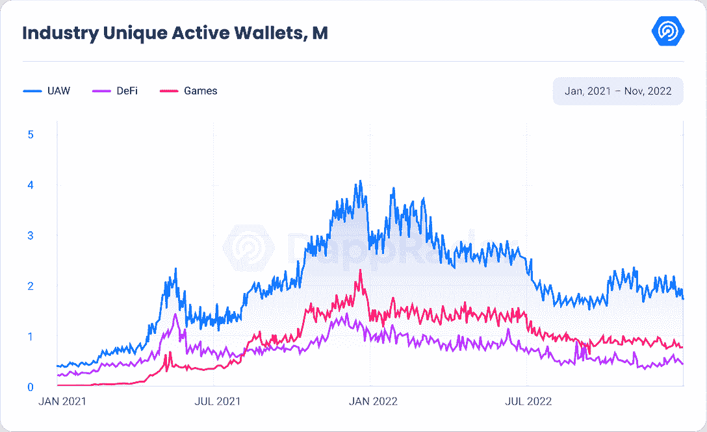

尽管该行业的趋势不容乐观，但仍有一些一线希望让用户对 dapp 行业的未来保持乐观。

[BNB 链](https://web.archive.org/web/20221214025408/https://dappradar.com/rankings/protocol/binance-smart-chain)以平均 651，669 dUAW 位居最活跃协议榜首。这相当于比 10 月份增长了 1%，尽管 FTX 的情况如此。WAX 以 382，412 的平均 dUAW 排名第二，这是由协议上的各种游戏 dapps 驱动的。

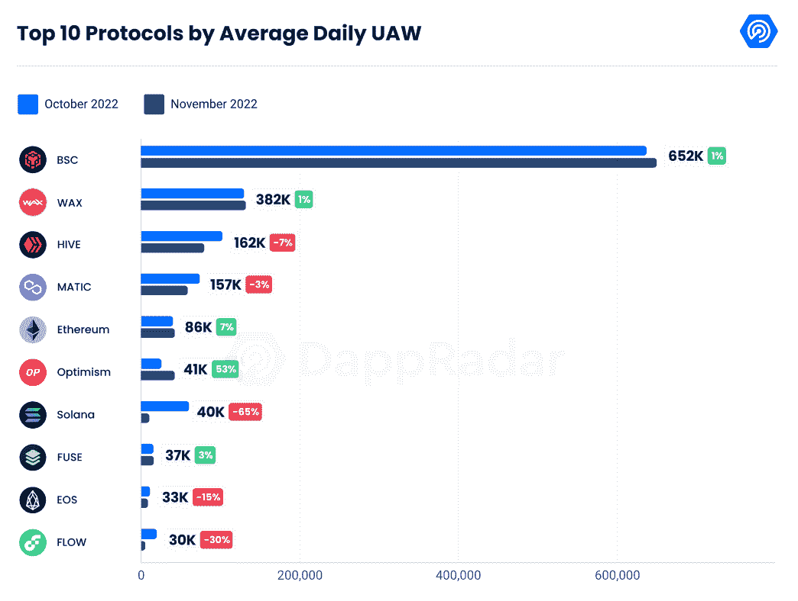

与前一个月相比，第二层协议[仲裁](https://web.archive.org/web/20221214025408/https://dappradar.com/rankings/protocol/arbitrum)和[乐观](https://web.archive.org/web/20221214025408/https://dappradar.com/rankings/protocol/optimism)分别增加了 91.19%和 52.87%。Arbitrum 的增加是由于投机者开始与协议进行交互，希望有资格获得即将到来的加密令牌空投。

与前几个月相比，[以太坊](https://web.archive.org/web/20221214025408/https://dappradar.com/rankings/protocol/ethereum)打破了下降趋势，本月我们看到独立活跃钱包的数量增加了 7%，平均达到 85，685 dUAW。这一增长是由[元掩模互换](https://web.archive.org/web/20221214025408/https://dappradar.com/ethereum/defi/metamask-swap)和 [NFT 市场模糊所推动的。](https://web.archive.org/web/20221214025408/https://dappradar.com/ethereum/marketplaces/blur) MetaMask Swap 在过去一个月增长了 30%，平均达到 3，866 dUAW，而 Blur 增长了 43.76%，平均达到 1，029 dUAW。

Solana 是受到最大冲击的协议，因为它靠近 FTX。今年 11 月，索拉纳区块链的活动减少了 65%，平均达到 39，768 dUAW。对索拉纳影响最大的是游戏，但尽管如此，索拉纳将继续专注于开发有前途的游戏。要了解更多，请阅读[我们对索拉纳游戏公司总经理约翰尼·b·李和技术及产品负责人马特·索尔格的采访](https://web.archive.org/web/20221214025408/https://dappradar.com/blog/solana-keeps-building-promising-games-despite-ftx-crisis)。

## 迪拜国际机场受到 FTX 局势的严重影响，与 10 月份相比下降了 22%

DeFi 平台(也称为 TVL)锁定的总价值受到了 FTX 金融危机的影响。11 月份下降 22%，约为 650.1 亿美元。11 月 9 日，当币安放弃对 FTX 的潜在收购时，TVL 出现最大跌幅。当日从 738.9 亿美元暴跌 11%至 657 亿美元。

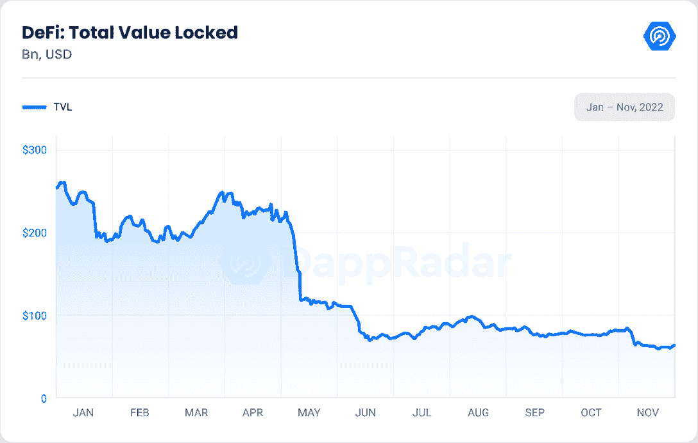

查看前 10 个协议的 TVL，我们可以观察到它们中的每一个都受到了 FTX 情况的影响。以太坊仍然是最受欢迎的连锁店，拥有 321 亿美元的 TVL，比 11 月下降了 24%。但相对于其他协议，其优势从 10 月的 61.97%下降到 11 月的 49%。BNB 链和 Arbitrum 似乎是受影响最小的协议，分别减少了 3%(79.5 亿美元)和 5%(14.3 亿美元)。

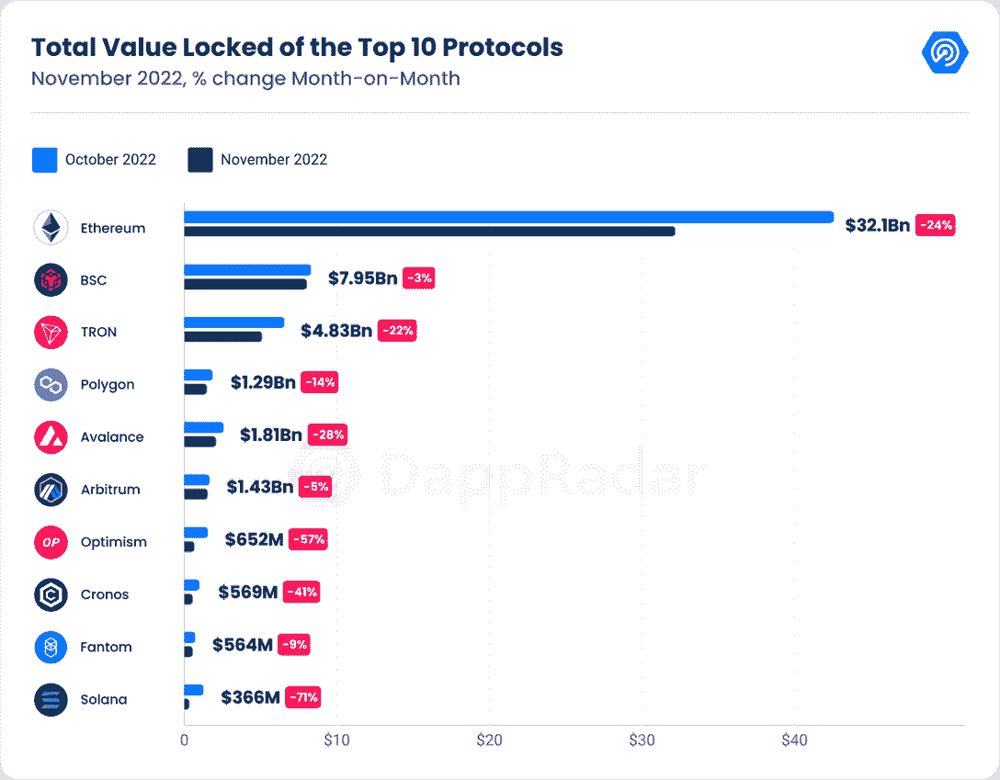

Avalanche 今年 11 月遭受重创，其 TVL 下跌 28%，至 18.1 亿美元。尽管如此，位于雪崩区块链的 NFT 市场 [Joepegs](https://web.archive.org/web/20221214025408/https://dappradar.com/avalanche/marketplaces/joepegs) 、[宣布，他们在由现已解散的 FTX 风险投资公司和雪崩基金会牵头的种子轮融资中筹集了 500 万美元。来自 FTX 风险投资公司的资金已于 6 月份完成，并在最近的破产事件之前转移出了 FTX。](https://web.archive.org/web/20221214025408/https://twitter.com/joepegsnft/status/1592186742450585601)

此外，乐观和克罗诺斯的 TVL 分别下降了 57%(6.52 亿美元)和 41%(5.69 亿美元)。Cronos 在 TVL 的股价下跌是因为担心 FTX 的惨败会蔓延，尤其是担心新加坡的加密交易所 Crypto.com 会像 FTX 一样崩溃。这些担忧的核心是关于潜在破产的传言，分析师指出，Crypto.com 持有低流动性的加密货币，如柴犬和 T2 CRO 作为储备，据报道占该交易所总资产的 40%。

TVL 本月损失最大的是索拉纳，下跌了 71%，至 3.66 亿美元。在这份[报告](https://web.archive.org/web/20221214025408/https://dappradar.com/blog/assessing-the-impact-of-ftx-meltdown-in-the-dapp-industry/#Decentralized-finance-is-essential-for-the-future-of-our-industry)中，我们分析了索拉纳生态系统中最重要的 dapps 是如何受到 FTX 局势的影响的。

## NFT 市场继续下滑趋势

本月以美元计算的 NFT 交易量较 10 月下降 17.47%，至 5.46 亿美元。这是我们今年登记的最低金额。此外，销售额环比下降 22.24%。

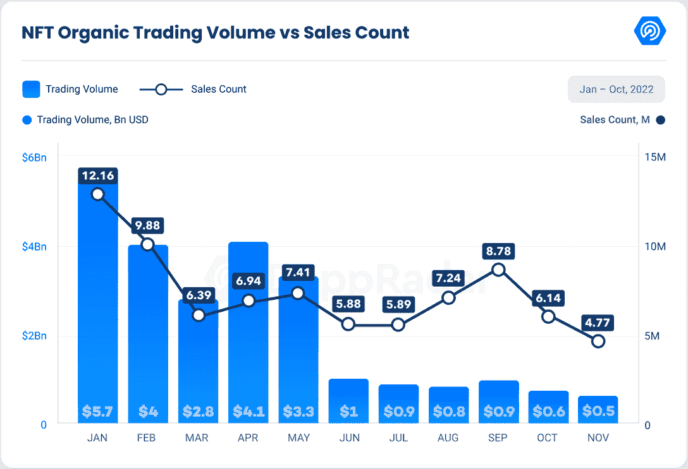

以太坊的 NFT 交易量已经持续了过去四个月的下降趋势。本月，它减少了 14%，达到 2.77 亿美元，是我们自 2021 年 6 月以来记录的最低 NFT 交易量。然而，以太坊仍然以整个 NFT 交易价值的 50.75%主导着 NFT 市场。

紧随其后的是， [Solana](https://web.archive.org/web/20221214025408/https://dappradar.com/nft/protocol/solana) 在 NFT 交易量中位居第二，而本月，尽管 FTX 局势不佳，NFT 交易量仍增长了 42%，达到 9510 万美元。这一增长主要是由 [y00ts 系列](https://web.archive.org/web/20221214025408/https://dappradar.com/solana/collectibles/y00ts)推动的。令人惊讶的是，Solana 在 NFT 的销量本月下降了 33%，市场上共售出 852，780 件 NFT。

另一方面， [Flow](https://web.archive.org/web/20221214025408/https://dappradar.com/nft/protocol/flow) 见证了 NFT 交易量的大幅下降，下降了 51%，至 760 万美元。然而，售出的 NFT 数量并没有减少那么多。我们记录了 22%的下降，因为上个月区块链流量上的用户交易了 409，069 NFT。

此外， [Polygon](https://web.archive.org/web/20221214025408/https://dappradar.com/nft/protocol/polygon) 也出现了类似的下降，11 月份在 NFT 的交易量达到了 634 万美元。减少了 42%。有趣的是，该协议的销售计数本月增长了 135%，达到 556，434。这种增长是由在协议上启动的多个更便宜的 NFT 集合所驱动的。在 NFT 系列中，[镜头协议](https://web.archive.org/web/20221214025408/https://dappradar.com/polygon/social/lens-protocol)和[加密独角兽](https://web.archive.org/web/20221214025408/https://dappradar.com/polygon/games/crypto-unicorns/nfts)脱颖而出。这两个项目的销售额分别增长了 21.77%和 203%。

虽然许多连锁店的交易额有所下降，但 BNB 连锁店的交易额却增长了 6%。然而，数额仍然偏低，现已达到 390 万美元。从表面上看，小富豪俱乐部 NFT 藏品为数量的增加做出了巨大贡献，因为该藏品的交易量在 11 月飙升了 190.38%。

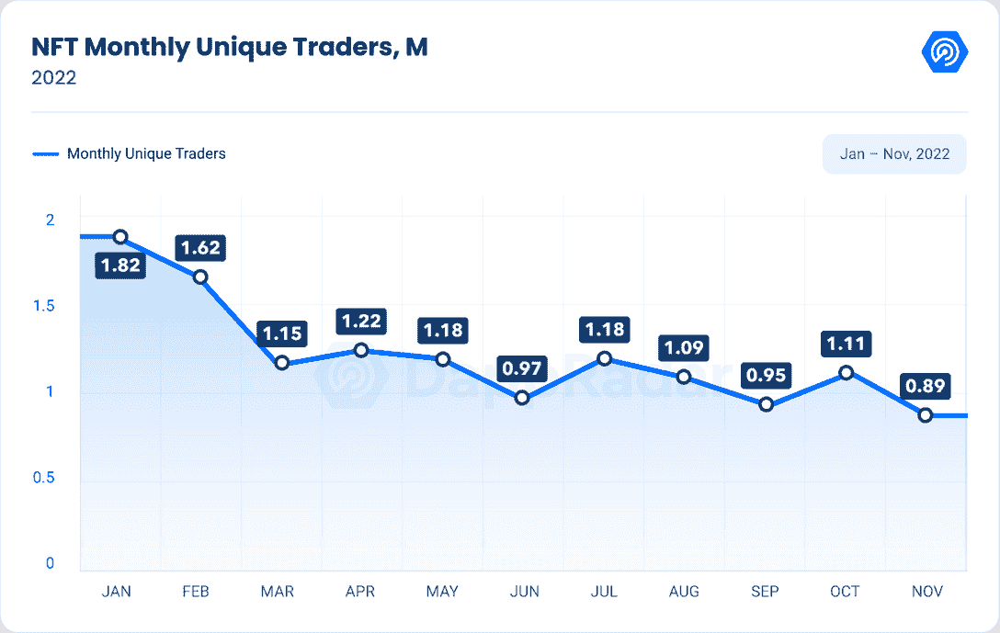

与 NFT 交易量和销售数量的趋势相同，本月独特交易者数量也有所下降。11 月，我们有 886，694 名 NFT 唯一交易者，减少了 20.29%。这是我们今年登记的最低金额。

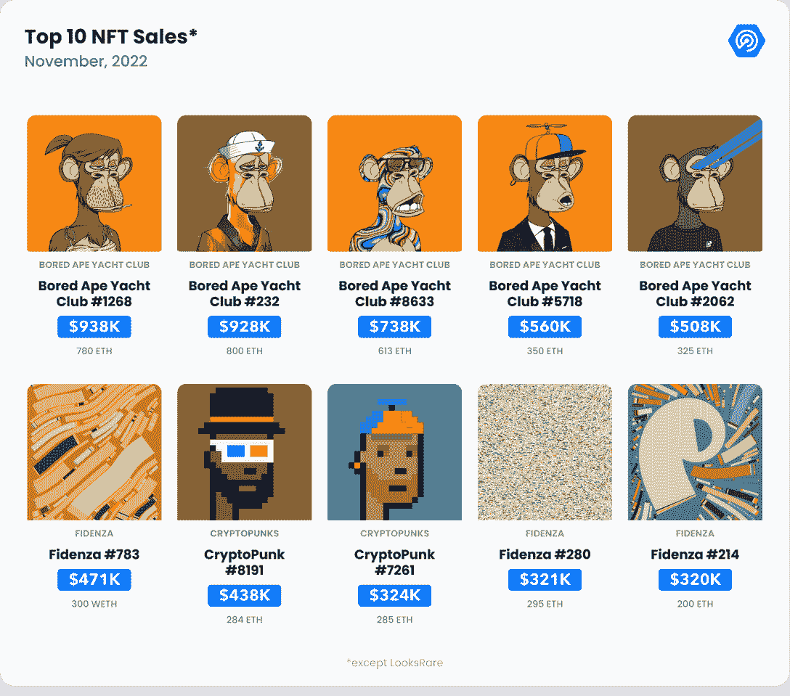

看看这个月的十大销售，我们可以看到宇迦实验室项目如何主导 NFT 市场。宇迦实验室是[隐朋克](https://web.archive.org/web/20221214025408/https://dappradar.com/ethereum/collectibles/cryptopunks)、[无聊猿游艇俱乐部](https://web.archive.org/web/20221214025408/https://dappradar.com/ethereum/collectibles/bored-ape-yacht-club)、 [Meebits](https://web.archive.org/web/20221214025408/https://dappradar.com/ethereum/collectibles/meebits) 、[变异猿游艇俱乐部](https://web.archive.org/web/20221214025408/https://dappradar.com/ethereum/collectibles/mutant-ape-yacht-club)、[养狗俱乐部游艇俱乐部](https://web.archive.org/web/20221214025408/https://dappradar.com/ethereum/collectibles/bored-ape-kennel-club)、[彼岸](https://web.archive.org/web/20221214025408/https://dappradar.com/ethereum/collectibles/otherdeed-for-otherside)背后的公司。在这些不确定时期，当蓝筹股保持其大部分价值，交易集中在一个资产类别时，我们看到了活动的高度集中。

## 随着新竞争对手的出现，NFT 市场的竞争日趋激烈

本月，两个新的 NFT 市场被介绍给 NFT 收藏家，他们在整个低迷的市场中继续交易。

11 月 23 日，ApeCoin DAO，一个由 ApeCoin 持有者组成的社区领导的管理机构，推出了自己的白色标签 [NFT 市场](https://web.archive.org/web/20221214025408/https://www.apecoinmarketplace.com/collections/0xbc4ca0eda7647a8ab7c2061c2e118a18a936f13d)。

由不可替代的 token (NFT)基础设施公司 Snag Solutions 建立的新社区市场列出了宇迦实验室拥有的 NFT 收藏的待售 NFT，如 BAYC，突变猿游艇俱乐部(MAYC)，Bored Ape Kennel Club (BAKC)和 Otherside 的其他 deed。该平台将不同市场的销售额进行汇总，但也允许用户在市场上销售。

此外，11 月 30 日，Uniswap [宣布](https://web.archive.org/web/20221214025408/https://uniswap.org/blog/uniswap-nft-aggregator-announcement)他们的平台上可以进行 NFT 交易。它的用户现在可以使用该平台的 NFT 聚合工具在 OpenSea、X2Y2、LooksRare、Sudoswap、幼虫实验室、基金会和 NFT20 市场上交易数字收藏品。此外，该平台表示，与其他 NFT 聚合商相比，其新的开源通用路由器合同可以为用户节省高达 15%的油费。

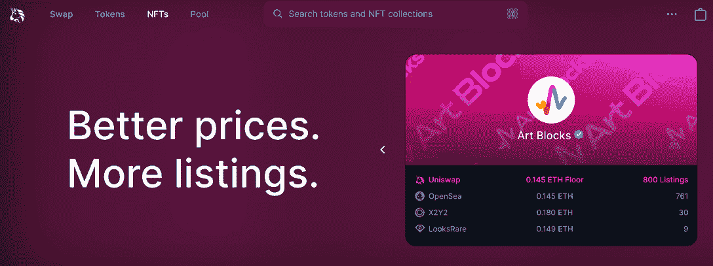

Source: [Uniswap](https://web.archive.org/web/20221214025408/https://app.uniswap.org/#/nfts)

与此同时，Uniswap 还向 Genie 的历史用户空投了 500 万美元，该公司是 uni swap 在 6 月份收购的 NFT 市场聚合公司。据该公司称，精灵用户完成一笔以上交易将被空投 300 美元，在 Uniswap 于 4 月拍摄的快照前持有精灵:创世纪 NFT 将被空投 1000 美元。符合条件的用户可以在未来 12 个月内申请在 USDC 的空投。

如前所述，在过去几个月中，OpenSea 的竞争对手增加了市场份额，将市场从“垄断”转变为“寡头垄断”。尽管以太坊和 Solana 的交易所 X2Y2 和 Magic Eden 自 2022 年以来获得了市场份额，但 OpenSea 仍是用户和交易量方面的行业领导者。

11 月份， [OpenSea](https://web.archive.org/web/20221214025408/https://dappradar.com/multichain/marketplaces/opensea) 的市场支配地位比 10 月份上升了 0.9%，其 NFT 交易量环比下降了 17.33%(2.58 亿美元)。这是自 2021 年 7 月以来我们登记的最低交易量。

11 月 6 日，OpenSea [宣布](https://web.archive.org/web/20221214025408/https://twitter.com/opensea/status/1589058770646491136?ref_src=twsrc%5Etfw%7Ctwcamp%5Etweetembed%7Ctwterm%5E1589058770646491136%7Ctwgr%5E098503e0fb7c4db2c5e08d63d16cca4c00e116f8%7Ctwcon%5Es1_&ref_url=https%3A%2F%2Fdecrypt.co%2F113698%2Fopensea-breaks-silence-on-nft-royalties-but-creators-dont-like-what-they-hear)针对新创建的 NFT 项目的版税强制执行系统，该系统围绕一个黑名单构建，阻止上市市场处理这些交易。这种方法针对的是那些没有完全执行版税的市场，这些市场是 OpenSea 最大的竞争对手之一——一些人认为这一举动是反竞争的。后来，在 11 月 10 日，[宣布](https://web.archive.org/web/20221214025408/https://twitter.com/opensea/status/1590466334814785537)在社区的强烈反对下，它将继续对非功能性网络游戏征收创作者版税。

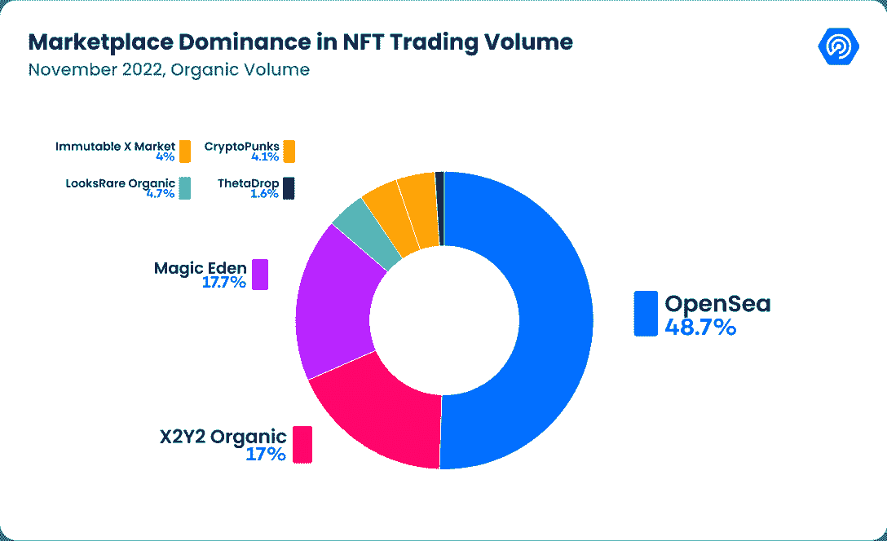

紧随其后，[魔法伊甸园](https://web.archive.org/web/20221214025408/https://dappradar.com/solana/marketplaces/magic-eden)本月统治力提升 8.3%，超越 X2Y2。但其交易量却增长了 53.63%(9440 万美元)。这主要是由于[索拉纳 NFT 收藏](https://web.archive.org/web/20221214025408/https://dappradar.com/nft/protocol/solana)和 [y00ts](https://web.archive.org/web/20221214025408/https://dappradar.com/solana/collectibles/y00ts) 的交易活动增加。

即使 [X2Y2](https://web.archive.org/web/20221214025408/https://dappradar.com/ethereum/marketplaces/x2y2) 保持了与 10 月份相同的市场份额，但其交易量却减少了 50.35%，达到 9023 万美元。在 11 月份的一篇 [Twitter 帖子](https://web.archive.org/web/20221214025408/https://twitter.com/the_x2y2/status/1593631427132018689?ref_src=twsrc%5Etfw%7Ctwcamp%5Etweetembed%7Ctwterm%5E1593631427132018689%7Ctwgr%5E59a5ed797886bf14a744a2f762927a05888d46ea%7Ctwcon%5Es1_&ref_url=https%3A%2F%2Fdecrypt.co%2F115026%2Fethereum-nft-marketplace-x2y2-royalties)中，X2Y2 称赞 OpenSea 最终表明了对创作者版税的立场，并承认许多新推出的项目都使用了 OpenSea 的黑名单代码，该代码禁止这些 NFT 在没有完全执行版税的市场上交易。他们还写道，它取消了使用 OpenSea blocklist 代码的新项目的灵活版税设置，但它也将强制执行所有现有 NFT 项目的版税设置。

显然，当利率和通胀因素不确定、战争和全球冲突持续以及其他全球因素发挥作用时，所有市场都在经历更大的波动。然而，无论波动如何，非金融交易及其基础市场都显示出稳定的迹象。

## 游戏行业仍占整个行业使用量的 42%

游戏区块链技术是 Web3 的新兴、有前途的行业之一，11 月份每天有 807，457 个独特的活动钱包。

值得一提的是，即使游戏在 UAW 的主导地位从 45%下降到 42%,它仍然是该行业的一个良好指标，因为它主导着 Web3 行业。此外，主导地位的下降也归因于对其他类别的兴趣的上升，特别是 DeFi 和 Social。

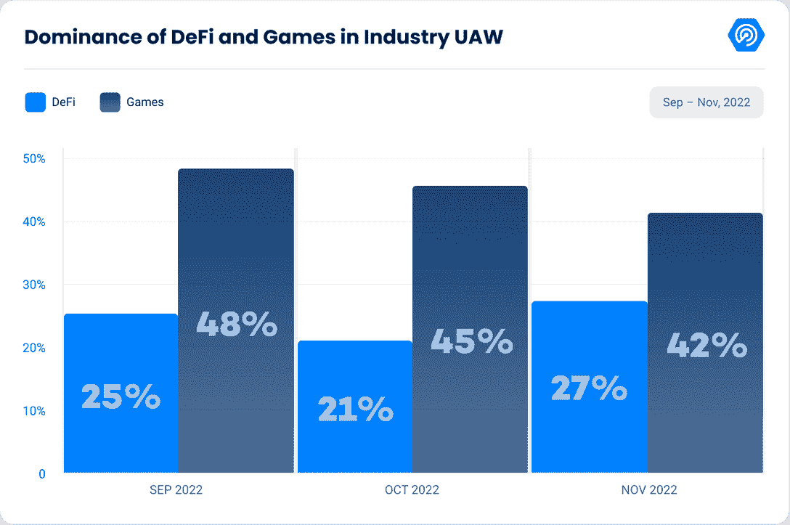

从交易量排名前 6 的游戏来看，我们可以观察到，在 11 月份，由于 FTX 局势导致加密货币的价格迅速下降，所有游戏的交易量都有所下降。

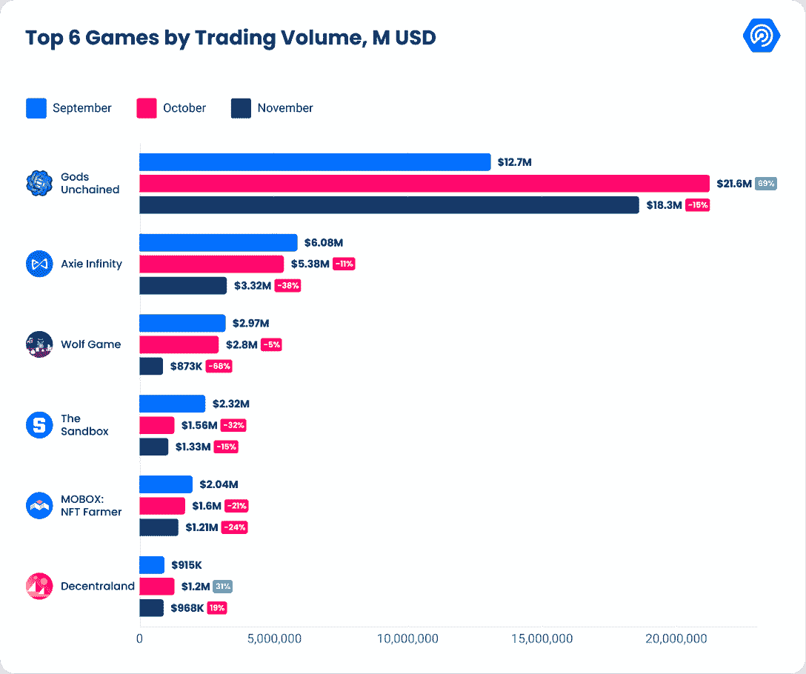

[诸神被解放](https://web.archive.org/web/20221214025408/https://dappradar.com/multichain/games/gods-unchained)依然是交易量最多的游戏，11 月份达到 1830 万美元，环比下降 15%。11 月 10 日，[团队宣布](https://web.archive.org/web/20221214025408/https://twitter.com/GodsUnchained/status/1590487158212608000?ref_src=twsrc%5Etfw%7Ctwcamp%5Etweetembed%7Ctwterm%5E1590487158212608000%7Ctwgr%5Eb71bb8d0843af231647ebfe8c75cf0f5248e2cda%7Ctwcon%5Es1_&ref_url=https%3A%2F%2Fdailycoin.com%2Fcommunity-contests-return-to-gods-unchained%2F)他们将把令人垂涎的“社区任务”活动更名为“社区竞赛”，增加更新的游戏变化、模式和挑战。该卡牌游戏已经与 TokenTrove 合作，token trove 是[不变 X](https://web.archive.org/web/20221214025408/https://dappradar.com/rankings/protocol/immutablex/category/games) 上的一个受信任的市场，旨在为玩家提供更好的参与机会。

Axie Infinity 的交易量位居第二，过去 3 个月一直呈下降趋势。11 月交易量减少 38%，达到 332 万美元。尽管如此，团队[还是在 11 月 21 日宣布了 Axie Origin 第二季的](https://web.archive.org/web/20221214025408/https://twitter.com/AxieInfinity/status/1594741345784299521?ref_src=twsrc%5Etfw%7Ctwcamp%5Etweetembed%7Ctwterm%5E1594741345784299521%7Ctwgr%5Edfd7cef850cef316b9effebde773220d04100c1d%7Ctwcon%5Es1_&ref_url=https%3A%2F%2Fplaytoearn.net%2Fnews%2Faxie-infinity-set-to-introduce-axie-origin-season-2-)更新。在新的一季中，开发者将会加入一些新的机制，比如守备，能量爆发和血月变化。此外，该更新创建了特定类别的游戏风格。Axie 起源 S2 将改变卡，符文和魅力，并将取代流行的 Axie 无限经典 V2。

要获得更多关于区块链游戏和趋势的见解，如虚拟世界、移动赚取和领先游戏 dapps，请阅读我们最新的 [BGA 游戏报告](https://web.archive.org/web/20221214025408/https://dappradar.com/blog/bga-game-report-october-november-2022)。

## 11 月是资金被盗最多的月份

11 月已经成为全年被黑客攻击和窃取的加密资产最多的月份。根据 DEFIYIELD 数据，仅这个月就有超过 48.8 亿美元被盗。第二高的月份是 10 月份，原因是 Francisco Valdevino da Silva，又名“比特币酋长”，诈骗和洗钱超过 7.66 亿美元。

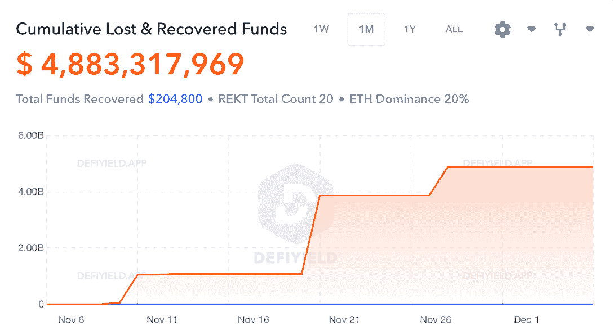

Source: [DEFIYIELD data](https://web.archive.org/web/20221214025408/https://defiyield.app/rekt-database)

本月最大的漏洞来自于促进交易、衍生品和贷款的交易所 [Genesis](https://web.archive.org/web/20221214025408/https://genesistrading.com/) 。由于加密技术的长期衰落，它是遭受损失的贷方之一。该公司有 28 亿美元的未偿贷款。11 月 10 日，该公司披露其 FTX 交易账户持有 1.75 亿美元。由于 FTX 崩盘后“异常的市场动荡”，撤资于 11 月 16 日停止，一直持续到今天。创世纪公司的代表[在 11 月 22 日说](https://web.archive.org/web/20221214025408/https://techcrunch.com/2022/11/21/crypto-firm-genesis-says-it-has-no-plans-to-file-bankruptcy-imminently/)他们想避免破产，到目前为止，情况仍然需要澄清。

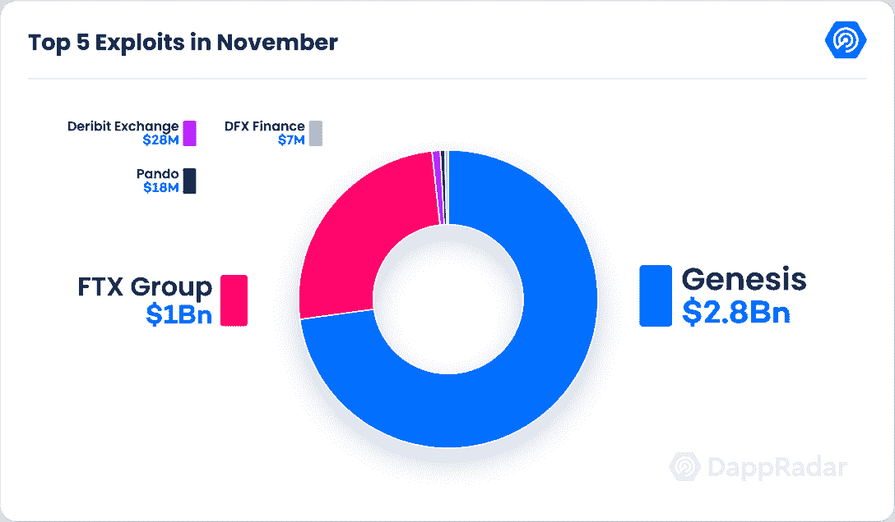

第二个漏洞来自 FTX 集团，大约损失了 10 亿美元的资金。此外，11 月 12 日，FTX 美国总法律顾问瑞安·米勒(Ryan Miller)在推特上表示，他们正在调查交易所发生的“异常情况”，因为它显示交易所面临 3.8 亿美元的剥削。

名单还没有结束，因为加密货币衍生品平台 Deribit Exchange 于 11 月 1 日被利用。在以太坊和比特币区块链上，热门钱包的私钥被泄露了。交易所共损失 9111 个 ETH 和 691 个 BTC，目前价值 2831 万美元。该漏洞没有影响客户资产和冷地址，该公司[表示](https://web.archive.org/web/20221214025408/https://twitter.com/DeribitExchange/status/1587701883778523136)他们将弥补损失。

截至目前，2022 年超过 2021 年，成为加密和区块链黑客攻击和利用的最大年份。

## 结论

全球经济目前正面临重大挑战。一些市场指数和国家货币面临压力，价值下降，导致购买力下降。作为最新的行业之一，加密货币市场在 2022 年的表现非常糟糕。

FTX 交易所及其相关组织的意外失败震动了加密货币市场、Web3 和 dapp 行业。从正常运营到破产和欺诈调查的过渡用了不到一周时间。值得强调的是，区块链技术没有失败，并继续提供服务，允许任何用户传输和接收资产。在 FTX 金融危机期间，DeFi services 的活动有所增加，凸显了这些分散应用的力量。

尽管围绕加密的负面影响，该部门仍然专注于开发和推动下一波区块链的采用。区块链技术仍然是强大的，并为建立各种创新项目提供了基础，以彻底改变我们的金融系统和经济。此外，它给予用户数字所有权，并促进自我保管。

毫无疑问，另一轮牛市将会到来，而且可能会比上一轮明显更强。当市场面临困难时，幸存者最终会变得更强大，并将向用户提供更高质量的产品和服务。但最值得注意的是，dapps 正在成为科技行业不可或缺的一部分，为下一代金融资产的创新提供动力。