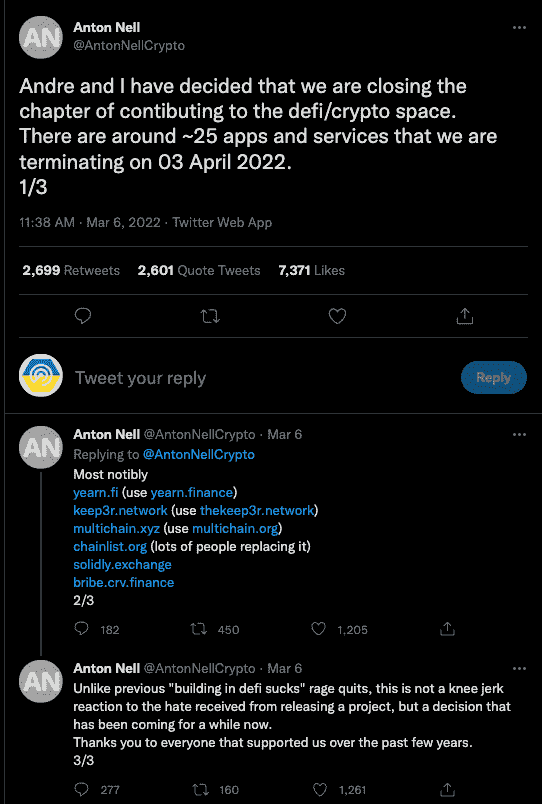
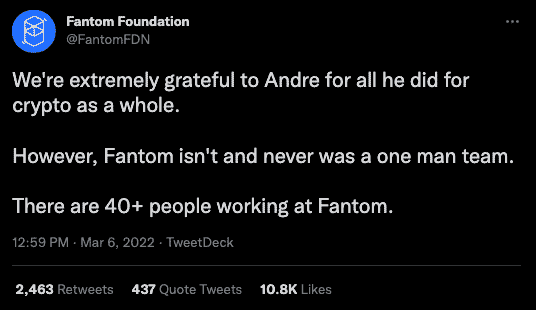
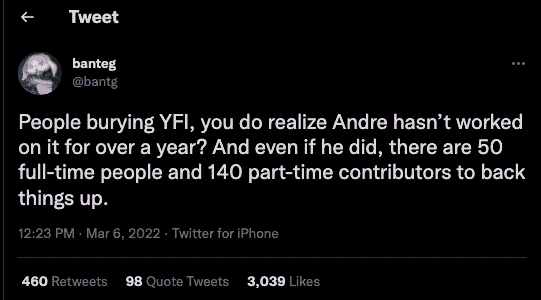
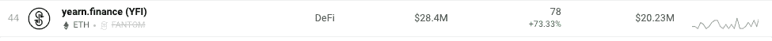
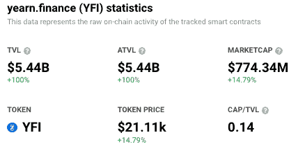
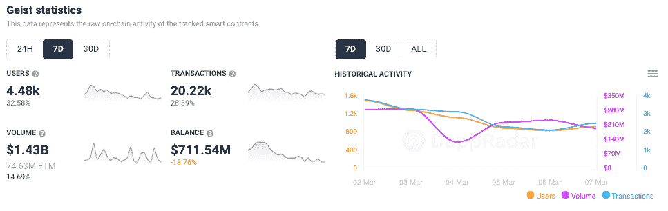
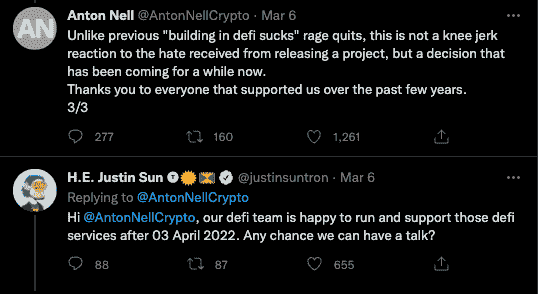
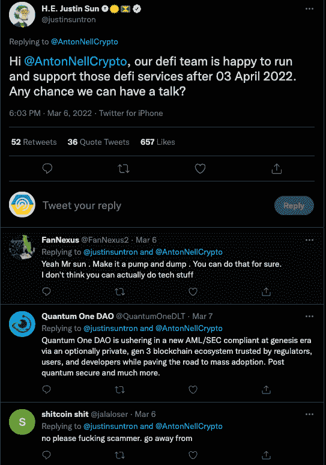
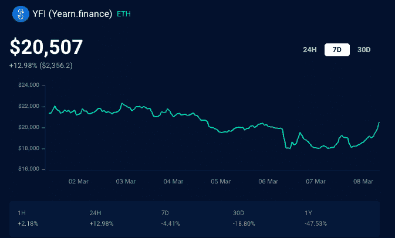

# 安德烈·克罗尼离开 DeFi，DeFi Dapp 代币贬值

> 原文：<https://web.archive.org/web/https://dappradar.com/blog/defi-dapp-tokens-drop-in-value-as-andre-cronje-leaves-defi>

## Fantom、渴望金融和保管者代币价值显著下降

Andre Cronje 是一位很有影响力的开发商，他开发了 Yearn Finance、Keep3r Network 和 Fantom，他的离开对 dapp 代币价格产生了相当大的影响。这一消息是通过 Fantom 基金会前同事 Anton Nell 的推特发布的，此前几个月的猜测一直在增加。因此，与 Nell 和 Cronje 相关的项目相关联的本地令牌开始减少。

Andre Cronje 与渴望金融和其他各种 dapps 一起在 DeFi 领域进行开拓。然而，他的创新也伴随着成为公众形象的负担。看起来——通常是有害的——社会压力把克罗吉推到了悬崖边上，留下了他帮助创新的空间。

Cronje 在其中担任了三年技术顾问的 Fantom 的 token (FTM)受此消息影响下跌了 17.5%，Keeper Network 的 token (Keep3r)遭受的损失更大，下跌了 35%，而[向往金融的](https://web.archive.org/web/20221207005518/https://dappradar.com/multichain/defi/yearn-finance-yfi) token (YFI)下跌了 12.6%，之后略有回升。推文中提到的所有其他令牌都遵循了类似的趋势。

## 一块砖造不出一栋大楼

此外，需要注意的是，尽管 Andre Cronje 在一些项目中担任关键职位，但他不是一个人的团队。相反，他在项目的开始或整个生命周期中作为顾问参与其中。

虽然媒体很快就发出了一个重要玩家跳槽的信号，但其他人认为机会和更广泛的行业整合仍然只有几年的历史。例如，[向往](https://web.archive.org/web/20221207005518/https://dappradar.com/multichain/defi/yearn-finance-yfi)的一个顶级假名开发者名叫 Banteg，[很快在 Twitter](https://web.archive.org/web/20221207005518/https://twitter.com/bantg/status/1500416805659201537) 上指出[cron je 已经一年多没有为这个项目做出贡献了。](https://web.archive.org/web/20221207005518/https://twitter.com/bantg/status/1500416805659201537)

在推文中，内尔说，在这 25 个项目中，最值得注意的是与[渴望金融](https://web.archive.org/web/20221207005518/https://dappradar.com/multichain/defi/yearn-finance-yfi)、Keep3r 网络、多链、[稳固](https://web.archive.org/web/20221207005518/https://dappradar.com/fantom/exchanges/solidly)、Chainlist 和贿赂 Crv 金融相关的项目。此外，他补充说，其他人将进行一些项目。虽然大多数项目的前端服务预计将于 4 月 3 日结束，但开源代码和智能合同允许其他人接过接力棒，继续运行 dapps。

## 令牌值下降，dapp 使用没有下降

一个有趣的方面是，当基础代币的价值下降时，dapp 的使用保持稳定或者实际上增加了。Yearn Finance 平台上连接的钱包数量增长了 73%。可以说，这可能是由于投资者担心 YFI 自由落体公告发布后，将资产从金库中取出造成的。

我们还可以看到，看看渴望的 24 小时表现，它已经在周日新闻的打击下大步前进，回到了关于 TVL 和它的令牌的宣布前的水平。

与此同时，Fantom 上的低成本、接近零的滑点交易平台[显示，过去 7 天连接到它的钱包数量略有增加，但幅度不大。此外，](https://web.archive.org/web/20221207005518/https://dappradar.com/fantom/exchanges/solidly)[DeFi dapp on Fantom](https://web.archive.org/web/20221207005518/https://dappradar.com/rankings/protocol/fantom/category/defi)如[艾斯特](https://web.archive.org/web/20221207005518/https://dappradar.com/fantom/defi/geist)正显示出强劲的增长信号，表明投资者对 Fantom 及其 dapp 生态系统的信心并未受到该公告的严重影响。

## “在 DeFi 建房子很烂”

对于一个从一开始就深陷于 DeFi 的人来说，现在应该是在一系列不利条件下停止前进的时候了，这几乎让人感觉很合适。2020 年，Cronje 告诉 [Decrypt](https://web.archive.org/web/20221207005518/https://decrypt.co/37995/exclusive-yfi-andre-cronje-broke-quitting-defi) 他正处于退出 crypto 的边缘，称有毒的 DeFi 社区是他的主要原因。这些评论是在 Cronje 离开向往五个月后发表的。虽然这一声明让人想起了 Cronje 过去的那些声明，但 Nell 在随后的一条推文中表示，这一次明显不同且明确。

有趣的是，TRON 的创始人 Justin Sun 几乎立即出现，提供他的 DeFi 团队的服务，在 4 月份之后接管一些 dapps，这在 Twitter 上遇到了预期的负面影响。

## 成功的机会来了

就像生活中的所有事情一样，书中有故事，字里行间也有故事。Andre Cronje 本周早些时候的声明导致相关代币价格下跌。虽然许多人看到了消极的一面，并认为有必要高呼“挑战死亡”，但一些人认为像[渴望](https://web.archive.org/web/20221207005518/https://dappradar.com/multichain/defi/yearn-finance-yfi)和 [Fantom](https://web.archive.org/web/20221207005518/https://dappradar.com/rankings/protocol/fantom) 这样的项目是一个机会，因为它们拥有坚实的社区，没有安德烈也能轻松继续，可能会使各自的支持度回升到宣布前的水平。

事实上，[在 YFI 周日达到 18000 美元左右后，今天，价格上涨了约 14%，回到 20500 美元。与此同时，Fantom 在周日触及 1.43 美元的低点后，仍在回升。然而，即将推出的 dapp 和目前围绕 Fantom 的普遍炒作应该会让它很快回到以前的水平。](https://web.archive.org/web/20221207005518/https://dappradar.com/hub/token/eth/YFI?from=0x0bc529c00c6401aef6d220be8c6ea1667f6ad93e)

## 安德烈大小的差距

除此之外，他还开发和参与了许多 DeFi 项目，包括 Yearn Finance、Curve Finance 和 Fantom。Andre 的 LinkedIn 页面显示，他在区块链和加密货币社区担任过许多职务，包括 Fusion Foundation 的技术主管、Lemniscap 的技术分析师，以及其他更引人注目的角色。

虽然他肯定会是一个被忽略的人物，但该行业的发展速度令人恐惧，因此我们预测他会以某种形式回归。或者，一个真正的创新者只是为其他人留下了一条创新的道路，让他们跟随和改进，因为区块链行业正朝着进一步采用和主流吸引力前进。

 NewsletterUnsubscribe at any time. [T&Cs](https://web.archive.org/web/20221207005518/https://dappradar.com/terms) and [Privacy Policy](https://web.archive.org/web/20221207005518/https://dappradar.com/privacy-policy)

***以上不构成投资建议。此处给出的信息仅供参考。请行使尽职调查，做你的研究。作者持有 ETH、BTC、AGIX、HEX、LINK、GRT、CRO、OMI、不可变 X、GALA、AVASTR、GMEE、CUBE、RADAR、FLOW、FTM、BNB、SPS、WRLD、ATOM 和 ADA。***