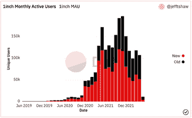
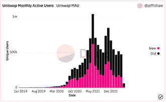
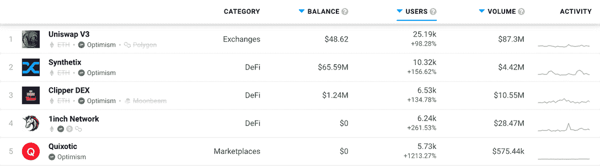
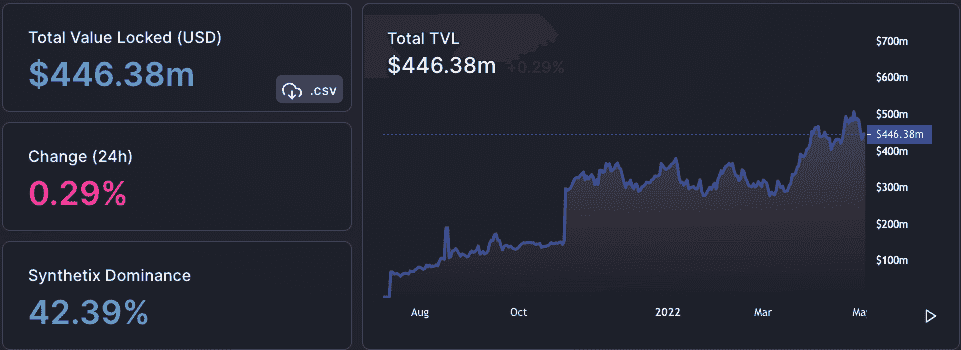
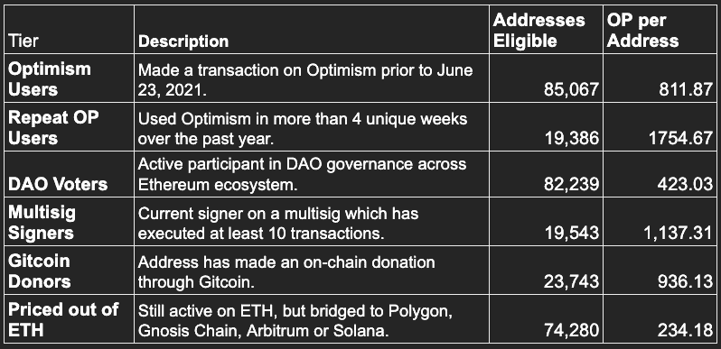

# DeFi Dapps 将乐观主义作为一种可行的选择

> 原文：<https://web.archive.org/web/https://dappradar.com/blog/defi-dapps-are-adopting-optimism-as-a-viable-alternative>

## 即使在目前的 DeFi 熊市，乐观主义正在创新，其连锁分析是一个积极的信号

乐观是 2022 年许多 DeFi dapps 正在采用的以太坊扩展解决方案。在这动荡的一年里，当集中和分散的市场呈现下降趋势时，乐观主义者正在展望一个充满希望的未来。

**总结**

*   DeFi 连锁分析是该行业在 2022 年陷入低迷的具体证据。BTC[***ETH***](https://web.archive.org/web/20220925085227/https://dappradar.com/hub/token/eth/ETH)***分别较 2022 年 11 月高点下跌 43.2%和 41%。***
*   [***32 dapp***](https://web.archive.org/web/20220925085227/https://dappradar.com/rankings/protocol/optimism/1)***已经采用了乐观主义的区块链，因为它以强烈的连锁信号对抗 DeFi 趋势。***
*   [***Uniswap V3***](https://web.archive.org/web/20220925085227/https://dappradar.com/multichain/exchanges/uniswap-v3)***和***[***1 inch Network***](https://web.archive.org/web/20220925085227/https://dappradar.com/multichain/defi/1inch-network)***在过去 30 天里，他们的观众增长了 22.2%和 258.9%***
*   ***[乐观主义集体最近一直在制造许多积极的噪音，最近的 OP 空投公告显示核心用户将获得奖励](https://web.archive.org/web/20220925085227/https://dappradar.com/blog/defi-dapps-are-adopting-optimism-as-a-viable-alternative/#optimism-airdrop)。***

自从 DappRadar 将乐观网络整合到其 dapps 生态系统中后，我们注意到许多 DeFi 平台都采用了区块链。随着该网络最近宣布乐观集体及其双管齐下的治理系统，以及即将到来的象征性空投，看起来该平台已经准备好进入下一个成熟水平。

乐观情绪是在一个悲观的 DeFi 市场背景下实现的。对于大多数加密货币和 DeFi 平台来说，形势不妙。即便如此，许多重要的民主党人还是选择了乐观的区块链，这个网络似乎正在蓬勃发展。

## DeFi 的现状

DeFi 正在脱离 2021 年 11 月的高点。BTC 从 2021 年 11 月 10 日的 67617 美元下跌 43.2%，至今天的 38435 美元。ETH 的故事也类似。2021 年 11 月 9 日，one ETH 价值 4815 美元。自那以来，该股已下跌 41%，至 2，842 美元。DappRadar 的《2022 年 Q1 报告》和我们最近的《T2 行为报告》对这些趋势进行了更详细的描述。

锁定的总价值(TVL)也下降了。2021 年 12 月 2 日，区块链 TVL 为 2547.2 亿美元。现在是 1997.9 亿美元，下降了 21.6%

DeFi Llama graph showing overall DeFi TVL

所有这些连锁信号无可争议地表明，DeFi 和加密货币总体上正在经历熊市。如果我们看看一些最大的分散交易所(DEX)的用户数量，我们可以看到这个数字也在下降。

Dune Analytics: 1inch Network monthly users

Dune Analytics: Uniswap monthly users

所以这里的关键是需求在下降。当这种情况发生时，供应保持稳定，价格就会下降。就这么简单。这并不是说 DeFi 已经风光不再。值得注意的是，人们不再像 2021 年那样赚钱了。

因此，人们在寻找新的利润来源的同时，也在寻找新产品。

## 采纳乐观主义的大人物

乐观主义是针对经常拥塞的以太坊网络的第二层扩展解决方案。乐观是一个乐观上滚(ORU)，这意味着它附带了父区块链，因此是第二层。该解决方案旨在通过离线运行所有计算，同时在线保存所有数据，来提高以太坊的速度并降低成本。

早在三月份，DappRadar 整合了来自乐观区块链的数据，以便我们每月一百万的访问者可以分析使用该网络的 dapps。在发布时，我们跟踪了 14 个 dapps，但从那以后，我们又增加了 18 个。

访问我们的[乐观排名](https://web.archive.org/web/20220925085227/https://dappradar.com/rankings/protocol/optimism/1)并深入每个 dapp 的个人页面，为自己分析他们的链上表现。

[DappRadar’s 30-day rankings for dapps on Optimism](https://web.archive.org/web/20220925085227/https://dappradar.com/rankings/protocol/optimism)

上述列表中令人印象深刻的是采用乐观主义区块链的重要 DeFi 平台的数量。在前五名中，我们可以看到两个重量级人物在过去 30 天里的活动足以表明乐观主义有一个光明的未来。在过去的 30 天里， [Uniswap V3](https://web.archive.org/web/20220925085227/https://dappradar.com/multichain/exchanges/uniswap-v3) 和 [1inch Network](https://web.archive.org/web/20220925085227/https://dappradar.com/optimism/defi/1inch-network) 的用户分别在二层网络上交易了 8730 万美元和 2847 万美元。

更重要的是，有很多 DeFi 平台是乐观主义的，这意味着它们完全建立在乐观主义的区块链之上。仅在前十名中，就有五个 dapps 仅在乐观网络上运行:

*   不切实际的
*   [Pika 协议](https://web.archive.org/web/20220925085227/https://dappradar.com/optimism/exchanges/pika-protocol)
*   [弹弓](https://web.archive.org/web/20220925085227/https://dappradar.com/optimism/defi/slingshot)
*   天琴座
*   [永久协议](https://web.archive.org/web/20220925085227/https://dappradar.com/optimism/defi/perpetual-protocol)

同样有趣的是，在同一时期，TVL 的总体 DeFi 下降了 21.6%，TVL 的乐观指数上升了 26.2%，从 3.5378 亿美元上升到 4.4638 亿美元。

DeFi Llama dashboard for Optimism

因此，有迹象表明，尽管 DeFi 可能正在经历一段艰难时期，但该领域有大量的创新和机会，让人们相信好日子会回来。

## 乐观集体和最近的空投行动

乐观不仅仅是区块链标度的解决方案。该网络是一个集体，希望“为乐观主义、以太坊和开放的互联网创造一个可持续的未来”。它认为自己的使命是:

*   为乐观主义项目提供资金。从 2022 年 5 月 3 日开始，在接下来的六个月里，总代币供应量的 5.4%将分配给这些人。
*   传递乐观的愿景。它认为影响=利润，公益可以盈利。这个集体打算把它从增长中获得的收益引导回“影响力驱动的扩张”的良性循环中。
*   持续运营治理，这将是迭代式的，并允许机构群体在决策和乐观方向中充分发挥作用。

上个月，4 月 26 日，乐观组织宣布了 25 万个地址，这些地址有资格获得对生态系统健康使用的奖励。对于符合任何标准的人，他们将被授予乐观主义的固有令牌，OP。

Criteria for claiming Optimism OP airdrop

如果您符合上表中的任何标准，您将能够领取您应得的空投物品。总共将提供 4，294，967，296 个代币，分配如下:

*   20%用于追溯性公共产品资助。
*   19%将空投给符合条件的成员。
*   25%将留作生态系统基金，用于治理、合作伙伴、种子基金，未分配部分供未来使用。
*   17%会给投资者。
*   19%将捐给核心捐助者。

在接下来的几周里，乐观将发布一系列关于治理、激励和迭代的帖子。

乐观主义还鼓励用户在下一次空投宣布之前将他们的 ETH 连接到 OP，以便有资格进行第二次空投。这样做可以让你得到一些免费的钱，并有机会在一个项目真正启动之前加入它。