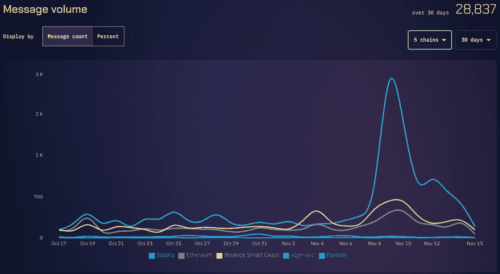
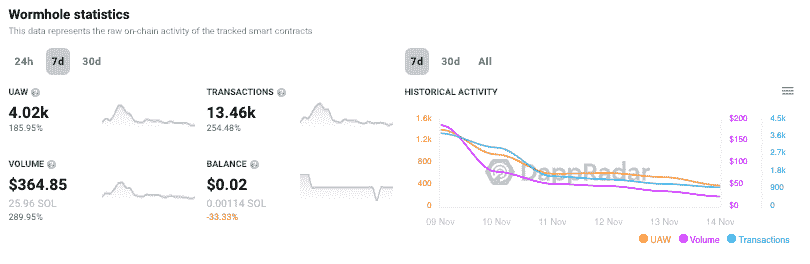
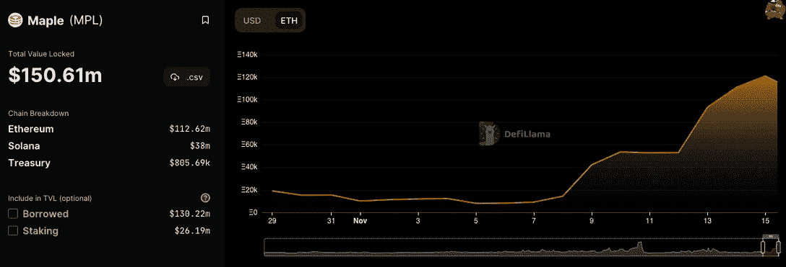
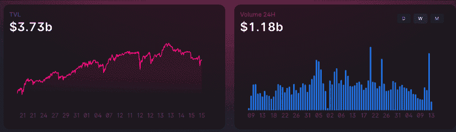
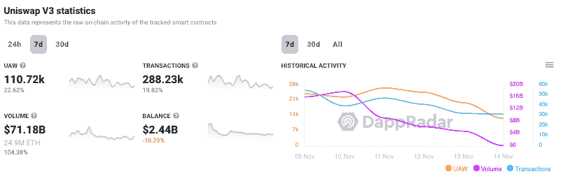
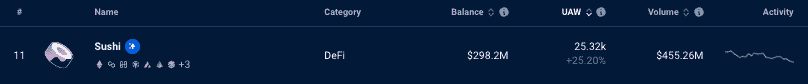
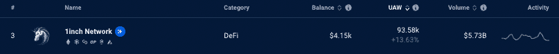

# FTX 融化，DeFi 升温

> 原文：<https://web.archive.org/web/https://dappradar.com/blog/defi-heats-up-as-ftx-melts-down>

## 关于真正分散金融的争论比以往任何时候都更加重要

在加密史上最大的一次崩溃中，主要的分散金融(DeFi)协议显示用户和交易活动有所增加。在过去的七天里，分散式交易所已经完成了 310 亿美元的交易量，显示出惊人的 178%的增长。

**亮点**

*   我们看到的活动高峰可能是由用户从集中式平台转向分散式平台引起的。
*   随着近期 ETH 和 BTC 价格的大幅下跌，交易商们在危机中开始进入稳定的货币头寸。
*   虫洞网络上的峰值度量可能是由于索拉纳。
*   11 月 6 日至 13 日，Uniswap 的交易量[刚刚超过 170 亿美元](https://web.archive.org/web/20221201051811/https://info.uniswap.org/#/)，主要来自瑞士联邦理工学院和两大稳定银行 USDC 和 USDT。
*   枫叶金融回避 FTX catasthrophe。

## FTX 正在给我们上一课

当世界看着 FTX 燃烧的时候，一个更突出的趋势出现了，它让区块链和加密倡导者对去中心化金融的未来感到兴奋。DeFi 正在展示它的金属作为一个地方，用户可以完全控制资金，并且不会放弃像 FTX 这样的托管交易所。

像 FTX 这样的分散平台和集中平台的显著区别在于，流动性来自用户，而不是投资者或机构。DeFi 的所有操作都是 100%透明和不可逆的。像 FTX 这样的情况永远不会出现在一个 [DeFi](/web/20221201051811/https://dappradar.com/blog/what-is-defi-and-how-can-i-save-money-with-it/) 平台上，在那里，令牌持有者投票决定平台如何运行，所有的立场都是透明的。

此外，根据设计，dex 上没有中心故障点。所有 DEX 活动都在链上进行—它是透明的、可验证的，并且得到了用户的批准。没有明确的批准，基金永远不会被交易，并且可以随时被访问。

然而，有一件事是可能发生的，即 DeFi dapp 的资金被 FTX 持有，或者 FTX 投资了 FTT 的平台，或者它获得了贷款以促进运营。这就是为什么在分析不断上升的数据的同时，我们会指出哪些平台已经响应了我们的要求，公开了它们在 FTX 和阿拉米达的风险敞口。

## 不是你的钥匙…

这里的另一个关键因素是，在过去 18 个月中使用 FTX、BlockFi 或 Crypto.com 等集中式平台的更广泛的加密受众现在意识到加密的一个基本规则与以往一样重要——不是你的密钥，也不是你的加密。

我们看到的活动高峰很大程度上可能是由用户从集中式平台转向分散式平台引起的，因为随着流动性枯竭，人们越来越担心他们会停止取款。除此之外，我们看到交易活动增加，因为最近 ETH 和 BTC 的价格大幅下跌，在危机中，交易者正在进入稳定的货币头寸。

此外，DeFi 仍在发挥作用，并向人们展示，他们可以通过对自己的资产行使更多权力、不信任第三方来保持完全控制。

## 穿过虫洞

[虫洞网络是连接高价值区块链的消息传递协议](https://web.archive.org/web/20221201051811/https://dappradar.com/multichain/defi/wormhole)。Dapps 利用消息传递层来促进不同区块链之间的互操作性。开发人员将虫洞插入到他们的 dapps 中，以跨链发送数据。此外，虫洞在一些领先的 DeFi 应用程序的后台执行操作。

[虫洞连接索拉纳](https://web.archive.org/web/20221201051811/https://dappradar.com/multichain/defi/wormhole)，Terra，以太坊，币安智能链，多边形，雪崩，绿洲，更多区块链。与索拉纳的联系很可能是指标见顶的原因，[因为他们对 FTX 死亡的暴露程度非常高](https://web.archive.org/web/20221201051811/https://solana.com/news/solana-facts-ftx-bankruptcy)。简而言之，阿拉米达和 FTX 持有大量 SOL 代币，人们担心他们会抛售这些代币来筹集资金。

索拉纳每天发送的平均信息量徘徊在 500 条左右。从 11 月 7 日开始，这一数字急剧上升，在 11 月 9 日达到 3000 左右的峰值，表明随着 FTX 的崩溃，索拉纳上发生的交易越来越多。与其他区块链相比，如以太坊和 BNB 连锁店，这种增长是明显的。

只看一下[虫洞 Solana dapp radar](https://web.archive.org/web/20221201051811/https://dappradar.com/solana/defi/wormhole)上的数据就可以看到类似的画面:与虫洞互动的 UAW 数量膨胀了 185%以上，达到 4000 个左右，几乎占了前一周所有连锁店中与 dapp 连接的所有钱包的一半。

## 枫叶金融回避灾难

[Maple Finance 是一个机构资本市场](https://web.archive.org/web/20221201051811/https://maplefinance.gitbook.io/maple/),专注于无抵押贷款，主要在以太坊和 Solana 上运营。简而言之，它们为金融机构和其他贷方提供流动性。最重要的是，Maple 是无担保贷款类别中最大的项目。

[据 DeFi Lama](https://web.archive.org/web/20221201051811/https://defillama.com/protocol/maple?denomination=USD) 称，在崩溃的余波中，Maple Finance 的总价值从大约 1500 万美元增长到 1 . 5 亿美元。如果我们包括借款和赌注，这个数字攀升到 3 亿多美元。在这额外的 1.5 亿美元中，借款占了 1.3 亿美元。

达普拉达联系了枫叶金融公司的营销主管夏洛特·多兹。她告诉我们，Maple 上的任何资金池都没有贷款给 Alameda，活跃的借款人对 FTX 和 FTT 的风险敞口也很有限。

此外，阿拉米达的所有未偿贷款已于 2022 年 9 月关闭，其证据可参见此处的。她接着说，代表们坚持最高的信贷标准，为贷款人提供有竞争力的风险调整回报。在风雨飘摇的六个月时间里，这些做法将所有资金的 99%返还给了协议中的贷款人。

这些标准还导致 Orthogonal 关闭了其单一借款人池，并在今年夏天取消了 Alameda 作为借款人的资格。此外，M11 信贷在 9 月 4 日退出了阿拉米达，而 Credora 在 8 月份只借了一笔贷款就退出了。另一方面，Maple 透露，他们通过用户对 FTX 有一些有限的间接敞口，但对 FTX 和 FTT 的总体借款人敞口是有限的。

Maple 向 Amber Group、Auros、DV Trading、Flow Traders、Folkvang、Nibbio、Portofino Technologies、Orthogonal Trading、Reliz Ltd、Symbolic Capital、Wincent 和 Wintermute 等借款人发放了 37 笔贷款，总额为 2 . 27 亿美元。池代表可以看到借款人当前的 FTT 持有量和对冲头寸、FTT 作为抵押品的使用情况以及 FTX 持有的资产数量。

她继续说，根据向代表们提供的信息和对链上工具的使用，我们认为借款人有足够的股本缓冲来承受 FTX 损失的资金，继续从动荡的市场中获利，并最终按预期在 Maple 上偿还贷款。

## Uniswap 不断伸缩

[Uniswap 是领先的多链 DeFi 协议](https://web.archive.org/web/20221201051811/https://dappradar.com/multichain/exchanges/uniswap-v3)在[吹牛模式](https://web.archive.org/web/20221201051811/https://twitter.com/Uniswap/status/1590802422129364992)。从设计上来说，在规定的限额之外，平台对用户资金没有控制权。这意味着即使 [Uniswap](https://web.archive.org/web/20221201051811/https://dappradar.com/multichain/exchanges/uniswap-v3) 暴露于 FTX，他们也没有办法阻止用户提取资金。事实上，许多人只是最近才开始学习像这样有见地的推文。

11 月 6 日至 13 日期间，该平台的交易量[刚刚超过 170 亿美元](https://web.archive.org/web/20221201051811/https://info.uniswap.org/#/)，主要来自瑞士联邦理工学院和两大稳定银行 USDC 和 USDT。上一次 [Uniswap](https://web.archive.org/web/20221201051811/https://dappradar.com/multichain/exchanges/uniswap-v3) 看到这样的周交易量是在 2022 年 5 月的第二周，当时 ETH 的价格在两个月内从近 3000 美元跌至略高于 950 美元。

[DappRadar 数据与趋势相吻合](https://web.archive.org/web/20221201051811/https://dappradar.com/multichain/exchanges/uniswap-v3)，我们看到与 Uniswap 互动的 UAW 数量周环比增长超过 22%,交易数量激增近 20%,超过 288，000 笔。与此同时，交易量增长到超过 710 亿美元，增长了 104%——这是底线。Uniswap 是安全的，并按预期运行，向世界展示了自我监管和分散融资的真正力量。

## 寿司仍然供应

[Sushi 是业内使用最多的多链 dex](https://web.archive.org/web/20221201051811/https://dappradar.com/multichain/defi/sushi)之一，部署在十多个区块链上，支持数千个令牌。用户可以在一个分散的、社区驱动的平台上交易、赚取、积累收益、借贷和利用。[寿司](https://web.archive.org/web/20221201051811/https://dappradar.com/multichain/defi/sushi)最重要的是，审查制度的阻力和不可改变性。Sushiswap 运行在无法更改或删除的代码上。与 Uniswap 相同。

该平台也一直在挺起胸膛，[提醒用户](https://web.archive.org/web/20221201051811/https://twitter.com/SushiSwap/status/1590281244142862336)关键规则——不是你的钥匙或密码。进一步提醒用户，在 DeFi 中，提款是不能停止的，无论用户是在交换还是提供流动性，他们都将被要求签署这些行动的交易。

我们看到连接到该平台的钱包数量增加了 25%以上，在过去七天内连接的钱包数量超过了 25，000 个。

## 退让一步。他们走了一英里

多链 DeFi 协议[1 英寸](https://web.archive.org/web/20221201051811/https://dappradar.com/multichain/defi/1inch-network)一直是该领域的重要参与者，但随着 FTX 的崩溃，其指标有所提高。11 月 11 日，在 FTX 申请破产的一天后，他们[在 Twitter](https://web.archive.org/web/20221201051811/https://dune.com/1inch) 上宣布，在过去的 24 小时内，1inch 上的总直接交易量超过了 19.4 亿美元，并且在过去的三天内，1inch 协议的每日用户数量增加了近 20%。

与之相得益彰的是越来越多的 UAW 连接到 1 英寸并完成交易。一周又一周，连接到 1inch 的钱包数量增长了 12%以上，交易额达到 57.3 亿美元。

## DeFi 或 bust

在过去的七天里，这个行业遭受了巨大的打击。即使对于一个似乎每周都经历动荡的空间，FTX 和阿拉米达的崩溃也意义重大，原因不止一个。

从人类的角度来看，人们将会失去他们努力积攒的一切。几千，如果不是几百万美元，都在眨眼之间消失了。但如果普通人听从区块链和 DeFi 倡导者关于自我监管的警告，而不是前往可以提供更简化但风险更大的体验的集中交易所，情况可能会完全不同。

此外，如果 DeFi 能够开始将用户认为 CEXs 有吸引力的方面与 DeFi 的自我监管和透明性结合起来，那么这个配方似乎很美味。就像本叔叔说的——权力越大，责任越大——但是谁准备好了呢？

## 随身携带您的 Web3 之旅

使用 DappRadar 移动应用程序，再也不会错过 Web3。查看最受欢迎的 dapps 的性能，并关注您投资组合中的 NFT。您在 DappRadar 上的帐户会与我们的移动应用程序同步，这样您很快就可以选择实时接收提醒。

[Download the DappRadar app now](https://web.archive.org/web/20221201051811/https://dappradar.app.link/blog)[<picture></picture>](https://web.archive.org/web/20221201051811/https://play.google.com/store/apps/details?id=com.portfolio.dappradar)

***以上不构成投资建议。此处给出的信息仅供参考。请行使尽职调查，做你的研究。作者持有多种加密货币的头寸，包括 BTC、瑞士法郎和雷达。***