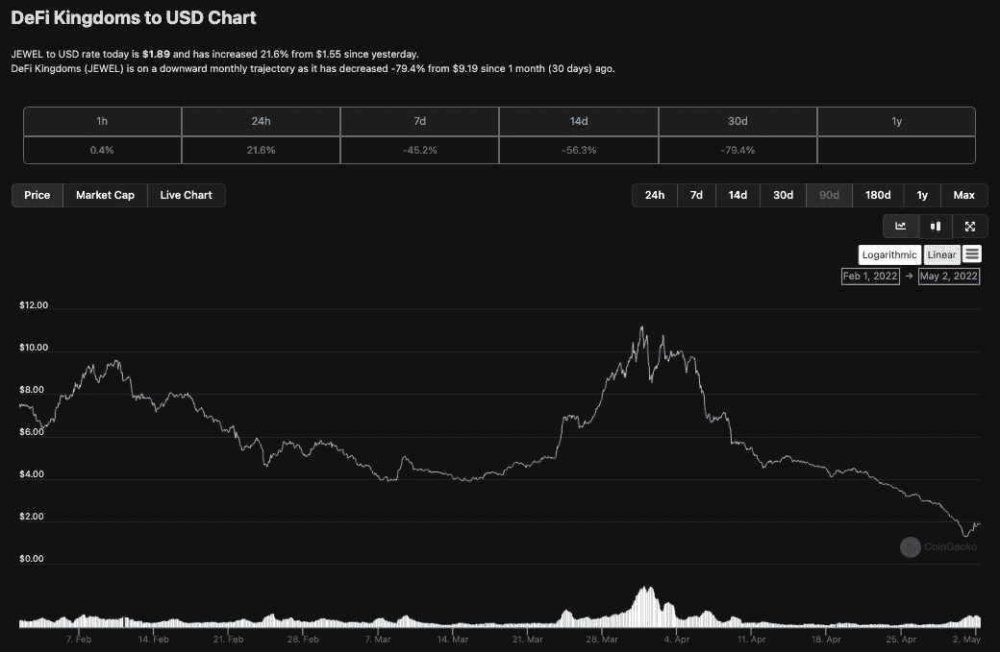
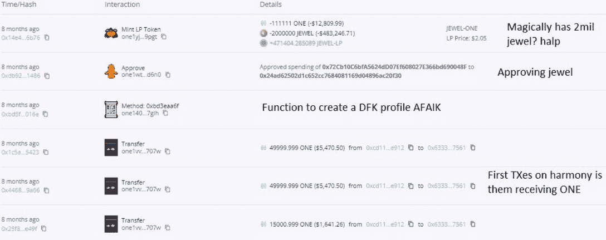
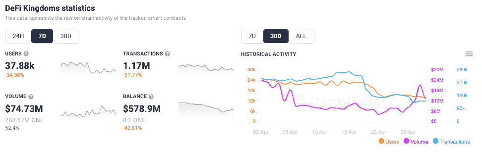
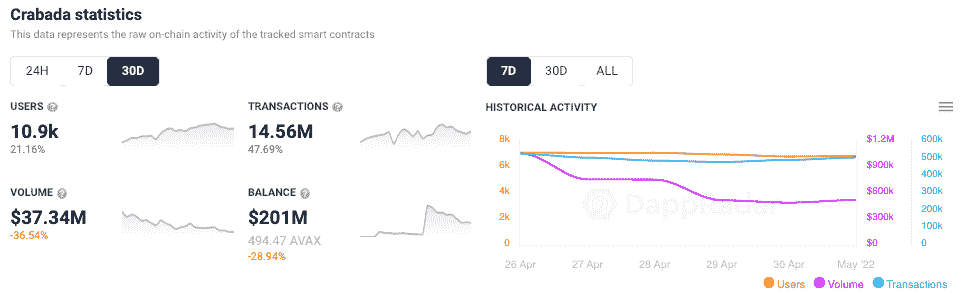
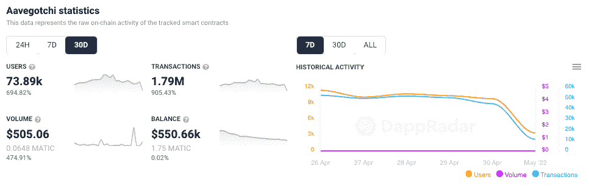

# DeFi 王国开发离开自由落体珠宝

> 原文：<https://web.archive.org/web/https://dappradar.com/blog/defi-kingdoms-exploit-leaves-jewel-in-freefall>

## JEWEL 较 2022 年 1 月的高点下跌了逾 79%

和谐世界上的游戏巨头 DeFi Kingdoms 在周末遭受了一次攻击，影响了玩家解锁他们锁定的珠宝令牌的速度。这一漏洞导致 JEWEL 在 5 月 1 日周日暴跌 50%以上，跌至 1.28 美元，截至发稿时反弹至 1.89 美元。

## 摘要

*   JEWEL 较 2022 年 1 月的高点下跌了逾 79%
*   [漏洞利用影响了](https://web.archive.org/web/20221127150119/http://defi-kingdoms-exploited-/)玩家解锁他们锁定的宝石令牌的速度
*   一个修复漏洞的补丁于周六上线，但是宝石还没有完全恢复
*   JEWEL 在写作时为 1.28 美元，与 2022 年 1 月相比下跌了 50%

## DeFi 王国开发

一个漏洞允许玩家从多个账户中挖掘被锁定的宝石，导致宝石价格大幅下跌。此外，新玩家的缺乏也导致了最近的抛售压力。结合这两个因素，导致了珠宝价格大幅下跌。根据开发者 Frisky Fox 的说法，通过在多个账号之间转移，可以不公平地增加锁定宝石的开采，允许比预期更多的英雄同时开采锁定宝石。

与合法开采的宝石数量相比，这次开采导致少量额外的宝石进入市场。然而，JEWEL 的价格在漏洞攻击后的 24 小时内受到了重创。同样值得一提的是，JEWEL 在过去几个月里一直呈下降趋势。就在四个月前，JEWEL 的价格还不止 22 美元。写作时，不到 2 美元。然而，今天早上出现了更多积极的迹象，价格开始回升，在过去 24 小时内上涨了 21.5%。

## 事情变得复杂了

4 月 30 日，一名 Twitter 用户发布了一条状态，使用 [Harmony](https://web.archive.org/web/20221127150119/https://dappradar.com/rankings/protocol/harmony) block explorer 寻求帮助，因为他们认为自己发现了一些见不得人的交易。他们发现，拥有 4000 万英镑的最大鲸鱼钱包之一 Harmony ONE 目前在钱包中锁定了大量的 LP 令牌和 0 宝石。求救的呼声是要找出钱包最初是从哪里得到宝石成为 DeFi 王国的一部分的。

将 [DFK](/web/20221127150119/https://dappradar.com/blog/defi-kingdoms-launching-own-dfk-blockchain-to-improve-game-experience/) 追踪器与和谐街区探索者结合使用，这个人发现钱包从未收到过珠宝，但当资金池开放时，他们花了 200 万珠宝铸造流动性提供商代币。用户需要池中等量的两种代币来创建 LP 代币以增加流动性。重要的是，这个钱包地址没有绑定到开发者账户，因为它没有列在任何地方，然而，自 DFK 成立以来，它已经倾倒了价值数百万美元的珠宝。

Twitter 侦探发现的另一件令人兴奋的事情是，这个账户最初被称为 Liquidity。据版主称，控制者后来设法将他们的账户改名为 LiquidLuck，这应该是不可能的。值得注意的是，旁观者清，他们并不是[和谐](/web/20221127150119/https://dappradar.com/blog/scalable-harmony-ecosystem-sees-healthy-growth/)街区探索者的专家。他们既没有指责 [DeFi 王国](/web/20221127150119/https://dappradar.com/blog/how-to-get-started-in-defi-kingdoms-crystalvale/)团队任何事情，而是提出了一个问题，并要求一些答案。

## DeFi 王国消失了

数据显示，DeFi 王国最近一直在有机衰退，在过去的七天里，连接到它的钱包数量下降了近 35%。交易数量也下降了 30%以上，表明玩家对平台失去了一些兴趣。

此外，在没有新玩家来平衡游戏经济的情况下，发给玩家的大量珠宝奖励增加了销售压力。这个漏洞出现在 DeFi 王国的关键时刻，因为 GameFi 类别中的其他战斗人员开始发起严重的指控。

## 挑战濒临绝境的王国

DeFi 王国于 2021 年 8 月 23 日抵达[和谐区块链](https://web.archive.org/web/20221127150119/https://dappradar.com/rankings/protocol/harmony/category/games)，并将自己描述为一个游戏、一个 DEX、一个流动性池机会和一个罕见的公用事业驱动的 NFT 市场。所有这一切都在幻想像素艺术的怀旧形式和农业的永恒吸引力中无缝地展现出来。

该游戏于 2021 年 8 月下旬推出，正如 DappRadar 在第三季度报告的 154 万个每日唯一活跃钱包连接到 dapps。此外，play-to-earn 和 GameFi dapps 继续推动行业内的使用，与 Q2 2021 年第三季度相比，连接到游戏 dapp 的独特钱包数量增加了 140%以上。DeFi 王国发挥影响力的时候到了。仅仅过了六个月，一系列竞争对手已经敲开了这个王国的大门，而随着我们进入 Q2，类似项目的数量也在下降。

由于 Ronin bridge 漏洞和周围的负面影响，Axie Infinity 最近受到了攻击；由于领先的区块链游戏试图为 2022 年重新配置自己，用户在过去 30 天内下降了 10%以上。[疯狂防御英雄](/web/20221127150119/https://dappradar.com/blog/how-crazy-defense-heroes-came-to-dominate-play-to-earn-gaming/)也曾一路高歌猛进，但在过去的 30 天里，其用户数量下降了 20%以上， [BNB 连锁店的](https://web.archive.org/web/20221127150119/https://dappradar.com/rankings/protocol/binance-smart-chain)闪耀之星 [MOBOX](/web/20221127150119/https://dappradar.com/blog/mobox-takes-over-gaming-on-bsc-as-play-to-earn-gains-traction/) 的用户数量也下降了 10%。然而，虽然一些更成熟的 dapps 显示出疲劳的迹象，但其他人正在崭露头角，并用有趣的介绍性令牌组学抓住用户的想象力。

## 新游戏吸引了人群

与此同时，[在雪崩](https://web.archive.org/web/20221127150119/https://dappradar.com/rankings/protocol/avalanche)、[克拉巴达](https://web.archive.org/web/20221127150119/https://dappradar.com/avalanche/games/crabada)之上，一款风格类似于 Axie Infinity 的游戏，已经获得了很多关注。在过去的 30 天里，它的用户群增加了 21%以上，交易量增加了近 50%。那些可能放弃 DeFi 王国和 Axie 的玩家已经在 Crabada 上找到了新的[挑战。](https://web.archive.org/web/20221127150119/https://dappradar.com/avalanche/games/crabada)

自从几周前发布了它的 [Gotchiverse](/web/20221127150119/https://dappradar.com/blog/aavegotchi-launches-gotchiverse-on-march-31/) 以来，Polygon 的 Aavegotchi 一直在碾压它。在过去的 30 天里，它的用户群增加了 690%以上，产生了 179 万笔交易。

《挑战王国》去年成为区块链顶级游戏。像 Ansem 这样的密码影响者经常表达他们对游戏的乐观态度，而 Crystalvale [资料片](https://web.archive.org/web/20221127150119/https://defikingdoms.medium.com/introducing-the-crystalvale-realm-defi-kingdoms-is-coming-to-avalanche-d0730ba54b63)进一步推动了炒作。然而，尽管有一个专门的开发团队和游戏最近在他们的雪崩子网上推出，DeFi 王国在一个悲观的加密市场中表现不佳。这款游戏未来能否夺回玩家基础仍不确定。

 NewsletterUnsubscribe at any time. [T&Cs](https://web.archive.org/web/20221127150119/https://dappradar.com/terms) and [Privacy Policy](https://web.archive.org/web/20221127150119/https://dappradar.com/privacy-policy)

***以上不构成投资建议。此处给出的信息仅供参考。请行使尽职调查，做你的研究。作者持有多种加密货币的头寸，包括 BTC、瑞士法郎和雷达。***