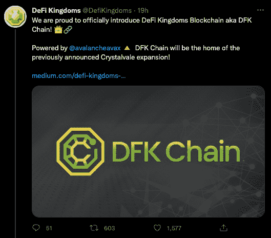
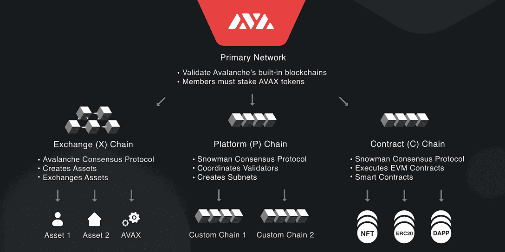
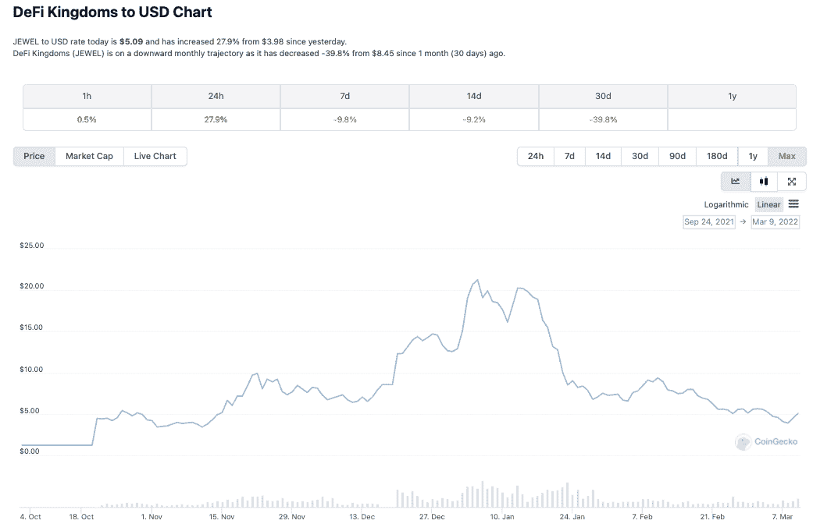
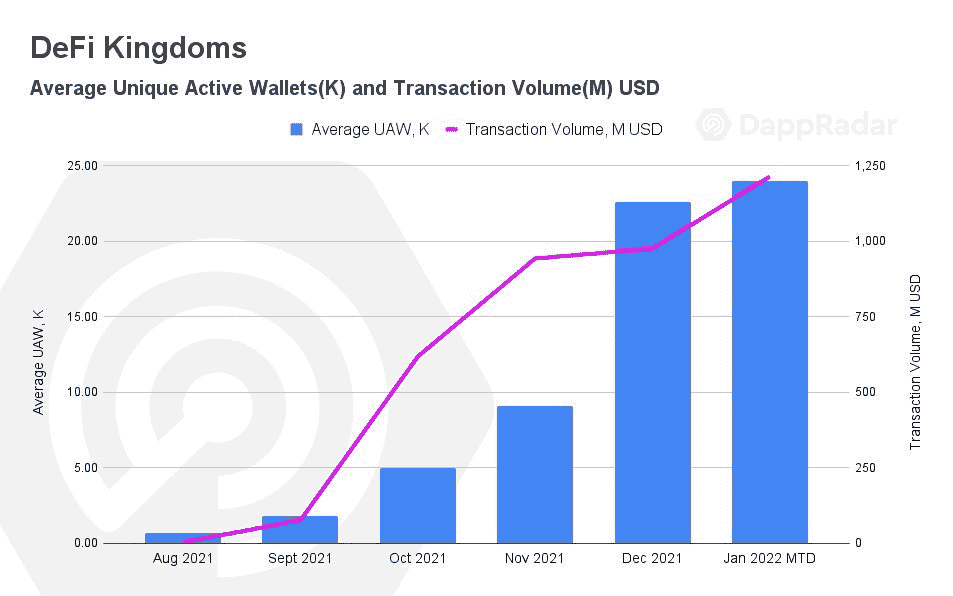
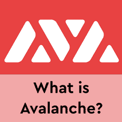

# DeFi 王国推出自己的 DFK 区块链，以改善游戏体验

> 原文：<https://web.archive.org/web/https://dappradar.com/blog/defi-kingdoms-launching-own-dfk-blockchain-to-improve-game-experience>

## 领先的 GameFi 平台跟随 Axie 和 Gala 的脚步

**领先的和谐网络 dapp 德菲王国已经宣布了自己的区块链，德菲王国区块链，也被称为 DFK 链。与艾娃实验室合作，DFK 链将是之前宣布的 Crystalvale 扩展的家。**

随着 [DeFi 王国](https://web.archive.org/web/20221129142254/https://dappradar.com/multichain/games/defi-kingdoms)区块链的发布，该团队希望它将成为推出 GameFi 和其他区块链游戏体验的首选生态系统。这些当然会连接到 DeFi 王国:水晶谷。

DeFi 王国和艾娃实验室基本上创造了雪崩区块链的姊妹链。他们称这个过程为初始子网提供，或 ISO。他们认为这是扩大区块链服务和创建定制生态系统的更大计划的开始。在这种情况下，DeFi 王国将提供这样一个定制的生态系统。

[玩赚游戏](/web/20221129142254/https://dappradar.com/blog/dappradar-x-bga-blockchain-games-report-january/)的兴起以及与 DeFi 和 NFT 机制交织在一起的游戏最近变得非常受欢迎， [DeFi 王国是冉冉升起的新星之一](https://web.archive.org/web/20221129142254/https://dappradar.com/blog/play-to-earn-defi-kingdoms-rise-to-success/)。GameFi 平台吸引了创纪录数量的用户，并敲开了寻找加密入口的主流客户的大门。它看起来简单，但非常复杂的财务机制帮助了船上的人，他们可能太害怕尝试 DeFi dapps。

## 子网不是主网

DeFi 王国始于和谐区块链，最近扩展到雪崩。现在，在这个最近公告的背景下，更清楚为什么团队[决定推出雪崩](https://web.archive.org/web/20221129142254/https://www.theblockcrypto.com/post/136691/avalanche-subnet-incentive-program)。Avalanche 子网技术允许项目分割一组 Avalanche 验证器，并委托他们验证 Avalanche 主要三个链之外的额外区块链。也许 Avalanche 公司刺激子网增长的 2 . 9 亿美元激励计划也有所帮助。

DeFi 王国将通过委托一个子网来运行和管理他们专有的区块链。DeFi 王国区块链是 EVM 兼容的区块链，将通过子网验证，并使用艾娃实验室开发的权威证明和利害关系证明共识算法。此外，DFK 链与雪崩子网基础设施的结合有望为 DeFi 王国释放新的潜力。关于雪崩子网的技术信息[可以在这里找到](https://web.archive.org/web/20221129142254/https://docs.avax.network/build/tutorials/platform/subnets/)。

## 宝石作为汽油的象征

在子网上构建特定 DeFi 王国区块链的最大优势之一是赋予宝石令牌更多的能力。JEWEL 将不仅作为一个 Serendale 治理令牌，而且作为 DFK 链的网络令牌。DeFi 王国的玩家:Crystalvale 将使用宝石支付 DFK 链上的交易。

值得注意的是，这一决定并没有增加珠宝代币的总市值。JEWEL 将继续在 Serendale 的主花园铸造。游戏内的桥梁将被提供，以允许珠宝被转移到 DFK 链支付交易和提供流动性。所有连锁店的有效总供应量保持在 5 亿珠宝。

既然宝石将被用于天然气，还有如何分配这些费用的问题。一部分将给予验证者的指定钱包，以允许 DeFi 王国吸引更多的验证者，并进一步分散链。通过实施持续的燃烧机制和减少供给，一定数量的宝石将被燃烧以持续增加宝石的价值。此外，一部分将被送往探索基金，以奖励整个社区和玩家。

## 1500 万美元的奖励

DeFi 王国将与 Avalanche 基金会合作，为 DFK 链上的 Crystalvale 发布的早期阶段提供总计 1500 万美元的奖励:一半在 Crystal，一半在 AVAX。这些激励措施将作为早期阶段持续空投和冰园排放的一部分，其中某些池将获得 AVAX 补贴。未来几周将公布更多激励措施的细节。

## DFK 前哨

从 Avalanche 开始，DeFi 王国将扩展到在多个链上创建它所谓的前哨站，这将包括使玩家无缝和轻松地登上 DFK 链的功能。这些将包括通过当地的 dex 进行整合的桥接和交易，以便更容易获得 JEWEL 来支付天然气费，并在不离开 defikingdoms.com 的情况下进行桥接。

前哨站更大的目标是减少进入 DeFi 王国的障碍。前哨将有一个菲亚特 onramp 集成，以帮助与当地连锁天然气费，教程，和 RPC 开关 DFK 链第一次。某些连锁店甚至会有自己专属的迷你区。

## 从其他连锁店到 DFK 的桥梁

DFK 是它自己的链，需要来自所有链的桥接支持，包括和谐和雪崩 C 链。正如在《塞伦代尔，DeFi 王国:Crystalvale》中已经看到的那样，它将利用“码头”区域作为游戏内接口，接入桥接服务。虽然前哨区域协助 DFK 链的初始上船，码头将是所有与链上和链下移动代币相关的事情的持续区域，包括菲亚特上/下坡道。

在发布时，DFK 码头将支持来自 Avalanche 和 Harmony chains 的 JEWEL、xJEWEL 和 AVAX，但随着时间的推移，将扩展受支持的令牌和链。这是希望码头将为玩家提供无缝和本地的经验，为桥梁和 DFK 链。

## 子网验证器

在雪崩网络上运行子网需要一组验证器。首先，DeFi 王国将与几个团队合作建立一个创世纪验证器集。他们计划向社区成员、公会和其他合作伙伴开放应用程序，以加入验证程序集并在短期内获得奖励。

子网技术要求所有子网验证器都是主要的雪崩网络验证器。雪崩的当前标桩要求是 2000 AVAX。除此之外，希望加入 DFK 子网组的验证者将被要求加入 JEWEL，并被列入该子网的白名单。随着子网技术的进步，该团队希望使 DFK 链成为一个任何人都可以加入和保护的无许可的股权证明网络。

## RPC 节点

由于在链上运行游戏逻辑需要大量的数据和事务，RPC 对于玩家的体验至关重要。与艾娃实验室和 POKT 网络的合作将在发布时提供一组公共的 RPC 节点。发布后，该团队计划委托内部资源来提供私有和公共 RPC，这些 RPC 将向社区成员、计划参与者和官方合作伙伴授予访问权限，以使所有人都能流畅地在 DFK 上玩游戏或开发。

## GameFi，新的 DeFi？

DeFi 王国的团队从根本上建立了一个分散的交易所，允许用户持有货币代币，并拥有一个有价值的可用代币，旨在以有趣的方式回馈代币持有者。比如让玩家建立一个操作，提升它以增加回报，增加每日任务以收集稀有的 NFT。增加和影响奖励和回报的项目。

这款游戏于 2021 年 8 月下旬推出，当时 [DappRadar 报告称，在第三季度](/web/20221129142254/https://dappradar.com/blog/dapp-industry-report-q3-2021-overview/)有 154 万个每日唯一活跃钱包连接到 dapps。此外，玩赚游戏继续推动行业内的使用，与 2021 年第三季度和 2021 年 Q2 相比，连接到游戏 dapps 的独特钱包数量增加了 140%以上。大约在那个时候，Splinterlands 成为了行业中使用最多的 dapps 之一，季度环比增长了惊人的 1，376%。而 Axie Infinity 成为有史以来交易量最大的 NFT 收藏，历史交易量超过 20 亿美元。

迄今为止，DeFi 王国的成功有几个关键因素。如前所述，时机就是一切，可以说这个团队不可能在更合适的时候发布这个平台了。随着天然气价格飙升，用户开始在其他地方寻找机会，DeFi 王国的定位非常好。

NFT 市场的推出是该平台活跃用户数量和交易量的巨大催化剂，有助于巩固游戏作为一个具有强大路线图和雄心的严肃竞争者。2022 年 1 月初，该团队宣布锁定的总价值达到了具有里程碑意义的 10 亿美元，进一步显示了该平台和游戏赚钱类型的受欢迎程度。扩张不可避免，进入雪崩生态系统的步骤更加清晰。

DeFi 王国跟随领先的 dapps 的脚步，如 Axie Infinity T1，他们推出了他们的[浪人链](/web/20221129142254/https://dappradar.com/blog/axie-infinity-activity-spikes-as-users-enjoy-new-ronin-based-dex/)，并在去年打破了他们以前的所有记录。此外，[盛大游戏上周宣布有意打造自己的区块链](/web/20221129142254/https://dappradar.com/blog/gala-games-presents-its-blockchain-what-is-project-gyri/)。随着越来越多的人开始理解像 DeFi 王国这样的 dapps 所带来的机会，活跃钱包的数量和交易量应该会增加。

[<picture></picture>](https://web.archive.org/web/20221129142254/https://dappradar.com/blog/introducing-the-avalanche-blockchain)[<picture></picture>](https://web.archive.org/web/20221129142254/https://dappradar.com/rankings/protocol/avalanche)[<picture></picture>](https://web.archive.org/web/20221129142254/https://dappradar.com/avalanche/defi/pangolin-exchange)

***以上不构成投资建议。此处给出的信息仅供参考。请行使尽职调查，做你的研究。作者持有 ETH、BTC、AGIX、HEX、LINK、GRT、CRO、OMI、不变 X、ENS、GALA、AVASTR、GMEE、CUBE、RADAR、FLOW、FTM、BNB、SPS、WRLD、ATOM 和 ADA。***