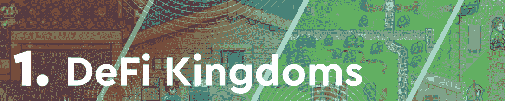
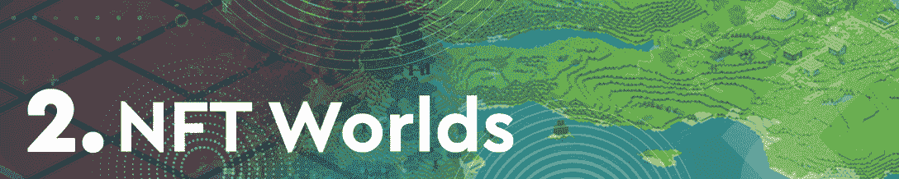
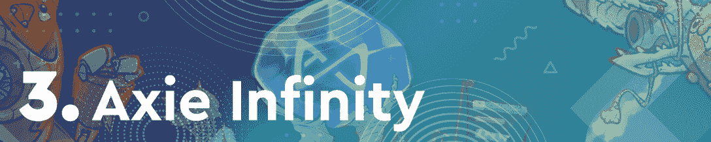
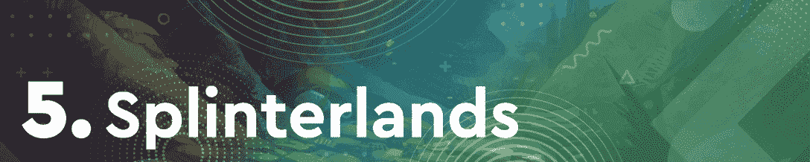
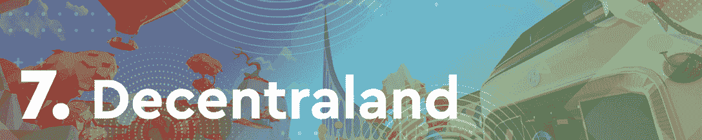

# DeFi 王国领先，游戏代币暴涨

> 原文：<https://web.archive.org/web/https://dappradar.com/blog/defi-kingdoms-takes-the-lead-gaming-tokens-skyrocket>

## 本周排名前 10 的游戏中，有 9 个游戏的代币价值飙升

DeFi 王国本周荣登排行榜榜首，这要归功于其本土象征珠宝的估值令人印象深刻地增长了 59%。令人印象深刻的是，这不是唯一一个游戏 dapp 看到其原生令牌的估值如此惊人的飙升。相反，列表中的 10 个游戏中有 9 个游戏的相应游戏代币的价格有所上涨。

在过去几周退出排名后，游戏赚钱巨头 Axie Infinity 正在卷土重来。新的条目也进入了名单，位于雪崩的 Crabada 本周排名第十。

几个月来，区块链游戏一直处于加密活动的前沿。通过这篇文章，DappRadar 看了本周最热门的游戏 dapps。为了编制这个排名，我们考虑了链上活动，NFT 交易量，令牌估值，以及围绕每个 dapp 的新闻和事件。

在下面浏览本周十大区块链游戏的完整列表。单击相应的图片，了解每个平台的更多信息。或者，看看下面的视频，它总结了排名，可以快速查看。

[https://web.archive.org/web/20221001122543if_/https://www.youtube.com/embed/msHO-AbI4-c?feature=oembed](https://web.archive.org/web/20221001122543if_/https://www.youtube.com/embed/msHO-AbI4-c?feature=oembed)

## 十大区块链游戏

[<picture></picture>](https://web.archive.org/web/20221001122543/https://dappradar.com/harmony/games/defi-kingdoms)

### DeFi 王国高居榜首，宝石收益 59%

由于其本土象征宝石在过去七天中令人印象深刻的积极行动，DeFi 王国是本周不可否认的赢家。在过去的一周里，JEWEL 的价格飙升了 59%以上。DeFi infused 游戏凭借其在 2022 年的出色表现吸引了密码界的关注。更不用说这个游戏把和谐和雪崩链放在了区块链游戏活动的最前沿。

[<picture></picture>](https://web.archive.org/web/20221001122543/https://dappradar.com/ethereum/games/nft-worlds)

### NFT 世界宣布推出阿凡达系列

虚拟世界 [NFT 世界](https://web.archive.org/web/20221001122543/https://dappradar.com/ethereum/games/nft-worlds)在团队宣布即将发布新的阿凡达 NFT 系列后攀升至第二位。NFT 世界的土地是元宇宙地区最昂贵的土地之一，推出亲民党系列也承载着同样的期望。更重要的是，这款游戏的本土标志 [WRLD](https://web.archive.org/web/20221001122543/https://dappradar.com/hub/token/eth/WRLD?from=0xd5d86fc8d5c0ea1ac1ac5dfab6e529c9967a45e9) 的价值已经升值超过 38%。

[<picture></picture>](https://web.archive.org/web/20221001122543/https://dappradar.com/ronin/games/axie-infinity)

### Axie Infinity Origins 即将在桌面上推出

游戏赚巨人 [Axie Infinity](https://web.archive.org/web/20221001122543/https://dappradar.com/ronin/games/axie-infinity) 宣布其即将推出的 Origins 版本将首先在桌面上推出。围绕新版本的大肆宣传有助于将游戏推到本周排行榜的前 3 名。此外，Axie 的原生令牌 [AXS](https://web.archive.org/web/20221001122543/https://dappradar.com/hub/token/eth/AXS?from=0xbb0e17ef65f82ab018d8edd776e8dd940327b28b) 的估值大幅飙升，在过去七天里上涨了近 45%。

[<picture></picture>](https://web.archive.org/web/20221001122543/https://dappradar.com/multichain/games/alien-worlds)

### 《异形世界》TLM 7 天涨幅接近 20%

基于蜡的采矿游戏[外星世界](https://web.archive.org/web/20221001122543/https://dappradar.com/multichain/games/alien-worlds)继续吸引稳定的用户群，这帮助它在本周排名第四。在过去的七天里，该平台上注册了近 370，000 个独特的活动钱包，《异形世界》是 Wax 上领先的 dapps 之一。此外，该平台的本地令牌 [TLM](https://web.archive.org/web/20221001122543/https://dappradar.com/hub/token/bsc/TLM?from=0x2222227e22102fe3322098e4cbfe18cfebd57c95) 的价格本周上涨了近 20%。

[<picture></picture>](https://web.archive.org/web/20221001122543/https://dappradar.com/hive/games/splinterlands)

### 夹板岛 SPS 失去价值，游戏玩家继续推

基于 Hive 的[splitter lands](https://web.archive.org/web/20221001122543/https://dappradar.com/hive/games/splinterlands)本周下降了几个位置，排名第五，是名单上唯一一个本地令牌贬值的游戏。 [SPS](https://web.archive.org/web/20221001122543/https://dappradar.com/hub/token/bsc/SPS?from=0x1633b7157e7638c4d6593436111bf125ee74703f) 在过去七天里损失了约 3%的估值。然而，这并没有影响游戏的受欢迎程度，因为上周有超过 530，000 个独特的活动钱包连接到该平台。

[<picture></picture>](https://web.archive.org/web/20221001122543/https://dappradar.com/ethereum/games/gods-unchained)

### 《被解放的上帝》卷土重来

[Gods Unchained](https://web.archive.org/web/20221001122543/https://dappradar.com/ethereum/games/gods-unchained) 是少数几个基于以太坊的游戏项目之一，已经进入了每周十大排名。虽然不是经常进入，游戏有一个坚实的用户基础，这有助于它输出稳定的性能。重要的是，在过去的七天里，游戏的原生令牌[神](https://web.archive.org/web/20221001122543/https://dappradar.com/hub/token/eth/GODS?from=0xccc8cb5229b0ac8069c51fd58367fd1e622afd97)获得了超过 37%的估值。

[<picture></picture>](https://web.archive.org/web/20221001122543/https://dappradar.com/ethereum/marketplaces/decentraland)

### 分散地举办了第一届元宇宙时装周

由于首届元宇宙时装周的举办，虚拟世界[分散的土地](https://web.archive.org/web/20221001122543/https://dappradar.com/ethereum/marketplaces/decentraland)本周排名第七。用户现在可以查看像汤米·席尔菲格这样的时尚界大品牌的收藏。值得一提的是，随着活动的开始，分散地的本地令牌 [MANA](https://web.archive.org/web/20221001122543/https://dappradar.com/hub/token/eth/MANA?from=0x0f5d2fb29fb7d3cfee444a200298f468908cc942) 升值了 7%，跟上了区块链游戏领域的主流趋势。

[<picture></picture>](https://web.archive.org/web/20221001122543/https://dappradar.com/binance-smart-chain/games/mobox-nft-farmer)

### Mobox 在 BSC 上主导 NFT 销售

基于 BNB 智能链的 NFT 农业游戏 [Mobox](https://web.archive.org/web/20221001122543/https://dappradar.com/binance-smart-chain/games/mobox-nft-farmer) 再次跻身区块链游戏排行榜前 10 名，本周排名第 8。这款游戏在 NFT 产生了超过 400 万美元的交易量，而其本土代币 [MBOX](https://web.archive.org/web/20221001122543/https://dappradar.com/hub/token/bsc/MBOX?from=0x3203c9e46ca618c8c1ce5dc67e7e9d75f5da2377) 在过去七天的估值中上涨了 12%以上。如果你好奇想了解更多关于 Mobox 的事情，看看这篇[详细分析](https://web.archive.org/web/20221001122543/https://dappradar.com/blog/the-incredible-rise-of-mobox-nft-farmer)概述了这款游戏的成名和成功。

[<picture></picture>](https://web.archive.org/web/20221001122543/https://dappradar.com/ethereum/games/crazy-defense-heroes)

### 疯狂防御英雄推动区块链游戏的发展

基于手机的塔防游戏[疯狂防御英雄](https://web.archive.org/web/20221001122543/https://dappradar.com/ethereum/games/crazy-defense-heroes)凭借令人印象深刻的用户群本周获得第九名。在过去的一周，超过 170，000 个独特的活动钱包连接到游戏。此外，该游戏的本地令牌[塔](https://web.archive.org/web/20221001122543/https://dappradar.com/hub/token/eth/TOWER?from=0x1c9922314ed1415c95b9fd453c3818fd41867d0b)在过去的七天里升值超过 10%。

[<picture></picture>](https://web.archive.org/web/20221001122543/https://dappradar.com/avalanche/games/crabada)

### 得益于 Crabada，雪崩游戏正在兴起

基于雪崩的游戏平台 [Crabada](https://web.archive.org/web/20221001122543/https://dappradar.com/avalanche/games/crabada) 是每周十大区块链游戏排名的新成员。该游戏在过去七天内吸引了超过 6000 个独特的活动钱包，将 Avalanche 上的游戏活动推向了新的高度。然而，最重要的是，Crabada 跟上了这个领域的总体趋势，因为它的本土股票 CRA 在过去七天的估值中上涨了 22%以上**。**

## DeFi 王国被证明是完美的组合

DeFi 王国是一个独特的游戏产品，结合了许多功能，包括 NFTs，玩赚，当然 DeFi。更重要的是，该平台采用了多链方式，在其母链[和谐](https://web.archive.org/web/20221001122543/https://dappradar.com/rankings/protocol/harmony)上取得成功后不久，就在[雪崩](https://web.archive.org/web/20221001122543/https://dappradar.com/rankings/protocol/avalanche)上推出。

在这个意义上，DeFi 王国证明了区块链空间各方面的平衡组合可以创造出一个成功的产品。几个月来，玩家们蜂拥而至，每个人都找到了合适的服务和功能。虽然有些人可能更喜欢参与平台的流动性池和其他 DeFi 方面，但其他人更热衷于探索游戏赚钱和 NFT 方面。尽管如此，每个人都有适合自己的东西。

这种有益健康的区块链空间的方法被证明是成功的，因为 DeFi 王国经常进入每周十大区块链游戏排名。DappRadar 将继续关注这个平台，因为它推动了区块链游戏的极限。要了解最新的区块链博彩新闻，请在 Twitter 上关注 DappRadar，并加入我们的 T2 不和谐社区。

 NewsletterUnsubscribe at any time. [T&Cs](https://web.archive.org/web/20221001122543/https://dappradar.com/terms) and [Privacy Policy](https://web.archive.org/web/20221001122543/https://dappradar.com/privacy-policy)