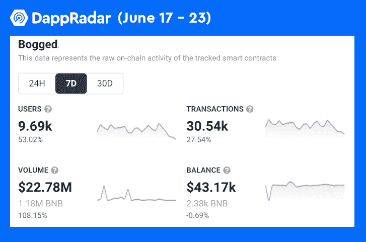

# DeFi 变得更容易:Bogged 现在支持信用卡

> 原文：<https://web.archive.org/web/https://dappradar.com/blog/defi-made-easier-bogged-now-supports-credit-cards>

## 多链 DeFi 平台变得更加易于使用

Bogged 通过其包罗万象的 DeFi 平台让每个人都可以获得 DeFi 交易体验，该平台现在允许用户直接使用信用卡购买密码。Bogged 是市场上最大的多链分散交易聚合器之一，支持来自 10 个不同区块链的 50 多个 DeFi 平台的代币。

**概要:**

*   ****上可用** [**BNB 智能链**](https://web.archive.org/web/20220812000535/https://dappradar.com/rankings/protocol/binance-smart-chain)**[**克罗诺斯**](https://web.archive.org/web/20220812000535/https://dappradar.com/rankings/protocol/cronos)**[**OEC**](https://web.archive.org/web/20220812000535/https://dappradar.com/rankings/protocol/oec)**[**赫科**](https://web.archive.org/web/20220812000535/https://dappradar.com/rankings/protocol/heco)**[**多边形**](https://web.archive.org/web/20220812000535/https://dappradar.com/rankings/protocol/polygon)**********
*   ******为了让每个人都能使用 DeFi trading，Bogged 与 Ramp 合作，将信用卡支付集成到其平台中。******
*   ******值得注意的是，上周 Bogged 的用户增长了 52%，交易量增长了 108%。******
*   ******用户可以通过持有 Bogged 的原生令牌 BOG 来解锁高级功能。******

 ******Bogged 努力成为市场上最广泛的加密令牌聚合器。目前，Bogged DEX Aggregator 支持 10 个不同区块链的 50 多个分散式交易所，包括 BNB 连锁、Cronos、Polygon、Fantom、Avalanche 和 Harmony。

为了进一步降低用户享受 DeFi 交易的门槛，Bogged 现在允许用户用信用卡购买 [DeFi](https://web.archive.org/web/20220812000535/https://dappradar.com/defi) 加密令牌。通过用信用卡购买加密令牌，用户可以无缝、快速地访问奇妙的多链 DeFi 世界，这要感谢 Bogged。

## 一步一步的教程对信用卡加密购买在 Bogged

通过提供巨大的效率和市场结构的变化，DeFi 一直在扰乱传统的金融行业。利用区块链，DeFi 有可能消除金融交易中的第三方和相关成本，并使目前被传统银行和机构低估的用户受益。

然而，许多对 DeFi 感兴趣的人不知道如何访问它。作为回应，Bogged 与 Ramp 合作，提供一种简单友好的方式，将资金直接添加到用户的сrypto 钱包中。这就是你如何用你的信用卡通过三个简单的步骤购买密码:

1.  **开始购买**
    首先，用户需要访问 [Bogged Swap 的代币兑换界面](https://web.archive.org/web/20220812000535/https://app.bogged.finance/bsc/swap?tokenIn=BNB&tokenOut)开始代币购买。一旦进入界面，用户可以在页面底部看到 Visa/Master 卡图标。接下来，用户可以点击他们喜欢的支付方式，并设置他们希望花费的法定货币和金额。

2.  **Ramp 账户设置**
    一旦用户选择了货币和金额，他们需要使用 Ramp 完成一个简单的账户设置过程。在输入有效的电子邮件地址并勾选 T & C 后，用户需要输入他们的(例如)BNB 连锁店 DeFi 钱包地址，选择支付方式，并完成 KYC(了解你的客户)流程。

3.  **完成加密购买**
    用户成功通过 KYC 后，就可以开始使用信用卡或其他选定的支付方式进行支付。一旦收到付款，Ramp 将向用户发送电子邮件通知。同时，所需数量的 [BNB 代币](https://web.archive.org/web/20220812000535/https://dappradar.com/hub/token/eth/BNB?from=0xb8c77482e45f1f44de1745f52c74426c631bdd52)将被转移到用户的钱包中。

## Bogged 的 7 天用户增长了 50%

Bogged 已经推出了一个稳健的路线图，以推进其跨链扩张。Bogged DEX 聚合路由器目前支持 10 个连锁店的 50 多个 DEX，并为 DeFi 交易商提供高级功能，如 AutoTax、Multi Tx、限价单和止损。

该团队目前正在对路由系统进行各种升级，这将使用户能够在改进的流动性 API 识别的任何兼容 uni WAP/Pancakewap fork 上交换任何令牌。

Bogged 在过去几个月中实现了几个里程碑，见证了令人印象深刻的数据性能。多链 dapp 的用户增长了 52%，交易量增长了 108%，交易量增长了 2278 万美元。看起来用户确实积极地投入到 Bogged 和它的服务中。

## 用 BOG 代币赢取奖励

BOG 令牌充当 Bogged 的治理和支付令牌。值得一提的是，Bogged 与用户分享利润。为了有资格分享利润池，用户需要[入股 BOG](https://web.archive.org/web/20220812000535/https://app.bogged.finance/bsc/staking) 来赚取平台费用的一部分。

此外，持有 BOG 代币允许用户享受许多额外的好处，包括绕过适用代币的交易限制、定制汽油、重复交易等等。

### 了解更多关于 Bogged [网站](https://web.archive.org/web/20220812000535/https://bogged.finance/)

[网站](https://web.archive.org/web/20220812000535/Website: https://bogged.finance/)

[推特](https://web.archive.org/web/20220812000535/https://twitter.com/boggedfinance)

[不和](https://web.archive.org/web/20220812000535/https://discord.com/invite/dkznEhDCmu)

[电报](https://web.archive.org/web/20220812000535/https://t.me/boggedfinance)

[中等](https://web.archive.org/web/20220812000535/https://boggedfinance.medium.com/)

[团队工具](https://web.archive.org/web/20220812000535/https://teams.bogged.finance/)

**免责声明** —这是一篇赞助文章。DappRadar 不认可本页面上的任何内容或产品。DappRadar 旨在提供准确的信息，但读者应该在采取行动之前总是自己做研究。DappRadar 的文章不能被认为是投资建议。******