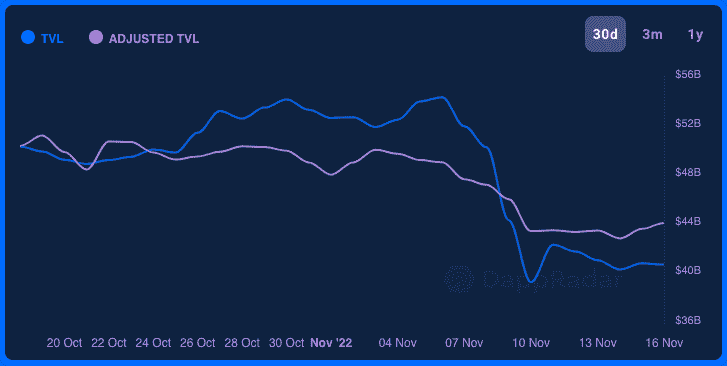

# DeFi 资金转向 BNB 链和多边形

> 原文：<https://web.archive.org/web/https://dappradar.com/blog/defi-money-shifts-towards-bnb-chain-and-polygon>

## FTX 崩溃后 DeFi 的赢家和输家

FTX 破产危机的影响波及了 DeFi 市场的所有行业。一旦中央集权的交易所显然会崩溃，投资者会迅速重新分配他们的资源。在动荡期间，一些区块链成为赢家，而锁定在其他网络中的总价值大幅下降。

**亮点**

*   从 11 月 7 日到 11 月 15 日，分散交易所锁定的总价值(TVL)下降了 31%。
*   在过去 10 天的区块链名单中，索拉纳是最引人注目的失败者。将资产锁定在以太坊、雪崩、浪人和乐观的用户也将资金从网络中取出。
*   *TVL 在两个区块链——BNB 连锁酒店和多边形酒店——的跌幅不低于整个行业的平均水平。考虑到 FTX 股市崩盘的影响，与竞争对手区块链相比，TVL 损失更少应该被视为一种胜利。*

[Explore Blockchain TVLs](https://web.archive.org/web/20221213115708/https://dappradar.com/defi)

## 领导区块链摆脱 TVL

FTX 的余波继续渗透到 DeFi 行业。不仅许多机构和散户投资者在过去 10 天里损失了巨额资金，现在的数据显示，一些最大的 Web3 区块链正在 TVL 大出血。

这种情况已经引起了业内许多有权有势的人的担忧，尤其是 DeFi 平台，他们没有做错什么，但现在需要用他们用来抹黑 FTX 的同一把刷子来对付媒体对分散平台的抹黑。

DappRadar 采访了 ApeSwap 的业务发展联席主管 Julian Uribe，谈论了这一事件将如何影响更广泛的 Web3 空间。

> FTX 的崩溃对密码行业的持续增长是一个巨大的打击。幸运的是，ApeSwap 和我们的团队完全没有受到这种情况的影响，保持了我们去中心化的精神。虽然我们为所有真正受到影响的人感到难过，但 FTX 的倒下真正凸显了权力下放的重要性，并证明了我们为扩大空间所做的工作。我们希望这一灾难性事件能让更多的不良行为者受到关注，同时进一步推动去中心化协议的兴起。
> 
> Julian Uribe, Co-Head of Business Development at [ApeSwap](https://web.archive.org/web/20221213115708/https://dappradar.com/multichain/defi/apeswap)

11 月 7 日至 11 月 15 日之间，TVL 全境的 DeFi 下降了 31%。11 月 7 日，当有关 FTX 破产问题的消息减少时，DeFi TVL 的市值为 519.1 亿美元。到 11 月 15 日，这一数字已降至 407.8 亿美元。

Data source: [DappRadar](https://web.archive.org/web/20221213115708/https://dappradar.com/defi)

这种巨大的下降有两个原因。这一下降主要是由于加密货币价值的下降。11 月 7 日至 11 月 15 日期间，以下货币价格均下跌:

*   **索尔**下降 **54%**
*   **ETH** 下降 **21%**
*   **AVAX** 下降 **27%**
*   **罗恩**下降了 **29%**
*   **OP** 下降 **26%** 。

DeFi TVL 下跌的第二个原因是，用户已经从一些区块链的平台上解锁了他们的加密货币，要么将它们转移到另一个区块链，要么放在他们的个人钱包里。

通过比较上述区块链 TVL 的下跌与相应加密货币的下跌，我们可以看到资产的重新分配积极促成了 TVL 的整体下跌。11 月 7 日至 11 月 15 日之间:

*   **索拉纳** TVL 下降 **68%**
*   **以太坊** TVL 下降 **21%**
*   **雪崩** TVL 下降 **30%**
*   **浪人** TVL 下降 **37%**
*   **乐观** TVL 下降 **33%** 。

又有一个数据点突显出，导致 DeFi TVL 整体下跌的不仅仅是加密货币价值的下跌。11 月 7 日，全球加密货币市场总市值为 1.03 万亿美元。到 11 月 15 日，这一数字已降至 8450 亿美元。这一降幅为 18%，远低于 DeFi TVL 31%的总体降幅。

## 哪些 DeFi 平台失去了 TVL？

我们可以使用 TVL 跟踪工具来查看哪些平台已经看到其合同中的资产转移到了其他地方。正如我们在上面看到的，TVL 下跌的很大一部分是加密货币价格贬值的结果。

### 索拉纳

例如，索拉纳 DeFi 协议公司[的 TVL 在 11 月 7 日至 11 月 15 日期间从 2.5444 亿美元暴跌至 9788 万美元。下降了 62%。但 SOL token 计数仅从 776 万下降到 694 万，降幅仅为 11%。](https://web.archive.org/web/20221213115708/https://dappradar.com/solana/defi/marinade-finance)

同样，索拉纳的另一个 DeFi 交易协议 Raydium T1 在 TVL 也大幅下跌。锁定在智能合同中的资产的美元价值从 1.1738 亿美元上升到 5185 万美元。下降了 56%。尽管如此，站台上的 SOL 令牌并没有改变。这表明一些用户仍然认为 DeFi 是集中融资的可行替代方案。

### 以太坊

建造在以太坊上的一些最大的 DeFi dapps 的故事是相似的。不同之处在于，对于以太坊来说，加密货币的市值规模和每天通过其协议流动的资金量意味着大幅下降会对 DeFi 行业产生巨大影响。

MakerDAO 是一个价值数十亿美元的 DeFi 协议，可生成 [Dai](https://web.archive.org/web/20221213115708/https://dappradar.com/hub/token/eth/DAI/ETH?from=0x6b175474e89094c44da98b954eedeac495271d0f) ，这是业界领先的分散式稳定积分之一。在 11 月 7 日至 11 月 15 日的一周内，MakerDAO 的 TVL 从 80.3 亿美元跌至 68 亿美元，下降了 12.3 亿美元，占所有赌注的 15%。瑞士联邦理工学院 TVL 下跌了 8%。

事实:马克尔道目前占了全 TVL DeFi 的 15.51%。

[曲线](https://web.archive.org/web/20221213115708/https://dappradar.com/multichain/defi/curve)是一个自动化的做市商，专注于寻找稳定货币交易的效率。这是一个易变性的平台，当密码货币贬值时，风险会增加。毫不奇怪，用户已经从一个潜在的不稳定协议中取出了他们的资产，这可以从固定在 dapp 智能合同中的 ETH 金额的大幅下降中看出。

在 FTX 危机开始后的一周内，ETH locked into Curve 的总价值从 376 万令牌降至 300 万令牌，降幅达 20%。此次下跌的美元价值为 15 亿美元，从 59.1 亿美元降至 3.72 美元，跌幅为 37%。

最后，我们可以看到, [Convex Finance](https://web.archive.org/web/20221213115708/https://dappradar.com/ethereum/defi/convex-finance) 的 TVL 从 38.6 亿美元降至 22 亿美元，下降了 43%。这是 16.6 亿美元的七天跌幅。用户从 Convex 中取走了 680，000 个 ETH，相当于下降了 28%。

### 大局

从 11 月 7 日到 11 月 15 日，上述五个平台在 TVL 的总跌幅为 46.1 亿美元。但类似的故事在数百个规模较小的平台上上演，这些平台总共拥有数十亿美元。加密货币价格疲软和用户令牌提款打击了整个 DeFi 行业，我们必须等待，看看有多少能够长期生存。

大多数 DeFi 平台对 FTX 危机对它们的影响仍然守口如瓶。但是 DappRadar 采访了 Sameep Singhania，QuickSwap 的联合创始人，听听他对这种情况的看法。

> FTX 的情况不是我们第一次看到。我们已经在今年的 LUNA、3AC 和 Celcius 中看到了这一点。FTX 只是又一个提醒，让我们关注的不是你的钥匙，不是你的钱。
> 
> Sameep Singhania, Co-Founder at [QuickSwap](https://web.archive.org/web/20221213115708/https://dappradar.com/polygon/exchanges/quickswap)

总体而言，在 11 月 7 日至 11 月 15 日的一周内，DeFi protocols 损失了价值 115.9 亿美元的 TVL。也就是一周下降 21%。相比之下，亚美尼亚的年国内生产总值为 115.4 亿美元。

由于 FTX 的“糟糕会计”，以及随后的恐惧和加密货币价格的下跌，迪菲的 TVL 下跌了相当于一个拥有近 280 万人口的民族国家一年生产的价值。

幸运的是，这不是一个全区块链的危机和损失的故事。当风暴在他们周围快速旋转时，一些人受到的伤害较小。

## BNB 链和多边形棚*少* TVL

FTX 崩盘后没有赢家。但也有一些平台损失较少。11 月 7 日至 11 月 15 日期间，TVL 在 [BNB 链](https://web.archive.org/web/20221213115708/https://dappradar.com/defi/protocol/binance-smart-chain)上下跌了 10%，从 48.8 亿美元跌至 43.7 亿美元。在同一时期，该连锁店的货币 [BNB](https://web.archive.org/web/20221213115708/https://dappradar.com/hub/token/bsc/BNB) 从 333 美元跌至 276 美元，跌幅达 17%。

虽然大多数区块链 TVL 的跌幅超过了其本土加密货币的价值，但 BNB 连锁店的 TVL 跌幅较小。这表明，用户远没有将他们的资产从 BNB 链智能合约中取出，而是增加了他们锁定在网络上建立的 DeFi 平台上的 BNB 量。

数据证明了这一点，数据显示，以 BNB 代币衡量的 TVL 从 1778 万到 1811 万，增长了 1.8%。区块链在湍流中表现强劲的原因尚不完全清楚。但是币安和 CZ 卷入 FTX 的戏剧可能与此有关。

### 多边形支撑得很好

第二层网络多边形也避免了 TVL 的灾难性崩溃，这影响了 Solana 和 Ethereum 等公司。11 月 7 日，TVL 的美元价值下降了 9.4148 亿美元，至 11 月 15 日的 7.9527 亿美元，降幅略低于 16%。

与 BNB 链一样，在 11 月 7 日之后的一周，锁定到 Polygon 的本地令牌数量上升。11.9 亿 MATIC 在本周初被锁定区块链，7 天后，它是 12.2 亿。对于生态系统中最有前途的第 2 层网络之一来说，这一小幅增长是一个好兆头。

## 随身携带您的 Web3 之旅

使用 DappRadar 移动应用程序，再也不会错过 Web3。查看最受欢迎的 dapps 的性能，并关注您投资组合中的 NFT。您在 DappRadar 上的帐户会与我们的移动应用程序同步，这样您很快就可以选择实时接收提醒。

[Download the DappRadar app now](https://web.archive.org/web/20221213115708/https://dappradar.app.link/blog)[<picture></picture>](https://web.archive.org/web/20221213115708/https://play.google.com/store/apps/details?id=com.portfolio.dappradar)