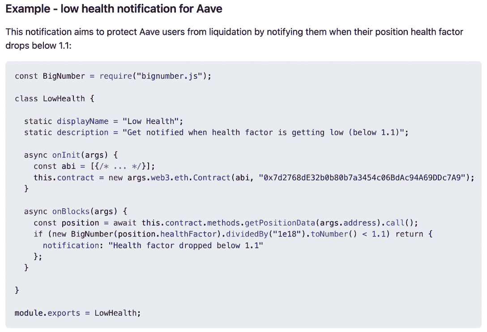

# DeFi.org &达普拉达邀请开发者加入 10 万美元的资助

> 原文：<https://web.archive.org/web/https://dappradar.com/blog/defi-org-dappradar-invite-developers-to-join-100000-grant>

## 为开放定义通知协议召集所有开发者

**DeFi.org 与 DappRadar 合作，为开放式 DeFi 通知协议启动了一项 10 万美元的开发者资助计划。该基金邀请团队和技术人才为开放定义通知协议贡献新项目。**

**概要:**

*   由 Orbs 提供支持的 Open DeFi Notification Protocol 是一个平台，允许用户随时了解他们的链上 [DeFi](https://web.archive.org/web/20221004010922/https://dappradar.com/defi) 事件。
*   Open DeFi 通知协议在五个网络中授权 20 个 dapps，包括[以太坊](https://web.archive.org/web/20221004010922/https://dappradar.com/rankings/protocol/ethereum)、[币安智能链](https://web.archive.org/web/20221004010922/https://dappradar.com/rankings/protocol/binance-smart-chain)、[多边形](https://web.archive.org/web/20221004010922/https://dappradar.com/rankings/protocol/polygon)、 [Fantom](https://web.archive.org/web/20221004010922/https://dappradar.com/rankings/protocol/fantom) 和[雪崩](https://web.archive.org/web/20221004010922/https://dappradar.com/rankings/protocol/avalanche)。
*   各种 DeFi dapps，如 [SushiSwap](https://web.archive.org/web/20221004010922/https://medium.com/@defiorg/the-open-defi-notification-protocol-now-supports-sushiswap-5f62c8341ff0) 和[羊驼金融](https://web.archive.org/web/20221004010922/https://medium.com/@defiorg/the-open-defi-notification-protocol-now-supports-alpaca-finance-c99213c5f72d)，已经利用该协议更好地通知他们的用户关键的 DeFi 时刻。
*   该平台与 DappRadar 合作推出了一项 10 万美元的资助计划。

开放式 DeFi 通知协议是一个免费使用、移动友好、社区驱动的倡议，让用户了解他们的链上 DeFi 事件。该协议运行在由被称为 Orbs Guardians 的独立节点组成的分散网络上。

该协议支持跨五个网络的 20 个 dapps，包括以太坊、币安智能链、多边形、Fantom 和 Avalanche。此外，它可以推送各种事件的警报，包括止损、价格变动、TVL 变化、合同升级等，以帮助用户保持知情。

要开始使用 Open DeFi 通知协议，请从 [AppStore](https://web.archive.org/web/20221004010922/https://apps.apple.com/il/app/defi-notifications/id1588243632) 和 [Google Play](https://web.archive.org/web/20221004010922/https://play.google.com/store/apps/details?id=com.orbs.openDefiNotificationsApp) 下载应用。

最近，该平台与 DappRadar 合作推出了一项 10 万美元的[资助计划](https://web.archive.org/web/20221004010922/https://medium.com/@defiorg/defi-org-dappradar-launch-100k-developers-grant-for-the-open-defi-notification-protocol-c584afacea62)，让开发人员的雄心和才华推动该平台的扩张。

## 如何参与资助

开放式 DeFi 通知协议是以社区驱动的协作为核心构建的。这个开源项目允许并鼓励任何人贡献并集成通知到它的平台上。

赠款计划可以通过在各个方面支持开发团队来帮助他们更有效地推进他们的项目。该程序的一个快照如下。

*   开始日期:22 年 5 月 30 日
*   结束日期:22 年 9 月 30 日
*   持续时间:4 个月
*   资助:总计高达 100，000 美元，每个开发团队高达 10，000 美元

由 defi.org 导师组成的资助委员会将根据四个参数对参赛作品进行评分，以确定最终的获胜者和奖金。这四个参数如下。

*   项目贡献:团队必须贡献至少一个项目才有资格获得资助。但是，贡献越多，评委给的分就越多。
*   主动通知:该基金鼓励团队为他们的项目开发更多的主动通知。
*   创新:团队被允许利用在这个[报告](https://web.archive.org/web/20221004010922/https://github.com/open-defi-notification-protocol/projects)中发现的现有项目和用例。然而，新的和创新的使用案例和集成将获得额外的分数。
*   社交媒体的存在:团队需要在 Twitter 上宣布他们的贡献，并标记 [@orbs_network](https://web.archive.org/web/20221004010922/https://twitter.com/orbs_network) 、 [@DappRadar](https://web.archive.org/web/20221004010922/https://twitter.com/DappRadar) 和 [@DefiOrg](https://web.archive.org/web/20221004010922/https://twitter.com/DefiOrg) 。另外值得注意的是，额外的社交媒体活动，如教育博客帖子、教程视频等。，会得到评委额外的考虑。

开发者还可以通过本文了解更多关于集成开放定义通知协议[的信息。它展示了 DeFi dapps，如 SushiSwap 和 Alpaca Finance，如何利用该协议更好地通知其用户关键的 DeFi 时刻。](/web/20221004010922/https://dappradar.com/blog/how-to-integrate-the-open-defi-notification-protocol-into-your-defi-project/)

一旦准备好，开发团队就可以在这个[表单](https://web.archive.org/web/20221004010922/https://docs.google.com/forms/d/e/1FAIpQLScWXOXHC0MkUiDwclLVw82gWzx60TAu5cORGAqYM0sKLLGjxg/viewform)中提交他们的参赛作品。

## 开发者资源——简而言之，新的通知实现

Open DeFi Notification Protocol 的 [Github](https://web.archive.org/web/20221004010922/https://github.com/open-defi-notification-protocol) 网站为开发者提供了丰富的材料来帮助他们入门。此外，开发人员可以查看这个[自述文件](https://web.archive.org/web/20221004010922/https://github.com/open-defi-notification-protocol/projects/blob/master/README.md)，了解集成新项目的分步说明。

现在让我们仔细看看如何实现一个新的通知。

开放式 DeFi 通知协议是一个对开发者非常友好的平台。如果开发人员熟悉智能合约，在平台上创建一个新的通知只需要大约 30 分钟。此外，不需要运行任何后端，开发任何用户界面或修改项目的智能合同。

要开始这个过程，开发人员必须实现一个简单的 JavaScript web3 类，从链数据中提取通知。然后，这个类将通过 pull request (PR)提交给协议 [Github repo](https://web.archive.org/web/20221004010922/https://github.com/open-defi-notification-protocol/projects) 。

一旦开发者实现了新的通知，用户可以在应用程序中注册使用它，该应用程序可在 [iOS](https://web.archive.org/web/20221004010922/https://apps.apple.com/il/app/defi-notifications/id1588243632) 和 [Android](https://web.archive.org/web/20221004010922/https://play.google.com/store/apps/details?id=com.orbs.openDefiNotificationsApp) 上使用。当协议接收到来自用户端的通知请求时，它的警报节点将开始针对每个新的 mainnet 块执行新贡献的 JavaScript web3 类，以提取新的通知。

最后，当系统发现任何新的通知时，警报节点将触发推送通知并将其发送给用户。

### 集成示例:Aave

以下示例显示了协议如何允许 Aave 用户在他们的位置健康系数降至 1.1 以下时得到通知。

如前所述，开发者可以通过 PR 为协议 [Github repo](https://web.archive.org/web/20221004010922/https://github.com/open-defi-notification-protocol/projects) 做出贡献。一旦 PR 被接受，项目将立即出现在移动应用程序中，启用这种新的通知类型。此外，开发人员可以通过在类旁边添加一个小的 JSON 文件来定制项目标签、徽标和颜色。

## 加入资助计划，提升您的用户体验

加密货币交易市场一直在不断变化。用户不时淹没在信息的海洋中。由于开放式 DeFi 通知协议，团队可以利用这一重要工具来优化用户的 DeFi 体验。

通过启动这个资助项目，DeFi.org 和达普拉达期待看到创新项目来丰富开放 DeFi 通知协议平台。开发者可以使用此[表格](https://web.archive.org/web/20221004010922/https://docs.google.com/forms/d/e/1FAIpQLScWXOXHC0MkUiDwclLVw82gWzx60TAu5cORGAqYM0sKLLGjxg/viewform)提交他们的参赛作品，并通过[电报](https://web.archive.org/web/20221004010922/https://t.me/defiorg)联系 defi.org 团队以获取更多信息。

了解有关开放定义通知的更多信息

[DeFi.org](https://web.archive.org/web/20221004010922/https://defi.org/)

[Github](https://web.archive.org/web/20221004010922/https://github.com/open-defi-notification-protocol)

[网站](https://web.archive.org/web/20221004010922/https://defi.org/notifications/)

[概述博文](https://web.archive.org/web/20221004010922/https://medium.com/@defiorg/introducing-open-defi-notification-protocol-95a8712a94e0)

[推特](https://web.archive.org/web/20221004010922/https://twitter.com/DefiOrg)

[电报](https://web.archive.org/web/20221004010922/https://t.me/defiorg)

通知 app: [iOS](https://web.archive.org/web/20221004010922/https://apps.apple.com/il/app/defi-notifications/id1588243632) ， [Android](https://web.archive.org/web/20221004010922/https://play.google.com/store/apps/details?id=com.orbs.openDefiNotificationsApp)

**免责声明** —这是一篇赞助文章。DappRadar 不认可本页面上的任何内容或产品。DappRadar 旨在提供准确的信息，但读者应该在采取行动之前总是自己做研究。DappRadar 的文章不能被认为是投资建议。