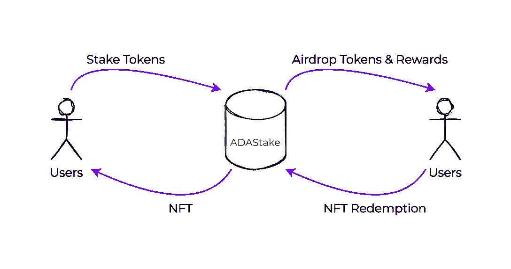

# DeFi 透视:StakeADA 平台及其机制

> 原文：<https://web.archive.org/web/https://dappradar.com/blog/defi-perspective-the-stakeada-platform-and-its-mechanics>

## 该协议被设计成可扩展和分散的，同时为用户参与网络提供激励

“分散金融工具”是加密货币领域一个令人兴奋的新领域。

赌注是新用户和投资者在这个新市场中利用和投资的最大方式之一。

Cardano staking 协议允许在 Cardano 区块链上创建分散式应用程序(dapp ),这使得开发者能够创建不受任何中央机构控制的 dapp。

Cardano 还使用独特的多层架构，允许结算和计算层分离，提供更大的可扩展性和灵活性。

本质上，Cardano 旨在为部署 dapps(如 [StakeADA](https://web.archive.org/web/20220904001110/https://stada.pro/) )提供一个安全且可扩展的环境。

# StakeADA 平台

首先，我们来解释一下 [StakeADA](https://web.archive.org/web/20220904001110/https://stada.pro/?utm_source=https%3A%2F%2Fdappradar.com&utm_medium=DeFi+Perspective%3A+Sharing+Information+About+The+ADAStake+Platform+and+Its+Mechanics&utm_campaign=DeFi+Perspective%3A+Sharing+Information+About+The+ADAStake+Platform+and+Its+Mechanics&utm_id=https%3A%2F%2Fdappradar.com) 是什么；StakeADA 是一个赌注协议，使用户能够通过将他们的代币委托给赌注池来获得奖励。该协议被设计成可扩展和分散的，同时为用户参与网络提供激励。StakeADA 建立在卡达诺区块链之上，兼容任何本地卡达诺令牌。

# 斯塔克达的建筑

[StakeADA](https://web.archive.org/web/20220904001110/https://stada.pro/) 协议允许用户在他们喜欢的池中下注他们的代币。每个池都有一个特殊的钱包被监控，当用户下注时，一个 NFT 被空投回给用户。

*在预定的赌注期限到期后，用户将能够用他们的 NFT 兑换代币和奖励。*

NFT 代表用户的赌注，在下注期结束时可以兑换成代币和奖品。该系统有助于确保用户积极参与标记他们的令牌，并为网络提供额外的安全层。

赌注代币被唯一地表示为 NFTs，允许灵活地转移到另一个钱包或市场交易所。这使得能够容易且快速地转移代币的所有权，而不必依赖中央机构。此外，NFT 可以存储在各种不同的平台和钱包上，便于跟踪您的令牌。

该协议旨在允许用户对其令牌有更多的控制，并允许他们以对他们更方便的方式来标记他们的令牌。

# StakeADA 的游泳池

有多个赌注池可供投资者使用；每个池对单个令牌进行操作。这使得投资者可以选择最适合他们需求和目标的资金池。通过投资于一个专门投资某个特定代币的资金池，投资者可以最小化风险，最大化回报。

赌注有两种主要类型:固定持续时间和无限持续时间。有了固定期限的赌注，你承诺一定的时间长度，如果你愿意，可以提前赎回你的股份。

另一方面，无限期赌注没有固定的结束日期。任何时候都可以进行部分或全部赎回，如果您不选择全部赎回，资金池中的股份将继续无限期存在。

要了解更多关于 StakeADA 的信息，你可以访问他们的[网站](https://web.archive.org/web/20220904001110/https://stada.pro/)或者关注他们的社交账户，了解这个项目的最新进展。

[中等](https://web.archive.org/web/20220904001110/https://medium.com/@Stakeada)

[推特](https://web.archive.org/web/20220904001110/https://twitter.com/StadaPro)

[Reddit](https://web.archive.org/web/20220904001110/https://www.reddit.com/user/stakeada-pro)

[电报](https://web.archive.org/web/20220904001110/https://t.me/STakeadapro)