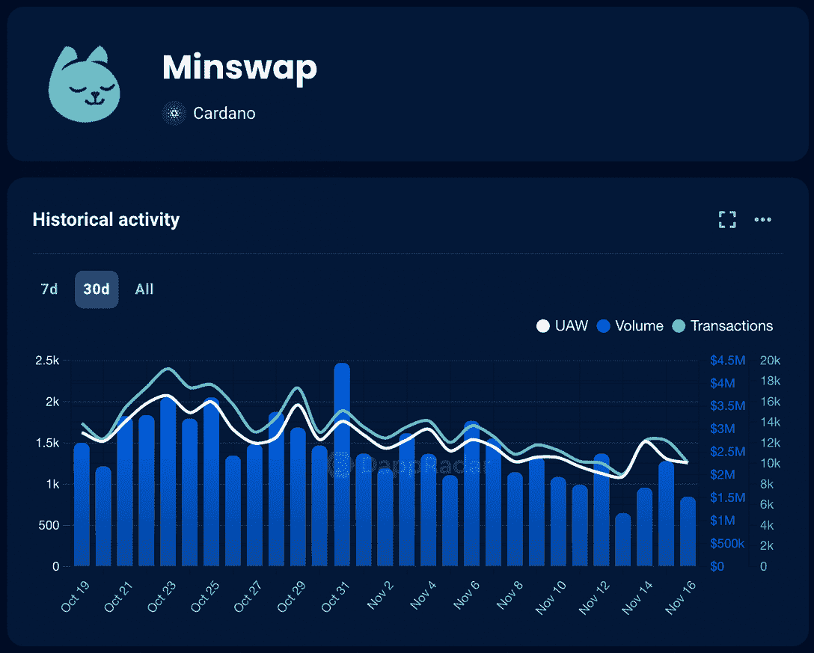
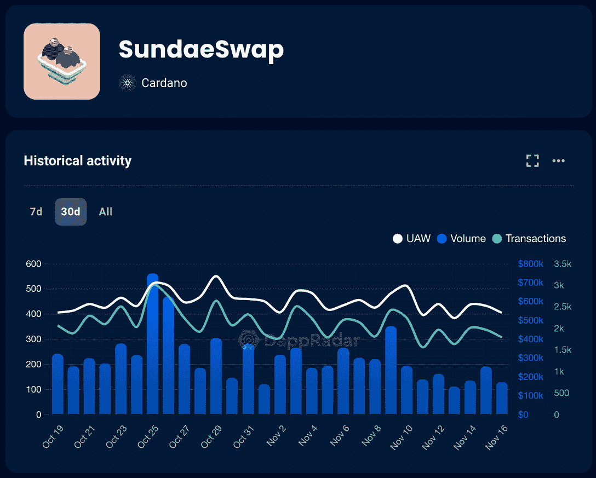
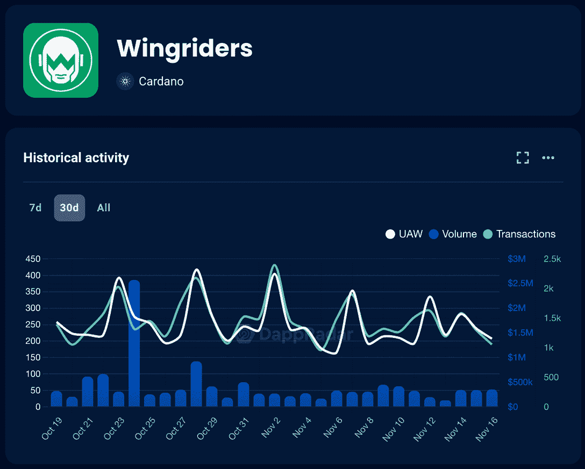

# 卡达诺上的迪菲涌动:3 个 Dapps 保持警惕

> 原文：<https://web.archive.org/web/https://dappradar.com/blog/defi-surging-on-cardano-3-dapps-to-keep-watch>

## 卡尔达诺 dapps 已经站在了金融光明未来的最前沿

自 FTX 金融危机以来，对去中心化金融应用的需求已经上升。现在比以往任何时候都清楚，保管好你的加密货币是多么重要。但是交易代币的最佳 dapps 和协议是什么呢？这个问题可以通过查看 DappRadar 上的 Cardano DeFi 应用程序来回答。

**亮点**

*   虽然对集中式交易所(CEX)的信任度较低，但人们正转向交易快捷、便宜的分散式交易所(DEX );
*   Cardano 上最受欢迎的 dex 在过去几天里数量上升，并有可能在未来几个月快速增长；
*   *你可以使用* [*DappRadar 工具*](https://web.archive.org/web/20221130143039/https://dappradar.com/rankings/protocol/cardano/category/defi) *在 Cardano 上找到最好的 DeFi 项目的数据。*

## 腰果生态系统及其 DeFi 潜力

卡尔达诺一直是有前途的 DeFi dapps 的家园。由以太坊联合创始人领导的利益相关区块链平台允许在考虑可伸缩性和互操作性的情况下开发项目。

在撰写本文时，在 DappRadar 的排名中，Cardano 协议的前 10 个 dapps 中有 6 个属于 DeFi 类别。

在以 ADA 令牌为中心的 Cardano 生态系统中进行交易，您可以享受快速、廉价和可靠的金融交易，同时拥有您的加密密钥。

## 3 个 DeFi 应用程序来保持观察

在 Cardano 生态系统内置的所有去中心化金融应用中，Minswap、SundaeSwap 和 Wingriders 脱颖而出。请在下面了解更多信息。

### 1.Minswap

Minswap 是 Cardano 网络上最受欢迎的分散式交易所(DEX ),市场在不确定性中波动。

[<picture></picture>](https://web.archive.org/web/20221130143039/https://dappradar.com/cardano/defi/minswap)[Visit The Minswap Dapp](https://web.archive.org/web/20221130143039/https://dappradar.com/cardano/defi/minswap)

在过去的 30 天里，dapp 内的独立活动钱包和交易数量增加了约 20%。Minswap 的余额，即智能合约中的资产价值，保持在 4064 万美元左右。

在这样的时期显示稳定是一个积极的迹象，Minswap 不断为他们的组织构建和宣布令人兴奋的新功能，如 Minswap 治理。

### 2.周日 wap

你应该记住的另一个 DeFi dapp 是[Sunday swap](https://web.archive.org/web/20221130143039/https://dappradar.com/cardano/defi/sundaeswap)。根据 DappRadar 的数据，AMM DEX 得到了一个参与社区的支持，上个月其余额增长了 23%。

[<picture></picture>](https://web.archive.org/web/20221130143039/https://dappradar.com/cardano/defi/sundaeswap)[Visit The SundaeSwap Dapp](https://web.archive.org/web/20221130143039/https://dappradar.com/cardano/defi/sundaeswap)

此外，我们还可以看到，继 dapp 上的 UAW 和交易数量增加 16%之后，SundaeSwap 的交易量在过去 30 天内增加了近 7%。

### 3.飞翼骑士

你需要了解的卡尔达诺最新的 DeFi dapp 是 [Wingriders](https://web.archive.org/web/20221130143039/https://dappradar.com/cardano/defi/wingriders) 。尽管在 2022 年初推出，但它已经征服了许多用户，是协议中第三大最常用的 DEX。

[<picture></picture>](https://web.archive.org/web/20221130143039/https://dappradar.com/cardano/defi/wingriders)[Visit The Wingriders Dapp](https://web.archive.org/web/20221130143039/https://dappradar.com/cardano/defi/wingriders)

此外，继 FTX 局势之后，发展援助方案创下了最高的增长记录。暴跌之后的一周，UAW 数量、交易量、成交量和总余额都略有增加。仅在上个月，Wingriders 的销量就增长了 20%，对于新的 DeFi 项目来说，这是一个非常乐观的数字。

## 对卡尔达诺的秘密传染效应

卡尔达诺以拥有 Web3 领域最支持的社区之一而闻名。该协议的联合创始人 Charles Hoskinson 将他从最近的 FTX 崩溃中吸取的教训带到了 Twitter 上。毫不奇怪，它符合 Cardano 对透明性和互操作性的主要关注。

> 协议设计和开源软件开发需要基于证据的业务。同行评审的协议、正式的方法和开放的生态系统，使每个人都能够一起工作。不是在加勒比海举办低租金大开眼界派对的皇帝[https://t.co/Lk5hL1nU0W](https://web.archive.org/web/20221130143039/https://t.co/Lk5hL1nU0W)
> 
> — Charles Hoskinson (@IOHK_Charles) [November 14, 2022](https://web.archive.org/web/20221130143039/https://twitter.com/IOHK_Charles/status/1592171794345390082?ref_src=twsrc%5Etfw)

现在说卡尔达诺区块链的所有 dapps 将如何应对消费者行为的变化，甚至这些变化会是什么，可能还为时过早。

*   通过我们在报告中的分析密切关注所有细节:[评估 FTX 危机对 Dapp 行业的影响](https://web.archive.org/web/20221130143039/https://dappradar.com/reports)

## 使用 DappRadar 继续跟踪顶级 DeFi dapps

在 DappRadar，您可以通过访问更新的数据和教育内容，密切关注您最喜爱的 dapps 如何发展。

使用 DappRadar 排名追踪最佳 Cardano dapps 和 NFT。

[Top Dapps On Cardano Ranking](https://web.archive.org/web/20221130143039/https://dappradar.com/rankings/protocol/cardano)

### 有用的链接

*   [什么是卡尔达诺:简单解释](https://web.archive.org/web/20221130143039/https://dappradar.com/blog/what-is-cardano-a-simple-explanation)
*   随着 FTX 融化，DeFi 升温
*   [卡达诺上最好的 DEX 是什么？参见顶部定义 Dapps 以保持跟踪](https://web.archive.org/web/20221130143039/https://dappradar.com/blog/the-best-dex-on-cardano)

***以上不构成投资建议。此处给出的信息仅供参考。请尽职调查并自行研究。***

 NewsletterUnsubscribe at any time. [T&Cs](https://web.archive.org/web/20221130143039/https://dappradar.com/terms) and [Privacy Policy](https://web.archive.org/web/20221130143039/https://dappradar.com/privacy-policy)